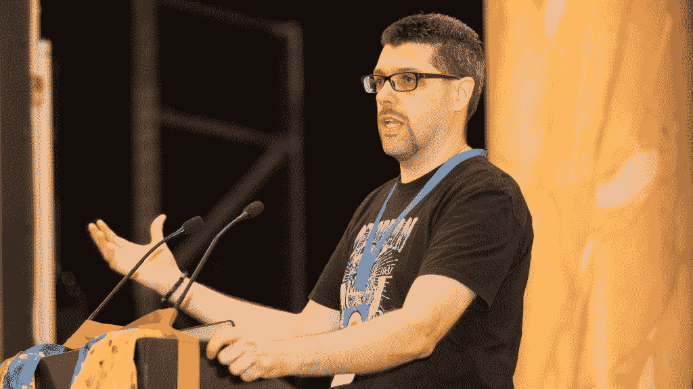

# 本周 PyDev:莱昂纳多·乔尔达尼

> 原文：<https://www.blog.pythonlibrary.org/2022/02/21/pydev-of-the-week-leonardo-giordani/>

本周我们欢迎莱昂纳多·乔尔达尼( [@tw_lgiordani](https://twitter.com/tw_lgiordani) )成为我们本周的 PyDev！莱昂纳多是 Python 中的[清洁架构的作者。莱昂纳多还在他的](https://www.thedigitalcatonline.com/blog/2018/12/20/cabook/)[网站](https://www.thedigitalcatonline.com/index.html)上写了很多文章。

PyCon UK 2019 在英国威尔士卡迪夫市政厅举行。第二天，2019 年 9 月 14 日。马克·霍金斯的图片/合成图片。

让我们花点时间来更好地了解达芬奇吧！

你能告诉我们一些关于你自己的情况吗(爱好、教育等)

我是意大利人，从 2016 年开始在英国生活工作。我在特塞罗长大，这是多洛米特山脉的一个小村庄，那里是世界上最美丽的地方之一，当我搬家时，我在那里留下了一片心。说到搬家，1996 年我去了米兰学习电信工程，并在那里生活了 19 年。获得学位后，我在一家遥感公司工作(雷达卫星！)然后我搬到了伦敦，加入了 WeGotPOP，它正在做一项令人印象深刻的工作，帮助电影制作拥抱数字世界。

我一直在现在被称为 DevOps 的领域工作(回到被简单定义为“杂工开发者”的时代)，部分是后端开发者，部分是围绕电缆和机架以及与防火墙斗争。我最近开始承包一个项目，为伦敦的 DevOps 组织一个名为 [The Jump](http://www.thejump.tech) 的学校，该项目将于 4 月开始。

由于编程是我最大的爱好之一，我也需要专注于与计算机无关的事情，所以我喜欢画微缩模型、玩棋盘游戏、阅读(主要是幻想和科幻小说)、弹吉他。当我有机会拜访我的父母时，我喜欢花时间在树林和山上徒步旅行。

我是一个不知悔改的爱猫人士，你会发现我的作品里到处都是猫。图片，名字，笑话。

**Why did you start using Python?**

When I started working for the remote sensing company in 2002, together with a friend of mine, we found that their data processing chain was made of several C number-crunching tools glued together with rough bash scripts and a lot of manual work. So we undertook the task of making that a truly automated process. At the time Python (version 2.2) was mostly advertised as a scripting language, and I knew it a bit, so we decided to use that. While initially we just used it to run external programs and to move around files, in time we added image and data manipulation in Python, so the whole processing chain eventually became a C/Python hybrid.

By the time I moved to London in 2016 Python was already long established in other fields like web programming and data science, but my current work with the language is still mostly connected with automation, CI pipelines, and scripting, together with bash.

**What other programming languages do you know and which is your favorite?**

I already mentioned C and bash (even though the latter transcends the definitions of language a bit). I actually started off with BASIC on a ZX Spectrum and with Pascal, but if we talk about modern languages I can also code in Scala, in JavaScript and Rust. My knowledge of the last three is embarrassingly low, mostly because I never used them in a real production context. I studied them, but I can't consider myself a true developer when using them.

I didn't mention my two favourite languages, though, which are Assembly and Lisp. Again, unfortunately I had limited chances to use them in a production environment, but I would gladly spend my days working with them. When I was young(er, cough) I was fascinated by the demoscene; I loved and still love to deal with the low-level problems of bits and bytes, CPU cycles counting, and memory addresses. I wasn't a lucky owner of an Amiga, but you could learn a lot on PCs as well, even though the Intel architecture is far from being a masterpiece. This is why I love Assembly, because it gives you access the deepest level of the machine. Well, until you enter the rabbit hole of transistors and friends, that is.

Lisp is a different beast. I am terribly attracted by language design and paradigms, and I love spending time investigating such things, for example comparing the implementation of the object-oriented paradigm of two different languages. So, I was naturally blown away when I first met Lisp because of the identity between data and code (homoiconicity) and other features which are still unparalleled in the software world. I worked a bit with Clojure, which I think is a good language, but never in a professional context.

Now, I feel a bit like a caveman trying to sell flint axes to a spaceman, but I think those languages that I discovered 30 years ago can still be very useful to learn. If not for beginners (better focus on Python and JavaScript), definitely for mid-level developer. As Clojure and WebAssembly (and many others) demonstrate, good ideas never die, and the concepts learned in one context will come back unexpectedly in another, possible completely different, case. This last sentence is possibly the best recap of my career so far 🙂

**What projects are you working on now?**

I'm preparing the DevOps bootcamp, which absorbed me for the last months while I work part-time as a Platform Engineer and DevOps. Preparing the lessons I'm revisiting almost everything I know on the subject, from CPU architecture to AWS services, passing through networking, operating systems, cryptography, and several other topics. I'm preparing a lot of slides and practical exercises, and writing a lot of notes, and I do not exclude those will become something more than just bullet point lists in the future.

Speaking of writing, I publish some technical thoughts and investigations on my blog The Digital Cat. I do not publish very often, but I like to think that what I publish is fresh. It's definitely not clickbait stuff, at least judging from the low number of clicks 🙂 Jokes aside, I write posts when I find something that attracts my attention and that I want to learn. Recently, for example, I realised that SSH keys using ed25519 are not in the standard PEM format and spent quite a lot of time analysing it down to the tiniest detail, and I found there was almost no information on the subject other than the comments in the source code. I'm proud of what I write, it's useful to me (I often go back to read my posts when I do not remember something), and I'm happy if it can be useful to others. To be clear, I admire who is extremely productive with their blogs like you, Rodrigo Serrão or many other great authors, but I am a slow thinker, and an even slower writer 😉

Last year I've been busy with [Mau](https://github.com/Project-Mau/mau), a markup language written in Python and inspired by Markdown and AsciiDoc, but I will discuss it more in depth in one of the following answers.

**Which Python libraries are your favorite (core or 3rd party)?**

Given what I said before, it should not be a surprise I'm a big fan of some modules of the standard library that are related to metaprogramming and to scripting: itertools, logging, re, functools, dataclasses. I generally find such modules to be very elegant and to express a lot what Python is. I might go on, however: abc, contextlib, collections, they are all amazing!

Outside the standard library I have to mention pytest, which radically changed my way of writing code. Well, that was actually TDD, but pytest makes TDD almost a perfect experience.

**How did you decide to write a book about Python?**

Well, that's an interesting story. As I say in the introduction of the book, a colleague of mine introduced me to the concept of the Clean Architecture, and also to proper TDD and other methodologies. I was intrigued, so I started investigating and studying. I'm not a big fan of design books because I think many time they get too abstract, but I endured a couple of them and I kept the useful parts, and the whole picture started to take shape and make sense. As I always do when I try to learn something better, I started writing a post about that. Writing helps me to focus and to avoid leaving dark corners in the subject matter, because when you explain something you can't cheat (or at least you shouldn't).

So, I started writing this post on my blog with a tiny example of the Clean Architecture in Python. As often happens, the post grew in time, while I was adding corrections and expanding some parts, up to the point I felt it was too big. So, I planned to split it into several posts, but I wasn't convinced. My experience is that people do not like multi-part posts that much, and I overall felt like I needed a proper space to discuss the topic, without the constraints of being part of a series on a blog.

So, I started looking around if it was possible to create something different, and at the time I bumped into a post about self-publishing (I do not remember which one, unfortunately) which led me to try that route. It all started as a side project, and I never thought of making that my main job, and self-publishing could give me all the time and space I needed, away from publisher's deadlines.

Indeed, I wrote the book mostly on the bus while going to the office or going back home in the evening, but with a very relaxed pace. When I published it on Christmas day 2018 and advertised it on Reddit, I was lucky enough to get one of the magical moments when hundreds of people see your post and start liking it, it gains momentum and spikes. The book was free, but several people decided to donate some money and after a month I had enough money to pay a lifetime subscription on Leanpub, which is great!

After that I got an impressive feedback by several readers, some questions and corrections on the technical content, and many from the linguistic point of view (so many typos!). It was a great experience to see people willing to spend time opening an issue on GitHub to say thanks and to point out that I misspelled a word. I really felt the appreciation of my work.

When the major typos and problems were ironed out I started collecting my personal ideas and advice from readers and begun to work on the second edition, and in the meanwhile I was planning to publish the book in HTML form on the web. I wanted it to be accessible and somehow searchable, and since these days I prefer HTML content over PDF I projected this on my whole audience 😉 This led to [www.thedigitalcatbooks.com](http://www.thedigitalcatbooks.com) where I eventually published it and will publish other books in the future (or at least this is the plan).

**What challenges did you face as an author and how did you overcome them?**

The main challenge was (and still is) linguistic. I know my mother tongue (Italian) pretty well, and I know I can express myself clearly and with different registers. In particular, I love to pick the right expression or idiom to highlight a specific point, or maybe to crack small jokes to make some concepts less heavy to digest. When I write in English (and foreign languages in general) I'm always worried about the clarity of the output, and that leads to long trips between vocabularies and websites. In time, I learned partially to be more confident and partially to shrug it off, but that's still my main challenge. For the records, I looked up "shrug off" after I wrote it. I'm hopeless 🙂

From the point of view of the content I have to say that the small example that I use in the book works well, so I didn't have big challenges. On the contrary, I was surprised by how well the whole process was flowing once I started it. You might say that the book sold itself to me while I was writing it. However, after I published it some readers found bugs (as it's natural), and while fixing them wasn't a big deal, keeping the book and the code in sync was. In particular, I decided to tag Git commits so that it's simpler for a reader to see the full code of the project at a certain point, and I mention the tags in the book. This is all great until someone finds a mistake or a bug in one of the earliest commits (which happened several times) and you have to rebase/cherry-pick/merge the whole history on top of that fix, and tag all of them again. So far I haven't found a good and safe way to automate it, any advice on this is more than welcome!

As for the tools, I had a couple of false starts with Pandoc and other systems. They are good, and many authors use them successfully, but they didn't suit my needs. The initial version of the book came from a post written in Markdown, which I love, so I wanted to keep that simplicity, and I eventually landed at Leanpub, which offered me a platform that worked out of the box with a Markdown dialect (Markua).

Leanpub's PDF rendering is great, and the output is beautiful, but to publish the book on the web I wanted to create HTML pages from the same source material. In addition, I wanted to be able to use boxes with warnings and insights like the ones that I saw on books (for example the ones published by O'Reilly), and I started dreaming of features like automating the import of code snippets from Git commits and things like that. Long story short, I ended up writing my own markup language, [Mau](https://github.com/Project-Mau/mau), which leverages Jinja templates to render its output. I think it's a great concept, and while it has a lot of possible improvements I am already using it for my blog and for the book. Mau can be transformed into Markua, which makes it possible to publish on LeanPub, and from the same source code I can create the HTML output for the website The Digital Cat Books, where I also published the manual of the markup language, [The Mau Book](https://www.thedigitalcatbooks.com/maubook-introduction/).

Overall Mau was my biggest personal project so far, and while I'm basically the only user at the moment I'm so happy about it. The day I saw my own markup language work and render its first HTML is one of the best in my whole career as a software developer!

**Is there anything else you’d like to say?**

I want to thank all the people who work for coding communities, starting from the Python one. In particular I'd like to thank all my friends who work to organise and run PyCon Italia (you interviewed my friends [Patrick Arminio](https://www.blog.pythonlibrary.org/2021/08/09/pydev-of-the-week-patrick-arminio/) and [Alessia Marcolini](https://www.blog.pythonlibrary.org/2020/02/03/pydev-of-the-week-alessia-marcolini/) previously in this series). Despite my efforts, I really struggle to focus on conferences and I always end up missing them or not being a really active part of them. I love to think that my contribution is more behind the scenes, but I want to take the opportunity to praise their effort and sacrifices!

**Thanks for doing the interview, Leonardo!**