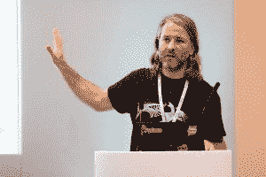
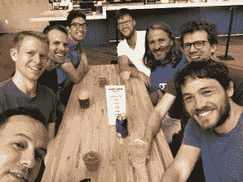

# 本周 PyDev:马克·加西亚

> 原文：<https://www.blog.pythonlibrary.org/2018/10/15/pydev-of-the-week-marc-garcia/>

本周，我们欢迎马克·加西亚( [@datapythonista](https://twitter.com/datapythonista) )成为我们的本周 PyDev！Marc 是 Python 数据分析库 [pandas](https://pandas.pydata.org/) 的核心开发人员。如果你想了解更多关于 Marc 的信息，你可以查看他的[网站](https://datapythonista.github.io/)，上面有他在欧洲 PyData 和 EuroPython 上的演讲链接。

事实上，如果你感兴趣的话，这是他关于熊猫的一个演讲:

[https://www.youtube.com/embed/F37fV0uFf60?feature=oembed](https://www.youtube.com/embed/F37fV0uFf60?feature=oembed)

你也可以在 Github 上看到他参与了哪些项目。现在，让我们花些时间来了解 Marc！

你能告诉我们一些关于你自己的情况吗(爱好、教育等)

我的背景是计算机工程，拥有人工智能硕士学位。我在 9 岁的时候写了我的第一个程序，没过几年我就了解了自由软件，我仍然认为这是人类最惊人的成就之一。

我从事 Python 专业工作已经超过 10 年了，今年我成为了 Python fellow。我是 pandas 的核心开发人员，几乎从我开始用 Python 编程开始，我就参与了 Python 社区。

我开始是巴塞罗那 Python meetup 的常客，当时我们的会员还不到 10 人。在 Django 达到 1.0 之前，我为它做了贡献。我是 PyData Mallorca 的创始人之一。我是一名 NumFOCUS 大使。我定期在 PyCon 和 PyData 会议上发言。我组织了伦敦 Python Sprints 小组，在那里我们指导那些想为开源 Python 项目做贡献的人。大多数人认识我是因为我领导了熊猫文档冲刺，这是去年三月的一项全球活动，大约有 500 人致力于改进熊猫文档。大约发送了 300 个拉请求，我仍然需要检查和合并其中的一些。🙂

关于业余爱好，我喜欢徒步旅行、旅游、瑜伽、打网球、跳佛罗舞、打鼓和看宝莱坞电影。我没有时间经常做这些，但希望我会在某个时候做。

**你为什么开始使用 Python？**

我从 2006 年开始使用 Python。当时使用 Python 的一个主要原因是它“包含电池”。不仅如此，通过使用 Python，我比使用任何其他语言都更有效率。这是我的主要原因。

另一件我从一开始就非常喜欢的事情是缩进。在发现 Python 之前不久，我不得不使用一些没有缩进的遗留 php 代码。当时我将强制缩进视为 Python 的主要资产之一。

在使用 Python 一段时间后，我很高兴 Python 吸引了顶级程序员。在 2006 年，Python 还远远不是主流语言。而且大学没教，公司也很少用，那时候的 Python 用户大多是业余时间追求卓越的热情程序员。我的感觉是，这些起源解释了为什么今天 Python 社区是最先进的之一；不仅在技术上，而且在价值观，多样性，行为准则方面...

你还知道哪些编程语言，你最喜欢哪一种？

自从我发现了 Python，我很少使用其他语言，除了一些 javaScript(用于前端)或 c。在 Python 之前，我什么都用一点，php，Java，visual basic...但我真的很高兴我已经 10 多年没有和他们一起工作了。🙂

我最喜欢的语言当然是 c 语言和 Python。我认为它的完美在于它的简单。

你现在在做什么项目？

目前，除了工作之外，我主要在研究熊猫。我主要关注文档。不仅如此，我认为这真的很有必要，而且除了我经常使用的部分之外，它还能帮助我发现图书馆的其他部分。

除了文档之外，我还致力于使 pandas 在构造基于行的数据时更高效(比如从生成器构造)。也在用 matplotlib 之外的库制作 pandas plot，比如 Bokeh。我也喜欢致力于熊猫遗产特征的贬低和移除。

哪些 Python 库是你最喜欢的(核心或第三方)？

作为一名数据科学家，pandas 和 scikit-learn 是我无法忍受的库。现在，我们认为它们是理所当然的，但不难想象，如果没有它们，任何数据科学团队的生产力会有多低。如果每次您想要使用不同的模型时，您都需要研究新的库、学习新的 API、处理错误和缺少文档，或者您只是发现对于您的数据来说实现太慢了，该怎么办？我经常说，真正进行机器学习的人是 scikit-learn 开发人员(以及生态系统中其他必需的库，numpy，pandas...).我们其余的人只做 10%的工作。

作为第三方库，Bokeh 和 Datashader 是我比较喜欢的库。他们有一个非常创新的可视化方法。我认为他们会更上一层楼。

我现在不怎么做 web 开发，但我真的很喜欢 Django(多年前我参与了它的开发)。作为一个软件和一个社区，我真的很喜欢它。

你还有什么想说的吗？

我想很多时候我们都有这样的感觉，因为我们使用的软件质量非常高，而且新的版本经常出现，所以没有必要为它做贡献。我个人认为那远远不是真的。

我的感觉是，即使 Python 拥有数千万用户，如果只有 20 或 30 个关键人物停止(在空闲时间)努力改进它(这里我指的是不同的 Python 实现和最受欢迎的库)，对我们未来生产力的影响将是巨大的。

我认为更多的人应该为不同的 Python 项目做出贡献。许多公司在软件许可上节省了数千美元，并且因为开源软件而提高了他们的生产力，他们应该考虑为这些项目融资。当然，让他们的员工为他们做出贡献也是他们工作的一部分。我们认为 Python 和自由软件是理所当然的，但我不认为我们有让它可持续的公式。

我想说的另一件事是，我认为我们都希望有更有趣的闪电谈话。我有一种感觉，过去人们不太重视闪电谈话，许多疯狂的东西都出现在其中(或者以一种疯狂的方式出现了严肃而伟大的项目)。我不认为我们希望留给后代一个用闪电谈话来展示公式和代码的世界。😉

感谢您接受采访！