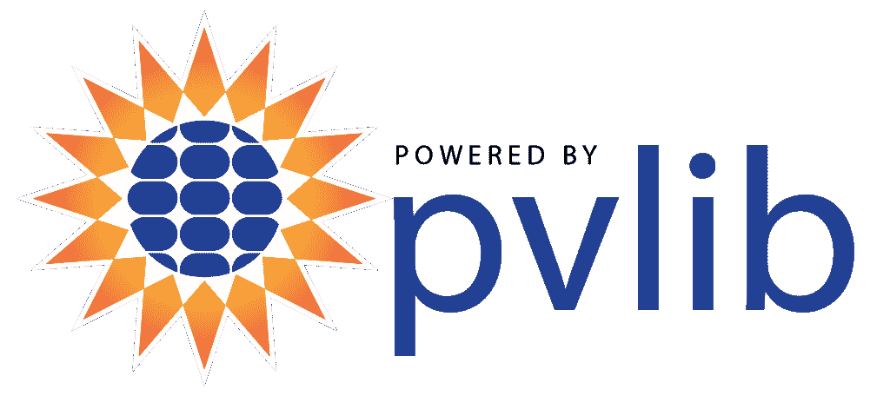

# 本周 PyDev:马克·米科夫斯基

> 原文：<https://www.blog.pythonlibrary.org/2022/10/03/pydev-of-the-week-mark-mikofski/>

本周，我们欢迎马克·米科夫斯基([@布瓦纳马克](https://twitter.com/bwanamarko) )成为我们本周的 PyDev！马克是 [pvlib](https://pvlib-python.readthedocs.io/) 工具的核心开发人员，该工具用于“模拟光伏能源系统的性能”你可以查看他的 [Github.io](https://mikofski.github.io/) 页面，看看马克的博客、演讲等等！

让我们花些时间更好地了解马克。

你能告诉我们一些关于你自己的情况吗(爱好、教育等)

我是由一位单身母亲抚养长大的，她自己也是由一位单身母亲，我的祖母抚养长大的，她是一位古巴移民。我的母亲是一名教师，她和我分享了她对学习的热爱，尤其是数学。我主修机械工程，在东非坦桑尼亚的美国和平队(US Peace Corps)工作 3 年后，我在那里教高中数学，最终我回到学校完成了机械工程的硕士和博士学位，重点是燃烧产生的有害排放物和空气质量。我在研究生院的学习是对可再生能源的自然延续，这也是我过去 15 年来一直在工作的地方。在我的空闲时间，我喜欢跑步，爬山，阅读，弹吉他，和家人在一起。

 **你为什么开始使用 Python？**

作为一名本科生，我们被教授 Pascal，这不是一种特别有用的语言，但我从中学开始就在我的 Atari 600xl 上使用 BASIC 编程，所以我喜欢 Pascal。后来我学习了 MATLAB，它成为我多年来选择的分析工具。我听说过关于“Python”的传闻，甚至不得不在读研期间安装它，以便使用 Cantera 库来研究燃烧等化学反应的热力学。然而，我认为 Python 是一种“严肃的”编程语言，与 C/C++和 FORTRAN 处于同一联盟。作为研究生院研究的一部分，我接触过 FORTRAN，它非常可怕，所以我不想接近它。我终于在 2012 年尝试了 Python，将一个 Excel 分析转换成最终成为 [PVMismatch](https://sunpower.github.io/PVMismatch/) 的东西，我马上就有了那个 a-ha！XKCD 的[著名漫画](https://xkcd.com/353/)中描述得非常好的时刻。从那以后，我很快成为了一名 Python 爱好者，并开始在我的所有分析中使用它。

你还知道哪些编程语言，你最喜欢哪一种？

除了 Python，我不精通任何其他语言，除了 MATLAB，我从大学就开始用它了。为了工作，我曾涉猎过 C#，但不是因为我真的想学。我也尝试过用 Java 做一个 Android 应用程序，但不适合我。我已经学习了足够的 HTML、CSS 和 JS，所以我可以使用 Django/Flask 和 Bootstrap 来制作 web 应用程序，但主要只是为了证明概念，然后我让真正的开发人员接手。我也能使用 SQL，但是我经常不得不在网上搜索关于编写简单查询的帮助。我在研究生院的时候不得不写一些 FORTRAN 语言，但是那太可怕了。我写过几行 C 语言，但我从未试图理解 C++。我有时也不得不费力地阅读一些 R，但时间只够用 Python 重写。我觉得朱莉娅听起来很酷，但我还没有学会使用它。所以我想我最喜欢的语言仍然只是 Python。

你现在在做什么项目？

pvlib 是我在工作之外参与的主要项目。这是一个社区项目，用于模拟太阳能系统的能量。与其他维护者合作真的很棒。pvlib 最初是由桑迪亚国家实验室研究员克里夫·汉森和其他人开发的 MATLAB 工具箱。后来，当时的博士生 Rob Andrews 将其移植到 Python，不久之后，亚利桑那大学的研究教授 Will Holmgren 为 2015 年的 v0.1.0 版本做出了足够的贡献。我直到 2016 年才做出第一次贡献，而且只是包概述例子的微小变化。从那以后，我做出了更多的贡献，我在日常工作中越来越多地使用 pvlib。在 2020 年的某个时候，我在 pvlib 中担任了一个正式的角色，加入了维护者的行列，主要专注于构建 pvlib 社区，该社区已经发展到拥有来自学术界、国家实验室和工业界的 600 多名成员。大约在这个时候，NREL 研究员和频繁的合作者凯文·安德森也加入了维护者，我们发表了我们的 [JOSS 论文](https://doi.org/10.21105/joss.00884)，pvlib 成为了 NumFOCUS 的附属项目。在过去的几年中，当可再生能源分析师开始感觉在日常工作中使用 pvlib 和 Python 来回答他们没有意识到触手可及的问题，并自动化以前需要几个小时的过程时，他们的热情令人瞩目。我们已经给出了三个 pvlib 教程，其中一个在 2021 年的[PyData Global](https://youtu.be/sweUakFg3I8)上，它使用 [JupyterHub](https://pvsc-python-tutorials.github.io/pyData-2021-Solar-PV-Modeling) 让任何人都可以轻松使用 pvlib，而不需要安装任何东西。我也是 NumFOCUS 附属项目选择委员会和科学计算多样性和包容性(DISC)委员会的志愿者，以确保尽可能多的人可以获得这些机会，并确保我们利用我们所有的才能，尽可能多地获得认知多样性。

哪些 Python 库是你最喜欢的(核心或第三方)？

我最喜欢的第三方库是 [Seaborn](https://seaborn.pydata.org/) ,用于制作惊人的统计图表。我总是为自己感到骄傲，当我设法制作我认为是一个真正令人惊讶的 Seaborn 情节。您可能会感到惊讶，但我最喜欢的核心库是 pathlib。我只是喜欢直观地重用斜杠运算符来连接路径，这比旧的 os.path.join()优雅得多。我也喜欢日历核心库。没有人应该记住某个月有多少天，或者是闰年。严重地

您对 pvlib 的电梯间推介是什么？

我已经说了很多关于 pvlib 的内容，所以我将利用这个问题向可再生能源领域的开发人员、定量分析师和数据科学家进行推介。对于那些寻找新挑战、寻找产生有意义影响的方法的人来说，现在是努力转向可再生能源的时候了。在气候危机不可逆转地恶化之前，我们没有多少时间了。好消息是，我们已经有了解决方案，可再生能源、电池存储、绿色氢和其他清洁、无碳的替代能源，但我们需要大规模地部署它们，这需要行业、政府、投资者、电网运营商、建筑、劳工、制造业以及美国劳动力和经济的基本所有角落的合作。到 2035 年，我们将需要在美国电网中部署超过 1 太瓦的可再生能源，或者在未来 10 年中，基本上是过去 10 年中每年的全部装机容量。也就是每年超过 100 千兆瓦。我们需要每个人都参与进来，开发人员、定量分析师和数据科学家可以发挥关键作用。所以来加入能量转换吧。

关于太阳能或太阳能技术，你觉得最令人兴奋的三件事是什么？

1.技术在不断进步，所以总有新东西要学。在太阳能领域工作让我对气候危机感觉更好，因为我不是专注于我们即将到来的厄运，而是致力于加速能源转型，我相信如果有足够多的人参与到工业和政府的所有部门，我们可以产生积极的影响。
3。solar 的人真的很棒。人们对彼此的关心和对地球的关心让我一直心存敬畏。

你还有什么想说的吗？

我只是想让人们知道，他们不需要知道或者做什么特别的事情就可以使用 Python。任何人都可以使用 Python 来释放数字和计算的潜力，以增强他们正在做的任何工作。要使用 Python，你不必是软件工程师、开发人员或计算机科学家。您可以使用 Python 替换分析工具链中的现有工具，并自动执行手动流程来分析更多数量级的数据，从而得出具有统计意义的结论。所以不要害怕，不要像我一样等待。今天就试试 Python 吧。我非常喜欢安娜莉丝·米勒上个月在光伏性能建模协作研讨会上的这个“从零到英雄”的演示:[https://youtu.be/-6TzTVWBeOo.](https://youtu.be/-6TzTVWBeOo.)

马克，谢谢你接受采访！