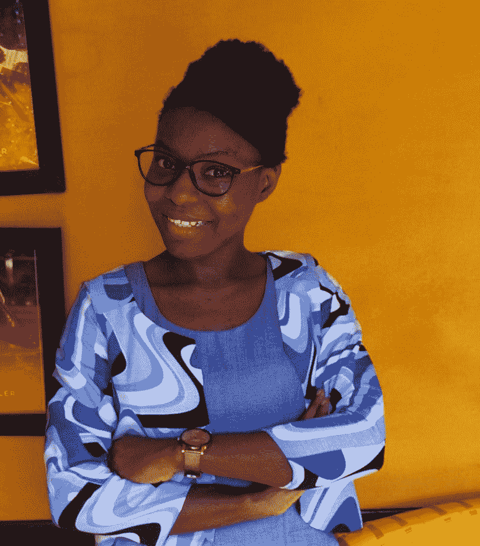

# 本周 PyDev:玛莎·泰伊

> 原文：<https://www.blog.pythonlibrary.org/2021/10/04/pydev-of-the-week-martha-teye/>

本周我们欢迎玛莎·泰耶([@泰耶 _ 玛莎](https://twitter.com/teye_martha))成为我们本周的 PyDev！在这个 [YouTube 视频](https://youtu.be/qKlqTSH7qxQ)中，玛莎讲述了她的第一个大型 Python 项目，她创建了一个聊天机器人。你可以在 [LinkedIn](https://www.linkedin.com/in/martha-t-teye/) 上联系玛莎。

让我们花些时间更好地了解玛莎！

你能告诉我们一些关于你自己的情况吗(爱好、教育等)

我叫 Martha Teye，是 Kwame Nkrumah 科技大学计算机科学专业的一名大四学生。在此之前，我在能源和自然资源大学获得了电气和电子工程学士学位。

我也是一个有两年工作经验的软件开发人员。工作之余，我喜欢志愿教年轻人(尤其是女性)计算机编程。

**你为什么开始使用 Python？**

在我的第三年实习计划期间(2017 年)，我有机会在加纳地球观测研究和创新中心(EORIC)的高性能计算实验室实习。我的部分任务是理解数据操作和可视化，以及如何使用这些技术来分析实时数据。那是我第一次学习用 python 编程的时候。我必须学习基础知识和 python，以及一些介绍性的数据科学和数据可视化技术。

实习结束后，我决定在空闲时间探索基础数据科学和机器学习项目。此后，我对 python 产生了浓厚的兴趣，并决定甚至在我的最后一年项目中使用它，该项目是使用自然语言工具包开发一个聊天机器人，用于我所在部门的教学。

你还知道哪些编程语言，你最喜欢哪一种？

作为一名软件开发人员，我最常用的是 C#、Matlab、Typescript、JavaScript 和 PHP。我不确定我是否有最喜欢的，因为我喜欢根据我工作的项目来使用它们。但是我想说我最喜欢的是 C#和 Python。因为我使用了。NET 框架，我喜欢他们的库。Python 还因为它的库和易用性。

你现在在做什么项目？

我目前正在研究一个用于实时视频情感识别的模型。该项目旨在减轻黑非洲社会中从数据集阶段到部署阶段的一些偏见。我正在实施几种数据扩充技术，以确定减少数据集中偏差的最佳解决方案。该模型也是使用具有 VGG16 架构的卷积神经网络构建的。这其实是我正在进行的硕士研究，期待惊人的成果。

我也在为一个时尚品牌做布料图案的图像识别。这是我不久前开始的一个新项目，所以我期待着令人兴奋的结果。

哪些 Python 库是你最喜欢的(核心或第三方)？

我喜欢使用 Python，因为有库可以让工作变得更容易。我经常使用的肯定是我的最爱。熊猫、Matplotlib、TensorFlow、自然语言工具包、Tkinter、Open CV。

**你是如何加入 Python 加纳社区的？**

在我学习 python 基础知识的几个月后(2018 年 2 月)，一个朋友和我谈到了即将举行的 Django 女孩研讨会和招募志愿者导师的事情。我总是在练习新东西，并与我的同事分享，所以他们中的一些人认为我可以胜任教授他人的任务。然而，我以前没有和 Django 一起工作过，所以我对申请有点怀疑，但我还是这样做了。我每天都在学习 Django，直到事情发生的那天。在为期两天的研讨会后，我被介绍给了 Python 加纳，因为他们组织了研讨会。我是活动中为数不多的女性导师之一，最终也成为了皮拉迪斯加纳的一员。到目前为止，我已经是一名会员了，我相信它对我的 python 之旅有所帮助。

我看到你在 Python 编程方面指导人们？你在 Python 中看到人们努力学习的一些常见的事情是什么？

没错，我用 python 指导人们，尤其是女士。这是我非常热爱的事情之一，因为我不得不艰难地学习 python，如果我没有得到任何指导，我怀疑我会成功。我在 PyLadies、Developers in Vogue、Tech Flair 等公司有志愿经验。通过这个，我注意到，大多数人在开始学习 python 时，有时会希望在一周或一个月内完成音节。由于这一点，他们没有真正的耐心去掌握基本概念，因此当需要实现一些数据结构、循环或类时，他们往往会发现很难。幸运的是，Python 的语法很容易理解，但是提供逻辑解决方案的能力是个问题。

对于循环来说，While 和 If 语句是人们努力学习的主要内容，有时甚至会阻碍他们进一步学习。我通常把这归因于大多数人没有花更多的时间去练习。就个人而言，我在理解 while 循环时遇到了一些挑战，直到我花了一些时间来回答 leetcode 上的示例问题，这提高了我的理解能力。

玛莎，谢谢你接受采访！