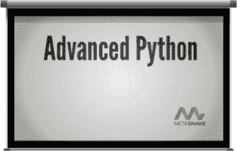

# 本周 PyDev:马特·哈里森

> 原文：<https://www.blog.pythonlibrary.org/2015/05/04/pydev-of-the-week-matt-harrison/>

本周，我们欢迎马特·哈里森作为本周的 PyDev。马特是几本 Python 书籍的[作者](http://www.amazon.com/Matt-Harrison/e/B0077BQLH6/ref=sr_ntt_srch_lnk_1?qid=1425332217&sr=8-1)。他是 PyCon 和其他会议及用户组的著名演讲者。去年，他发布了一个 [Python 培训包](http://www.hairysun.com/90py/)，这是一个学习 90% Python 的 Python 课程。让我们花些时间去更好地了解他吧！

你能告诉我们一些关于你自己的情况吗(爱好、教育等)

我应该先说:我使用 emacs，所以如果你需要的话，现在可以停止阅读🙂

*我经营着一家小公司， [MetaSnake](http://metasnake.com) ，它为专业人士提供密集的 Python 培训，以及围绕原型、数据科学和如何高效使用 Python 的咨询服务。我在犹他州长大，但在斯坦福上学，毕业后在湾区呆了一段时间，为各种初创公司工作。从大学开始，我最大的时间浪费是极限飞盘。在湾区，我可以全年和几乎一周的任何一天参加皮卡，联赛和俱乐部的比赛。(这实际上是一个很好的社交机会，因为事实证明，书呆子更喜欢终极版，我遇到了很多有趣的人，并和他们一起玩)。*

这些年来，我在多个领域工作过:高可用性、搜索、开源堆栈管理、商业智能、存储、数据科学、教育和移动应用程序设计。大多数任务都是使用 Python 完成的。我已经用 Python 编程 15 年了，并且看到了它的成长。当我开始工作时，我们需要隐藏我们正在使用的语言，因为尖头型的人不信任任何旧语言。现在，Python 是最受欢迎的语言之一，在大学里被教授，在初创公司和成熟公司里被使用。

为了离家更近，我们搬到了犹他州。虽然没有什么比得上湾区的科技场景，但我在这里很开心。拥有四个季节是美妙的(我今天早上滑了 18 英寸的粉)，但即使在犹他州，我也有机会全年无休。技术场景正在改善:有大量的本地用户组和会议让书呆子们开心。这里对 Python 开发者的需求很大。

我非常相信帮助他人和回报他人。我帮助运行犹他州 Python 用户组。除了在会议上演讲和做培训之外，在过去的五年里，我还志愿为小学生教授为期 8 周的编程概念。这是有益和有趣的。尽管孩子们比前几代人有更多的机会接触技术，但他们面对的设备和应用程序让他们无法理解电脑是如何工作的。尝试不同的方法向他们解释潜在的、隐藏的计算机科学概念是很有趣的。我最近的一次尝试是使用无人机，我认为相当成功。

**你为什么开始使用 Python？**

在我校外工作的第一家创业公司，我和一些非常聪明的人一起从事信息检索工作。我和一位同事负责为一个内部工具实现 tf-idf。他对 Tcl 很熟悉，而我当时正在使用 Perl(有人告诉我，如果我在学校时学习 Perl，我将更容易被雇用)。我们俩都没有兴趣跨越到对方语言的桥梁上。但是我们都对 Python 感兴趣，并认为这是一个令人愉快的妥协。最后，我们在三天内完成了这个项目，我们两个都很快开始使用 Python 作为我们的“首选”工具。

虽然我欣赏 Perl，但我发现它是一种只写的语言。总的来说，Python 与我的情感相契合。我可以用同样多的代码用 Python 实现伪代码。虽然 Python 这种语言有各种缺点，但我还没有找到另一种语言能像 Python 一样给我带来高效率。

你还知道哪些编程语言，你最喜欢哪一种？

这些年来，我使用过 JavaScript、Java、Perl、VisualBasic、C#、C、C++和 Lua 来完成各种与工作相关的任务。在学校里，我学过 Prolog、Pascal、Fortran 和 Lisp。和我同龄的许多人一样，我是从 Commodore 64 开始做基础的。我的首选工具是 Python。

在当前的咨询项目中，我们使用 Clojure 和 ClojureScript 做了大量工作。我欣赏函数式编程，Rich Hickey 在领导 Clojure 方面做得很好。我认为 Python 程序员应该研究一下函数构造，因为它们也适用于 Python。大多数刚从学校出来的人似乎都被灌输了面向对象编程，虽然 Python 支持这种编程风格，但它也支持命令式和函数式风格。我认为后一种风格通常更简洁明了。话虽如此，我知道不止一家公司试图使用 Clojure 来完成 Python 擅长的任务，但最终还是回到了 Python。

你现在在做什么项目？

对于我的培训客户，我和他们一起构建定制培训，让专业程序员快速掌握 Python。学生或业余爱好者通常可以慢慢来，浏览博客或文档，但对于专业人员来说，他们必须快速理解语法知识、缺点、最佳实践和库。我和客户一起工作来调整知识的传递。

我创建并用于培训的一个漂亮工具是 [rst2odp](https://github.com/mattharrison/rst2odp) ，这是一个将 rst 转换成(Open|Libre)Office 演示文稿的工具。使用 rst 的一个很好的好处是，我可以在我所有的幻灯片上运行 doctest，并确保我的幻灯片中的代码实际工作。

我的咨询包括应用和分析/数据科学项目的战略规划和实施。在这里，我使用了整个 Python 栈:Flask、SQLAlchemy、pandas、matplotlib 等，甚至还涉足了 IronPython 等项目。我最近开始使用 Luigi 项目，它对于构建分析管道非常有用，我希望我以前使用过它。

下面是我的几个 github 项目。我觉得有趣的是，我最受欢迎的两个 github 项目甚至都不是 Python:

*   *[epub-css-starter-kit](https://github.com/mattharrison/epub-css-starter-kit) 一个 css 集合，用于在最流行的电子书平台上创建格式良好的电子书*
*   *[Git-supervi ular-cheat sheet](https://github.com/mattharrison/Git-Supervisual-Cheatsheet)一个解释 Git 用法的 SVG*
*   *[rst2epub2](https://github.com/mattharrison/rst2epub2) 一个将 rst 转换成电子书的 Python(最终)工具，也适用于 Kindle 的电子书*
*   *[pycoverage.el](https://github.com/mattharrison/pycoverage.el) 一个用于高亮显示 coverage.py 结果的 emacs 插件*

我和痴迷于运动的儿子一起做的一个有趣的小项目是足球游戏。我们找到了一些他最喜欢的球员的统计数据，使用这些数据，结合一些统计数据，我们制作了一个非常酷的基于文本的足球游戏，有点模拟现实中发生的事情。向更小的孩子展示数学和编程如何应用于体育运动是很有趣的。(也许他会变成一个体育赌徒)。

哪些 Python 库是你最喜欢的(核心或第三方)？

我几乎每天都使用的两个库是 virtualenv 和 pip。能够使用 virtualenv 轻松运行应用程序，让我安心地快速试验和尝试新事物。Pip 使安装变得容易，是天赐之物。它使开发变得不那么痛苦。在 pip(及其前身 easyinstall)之前，设置依赖关系是一件令人头疼的事情。

这些年来，我非常欣赏 SQLAlchemy。Mike Bayer 在分层界面方面做得非常出色。我已经使用了 SQL 抽象和 ORM 接口，并且对它的特性集印象深刻。几年前，我甚至为它编写了 MonetDB 支持，这非常简单。

pandas、matplotlib、scikit-learn 和 iPython Notebook 的分析工具非常方便。我是 emacs 的长期用户，我真的很欣赏 iPython 笔记本 **的 [emacs 客户端。](https://github.com/millejoh/emacs-ipython-notebook)** IPython Notebook 面向分析，我发现当我编写库时，我需要一个真正的编辑器。emacs 客户端使得混合开发和分析变得非常容易。

Matplotlib 是另一个令人惊叹的工程壮举，但由于它的界面受到 MATLAB 的启发，所以有点非 Pythonic 化。坐落在 matplotlib 之上的 [Seaborn](http://stanford.edu/~mwaskom/software/seaborn/) 库提供了面向统计绘图的接口，是对 matplotlib 接口和 pandas 绘图接口的改进。任何需要好看的，复杂的绘图的人都应该去看看。

你写 Python 书籍的动机是什么？

简短的回答:自行车脱落。当我学习 Python 的时候，我觉得有必要创作我想要的 Python 书籍。

更长的回答:我一直喜欢教书和帮助别人。我通过做家教来资助我的教育。当你看到别人的想法被点击时，这是非常有益的。我就是这样开始参与 PyCon 和其他会议上的教程的。我想象着:我想上什么课或课程？我在此基础上创建了自己的实践课程。总的来说，它们非常成功，广受好评。多年来，我已经教了数百名学生 Python。

我的书是这个想法的延伸。特别是在为一个会议准备教程时，我想，与其只是重做我的幻灯片，不如根据我的课程写本书。我本打算在会议之前完成这本书，但是唉，我对写书的努力太天真了。

*最终我完成了我的第一本书，[踏上 Python:开始 Python](https://www.amazon.com/Beginning-Python-Programming-Learn-Treading-ebook/dp/B00639H0AK/ref=as_sl_pc_ss_til?tag=hairysuncom-20&linkCode=w01&linkId=QLR77FPIPPRO44L5&creativeASIN=B00639H0AK) 。在这个过程中，我对电子书有了相当多的了解(因此有了 github for CSS for ebooks 的项目，以及将 rst 转换成电子书)，最终有了一本电子书和一本实体书出售。在学习 Python 时，我曾试图提供我想要的产品。反响很好，我已经开始写其他几本书，也有了自己的想法。*

********

你能告诉我们作为一名作家你学到了什么吗？

现在任何人都可以成为作家。传统出版商仍在寻找内容，但随着 Kindle 的出现，自助出版比以往任何时候都更容易。唯一的要求就是写内容的决心。做一个作者，做一个导师，跟编程很像。如果你有一个逻辑进展，输出更容易跟随。我认为作为一名作者对我作为一名开发人员也有帮助，因为我倾向于将问题分解成一系列更小的步骤。

走自助出版的道路也让我能够钻研如何创造和销售产品。做销售是一种新的体验，需要你全身心地投入。这种曝光有好有坏。得到很好的反馈和评论真是太棒了。但是你也会得到差评，有些是合理的，有些是不合理的。它并不适合每个人，但我喜欢新的挑战，这是一次很好的学习经历。

你还有什么想说的吗？

随着媒体对数据科学的关注，非 web 开发人员和科学家对 Python 产生了极大的兴趣。Python 是唯一一个可以在广泛的领域中看到如此广度的工具。这是成为 Python 开发者的大好时机。

我最大的遗憾是，当我第一次来到旧金山湾区时，我没有加入当地的用户组。当时这是一个很小的群体。我是一个内向的人，不知道社交的重要性，也不知道分享想法和从他人如何使用 Python 中获得灵感的重要性。我真是太傻了。如果有一条建议，我会给年轻的自己，那就是打破你的舒适区。

*感谢阅读，你可以在 twitter 上关注我，时间是 [@__mharrison__](https://twitter.com/__mharrison__) 。或者随时来 PyCon 聊天！*

**谢谢！**

### 一周的最后 10 个 PyDevs

*   阿迪娜·豪
*   [诺亚礼物](https://www.blog.pythonlibrary.org/2015/04/20/pydev-of-the-week-noah-gift/)
*   道格拉斯·斯塔内斯
*   [可降解的脊椎动物](https://www.blog.pythonlibrary.org/2015/04/06/pydev-of-the-week-lennart-regebro/)
*   迈克·弗莱彻
*   丹尼尔·格林菲尔德
*   伊莱·本德斯基
*   [Ned Batchelder](https://www.blog.pythonlibrary.org/2015/03/09/pydev-of-the-week-ned-batchelder/)
*   布莱恩·奥克利
*   [足球妈妈](https://www.blog.pythonlibrary.org/2015/02/23/pydev-of-the-week-maciej-fijalkowski/)