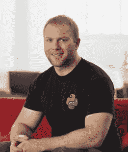

# 本周 PyDev:马修·马凯

> 原文：<https://www.blog.pythonlibrary.org/2017/10/30/pydev-of-the-week-matthew-makai/>

本周，我们欢迎马修·马凯成为本周的 PyDev！马修是[全栈 Python](https://www.fullstackpython.com/) 的创造者，他还与迈克尔·肯尼迪合作制作他的[企业家 Python 视频课程](https://www.kickstarter.com/projects/mikeckennedy/python-for-entrepreneurs-video-course)。你可能也想看看他在 [Github](https://github.com/mattmakai) 上做了什么。让我们花几分钟时间更好地了解他！

你能告诉我们一些关于你自己的情况吗(爱好、教育等)

*我叫[马特·马凯](https://github.com/mattmakai/)，我是[全栈 Python](https://www.fullstackpython.com/) 的创造者，也是一名目前为 [Twilio](https://www.twilio.com/blog/2014/02/introducing-developer-evangelist-matt-makai.html) 工作的软件开发人员。我和妻子住在华盛顿特区，尽管我们几个月前刚从旧金山搬到华盛顿特区。*

我的教育贯穿了弗吉尼亚州的公立大学系统:[詹姆斯·麦迪森大学](http://www.jmu.edu/cs/)计算机科学学士，[弗吉尼亚理工大学](https://www.cs.vt.edu/)计算机科学硕士，然后[弗吉尼亚大学](https://www.commerce.virginia.edu/ms-mit)信息技术管理第二个硕士学位(实际上是应用于软件的 MBA)。

计算机科学和编程是我的主修科目，但是我获得了商业学位，所以我能够在关于市场营销、金融、公司战略等方面的讨论中坚持自己的观点。弗吉尼亚大学的项目对于成为一名更全面的软件开发人员来说是一门真正令人愉快的课程。

**你为什么开始使用 Python？**

对我来说，在 Python 生态系统中写代码已经有 10 年了！早在 2007 年，我白天是一名 Java 开发人员，但晚上会从事 Python 方面的项目。随着时间的推移，我发现使用 Python 在晚上几个小时内构建的东西比在 Java 领域工作一整天都要多。

*非常感谢为 [Django web framework](https://www.djangoproject.com/) 工作的人们，感谢[令人惊叹的文档](https://docs.djangoproject.com/en/dev/)，这让我能够自学 Python 开发并开始全职从事 Python 工作。*

你还知道哪些编程语言，你最喜欢哪一种？

*我有一些使用 Swift 进行 iOS 开发的经验。我的 Java 有点生疏了，但在 Spark 框架中使用一些 Java 8 的新特性很有趣，今年早些时候我曾用它写了一个有趣的教程。Python 是迄今为止我最喜欢的语言，但是抛开它不谈，Swift 有很大的潜力。*

—

你现在在做什么项目？

*我从 2012 年开始的一手项目是[全栈 Python](https://www.fullstackpython.com/) ( [源代码库](https://github.com/mattmakai/fullstackpython.com))。我几乎每天都推[全栈 Python 更新](https://www.fullstackpython.com/change-log.html)到描述[主题](https://www.fullstackpython.com/table-of-contents.html)的页面，从[对象关系映射器](https://www.fullstackpython.com/object-relational-mappers-orms.html)到[模板引擎](https://www.fullstackpython.com/template-engines.html)，到[教程博客](https://www.fullstackpython.com/blog.html)。*

*在 [Python 企业家视频课程](https://training.talkpython.fm/courses/explore_entrepreneurs/python-for-entrepreneurs-build-and-launch-your-online-business)中，与的“Python 对我说”播客的 [Michael Kennedy 合作真是一种享受。我也一直在更新我的部署指南书](https://talkpython.fm/)，尽管很难找到大量的时间来做兼职项目，因为我和妻子刚刚有了第一个孩子。*

哪些 Python 库是你最喜欢的(核心或第三方)？

这个问题的答案可以有自己的博文！我在 [PythonBytes 播客第 38 集](https://pythonbytes.fm/episodes/show/38/hacking-classic-nintendo-games-with-python)中讨论了一些我最喜欢的，包括[鹈鹕](http://docs.getpelican.com/en/stable/)和[散景](https://bokeh.pydata.org/en/latest/)。Ansible 和 [Fabric](http://www.fabfile.org/) 也是我最喜欢的，因为我做了大量的 [web 开发](https://www.fullstackpython.com/web-development.html)和[部署](https://www.fullstackpython.com/deployment.html)工作。

**全栈 Python 是怎么来的？**

回到 2012 年，我每个月都去 DC Python meetup，和那些努力理解 Python 生态系统的初级开发人员交谈。在和人们发了很多邮件后，我决定把我写的关于 Python web stack 的东西放到网上。我选择了“全栈 Python”这个名字，因为 fullstackpython.com 是一个可用的域名。我一点也不知道这个名字会被记住，多年后我仍在从事这个项目。

从 2012 年末到 2014 年初，我在/r/python subreddit 上建立了一个链接。那里的开发人员非常支持我的努力，所以这给了我继续工作的动力。那年夏天，随着头版黑客新闻《T4》的热播，该网站得到了另一个巨大的推动。这两次活动的流量和反馈帮助我找到了网站未来的方向。我也意识到我投入到这个项目中的时间对于更广泛的 Python 社区来说是有价值的，所以从那以后我每天都在做这个项目。

在运营网站的过程中，你学到了什么？

开源的碎片化本质使得初学者很难知道他们不知道的东西。要成为一名高效的程序员，你需要知道的不仅仅是编程语言的语法。你必须了解生态系统中的开源项目可以解决你正在处理的问题。例如，如果你是一名使用 [Sidekiq](https://github.com/mperham/sidekiq) 的 Ruby 开发人员，然后从事 Python 项目，你会想知道使用什么等价的[任务队列](https://www.fullstackpython.com/task-queues.html)，比如[芹菜](https://www.fullstackpython.com/celery.html)、 [RQ](https://www.fullstackpython.com/redis-queue-rq.html) 或 [Huey](https://huey.readthedocs.io/en/latest/) 。

另外，我发现有经验的开发人员理解概念和工具之间的区别，就像我如何在网站上对主题进行分组一样。像 [web 框架](https://www.fullstackpython.com/web-frameworks.html)这样的概念是通用的，并且有不同类型的实现。工具是概念的实现。对于 web 框架概念，一些示例工具实现是 [Django](https://www.fullstackpython.com/django.html) 、 [Flask](https://www.fullstackpython.com/flask.html) 、 [Pyramid](https://www.fullstackpython.com/pyramid.html) 。在一个概念中，有许多方法可以实现一个工具。每种工具都有自己的实现理念和优缺点。

许多初级开发人员经常发现一个闪亮的新工具，并说“酷，我要在我的项目中使用它！”。然而，如果不理解工具背后的概念以及它能解决什么问题，你只是给你的项目增加了一堆复杂性，而没有清楚地理解权衡。

你还有什么想说的吗？

能够成为我们神奇的 Python 社区的一员，我感到非常幸运。我想对那些运营组织的人们大声疾呼，例如 [Python 软件基金会](https://www.python.org/psf/)、 [Django 软件基金会](https://www.djangoproject.com/foundation/)、 [NumFOCUS](https://www.numfocus.org/) 以及其他许多类似的组织，它们使得开源项目得以蓬勃发展。这是一项困难而重要的工作，但这些组织背后的人往往没有因为让社区变得伟大而获得足够的信任。所以谢谢大家！

感谢您接受采访！