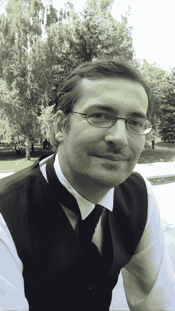

# 本周 PyDev:米歇尔·西米奥纳托

> 原文：<https://www.blog.pythonlibrary.org/2016/08/22/pydev-of-the-week-michele-simionato/>

本周我们欢迎 Michele Simionato 成为我们的本周 PyDev！Michele 是 Python 方面的专家，他因关于 Python 的[方法解析顺序](https://www.python.org/download/releases/2.3/mro/)的论文而闻名，该论文由 Guide Van Rossum 发表在 Python 网站上，他还与 David Mertz 一起撰写了一系列关于元类的非常有趣的文章。它们有点难找到，但是你可以在这里阅读三部曲系列[的第一部。他是意大利蟒蛇协会的创始人之一。米歇尔拥有量子场论重整化的博士学位。让我们花一些时间来更好地了解他！](http://gnosis.cx/publish/programming/metaclass_1.html)

你能告诉我们一些关于你自己的情况吗(爱好、教育等)

我最初来自学术界，拥有理论物理博士学位。然后我在一家分析公司(股票市场风险评估)工作了几年，现在我回到了科学领域，在 [GEM](https://www.globalquakemodel.org/) 做地震模拟。

**你为什么开始使用 Python？**

这件事发生在 2002 年。当时我是匹兹堡大学物理和天文学系的博士后研究员。鉴于在学术界之外可能的职业生涯，我决定是时候学习一些现代编程语言了。在读了布鲁斯·埃凯尔的几本长书之后，首先是关于 C++的，然后是关于 Java 的，我决定我不想用这两本书中的任何一本来编程。我在 Ruby 和 Python 之间犹豫不决，但是 Python 赢了，因为它有更好的科学库和更实用的哲学。

你还知道哪些编程语言，你最喜欢哪一种？

很久以前，我从 Basic 和 Pascal 开始，后来我用 Mathematica 和 Maple 做了很多工作。在学习 Python 之后，我对函数式语言产生了兴趣，并且对 Scheme 了如指掌，以至于我几乎写了一本书，书名是《一个 Pythonista 在 Schemeland 的冒险》。在我的日常工作中，我不得不大量使用 SQL(我非常喜欢)和 Javascript(我不喜欢)。

你现在在做什么项目？

在过去的三年里，我已经成为 OpenQuake 引擎的维护者和主要开发者，这是一个产生地震危害和风险评估的计算引擎。这意味着，在做了几年数据库和 Web 开发人员之后，我已经成为了一名科学程序员，现在我把大部分时间花在了大规模分布式计算的性能分析上。我也有一个[博客](http://micheles.github.io/about/)，记录我与引擎的战斗。

哪些 Python 库是你最喜欢的(核心或第三方)？

numpy 是一个非常好的库，是人们进行科学应用的必要工具。

作为一门编程语言，你认为 Python 将何去何从？

老实说，我不确定 Python 作为一种语言将走向何方，我甚至不确定我是否喜欢最近的趋势。当然，我希望语言变得更简单，这是 Python 最初吸引我的地方，相反，我看到了一些变得越来越复杂的东西。此外，现在有其他值得注意的语言，而多年来 Python 没有竞争对手。如果你想知道的话，我想去做服务器端编程，Julia 做科学编程。它们看起来真的很有趣，即使我没有在它们中的任何一个中编程。Python 不应该认为它比 Java 和 C++更好(轻而易举的胜利)，而是应该认真考虑新的竞争者。

你对当前的 Python 程序员市场有什么看法？

对于 Python 程序员来说，这一直是一个很好的市场(至少从我 14 年前开始的时候开始)，现在更是如此。几乎每周都有人给我提供 Python 的工作。

你还有什么想说的吗？

我在 2016 年欧洲 Python 大会上的口号是“遗产代码战士”:这反映了我至少在过去 10 年里的日常工作。你可以在这里看到我演讲的视频:

[https://www.youtube.com/embed/uYKofUe0TnM?feature=oembed](https://www.youtube.com/embed/uYKofUe0TnM?feature=oembed)

感谢您接受采访！