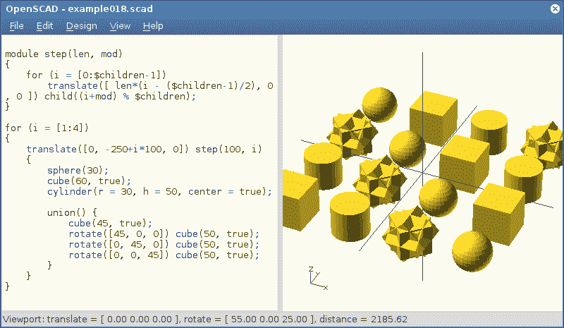

# 本周 PyDev:Miro hron ok

> 原文：<https://www.blog.pythonlibrary.org/2019/03/25/pydev-of-the-week-miro-hroncok/>

本周我们欢迎 Miro hron ok([@ hron cock](https://twitter.com/hroncok))成为我们的本周 PyDev！米罗在捷克技术大学任教，并帮助当地皮拉第斯分会。除了教学职位之外，他还为 Red Hat 工作，参与了 Fedora 中 Python 的特殊兴趣小组。你可以在 [Github](https://github.com/hroncok) 上查看他参与的一些项目，或者查看他的[网站](https://hroncok.cz/)。让我们花一些时间来更好地了解米罗！

你能告诉我们一些关于你自己的情况吗(爱好、教育等)

我是一个来自捷克共和国布拉格的男人，快三十岁了，但我的父母都来自斯洛伐克的科希策，所以我是捷克和斯洛伐克的混血儿。我在体育馆学习了 Pascal，后来在布拉格的捷克技术大学信息技术学院获得了计算机科学/软件工程的学士和硕士学位。我的大多数爱好都与计算机和技术有关，但除此之外，我还有两只爱尔兰猎狼犬，我喜欢滑雪。

她小时候我的一只狗

我的技术兴趣一直与自由和开源软件(和硬件)有关，从我十几岁时的捷克 Linux 社区开始，在我大学的早期共同创建了 RepRap 3D 打印实验室，并加入了 Fedora 和后来的 Red Hat，现在在 Python 维护团队工作，也是捷克 Python 社区的积极分子。

**你为什么开始使用 Python？**

Python 不知何故在我做事情的任何地方都出现了。是一些基本的 Linux 实用程序还是一些面向 RepRap 的应用程序，它碰巧是用 Python(或 perlðÿ˜)编写的。我更喜欢 Python 语法，因为我已经熟悉了多种语言，如 C、C++、Java、Pascal 甚至 PHP，所以我决定尝试一下 Python。一次偶然的机会，我在某个捷克 Linux 会议上免费得到了马克·皮尔格林的《深入研究 Python 3》的捷克语翻译版本，这是我智慧的主要来源。

你还知道哪些编程语言，你最喜欢哪一种？

除了已经提到的语言，我大部分时间都在 Shell 中工作。除了 Python 之外，我不认为我有喜欢的编程语言，但我喜欢 TeX 和 [OpenSCAD](http://www.openscad.org/) (本质上不是“编程”语言)。

我真的对 Rust 很感兴趣，但我仍然没有找到合适的项目来学习它，而且自从我大学毕业后，我不知何故失去了通过 hello world 示例学习的耐心。

Haskell 是另一种我希望有一天能学会的语言。

OpenSCAD

你现在在做什么项目？

我在 Red Hat 的主要职责可能也是我的主要爱好是软呢帽。Fedora 是一个大项目，我开始是一名打包员(旨在引入 [RepRap 应用](https://fedoraproject.org/wiki/Features/3D_Printing))，几个月后成为 [Fedora 大使](https://fedoraproject.org/wiki/Ambassadors)，由我的捷克朋友兼同事[Ji eisch Mann](https://eischmann.wordpress.com/)和其他几位 Fedora 大使指导，他们大多来自德国。

后来，我成为了打包赞助者(能够“赞助”更多的打包者进入 Fedora 项目)，最近加入了 [Fedora 打包委员会](https://fedoraproject.org/wiki/Packaging_Committee)和 [Fedora 工程指导委员会](https://docs.fedoraproject.org/en-US/fesco/)。

作为我工作的一部分，我是 [Fedora 的 Python 特别兴趣小组](https://fedoraproject.org/wiki/SIGs/Python)的成员，并且作为 Red Hat 的 Python 维护团队的“主要 Fedora”人员，我主要在 Fedora 中处理 [Python 的各个方面，试图让 Fedora 成为 Python 开发者的最佳系统。](https://fedoralovespython.org/)

除了 Fedora，我还参与了各种上游项目(大部分是小补丁),包括 pytest、betamax、Printrun 和 CPython 本身。

我还维护或共同维护由[捷克 Python 社区](https://github.com/pyvec)创建的各种项目，最重要的是，我是 [Elsa](https://github.com/pyvec/elsa) 的主要维护者，Elsa 是一个固执己见的冷冻瓶包装器。

那些大多是编程项目，但我也教书。我们在大学里有 3D 打印和高级 Python 课程，我还参加了捷克语 [PyLadies 初学者课程](https://pyladies.cz/)。

**您喜欢使用哪些非 Python 开源项目？**

我想我已经提到了很多ðÿ˜，除了像 Git 这样显而易见的东西，我真的很喜欢在我的 Xfce 桌面上工作时使用的 [Geany 文本编辑器](http://geany.org/)(用 c 编写);对于终端使用，我最近越来越喜欢[微](https://micro-editor.github.io/)(用 Go 编写)。至于实用工具，我喜欢 [ripgrep](https://github.com/BurntSushi/ripgrep) (用 Rust 写的‘grep-r’或‘git grep’替换)。

你为什么去大学教书？

当我们建立 3D 打印实验室时(IIRC 大学本科二年级)，我们正在寻找方法让其他学生熟悉 RepRap 项目和我们的活动。我们决定开设一门关于 3D 打印的选修课。我们让某人正式领导班级，但实际上是学生教的。后来，参与其他事情变得很容易，当我得知他们在技术文档类(LaTeX、graphviz、gnuplot 以及后来的 groff)中寻求帮助时，我也加入了进来。我想我倾向于参加我喜欢的事情。

当我完成我的硕士学位时，我也有一个教高级 Python 的想法，我已经说服了我的团队领导 Petr Viktorin。我们已经在知识共享许可下，通过开源[学习材料](https://naucse.python.cz/)为大师们开设了一门“红帽赞助”课程。

我在大学里主要教男生，我也加入了皮拉迪斯初学者课程，通过向女士们介绍 Python 来帮助平衡这种情况。

由于我一直在家工作，每周能够教一两次课给了我更多的社交机会。

对于想学习编程的人来说，你认为在捷克共和国有什么挑战(如果有的话)？

我真的不知道。有大量的英语和捷克语的免费资源，大量的公共活动，你可以了解更多，无数的孩子学习的倡议，甚至为俄斯特拉发地区的前矿工开设的课程。你所需要的只是一个将时间投入编程的意愿。

我真的不知道小学和中学的信息学课程是什么样的，可能会因机构而异，有时可能非常糟糕，也可能非常优秀。

我的建议是:如果你的学校不能教你编程，那就去别处看看。

来到捷克的 pycon 来见见所有来自我家乡的热情的人们，看看我们在ðÿ‡ðÿ‡ðÿ是怎么做事的

我的意思是，说真的，来，下一个是 2019 年 6 月在俄斯特拉发(如果你后来看到这个，请查看网站上的明年)。

PyCon 2017

在红帽工作最大的好处是什么？

和优秀的人一起工作，做一些我可能也会免费做的事情，并因此获得报酬，ðÿ

我为红帽工作了 6 年，大部分时间我只是做我认为正确的事情。不要误解我，我也和其他人交谈，但是现在没有一个客户需要一个特性(或者至少这个客户离我很远)，或者一个坏老板告诉我，我只能在星期五为自由软件项目做贡献。我为红帽做的一切都是社区中的自由软件。

米罗，谢谢你接受采访！