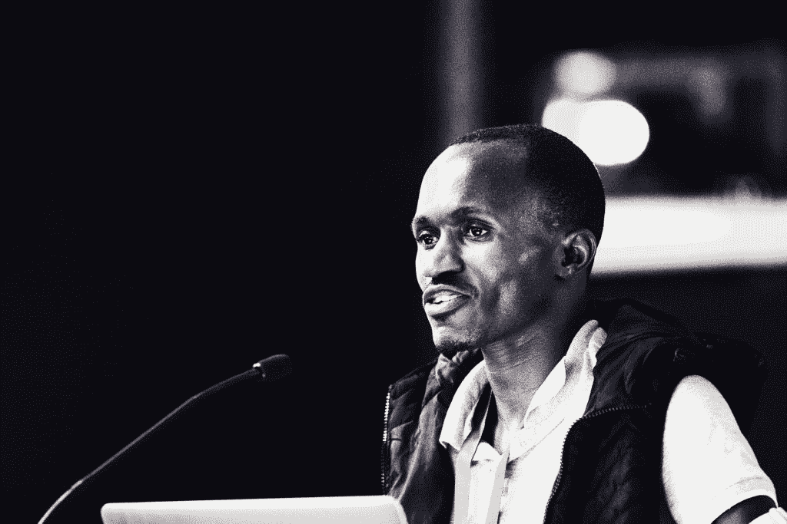

# 本周 PyDev:Ngazetungue mu heue

> 原文：<https://www.blog.pythonlibrary.org/2021/04/05/pydev-of-the-week-ngazetungue-muheue/>

本周，我们欢迎 Ngazetungue mu heue([@ muheuenga](https://twitter.com/muheuenga))成为我们本周的 PyDev！Ngazetungue 帮助组织 PyCon 纳米比亚，是 Python 纳米比亚的联合创始人。他是一名活跃的演讲者，也是 Python 软件基金会的成员。

Ngazetungue Muheue

让我们花些时间去更好地了解他吧！

你能告诉我们一些关于你自己的情况吗(爱好、教育等)

我是 Ngazetungue Muheue，纳米比亚人，开发人员，大会发言人，住在纳米比亚的温得和克市。我出生在纳米比亚，在这个国家远离牲畜的偏远地区长大。我是一名农民，尽管最近我跳槽到了科技领域。

我毕业于纳米比亚大学，获得计算机科学(荣誉)学士学位和文凭。虽然我上过几门技术课，但我的兴趣主要在编程方面。在编程领域接受教育拓宽了我的视野，我确实从各种不同的角度解决了问题。

我是 Python 软件基金会的研究员，对为技术领域的弱势群体或代表不足的群体而奋斗，并让世界各地的每个人都能更容易地使用这种语言有着浓厚的兴趣。希望，如果我们有共同的目标，这个世界会变得更好。几年来，我一直是 Python 社区的积极志愿者，倡导在纳米比亚和全球使用 Python。

当我不写代码的时候，你会发现我和朋友们在运动场上，在河床上听鸟鸣，和我的祖父母围着火炉听他们的童年故事。另外，我喜欢下棋。搞笑的部分，我不擅长看电影，我可以暂停两天，第三天继续看。希望我会继续努力。

**你为什么开始使用 Python？**

高中毕业后，我遭遇了一场车祸，这场车祸几乎使我瘫痪，并使我在医院里呆了整整一年。我不能动；我的胳膊和腿不听使唤了。

我开始问自己，我该怎么帮助自己，如果我的胳膊又不能用了，我该怎么办？那段时间，我买了我的第一台笔记本电脑。我记得在使用脸书时，我想知道人们如何与美国和世界其他地方的人交流。那是开启我旅程的火花。

2014 年，我被纳米比亚大学录取，参加一个为期两年的项目，以获得计算机科学文凭。我第一年接触 Python 的时候。2015 年，我们在纳米比亚大学和卡迪夫大学举办了第一次 Python 纳米比亚会议，然后我决定在 Python 领域更加活跃。我爱上了这种语言，因为它的语法，对我来说，在大学的项目中使用它很容易。我使用这种语言越多，我就越意识到它有一个了不起的社区，已经成为我生活的一部分。我交了很多来自世界各地的朋友，他们给了我很多帮助。这也是我坚持使用 Python 的原因之一。

你还知道哪些编程语言，你最喜欢哪一种？

目前，除了 Python 和 Javascript，我没有最喜欢的编程语言。我在大多数项目中使用 Django 框架。我在大学攻读文凭期间曾经使用过 Visual Basic 和 C#，现在我正在学习 React。老实说，我更喜欢 Python，还没有尝试过太多其他语言。

你现在在做什么项目？

目前，我正在用 Python/Django 为我以前在纳米比亚偏远地区的一所学校开发一个短信通知系统。我希望该系统将改善家长和学校管理层之间的沟通。这将减少新冠肺炎疫情期间学校内外不必要的访问。我还有其他项目正在进行中。

哪些 Python 库是你最喜欢的(核心或第三方)？

我喜欢 pathlib，它提供了一个对象 API 来轻松处理文件和目录。

是什么让你决定成为你们国家的 Python 倡导者？

几年来，我一直是我所在社区的积极志愿者，2015 年，在我们在纳米比亚举行的第一次 Python 大会之后，我决定开始倡导在纳米比亚和全球范围内使用 Python。我知道世界上大多数发展中国家依赖于开放和用户友好的技术，增加社区参与和教授 Python 将为我们的国家和公民带来变革性的力量。

我想让更多的年轻人和女性进入科技行业，参与我们的旅程。女性激励着我，我相信一个没有女性的社区不是一个社区。

最后，我仍然相信，将纳米比亚的 Python 社区聚集在一起，将有助于我们从小学生开始培养新一代的 Python 开发人员。如果我们携手并开始为之做出贡献，纳米比亚的所有人都有可能成为 Python 开发者。不仅如此，我认为我的参与将改变纳米比亚软件开发的未来。

你还有什么想说的吗？

嗯，纳米比亚 Python 社区正在为今年 6 月的第七届纳米比亚 PyCon 做准备。我鼓励所有读者关注我们的@PyConNA 页面，获取更多更新。

Ngazetungue，谢谢你接受采访！