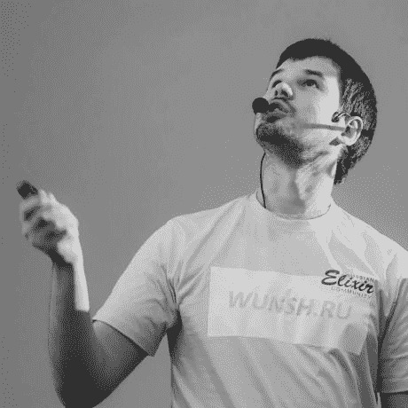

# 本周 PyDev:尼基塔·索博列夫

> 原文：<https://www.blog.pythonlibrary.org/2021/09/13/pydev-of-the-week-nikita-sobolev/>

本周，我们欢迎尼基塔·索博列夫( [@sobolevn](https://twitter.com/sobolevn) )成为我们本周的 PyDev！尼基塔是 [wemake.services](https://wemake.services/) 的创始人。尼基塔还写了一篇关于技术的[博客](https://sobolevn.me/)，你应该看看。你也可以在 GitHub 上看到他正在做什么。

让我们花点时间来更好地了解尼基塔！

你能告诉我们一些关于你自己的情况吗(爱好、教育等)

我的名字是尼基塔·索博列夫，我出生并成长在西伯利亚中部(俄罗斯新西伯利亚市)。西伯利亚最出名的是:

*   伟大的技术大学
*   美味的食物
*   遥远的距离，恶劣的天气和令人惊叹的风景

我喜欢所有这些东西🙂

现在我生活和工作在世界上最美丽的城市之一:圣彼得堡。关于我的职业生涯，一个有趣的事实是:我总是为同一家公司工作。当我还是学生的时候，我就开始了自己的咨询业务。我仍然在那里工作！

我花很多时间阅读历史或看电影。它帮助我从技术上转移注意力，把人道主义的部分带入我的生活。我也把教书作为业余爱好，我每周花几个小时给当地大学做关于 Python、web 开发和测试的讲座。

**你为什么开始使用 Python？**

我在大学的时候学过 Python，这是我课程的一部分，这很棒，因为这是很久以前的事了。

然后我用了涡轮齿轮(是不是还活着！？)来收集关于客户机定制 UNIX 版本中的驱动程序和硬件的一些数据。

从第一个项目开始，我就爱上了 Python。之后我就完全从 Java 转到 Python 了。我现在用了 10 多年了，从来没有回头过！

你还知道哪些编程语言，你最喜欢哪一种？

由于我的职责，我懂很多语言。作为一家咨询公司的首席技术官，我必须使用客户拥有的不同技术，我还必须了解不同堆栈的优缺点，以便做出更好的技术决策。

我经常使用:

*   打字稿，太牛逼了。我再也不会用普通的 JavaScript 了。它的类型系统既简单又灵活，工具也非常棒。这些天我尽可能地使用 Deno
*   灵丹妙药。它没有广泛流行，但它是一种学习和使用起来令人惊叹的技术。它有惊人的抽象、强大的平台和漂亮的语法
*   铁锈。我不能说“我知道”，因为还有很多东西要学，但我使用它，我完全喜欢它

我很想更多地使用 Haskell，但是在这一点上似乎不太现实。我也想花更多的时间在定理证明和 TLA+上。

你现在在做什么项目？

我未来几年的主要项目是让我的开源工作可持续发展。前面的路还很长。

目前，我主要从事几个开源项目:

*   [https://github.com/dry-python/](https://github.com/dry-python/)一组用于可插拔业务逻辑组件的库。你可以查看我们的 returns(【https://github.com/dry-】<wbr>python/returns)和 classes([https://github.com/dry-<wbr>python/classes/](https://github.com/dry-python/classes/))项目。第一个是关于单子的，而第二个增加了类型类。一切都是用 mypy 打出来的。这是一种完全不同的编写代码的方式，如果你愿意的话，功能性更强。加入我们的社区([https://t.me/drypython](https://t.me/drypython))了解更多
*   姜戈的类型！
*   不同的 Python 静态分析工具，您可能听说过有史以来最严格的 Python linter，对吗？[https://github.com/wemake-<wbr>服务/wemake-python- <wbr>风格指南](https://github.com/wemake-services/wemake-python-styleguide)

哪些 Python 库是你最喜欢的(核心或第三方)？

*   我喜欢 pytest，因为它是编写测试最简单的方法
*   我喜欢假设，因为它改变了你对测试的看法。改变你的思维模式后，你开始看到代码的“属性”而不是“行为”。这对编写更好的软件至关重要:[https://sobolevn.me/2021/02/<wbr>让测试成为你应用的一部分](https://sobolevn.me/2021/02/make-tests-a-part-of-your-app)
*   我还会把它命名为 rust python([https://github.com/<wbr>rust python/rust python](https://github.com/RustPython/RustPython))，因为和它一起工作非常有趣！

**你是如何参加 Python 会议/聚会的？**

我的一个同事是莫斯科 Python meetups 的联合组织者。在某些时候申请是很自然的事情。然后，我在俄罗斯 Python 社区交了很多朋友，人们有点喜欢我的演讲。所以，我开始更频繁地这样做。

这对我的咨询业务也有积极的影响:新客户、新合同等等。

你对有抱负的作家或演讲者有什么建议吗？

1.  创建自己感兴趣的内容
2.  关注想法和表达想法的方式
3.  保持一致
4.  小心你创造的“易于推广”的内容的数量。有时候人们会对此过度兴奋