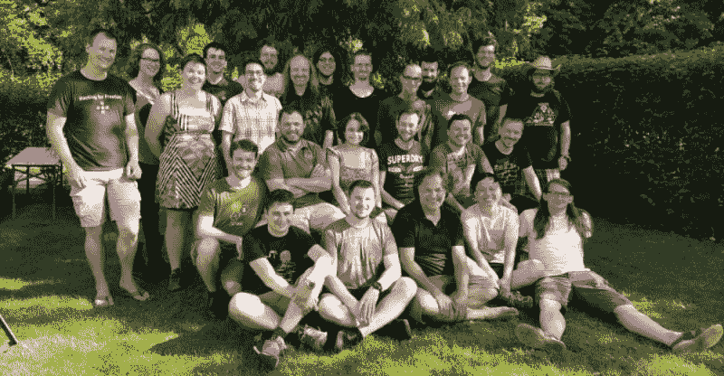

# 本周 PyDev:奥利弗·贝斯沃特

> 原文：<https://www.blog.pythonlibrary.org/2018/09/10/pydev-of-the-week-oliver-bestwalter/>

本周，我们欢迎奥利弗·贝斯沃特( [@obestwalter](https://twitter.com/obestwalter) )成为我们本周的 PyDev！他是 [tox 自动化项目](https://tox.readthedocs.io/en/latest/)和 [pytest](https://docs.pytest.org/en/latest/) 包的核心开发者之一。他也是几个 Python 相关会议的发言人。你可以在他的[网站](https://oliver.bestwalter.de/)或 [Github](https://github.com/obestwalter) 上了解更多关于奥利弗的信息。让我们花一点时间来了解更多关于奥利弗！

你能告诉我们一些关于你自己的情况吗？

我在星球大战日出生在西德，那一年，最后一个人踏上了月球。

39 岁时，我获得了计算机工程学士学位(德语:Technische Informatik ),然后开始了第一份软件开发工作。

虽然我在十几岁的时候就爱上了计算机，在我二十出头的时候就爱上了自由软件，但那时我更喜欢音乐、文学和体育。在学校里，我被误导，认为自己“不擅长数学”，所以学习计算机科学或任何技术都不是我的选择。作曲和演奏音乐占据了我十几岁和二十几岁的时间。我独自在不同的乐队演奏过几种乐器(贝斯、吉他和键盘乐器——主要是自学的)。那段时间的一些录音在 [Soundcloud](https://soundcloud.com/oliver-bestwalter) 上在线。

当我 28 岁时，我经历了一次严重的滑板事故，摔断了手和肘。这使我一年多不能演奏任何乐器。我没有很好地应对，陷入了深深的危机，导致我放弃了音乐和围绕音乐的整个社会生活。那时，我相当孤立，没有受过任何形式的正规教育，老实说，我不知道该如何生活。我在一家半导体制造厂的后台(也就是嘈杂和肮脏的部分)接受了一份极其无聊的工作。生活并没有那么美好，但在业余时间，我再次拾起了我的另一个爱好(计算机)，并用它来共同创建和培育一个基于网络的非营利性支持委员会。我的联合创始人碰巧是一个很棒的女人，后来成了我的妻子。所以你永远不知道什么东西是好的，我猜。

我倾向于把我的爱好转化为我的工作，就像我当年对音乐和现在对计算机所做的那样。好的食物和饮料偶尔会从我的嘴里冒出来，这可能被称为一种爱好，当它不纯粹是为了维持生计而喝的时候。欣赏现代艺术，主要是电影、书籍和电脑游戏(现在很少了)，也是我娱乐活动的一部分。我更多的是一个室内爱好者，但我也可能偶尔去散步。作为一个内向的人，我需要很多独处的时间来充电，但我也喜欢和我的家人和我的猫在一起(可能更合适的说法是，猫有时喜欢和我们在一起，因为她收养了我们，而且绝对是发号施令的人)。

**你为什么开始使用 Python？**

TL；大卫:我真的不知道，但我肯定不后悔。

2006 年的一个晴朗的日子，当我在互联网上旅行时，我偶然发现了一个以我最喜欢的喜剧组合命名的编程语言网站。我差不多一口气就把[伟大的 Python 教程](https://docs.python.org/3/tutorial/)吸入了进去。我仍然清楚地记得那件事——那是一见钟情。那些内置的数据结构！简单！语法的清晰！没有花括号汤！接下来，我读了马克·皮尔格林的《深入 Python 的 Python 2 版本的硬拷贝，我完全被这种美丽的语言及其可能性迷住了。谢谢贵都和马克！

当我还在工厂里做着没有任何前景的粗活时，学好这门语言并弄清楚如何使用它成了我的目标。我开始梦想成为一名使用 Python 开发软件的专业开发人员。问题是 Python 当时还远未成为主流，Python 的工作也并不常见。我也已经三十多岁了，仍然坚信不擅长数学会让这成为一个不可能的梦想。不知何故，我已经接受了这样的想法:我的余生将在一份又一份的工作中辛苦地度过。我的妻子不同意这种无稽之谈，她说如果我不试就不知道。她准备在我学习期间资助我们，我再也没有任何借口了(我告诉过你她很棒)。我决定接受正规的教育，我们搬到了北方，那里的生活很便宜，我进入了一所小型应用科学大学。我参加的第一次考试是数学。那一年我取得了第二好的成绩...“不擅长数学”...哈！离开学校 15 年了，我不得不努力学习，但是我努力学习，获得了我那一年最好的学位之一。直到今天，我在 [Avira](https://www.avira.com) 的第一份技术工作主要是用 Python 编写软件，并花费越来越多的时间进行指导和教学(尤其是围绕测试和构建自动化)。所以不要听那些反对者或你头脑中悲观的声音！追寻你的梦想，孩子们🙂

你还知道哪些编程语言，你最喜欢哪一种？

15 岁时，我得到了一台 Commodore 64 作为圣诞礼物(因为在朋友家看到一台 VC-20 后，我缠着妈妈好几个月)。我学了一点 BASIC 编程，但是在一个可怕的键盘上用一个古老的文本编辑器输入所有这些列表并不是那么有趣，所以我主要玩游戏([太空出租车！](https://en.wikipedia.org/wiki/Space_Taxi))。我还在学校里学过 CS(这在 80 年代中期还是很新奇的)，并在一个 EUMEL 系统上学习了[ELAN](https://6xq.net/eumel/)。那很有趣。当我 17 岁的时候，我继承了一小笔遗产，我投资了一辆雅达利 1040 ST。那辆车配有 [Omikron Basic](https://de.wikipedia.org/wiki/Omikron_BASIC) 和一本德国手册。我从头到尾阅读了那本手册，并开始编写带有图形用户界面的鼠标驱动程序，以此作为乐趣。我还用雅达利作为我在学校的乐队的鼓手电脑(我们找不到真正的鼓手)。事实证明，在 20 世纪 80 年代末，由无菌电子鼓点驱动的水面上覆盖烟雾并不流行，但我们很开心🙂

我的第一个乐队-我是左前方。不在图中:我们的“鼓手”——一台雅达利 1040 ST。

我之前提到的那个支持板让我回到了 15 年前的计算机时代，它运行在 phpBB 板上，我今天还在运行它。phpBB 是一个很棒的板软件，PHP 7 和它的现代工具在今天的开发中是非常令人愉快的。

在大学里，几乎没有人听说过 Python。关于 C，Java，汇编和 VHDL 的课程。那时，Python 是我编写脚本来帮助我完成作业的首选语言。

我还自学了自动热键，以克服我妻子在技术翻译工作中使用的工具的弱点。对于不想被自动化的 GUI 驱动的程序中的任务的快速和肮脏的自动化来说，这是非常有用的。

如果我不得不挑选一个最喜欢的，那将是 VHDL。不是因为我现在对它有任何用处(我没有)，而是因为接触到这种语言和学习经验。首先:用一种受 ADA 启发的内置并行语言描述硬件(因为“编译”会在 [FPGA](https://en.wikipedia.org/wiki/Field-programmable_gate_array) 上产生实际的逻辑电路)是一种令人愉快的不同体验，它拓宽了我对编程的总体看法。但更重要的是:这门课程非常注重实践，而且是唯一一门课程，学习编写自动化测试是这门课程不可或缺的一部分。在 VHDL 中，这是通过[测试平台](http://vhdl.renerta.com/source/vhd00073.htm)完成的。它们提供了一个模拟环境，用于编写黑盒测试、提供激励以及断言电路的输出和行为。这给了我第一次切实的体验，自动化测试在探索你的设计和获得对它的正确性的信心方面是多么有价值。我要感谢 Ing 教授。Dirk Rabe 将许多真实世界的经验和对他的主题的热情带到了课程中，这使一切都变得不同。

尽管如此，Python 是我最喜欢的。不仅仅是因为语言本身，还因为它包含的电池，它周围的生态系统，尤其是因为它非常友好和包容的社区。另外:Python 是第二好的语言🙂

你现在在做什么项目？

自 2017 年初以来，我主要从事 tox 自动化项目中的[开源园艺。对我来说，这意味着发布、问题分类、自动化、协调和](https://oliver.bestwalter.de/articles/becoming-an-open-source-gardener/)[指导](https://www.python-academy.com/courses/specialtopics/python_course_testing.html)。它占用了令人惊讶的大量时间和精力，但有时也是有益的，让我接触到许多聪明善良的人类，他们可以教这只老狗一些新技巧:)。我还通过在 tox 和相关或上游项目的问题跟踪器中闲逛，从总体上了解了许多关于生态系统和良好实践的信息。不过，我确实经常休息，让 Github 通知堆积如山，而不会感到内疚(至少不是很内疚)。在 tox 项目中，现在有一个不断增长的第二代社区，我相信它会将该项目带入未来。我要感谢 [Holger Krekel](http://holgerkrekel.net) 创造了这些伟大的工具，并在他们周围培育了一个由聪明善良的人组成的伟大社区。

pytest 冲刺 2016

我通常还会努力成为一名好公民，并在我认为有必要并且能够提供帮助的时候，为各种项目做出贡献。这可能以(希望是好的)错误报告、错误修复、(文档)增强或参与设计讨论的形式出现。

我也喜欢帮助新手开始学习 Python，并帮助他们走上自我指导、探索驱动的学习之路。我提供项目驱动的实践课程，向他们展示探索语言的工具，并向他们介绍数据和执行模型。除了通常的怀疑之外，还有一个很棒的工具值得更多的关注:Philip Guo 的 Python Tutor 非常适合可视化语言基础并检查您自己的假设。这种学习的另一个很好的工具是 [PyCharm](https://www.jetbrains.com/pycharm/) 。基于 pydev 的可视化调试器、优秀的静态代码分析、意图动作和快速修复等东西可以教会你很多。还有 [PyCharm Edu](https://www.jetbrains.com/pycharm-edu/) ，它使用 PyCharm 作为工具在 ide 本身中提供交互式课程，我觉得这是一个有趣的概念。

我知道，我在这里离题了，但是我认为重要的是要提到学习编程并不容易，而且需要时间。就像学习适当地演奏一种乐器一样(而不是仅仅制造一些噪音:)。这也不仅仅是学习语言(如语法、语义、数据和执行模型等)。)-还涉及到工具、库、习惯用法和文化，对于你可能遇到的每一种语言来说，这些都是非常不同的。当我听到有人说你可以在几周甚至几天内学会一门新语言时，我总是畏缩不前。如果你从零开始，在你成为一名程序员之前，已经花了相当多的时间来积累一些基本的计算机知识。关于这一点的进一步阐述，我想指出彼得·诺威格的[十年自学编程。](http://norvig.com/21-days.html)

哪些 Python 库是你最喜欢的(核心或第三方)？

*   内德·巴切尔德的《Cog》将永远在我心中占据一个特殊的位置。在我的学士论文中，我给[RTS 实时管理程序](https://www.real-time-systems.com/)添加了一个事件系统，使得在该管理程序上运行的不同操作系统之间能够进行通信。测试起来非常慢，因为它的一部分需要在启动时初始化，而且代码分散在不同操作系统的不同模块上。为了创建更快的反馈循环，我在受 VHDL 测试平台启发而开发的(基于 Python 的)测试工具中编写了沙盒代码。这使我能够在本地隔离测试代码。我还使用 Cog 来生成参数化的测试，类似于我后来发现的 pytest 可以做的事情(我希望我早一点了解到这一点——这会节省我很多工作:)。为了在上下文中测试代码，我使用 Cog 将它注入到不同的模块中，在真正的虚拟机管理程序上编译和运行。Cog 是那些“简单”的想法中的一个，它被证明是一个非常强大和通用的工具。
*   Antoine Pitrou 的 pathlib 最后把 path 对象带到了 stdlib 中。[我在一个会议上的第一个演讲](https://www.youtube.com/watch?v=gT_LxtSw5Qg)是关于我多么想念一个我们都同意的被广泛采用的路径库，所以我对它和它的发展非常高兴。从 Python 3.6 开始，整个 stdlib 都努力支持文件系统路径协议( [PEP 519](https://www.python.org/dev/peps/pep-0519/) )。
*   pytest/[tox](https://tox.readthedocs.io/)/[devpi](https://www.devpi.net/)是我最喜欢的测试和发布工具链。虽然它们本身都是很好的工具。他们都来自同一个社区，这意味着他们在一起玩得很好。
*   pluggy 是一个库，它使 pytest/tox/devpi 能够支持任意数量的独立开发的插件，这些插件可以与那些自动注册的工具一起安装，增强/改变那些工具的行为。
*   我最喜欢的 web 框架——快速组装动态网站和基于 HTTP 的 API 的理想工具。与基于 [gevent 的嵌入式服务器](http://www.gevent.org/servers.html)结合，你可以构建在 Windows 上运行的令人惊讶的高性能和稳定的后端——如果我需要一些真正快速的东西，但不必为 Windows 构建，我会使用 [Falcon](https://falconframework.org/) 。
*   铅壳组合子 -有点像隐藏的宝石。“该库的座右铭是‘永远不要再编写 shell 脚本’，因此它试图在有意义的地方模仿 shell 语法(shell 组合子)，同时保持它的 pythonic 化和跨平台性。”
*   最后但同样重要的是:整个 stdlib as 是整洁的工具和概念的一个很好的来源，我强烈推荐 [Doug Hellman 的本周 Python 模块(PyMOTW 3)](https://pymotw.com/3/) 作为对文档的一个很好的补充。

**你从 tox 这样的开源项目中学到了什么？**

*   Pythonistas 有一个非常友好的全球社区，围绕核心语言创建和维护各种各样的优秀库和工具。如果这个生态系统不存在，Python 就不会是这个星球上最受欢迎的语言之一。遗憾的是，许多关键项目缺乏资源，“维护者倦怠”是一个严重的问题，需要更加认真地对待，并且应该在社会层面上解决。参见[道路和桥梁:我们数字基础设施背后看不见的劳动力——Nadia Eghbal](https://www.fordfoundation.org/library/reports-and-studies/roads-and-bridges-the-unseen-labor-behind-our-digital-infrastructure/)
*   对于任何花费在给定项目中的“业务逻辑”编程上的“n”个单位的时间，有“n * x”个单位的时间花费在通信、组织和过程协商/自动化上。在宠物项目中,“x”非常接近 1，但当它们变得流行时，它会增长，如果它们成为语言生态系统的一个组成部分，它会增长得更大。
*   大多数在我参与的项目中报告问题的人都很友好，有耐心，并且理解维护者和贡献者不欠他们任何东西。如果他们在最初的报告中没有提供非常有用的信息，并且沟通不够理想，这通常不是因为恶意。这要么是因为缺乏解决问题的知识和经验，要么是因为参与项目时不得不处理项目尚未解决的非常具体的问题。以 tox 为例:它抽象出了许多关于打包和测试自动化的痛苦，但是当抽象分解时，许多用户甚至不知道如何分析问题，因为他们只关心他们的代码，而不关心打包或 tox 测试运行的复杂性。我比普通用户更了解这些事情，我需要不断提醒自己，在交流时，要确保我是有帮助的，而不只是对他们缺乏分析问题的技能或耐心感到恼火。对他们来说，毒理通常只是起作用，帮助他们不必处理所有这些。还有另一个极端:用户对主题非常深入，并且比我有更多的经验。来自那里的要求、批评和想法有时让我困惑，有时我不得不投入大量的时间去理解他们在谈论什么。我不得不认识到，有时候后退一步，让其他人(或者根本没有人)来处理某些问题会更好。我怀疑是否有一个人能够知道并理解 tox 所面临的问题空间的一切，因为它实际上是惊人的庞大——跨越许多使用场景、平台、Python 实现、棘手的上游错误和非常有创意的配置。

在 Python 中进行测试时，有什么新奇的东西吗？

不仅仅是 Python，我总体上欣赏拆除开发、测试和操作之间的墙的趋势。专业化总是存在的，但我认为这些专家团队合作得越紧密，最终的体验就越好——我指的是对用户以及创作者/经营者而言。我相信，如果您将相同的原则和质量标准应用到测试和操作中，就像应用到生产代码中一样，那么对于每个相关人员来说，生活都会变得更加愉快。结果是更好、更稳定、更容易维护的软件(也是:更快乐的开发人员/测试人员/操作人员:)。

也不是特定于 Python 的，但是测试的一个非常重要的方面是它们需要被运行。理想的情况是每次更换后。似乎是显而易见的，但仍然经常不是这样，或者至少不够经常。糟糕的维护，缓慢和脆弱的测试套件，它们只在即将到来的发布之前运行，造成了大量的摩擦和痛苦。当两次测试运行之间进行了太多更改时，新失败的原因可能很难确定。如果我在这样的项目中被咨询，我的主要建议是首先改善这种情况，努力使软件更好地测试和更稳定。其他一切都应该在后面。自由/开源软件中的持续集成/交付/部署现在已经过时了——许多公司防火墙背后的情况仍然大不相同。想要了解这如何为他们的公司工作的人可以查看包含这些原则的已建立的开源项目，并从那里开始。tox 项目有助于使其成为 Python 世界的主流，并且作为一个项目，它开始接受这种非常接近完全自动化的发布过程的理念。在 tox 项目中，bernt g bor 和 T2 最近在这方面非常忙。到目前为止，我们的测试和发布过程几乎已经完全自动化了。发布是通过将版本标签推送到 master 来完成的，剩下的事情会自动发生。

现在是 Python 特有的一些东西。我自己在测试和代码质量领域使用的或者认为有趣的几个项目:

*   假设是一个用于创建基于属性的测试的库，可以很好地与 pytest 一起工作。
*   [black](https://black.readthedocs.io/) 是一个相对较新的自动格式化程序，它帮助我不再担心如何格式化我的代码，并防止团队中的开发人员之间出现许多风格上的分歧。你所要做的就是放弃控制权。
*   mypy 是用于检查 PEP 484 conform 类型提示的参考实现，支持渐进类型，结合了动态和静态类型的优点。
*   [pre-commit](https://pre-commit.com/) 是一款工具，可将您所有的林挺、检查和格式化工具整合在一起，并将它们集成到您的开发和 CI 工作流程中。
*   [coverage . py](https://coverage.readthedocs.io/)——为您遇到的几乎所有 Python 代码的覆盖率报告提供支持。我甚至不知道任何替代方案...
*   提到来自新兴数据科学的两个有趣的项目: [pytest-cases](https://smarie.github.io/python-pytest-cases/) 和[data test](https://pypi.org/project/datatest/)——我自己还没有使用过它们，但是我认为它们值得一试。

你从事开源工作的动机是什么？

我喜欢这个问题，但觉得有点难回答。它触及了我的个人价值观，也触及了我看待社会的方式和它的发展轨迹。但让我试一试:一方面，我看到惊人的科学和技术进步可以在未来几十年内将所有人类从为生存而斗争的负担中解放出来，另一方面，我们在以可持续的方式管理地球的有限资源方面悲惨地失败了，实际上破坏了我们生存的基础。自工业时代开始以来，我们的生产力一直在不断增长，由于计算机化和由此而来的自动化，其速度正在急剧增加。尽管如此，几十年来，大多数社会的社会分层都在恶化，财富集中在越来越少的人手里。

当我看到这一切时，我常常感到完全无助，但我试图在改变它的轨迹方面发挥我的作用。我认为，在我目前的情况下，以我目前的技能，我能做到的最好的方法是成为全球开源社区的好公民，帮助提高软件的整体质量和过程自动化的全球能力，希望这将用于整个社会的进步，而不是装进少数特权人士的口袋。我越来越意识到的一个方面是同情和包容的需要。技术是涉及社会和技术可行性的复杂反馈回路的一部分。技术不是非政治性的，并且参与了它的创造，我试图意识到这一点。

我也相信信息和知识应该是免费的，我想成为这一创造的一部分，而不是主要考虑我能从中获得什么物质利益。我们都站在巨人的肩膀上，一个人独自做出任何重大发明或发现的想法对我来说简直是荒谬的。知识和权力(有时是等同的)应该尽可能平均地分配，以确保少数坏演员不能破坏我们其余的人。民主进程可能缓慢而乏味，但在社会层面上，它仍优于我们尝试过的所有其他政府模式。但是我们必须确保这些过程不会轻易被破坏。我对“防腐败”社会的一个期望是，引入全民基本收入，让我们所有人都处于更加平等的基础上。Scott Santens 是了解这个话题的最佳人选。

奥利弗，谢谢你接受采访！