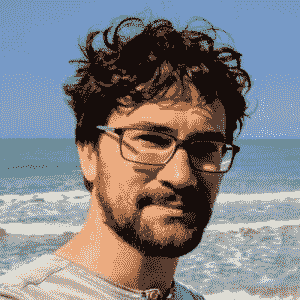
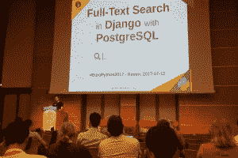
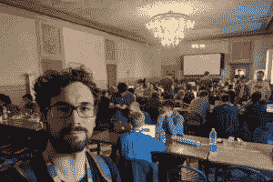
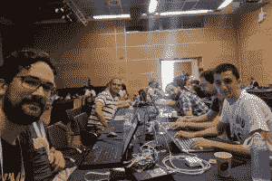
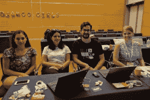
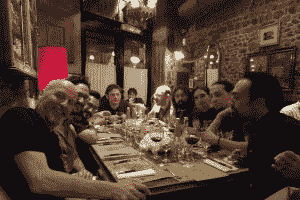

# 本周 PyDev:Paolo Melchiorre

> 原文：<https://www.blog.pythonlibrary.org/2019/02/11/pydev-of-the-week-paolo-melchiorre/>

本周我们欢迎 Paolo Melchiorre([@ pauloxnet](https://twitter.com/pauloxnet))成为我们本周的 PyDev！Paolo 是 Django web 框架的核心开发人员。他在欧洲的几个不同的 Python 相关会议上发表过演讲，也在他的[博客](https://www.paulox.net/)上写过文章。让我们花几分钟时间更好地了解他！

你能告诉我们一些关于你自己的情况吗(爱好、教育等)？

我毕业于博洛尼亚大学，获得了计算机科学学位。我的论文是关于自由软件的，从那以后，我一直是自由软件的倡导者。

我使用 GNU/Linux 已经 20 年了，现在我是 Ubuntu 的快乐用户。

2007 年，我参加了我的第一个会议，Plone 会议，从那以后，我参加了欧洲的许多其他 pythonic 会议。

2017 年，我在意大利 PyCon 和欧洲 Python 大会上发表了演讲，从那以后，我一直是当地和国际活动的会议演讲者，用意大利语和英语。

在 2017 年欧洲 Python 大会上发表演讲

我在罗马和伦敦生活和工作，自 2015 年以来，我一直是一名远程工作者，住在我的家乡意大利佩斯卡拉，那里靠近海滩和山脉。

我热爱大自然，喜欢游泳、滑雪或徒步旅行，也喜欢和妻子环游世界。

我喜欢通过阅读小说或听有声读物、看电视剧和电影、听播客和参加当地的英语演讲聚会来提高我的英语技能。

我在[栈溢出](https://stackoverflow.com/users/755343/paolo-melchiorre)回答问题，在 [@pauloxnet](https://twitter.com/pauloxnet) 发微博，偶尔在【pauloxnet】的[发帖](https://www.paulox.net/)。

**你为什么开始使用 Python？**

我在第一份工作中开始使用 Python，是因为我们用 Plone 和 Zope 开发网站。

我意识到 Python 比我以前学习和使用的其他语言好得多，因为它更容易学习，它专注于代码的简单性和可读性，它可扩展，编写速度快，并且有一个很棒的社区。

当我停止使用 Plone 时，我继续使用 Python 作为主要编程语言。

你还知道哪些编程语言，你最喜欢哪一种？

我在高中期间开始用 Pascal 编程，然后我自学了 HTML 和 CSS，以高中期末论文的形式开发了我的第一个网站。

在大学里，我学习了一些不同的语言，如 C、C++、C#、Java、SQL 和 Javascript，过去我在工作中使用过其中一些语言。

在过去的 10 年里，我主要使用 Python，毫无疑问，这是我更喜欢的语言，尽管有时我仍然使用 SQL、Javascript，显然还有 HTML 和 CSS。

哪些 Python 库是你最喜欢的(核心或第三方)？

我每天都要使用 Django 和 PostgreSQL，所以除了 Django 框架本身之外，我认为我最喜欢的 python 库是 Python-PostgreSQL 数据库适配器 psycopg2，因为它非常可靠，当我需要进行非常低级的操作并使用 PostgreSQL 的所有强大功能时，它允许我在没有 Django ORM 的情况下使用数据库。

你是如何开始为 Django 做贡献的？

冲刺 2017 年 DjangoCon 欧洲赛

在 DjangoCon Europe 2017 的冲刺日期间，我开始为 Django 的核心做出贡献，提出了一个[拉请求](https://www.paulox.net/code/#django)，将 PostgreSQL 加密扩展集成到了它的 contrib 包中，并被合并到了 Django 2.0 中。

我在 Pycon Italy 2017 大会上做了一个关于 Django 全文搜索功能的演讲，然后在此基础上写了文章“[用 Django 和 PostgreSQL 进行全文搜索](https://www.paulox.net/2017/12/22/full-text-search-in-django-with-postgresql/)”，但我意识到在 djangoproject.com 的[网站上没有使用 Django 全文搜索功能。](http://djangoproject.com/)

冲刺 2017 欧洲 Python 大会

在*europpython 2017*上，我组织了一次关于 djangoproject.com 的[搜索模块的冲刺。](http://djangoproject.com/)

我在 Django 官方网站上完成了一个 [pull 请求](https://www.paulox.net/code/#djangoproject-com)，用 *PostgreSQL 全文搜索*功能替换了 **Elasticsearch** ，并且我继续更新这个功能，提高了速度和多语言支持。

我做了一个关于这次经历的演讲，作为对 Django 项目贡献的一个例子。

你为什么选择 Django 而不是 Python web 框架？

我开始使用 Plone 和 Zope 应用程序框架，该框架将所有信息存储在 Zope 的内置事务对象数据库(ZODB)中。

当我需要在 PostgreSQL 这样的关系数据库中存储数据时，我开始使用 *Django* ，经过一些研究，我意识到这是最佳选择。

我很欣赏它的架构，ORM，管理模块，PostgreSQL 支持，所有现成的模块，如*geo jango*，所有第三方包，尤其是它背后的社区。

你现在在做什么项目？

Django Girls EuroPython 2017 教练

我[向 Django 项目、其网站和一些相关的包贡献](https://www.paulox.net/code/)。

我以教练的身份参加了一些 Django 女孩研讨会，并为其[教程](https://www.paulox.net/code/#django-girls)做出了贡献。

此外，我正在更新一个 [django 查询项目](https://www.paulox.net/code/#django-queries),使用我在演讲中使用的代码，让人们自己尝试。

我正在开发一个 [Django 项目模板](https://www.paulox.net/code/#django-uwsgi-template),我们在工作中使用它来加速部署在 uWSGI 上的项目的引导。

我正在更新我在鹈鹕的技术博客,在那里我会发布一些文章、关于我的信息、我的项目和我的演讲。

我正在用我所有的[录制的演讲](https://www.paulox.net/talks/#europython-2017)更新我的 YouTube 频道，用我所有的演讲幻灯片更新我的演讲台账户。

我还尽可能多地回答了关于堆栈溢出的 python 相关问题，特别是与 Django、全文搜索和 PostgreSQL 相关的问题，并且我基于其中一个问题写了一篇文章。

作为一名开源开发者，你学到的前三件事是什么？

我认为自由软件是上个世纪最好的发明之一，成为其中的一部分是非常有益的。

尤其是作为一名自由软件开发者，我学到了:

1.  分享知识(以想法、代码、文档、技能的形式)是提升自己作为一个人和开发人员的最好方式
2.  自由软件最好的部分是它的人类社区
3.  一些与代码无关的事情对于改进自由软件及其社区是非常重要的，比如选择一个好的许可证，添加有贡献的指南以及不要忘记文档

你还有什么想说的吗？

在 2018 年意大利皮肯节期间，在皮佛罗伦蒂诺尽情玩乐

作为自由软件相关会议的发言人，我有机会认识很多人，成为一个更好的人。

我鼓励每个人加入聚会，走出社区，参加会议，当然，如果我们在某个会议上相遇，请打招呼。

我还想对所有以英语为母语的开发者说，有很多优秀的开发者因为缺乏英语知识而对自由软件犹豫不决。

就我个人而言，在为项目做贡献和积极参与社区之前，我等了很长时间，然后我强迫自己用大量的时间、精力和金钱来提高我的英语技能。

因此，我想提醒人们，当谈到非英语母语者时，要有耐心和包容性，因为我们需要更多的时间和努力来打开一个问题，发送一个拉式请求，在网上和会议上提问，或者在这样的采访中简单地谈论和写下我们自己和我们的想法。

保罗，谢谢你接受采访！