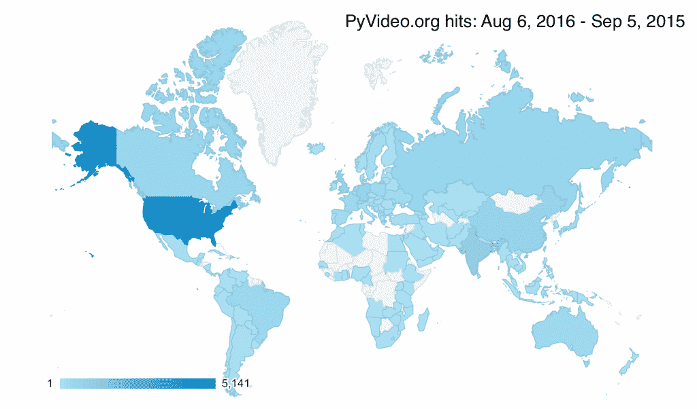

# 本周 PyDev:保罗·罗格斯顿

> 原文：<https://www.blog.pythonlibrary.org/2016/10/10/pydev-of-the-week-paul-logston/>

本周我们欢迎保罗·罗格斯顿([@保罗·罗格斯顿](https://twitter.com/paullogston))成为我们本周的 PyDev！保罗是 Pyvideo.org 的[的新维护者。他接替了威尔·卡恩-格林。你可以在这里](http://pyvideo.org/)阅读更多关于过渡[的内容。他还是当地 Python 用户组的组织者。你可能想花点时间看看他的 Github 简介](http://bluesock.org/~willkg/blog/pyvideo/status_20160316.html)，这样你就能知道保罗最近在忙些什么。让我们花些时间去更好地了解他！

你能告诉我们一些关于你自己的情况吗(爱好、教育等)

去加州大学戴维斯分校学习化学工程，大学毕业后在芝加哥学习即兴表演，学习急救医疗师/抽血师，一边做喜剧一边工作。搬到纽约继续做喜剧。在做喜剧的时候教了几年心肺复苏术/BLS/ACLS。然后决定转行。我决定推动编码，因为我一直把它作为一种爱好。自学 Python 大约一年后，我从 EMS 教育转到 155 做开发人员。NYC Python Meetup 是我 Python 教育中不可或缺的一部分。没有这个团队，我就不会有今天。我现在帮助组织这个小组，管理周六的办公时间以及一些大型的谈话夜和 PyGotham 纽约的区域 Python 会议。其他爱好包括狂看网飞原版电影、酿造康普茶和教学。

**你为什么开始使用 Python？**

我知道 PHP，但我想要一种语言，可以用来为网站和图形用户界面编写一个后端。不过，我还没有为此使用 Python。

你还知道哪些编程语言，你最喜欢哪一种？
 *是的,“知道”和“我已经把它作为我知道的一种语言写在我的简历上了”之间的界限有点模糊，但是如果给我一两个星期的时间，我可以有效地使用这些语言。*

*   C
*   服务器端编程语言（Professional Hypertext Preprocessor 的缩写）
*   Java Script 语言

我认为 C 是我最喜欢的。这不是我最喜欢写的东西(到目前为止应该是 Python)，但是 C 更接近于金属，以至于当你写它的时候，你会有真正的黑客快感。或者至少我知道。

你现在在做什么项目？

*   Pyvideo.org
*   写脚本在票务网站上找到最好的交易。
*   dna 音乐播放器

哪些 Python 库是你最喜欢的(核心或第三方)？

*哇。好问题。不过，我倾向于不做最喜欢的。这些对我来说很难，不值得去决定。不过，我最近真正感兴趣的是 asyncio 和 bokeh。*

作为一门编程语言，你认为 Python 将何去何从？

我认为 Python 正在许多不同的领域发展，我认为一些社区正在将它作为他们的首选语言。尤其是教学和数据。我看到 python 在各个领域都有增长，但它在学校的普及令人惊讶。Java 和 C++正在被推出，被 Python 取代。此外，尽管 R 很有趣(我从未使用过 R ),但很难在 R 中以一种与大量人互动的方式展示你的工作成果。我看到想为数据分析编写代码的人也想为一个快速的 web 应用程序编写代码来展示他们的工作。r 只是还没有出现。简而言之，Python 的易用性、温和的学习曲线和多功能性使它成为一种很好的语言，可以开始学习并与之一起成长。

你对当前的 Python 程序员市场有什么看法？

是的，可能会很艰难。在微观层面上，纽约市往往会出现 3 - 6 个月的招聘热潮，随后就会放缓。我认为我们现在正处于冲刺的尾声。我预计招聘将在一个月左右放缓。此外，假期就在眼前，所以有些缓慢是理所当然的。

宏观上，我真的不知道。我不知道我们是在山顶上，还是在山上，或者我们刚刚迈出了我们第一个蹒跚学步的孩子的步伐，爬上了操场的楼梯。我能感觉到的只有前进的动力。说真的，感觉很好。

你还有什么想说的吗？

首先，感谢邀请我！其次，我会利用这段时间无耻地宣传 pyvideo.org。Pyvideo.org 是一个全球使用的(见下图)python 视频索引。我们一直在寻找新的提交，并非常感谢那些进来。如果你正在寻找一种进入开源社区的简单方法，请在[https://github.com/pyvideo/data](https://github.com/pyvideo/data)为其中一个问题提交一份 PR。谢谢！

感谢您接受采访！