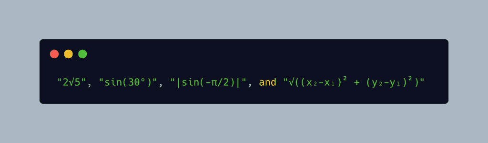
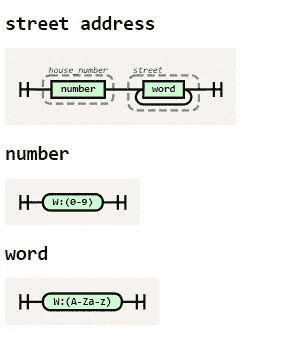
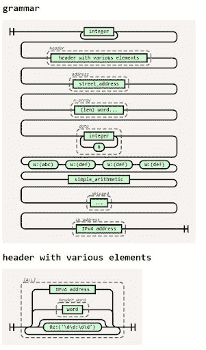

# PyDev of the Week: Paul McGuire

> 原文：<https://www.blog.pythonlibrary.org/2021/11/22/pydev-of-the-week-paul-mcguire/>

This week we welcome Paul McGuire ([@ptmcguire](https://twitter.com/ptmcguire)) as our PyDev of the Week! Paul is the author of the [pyparsing package.](https://pyparsing-docs.readthedocs.io/en/latest/HowToUsePyparsing.html) Paul is a Site Reliability Engineer for [Indeed.com](http://Indeed.com). He is also the co-author of the 4th edition of **Python in a Nutshell**. You can find out what he is up to by checking out his [website](https://thingspython.wordpress.com/).

Let's take a few moments to get to know Paul!

### Can you tell us a little about yourself (hobbies, education, etc):

I grew up as the math/science nerd surrounded by artists. My older brothers were a writer, a sculptor, and an architect. I took piano lessons for a few years, and I got to go see the Cleveland Orchestra many times while I was in high school (if you volunteered as an usher, you got in for free). So I had a good dose of the arts to go with the math and science. Eventually I was drawn to engineering and attended Rensselaer Polytechnic Institute, but I still kept up my appreciation of the arts.

In the mid 80's I read an article about the computer-generation algorithms used to create the landscapes for Star Wars, and thought that would be an interesting little program to write. I've gone back to that little program several times, and around 2008 I started doing abstract art prints on canvas, which then became other products as well - you can see them at [paulmcguireart.com](http://paulmcguireart.com).

### Why did you start using Python?

I was just starting to work with two friends who had started a consulting company. I had worked with Tcl previously, so I knew that I wanted to have a scripting language in my consulting toolkit. But I disliked Tcl's "everything's a string" data model. After looking at a couple of languages, I settled on Python.

I immediately loved the notion of using whitespace to delimit blocks. I had previously worked on a C development team that spent 2 weeks debating "where should the braces go?" and having blocks with no braces just made that whole issue go away (though maybe got traded for "tabs vs. spaces"?)

After about 10 months, I thought about the core ideas in pyparsing, and so put out version 0.1 in late 2003\. I've been using Python ever since.

### What other programming languages do you know and which is your favorite?

I've been around a while, so I've collected a number of languages. I started with BASIC in middle and high school, then FORTRAN in college. Through a succession of jobs I picked up (in rough chronological order) Pascal, PL/I, COBOL, C, Smalltalk, Java, C++, (insert Python here), C#, Boo, Groovy, and most recently Golang.

My favorite is probably the Python mode of the Processing environment. I've also used Processing's Java mode, and I have described it to others as "Java for artists". Processing is great for doing quick graphical work, with some really beautiful results, and it ports to multiple platforms pretty easily (I've used it to prototype a couple of small Android apps for my phone).

### What projects are you working on now?

I'm *finally* finishing release 3.0.0 of pyparsing, which started 2 years ago - it was a major code restructure, it cleared out the Py2 compatibility code, plus some other stuff happened. I've described it as feeling like I'm walking a marathon.

My other open source projects are a pyparsing spin-off called plusminus ([pyparsing/plusminus (github.com)](https://github.com/pyparsing/plusminus)), a library for incorporating custom, secure arithmetic expression evaluation into Python applications. The base parser guards against common eval() security and DOS attacks, and handles expressions like:

There are also custom parsers in the examples to parse and evaluate "30% off of 50", "d20+3d4", and "3 days and 2 hours from now".

And littletable ([ptmcg/littletable: An in-memory database of Python objects, searchable using quasi-SQL API (github.com)](https://github.com/ptmcg/littletable)), which started as an ORM experiment that has turned out to be useful on and off, especially working with CSV data. Littletable is pretty lightweight, so it gives a nice ORM-ish wrapper around lists of objects - it infers column names from the objects' attributes. Last winter I also added some full-text search. (Ironically, a week later I had a job interview coding test where I had to implement a full-text search!) You can use littletable to quickly read, manipulate, and write CSV files without having to wield the pandas sledgehammer.

I'm also working with Alex Martelli and Steve Holden on a 4th edition of Python in a Nutshell. The 3rd ed. was written when Python 3.6 was just coming out, and there have been some significant new features added to Python since then (plus we can also finally put Python2 in the rear-view mirror, and prune all the "but in v2, it looks like this…" cruft).

### Which Python libraries are your favorite (core or 3rd party)?

itertools in the stdlib. Especially groupby. I wrote a couple of blog posts about using groupby in some novel ways, comparing it to a greeter who seats groups of diners at a restaurant. (Blog link: [Things Python | Python bits collected along the way… (wordpress.com)](https://thingspython.wordpress.com/))

Second place in the stdlib is collections, especially deque and defaultdict.

rich from Will McGugan is really fun - I used part of it in littletable for pretty tabular output. I've used tqdm in the past for progress bars, but I want to give rich progress bars a try. And Will's textual package looks pretty cool, but I haven't used it yet.

### How did the pyparsing package come about?

1\. I was bad at regex.  2\. I was annoyed at regex's use of common characters (like "." and "?" and "*") for metacharacters, and so requiring the ugly "\" escape if they were needed as literal content. 3\. I had a long-standing interest in parsing utilities, having previously written an embedded arithmetic parser written in PL/I as part of a statistical process control package. So writing a simple 4-function arithmetic parser was a good early exercise while learning Python, and it evolved into an object-based API, in which you could write "OneOrMore(expr)" instead of "(expr)+". It is more verbose, but that verbosity makes it easier to revisit several months down the road when your existing parser needs a tweak.

(I've since gotten a lot better at regex.)

### What are some neat features you can do with pyparsing that you don't think most people are aware of?

First off, 2 new features in 3.0.0, railroad diagrams (contributed by Michael Milton) and left-recursive parsing (contributed by Max Fischer). The railroad diagrams look very nice but they are still only lightly tested, so they will evolve a bit in the next few point releases. Here is a sample:

And a more thorough example from the pyparsing test suite:

The LR parsing walks a similar path as the PEG parser that was added to Python, with a twist - pyparsing's parse actions complicate this process a bit. I've encouraged Max to do a PyCon presentation on this work, I think it is really interesting.

In pyparsing 3.0.0, I am also adding PEP-8 names (like "parse_string") in place of the Javaesque names (like "parseString"). When I first wrote pyparsing, I had worked in C before and was familiar with snake case naming, which goes back to the dawn of C programming. But I had been working more recently in Smalltalk and Java. So at that time, I was sure that the more modern camel case naming was going to become the de facto convention, so I stuck with that for pyparsing. Since then, camel cased Python has pretty much fallen into disfavor, even though you still see it in Java-influenced stdlib modules like logging (from log4j) and unittest (from junit). Pyparsing 3.0.0 includes the new names, but also defines the old names as synonyms so that existing code does not require a huge rewrite in order to upgrade to it. The synonyms will be kept around for a bit, but new code should use the PEP-8 snake case names.

### Is there anything else you’d like to say?

I've probably run on enough.

 **Thanks for doing the interview, Paul!**