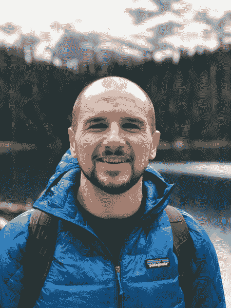

# 本周 PyDev:Raphael pier zina

> 原文：<https://www.blog.pythonlibrary.org/2019/08/12/pydev-of-the-week-raphael-pierzina/>

本周，我们欢迎 Raphael pier zina([@ hackebrot](https://twitter.com/hackebrot))成为我们本周的 PyDev！Raphael 是一个流行的 Python 测试框架 [pytest](https://docs.pytest.org/en/latest/) 的核心开发人员。你可以通过访问拉斐尔的[博客](https://raphael.codes/)或者查看他的 [Github 简介](https://github.com/hackebrot)来了解更多关于拉斐尔的信息。让我们花点时间来了解一下拉斐尔吧！

你能告诉我们一些关于你自己的情况吗(爱好、教育等)

我的背景是 3D 可视化和动画。大学毕业获得设计文学学士学位后，我在一家视觉效果公司做了几年软件开发人员，为数字艺术家构建应用程序。

快进到今天，在其他几家软件公司工作过之后，我现在在 Mozilla 从事 Firefox 遥测技术。我管理项目以减少 Firefox 浏览器产品中与遥测相关的盲点，并支持我们的软件工程师和数据工程师增加 Firefox 遥测组件和 Firefox 数据平台的自动化测试覆盖率。今年 2 月早些时候，我在博客上写了我在 Mozilla 的第一年，如果你想了解更多关于我的工作的话。

为了好玩，我喜欢[快跑](https://www.strava.com/athletes/30315581)，[看书](https://raphael.codes/reading-list/)，享受户外。ðÿ"

拉斐尔·皮尔泽纳

**你为什么开始使用 Python？**

当我在 VFX 工作时，我的团队为几个 3D 计算机图形应用程序开发了插件，使用这些程序支持的任何脚本语言:

*   3ds Max 中的 MaxScript
*   玛雅中的梅尔
*   TCL in Nuke
*   ZBrush 中的 ZScript
*   Unity 中的 C#

我们经常不得不用各自的语言为不同的程序开发相似的特性，这不仅是乏味的，而且感觉真的没有必要。

当我第一次了解 PyPI 以及 Python 社区在开源许可下创建和发布的许多令人惊叹的框架、库和 CLI 应用程序时，我立即爱上了 Python，并开始寻找参与和回馈 Python 项目的方法，这些项目似乎很欢迎新人，例如 [cookiecutter](https://github.com/audreyr/cookiecutter) 。ðŸ

你还知道哪些编程语言，你最喜欢哪一种？

除了我前面提到的脚本语言，我在大学里学过 C++和 Java，但我不敢说我了解它们，因为我已经很多年没用过它们了。在之前的工作和个人项目中，我在 Go 方面做了相当多的工作，但 Python 绝对是我觉得最精通的。最近开始学 Rust，到目前为止真的很喜欢。

虽然我并不总是喜欢用 Python 编码(目前我已经为太多的项目添加了 Python 3 支持，并且在我维护的大多数项目中仍然支持 Python 2)，但是 Python 仍然是我最喜欢的编程语言！

通过参与几个开源 Python 项目，从参加 Python 会议和 meetups 并在会上发言，以及在 Twitter 上互动，我在 Python 社区交了很多朋友。如果你在今年的 EuroPython 或 PyCon DE 上看到我，请向我问好！

你现在在做什么项目？

我目前在 Mozilla 从事开源项目，还有 [cookiecutter](https://github.com/audreyr/cookiecutter) 、 [pytest](https://github.com/pytest-dev/pytest) ，以及一些较小的项目，如[cookiecutter-pytest-plugin](https://github.com/pytest-dev/cookiecutter-pytest-plugin)、 [pytest-cookies](https://github.com/hackebrot/pytest-cookies) 、 [pytest-md](https://github.com/hackebrot/pytest-md) 和 [labels](https://github.com/hackebrot/labels) 。

在过去的一两年里，我的优先事项发生了变化，我现在专注于通过在[会议和聚会](https://raphael.codes/talks/)上发言、在[我的博客](https://raphael.codes/)上写作以及在[我的推特](https://twitter.com/hackebrot)上发布来进行指导和教学。

哪些 Python 库是你最喜欢的(核心或第三方)？

我是 [attrs](https://pypi.org/project/attrs/) 、 [click](https://pypi.org/project/click/) 和 [pytest](https://pypi.org/project/pytest/) 的忠实粉丝。🚀

作为维护者，你学到了什么？

设定期望并能够说“不”真的很重要。允许自己休息一下，甚至离开你的项目。照顾好自己！

我在 2018 年的 EuroPython 上做了一个关于维护一个受欢迎的开源项目的挑战的演讲。虽然这个演讲在 YouTube 上的浏览量可能没有我的其他一些演讲多，但分享我多年来维护 cookiecutter 的经验对我来说非常重要，我希望它能帮助那些发现自己处于类似境地的人。

[https://www.youtube.com/embed/3pokUifUyWM?feature=oembed](https://www.youtube.com/embed/3pokUifUyWM?feature=oembed)

拉斐尔，谢谢你接受采访！