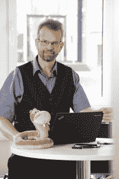

# 本周 PyDev:Reimar Bauer

> 原文：<https://www.blog.pythonlibrary.org/2018/11/26/pydev-of-the-week-reimar-bauer/>

本周，我们欢迎赖马·鲍尔([@赖马鲍尔](https://twitter.com/reimarbauer))成为我们本周的 PyDev！Reimar 是流行的 Python wiki 包 [MoinMoin](http://moinmo.in/) 的核心开发者。他已经在 PyCON DE、FOSDEM 和 EuroPython 上讲述了 Python。让我们花几分钟时间更好地了解他！

你能告诉我们一些关于你自己的情况吗(爱好、教育等)

我是一名来自德国 lich 的程序员。那是亚琛和科隆之间的一个小镇。

我在森林中心有限公司工作。雇员在能源和环境、信息和大脑研究领域开展研究，目的是为社会提供促进可持续发展的行动选择。

我的工作与大气科学有关。

版权所有:研究中心□有限公司

在过去的几年里，我写了几本关于数据结构和 IDL 的书，IDL 是我最早的科学相关编程语言之一，由科罗拉多州博尔德的 Ray Sterner 开发。

2012 年，我被选为德国 Python 软件 Verband 的董事会成员。我帮助组织了德国的几个 Python 活动，柏林的几个 PyConDE 和著名的 EuroPython。我从这个位置上退下来，我在 2017 年离开，因为我需要并想花更多的时间陪伴家人。

自 2013 年以来，我一直是 Python 软件基金会的研究员。

我曾经在一个大乐队演奏长号，但不得不暂停，因为我实在找不到这个爱好需要的时间。我喜欢观光，徒步旅行，社交 3.0，认识很多不同的人。有时我会玩一个名为 ingress 的增强现实游戏。

2019 年，德国科隆第十届 PythonCamp，一个经典的 barcamp，将是 Reimar Bauer 参与的下一个社区项目。

**你为什么开始使用 Python？**

是因为 MoinMoin 软件。我有个主意。我想在 MoinMoin 有一个甘特图视图。

我得到了所有需要的帮助，学会了使用 IRC)，并开始进入 Python 开源世界。2003 年我用的是 1.5.2。后来我为 MoinMoin 写了许多插件和一个关于 API 例子的描述。

你还知道哪些编程语言，你最喜欢哪一种？

我只有一个最爱，那就是 Python。这也是我的同事在工作中所需要的。我仍然维护着一个大型的 IDL 库，但是由于开发在 2013 年左右冻结，我们转向了 Python。我也知道 Fortran，但是已经不用了。

你现在在做什么项目？

自 2016 年以来，我一直在维护和开发[任务支持系统](http://mss.readthedocs.io/en/stable/)。这个项目是完全开源的，Apache 2.0 许可。该软件用于交互式规划大气科学的飞机任务。

因为这个项目，我也成为了康达锻造公司大量原料的维护者。而且因为对 pyfilesystem2 的热爱，我开了一个 [qt5 文件选择器](https://github.com/ReimarBauer/fs_filepicker)。

哪些 Python 库是你最喜欢的(核心或第三方)？

Pyfilesystem2:
处理档案、内存、云等中的文件和目录。就像你在本地开车一样容易。现在写代码，以后决定数据存储在哪里；不写真实文件的单元测试；无需学习新的 API 即可将文件上传到云端；用沙箱保护您的文件编写代码；等等。https://pyfilesystem2.readthedocs.io/en/latest/

**人类请求:http**
[http://docs.python-requests.org/en/master/](http://docs.python-requests.org/en/master/)

**netcdf4:**
NetCDF 是一组软件库和自描述的、独立于机器的数据格式，支持面向数组的科学数据的创建、访问和共享。http://unidata.github.io/netcdf4-python/

borgbackup:
Borgbackup 是一个去重复备份程序。可选地，它支持压缩和认证加密。http://borgbackup.readthedocs.io/en/stable/

**您想提及哪些 Python 社区？**

德国 [Python 软件 Verband](https://python-verband.org/verband) ，专注于 PyConDE 和 EuroSciPy 会议系列，但也支持许多类似于 PSF 的小型社区。

专注于欧洲 Python 大会的欧洲 Python 协会

Python 软件基金会(Python Software Foundation)是一个多年来将一切联系在一起的组织。组织 Pycon US，并通过赠款帮助较小的社区。
感谢你们所有人的宝贵时间，感谢你们做了如此出色的工作！

是什么让你决定参与 MoinMoin 项目？

社区:乐于助人、热情好客的人们。我继续致力于它，因为我们能够在我们研究所的任何测量活动中使用 MoinMoin 作为项目 wiki。在那里，我们必须显示模型预测数据，管理具有不同访问规则的页面，为参与者提供大量信息。另一个用例是从 reST 格式的 wiki 页面创建 sphinx latex 文档。

你能告诉我们你在 MoinMoin 上做开发时学到的一些东西吗？

我学到了很多工具，如何编写合适的单元测试，web 服务器选项；我也从虫子身上学到了东西。我也喜欢接触新的社区。在谷歌代码之夏担任学生导师的那段时间也是一段美好的时光。我们处于风口浪尖，解决了很多基于浏览器的问题，或者至少找到了绕过它们的方法。

如果你能从头开始，你会做些什么不同的事情吗？

我们从 moin-2 开始。但是卡住了。一个原因可能是维基本身独特的卖点同时被广泛传播。还有许多类似的工具存在，许多只想稳定一些项目的开发人员对这种软件机制并不感兴趣。现在有太多的选择了。因为我们已经花了很多时间在 moin-2 中替换我们自制的模型和视图，我更愿意完成这个。我们目前重新整合了开发人员，并组建了一个新的核心团队。

如果你想加入我们，请随时联系 https://mail.python.org/mailman/listinfo/moin-devel

谢谢你接受采访，Reimar！