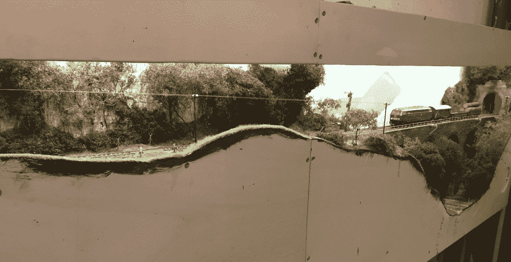

# 本周 PyDev:Reinout van Rees

> 原文：<https://www.blog.pythonlibrary.org/2016/09/05/pydev-of-the-week-reinout-van-rees/>

本周我们欢迎 Reinout van Rees([@ Reinout van Rees](https://twitter.com/reinoutvanrees))成为我们本周的 PyDev！Reinout 是 [zest.releaser](http://zestreleaser.readthedocs.io/en/latest/) 的创建者/维护者。他有一个不错的[网站](http://reinout.vanrees.org/)，里面有一个 Python 博客，你可能想看看。我还建议查看他的 Github 页面，看看他参与了哪些项目。

**你为什么开始使用 Python？**

*我来自荷兰，这当然让你在编程 Python 时有了些许优势。就学历而言，我是一名土木工程师。我上了所有可以上的编程课，但大部分当然是交通工程、建筑计算和水利工程等等。*

2000 年，我在学习结束时参加了一个欧盟的研究项目，这个项目基本上是土木工程和互联网编程的结合。正是我需要的。我使用了一些 Java 库来进行 XML 处理(这在当时很流行)，但是无法在一个重要的演示中及时完成。

因此...我试用了 Jython。用 Java Python 解释器调用 Java 代码要容易得多，我及时完成了演示。所以，我开始使用 Python 是出于需要，也是因为我不小心被它绊倒了。

在 2000 年中期发现 Python 之后，我开始在我的博士工作期间越来越多地使用它。Zope 当时就红了。我参观了许多早期的 Europython 会议。我很快就开始使用 Plone。当我获得博士学位后不得不找一份真正的工作时，我很偶然地在一家 Plone 公司结束了，做真正的编程赚钱。

你还知道哪些编程语言，你最喜欢哪一种？

嗯，Python 是目前为止我使用最多的语言。我以前很了解帕斯卡。Turbo Pascal 6 和后来的 Delphi 1。如果你称 XSLT 1.0 为编程语言:我已经用了两年了。当然，是一点狂欢。一点 Javascript。

最喜欢的？我已经很久没有给它编程了，我也没怎么用过它，它很难读，我只用它写了一个有用的程序，但是.... [APL](https://en.wikipedia.org/wiki/APL_(programming_language)) ！“一种编程语言”。那种语言的关键词是点、斜线、希腊字母和奇怪的符号。如果我没记错的话，像“+/A”这样的东西会返回向量 A 的和，我可能是语法错了。但是我确实对那个带有 IBM APL 2.0 演示版的 3.5 英寸软盘很感兴趣！

你现在在做什么项目？

*从 2010 年开始，我为....一家土木工程公司(公司的 2/3 是水利专家)，做了大量的 Python/Django 编程(公司的 1/3 是程序员)。对于一个成为程序员的土木工程师来说，这是一个不可能的完美组合。尤其是因为从我家骑车只需 30 分钟。纯粹的幸福。*

嗯，工作？目前主要是幕后工作。建立一个新的 Jenkins 实例，弄清楚我们应该如何使用 Docker，编写自动监控工具，zabbix 集成，指导新的程序员，一些系统管理员的事情，更新 python 3 的构建方法，重建我们的中央登录站点，等等。

因此，从努力思考 docker 策略到简单地享受快速监控脚本的乐趣。并且跟踪 Python 打包和 Django 发生了什么。

哪些 Python 库是你最喜欢的(核心或第三方)？
 *我先提一个我自己的。[释放器](http://zestreleaser.readthedocs.io/en/latest/)。我在 2008 年就已经开始了。我仍然在每次发布 Python 包的时候使用它:它更新版本号，在 changelog 中记录发布日期，标记它，并可选地上传到 pypi。所有那些我懒得用手做的事情。许多其他人也喜欢并使用它。这是一个有趣的开源项目，尤其是我的兄弟是维护者之一。*

一个不错的核心 Python 库？我一直很欣赏“临时文件”。以安全的方式创建一个临时文件或临时目录总是很方便的。我经常使用它。它只是做你需要它做的事情。

你还有什么想说的吗？
 *好了，我还没说我的爱好呢。我在第一个问题中跳过了这一点，因为我太忙于谈论 Python 了🙂*

爱好？读历史书很好。我还喜欢家里的铁路模型。我已经接管了我们阁楼的一小部分，我正在模拟一条位于 1970 年的德国单轨铁路。这与编程是不同的(尽管我确实在一些地方使用了一些 Arduinos)。景观美化，电力，油漆，一切。这里有一张照片，来自一个 20 厘米宽、2 米长的模块，横跨楼梯，给你一个想法。如果你想看一些与 Python 完全无关的视频，谷歌一下“Eifelburgenbahn”！

感谢您接受采访！