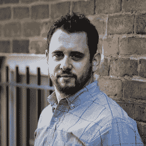

# 本周 PyDev:瑞奇·怀特

> 原文：<https://www.blog.pythonlibrary.org/2018/07/02/pydev-of-the-week-ricky-white/>

本周，我们欢迎里基·怀特( [@EndlessTrax](https://twitter.com/endlesstrax) )成为我们本周的 PyDev。瑞奇是[白狮媒体](http://whitelionmedia.com/)的所有者。他也是[真实 Python](https://realpython.com/team/rwhite/) 的社区经理。如果你去他的[网站](http://rickywhite.net/)，你会发现他写过一些非技术类的书，写得还蛮工整的。你也可以查看他的 [Github 简介](https://github.com/EndlessTrax)看看他在做什么项目。让我们花几分钟来了解一下 Ricky！

你能告诉我们一些关于你自己的情况吗(爱好、教育等)

我来自英国的莱斯特。我在 2014 年 10 月下旬搬到了美国。在移居美国之前，我是一名专门从事 ICU 护理的注册护士。当我们移民到弗吉尼亚时，我和妻子交换了家庭角色，她回去工作，而我成了一个全职爸爸，照顾我们当时 3 岁的儿子和 6 个月大的女儿。一份我无论如何都不会改变的工作。

过去的 3.5 年一点也不无聊，发生了太多的事情。更重要的是，我已经写了两本书。我学会了如何编码。并实现了[自己创业](http://whitelionmedia.com/)的毕生抱负。显然，照看两个小孩还不够累，而且我显然讨厌睡觉

当我没有完成我在生活中的主要任务，编写或抛出一些代码时，我通常住在 dojo 中。我是一名热情的武术家，拥有 Shodan(一级黑带)的头衔，我每周都会花一些时间教授其他学生这门艺术，帮助他们成长。

我还患有一种叫做强直性脊柱炎的慢性退行性疾病。自从 2010 年被确诊以来，我一直是一名患者倡导者，目前担任 501c3 非营利组织的副主席，该组织由我协助创建，旨在提高对这种疾病的认识，美国有 270 万人患有这种疾病(这比多发性硬化症和帕金森症的总和还要多！)该慈善机构名为[同心协力](http://walkasone.org/)。

只是为了好玩，我下象棋，有轻度到中度的盆景瘾，我收藏了一些。

**你为什么开始使用 Python？**

简短的回答是:因为每个人都在谈论它有多棒，而我正饱受 FOMO 之苦(害怕错过。)

稍微长一点的回答是:我之前尝试过几种语言，并且用每种语言开发了几个小规模的应用程序，因为我试图自学如何编码。我学习的部分问题是我没有方向。我不完全确定我想要制造什么样的产品和/或我想要解决什么样的问题。所以我只是从一个教程转到下一个教程，看看哪些内容被卡住了。最终，我找到了使用 Python 的方法，并打开了开关。突然间，我写的代码真的像预期的那样工作了。但更重要的是，我知道为什么。我刚刚发现(甚至是基本的)编程原则在 Python 中比在其他语言中更容易掌握，所有的点开始连接起来。知道我真的能做点什么感觉很棒。没有什么比成功更能激励人了(也许是恐惧，但我们不会去那里。)

你还知道哪些编程语言，你最喜欢哪一种？

当我开始自学如何编码时，我是从 C++开始的。不过，我从来没有真正在里面做过任何东西，我发现它非常令人困惑。然而，我确实学习了指针和内存管理。这是我发现在大多数教程中从来没有提到过的，因为其他语言(如 Python)有所有“奇特的东西”,如垃圾收集，所以人们认为这是理所当然的，或者从来不知道幕后发生了什么。我认为这是一种耻辱。

之后，我转向了 HTML 和 CSS，最终转向了 PHP(这样我就可以构建 WordPress 主题了。)我一点都不喜欢 PHP，所以接下来尝试了 C#。我用 C#构建了几个项目，甚至冒险去了 ASP.NET。我几乎没有学过 Python，因为我认为切换到另一种新语言只会拖延时间和分散注意力。但我确实学会了，虽然我确实对。到目前为止，Python 是我最喜欢的语言，每当我想构建一个新项目时，它总是我的第一选择。

你现在在做什么项目？

现在，我正在尝试用 Django 为我的[个人网站](http://rickywhite.net/)重新设计建立我自己的 CMS。我本来打算选择静态网站生成器 Pelican，但后来我决定在某个时候可能会直接销售我现在和未来的书籍，并重新开始写博客。那么，为什么不建立我自己的平台，并在这个过程中学到很多东西呢？这在当时听起来是个好主意——我可能会后悔。

除此之外，我还想为自己的利益做一些小项目。就像一个象棋 app，它分析我以前的比赛，告诉我各种有用的信息，像什么开局对我来说胜率最高，我的比赛平均时长等等。如今很难找到时间，所以现在时间在慢慢消耗。

哪些 Python 库是你最喜欢的(核心或第三方)？

烧瓶、请求和美味的汤是我写的几乎所有东西中的三个。这些是我的最爱。我可以利用其他人来完成同样的任务，但我不会。我总是能找到我喜欢的工作。

你是如何成为一名作家的？

我写的第一本书是一本非虚构的书，基于我作为护士和慢性病患者的经历。很少有人能体验桌子的两面，所以我认为有必要写一本书来帮助患者(患有任何长期疾病)从他们的医疗保健预约中获得更多。在某种程度上，它结束了我以前的护士生涯，并确保我在过去十年中获得的知识得到了很好的利用，并在文字中永垂不朽。

第二本书是我的第一部小说。没有短篇故事前奏，或 fanfic。我拿着一本完整的小说一头扎了进去。这很有趣，而且是系列的第一部，所以接下来至少还会有两部。它开始时更像是一个遗愿清单，但是当我深入研究“如何”写小说时，我发现它与编码有很多相似之处(真的。)我对讲故事和整个过程非常感兴趣。以至于它也开始改变我写非小说类文章的方式，变得更好。哦，和我以前的书不同，我用笔名写这本书。拥有另一个自我很有趣！😊

作为一名作者，你学到的前三件事是什么？

我喜欢这个问题，因为我真诚地相信这些要点对初露头角的开发人员也是很好的建议。

1.  完美是完成的敌人。把该死的文字/代码写好就行了。稍后编辑/重构。把它们都写在纸上。回去把它做得漂亮些，以后再完善它。您不能编辑空白页，也不能编译空白页。所以再丑也要拿出来。
2.  现在你在页面/文件上有些东西了，是时候“杀死”你的宝贝们了。删除整段文字/代码没问题。人们讨厌这样做，他们觉得自己失败了或者浪费了时间。这不是真的。每次总是以最好的方式写东西是很好的，但是没有人这样做。这是不现实的。那么如果你必须删除并重写一整个场景或类呢？你刚刚学到了一些东西。学习如何不做某事通常比学习“最佳”方式更重要。它还将帮助您更深入地理解某些东西为什么有效或无效。**删除键是你的朋友，从中学习吧。**
3.  也许这应该先进行——但是**制定一个计划**。在你坐下来写一本书或一个应用程序之前，先把它计划好。你越是提前了解你想要的外观和感觉。您需要花费在编辑/重构上的时间就越少。写列表，勾画用户界面，无论需要什么，先计划好。

你还有什么想说的吗？

乌鸦队加油。

谢谢你接受采访，瑞奇！