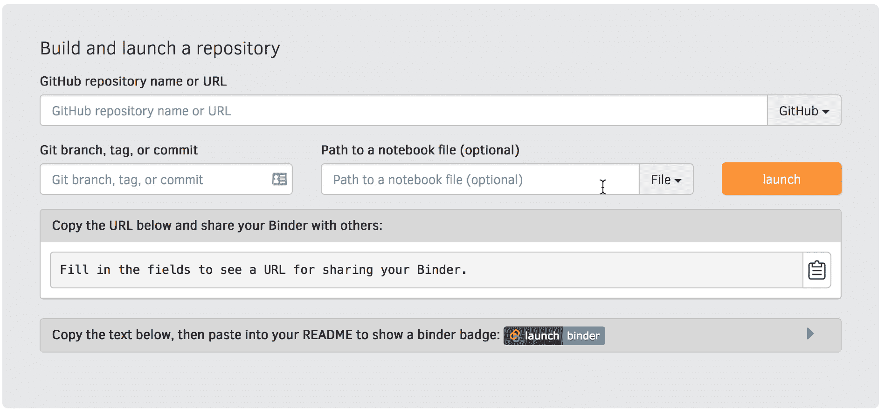

# PyDev of the Week: Sarah Gibson

> 原文：<https://www.blog.pythonlibrary.org/2021/11/08/pydev-of-the-week-sarah-gibson/>

This week we welcome Sarah Gibson ([@drsarahlgibson](https://twitter.com/drsarahlgibson)) as our PyDev of the Week! Sarah is a core developer for [Binder](https://mybinder.org/), [JupyterHub](https://jupyter.org/hub), and [*The Turing Way*](https://the-turing-way.netlify.app/). You can see what else she is contributing to over on [GitHub](https://github.com/sgibson91). Sarah also maintains a [blog](https://sgibson91.github.io/).

Let's spend some time getting to know Sarah better!

**Can you tell us a little about yourself (hobbies, education, etc):**

Hello everyone! I’m Sarah Gibson and I’m an Open Source Infrastructure Engineer at the [International Interactive Computing Collaboration](http://2i2c.org/) (2i2c for short!).

My background is in astrophysics, and I earned my PhD from the University of Leicester studying [Gamma-Ray Bursts (GRBs)](https://imagine.gsfc.nasa.gov/science/objects/bursts1.html) with NASA’s [Neil Gehrels Swift Observatory](https://swift.gsfc.nasa.gov/). GRBs are incredibly powerful, cataclysmic explosions that happen either when a very large star explodes (goes [supernova](https://spaceplace.nasa.gov/supernova/en/)) and collapses into a [black hole](https://www.nasa.gov/vision/universe/starsgalaxies/black_hole_description.html), or when two [neutron stars](https://imagine.gsfc.nasa.gov/science/objects/neutron_stars1.html) (incredibly dense dead star remnants) merge into one another. Beyond the initial peak of Gamma-Rays released, GRBs emit an ‘afterglow’ that shifts through the electromagnetic spectrum, passing through the optical range and all the way into radio bands. This makes GRBs an excellent tool to probe many areas of physics, from relativistic effects and accretion disks, through to the composition of the intergalactic medium (the space between galaxies).

After my PhD, I decided to leave academia and went on to join the Research Engineering team at the Alan Turing Institute. During my time there, I worked as both a Data Scientist and Software Engineer on a variety of projects in different domains. I worked on everything from supervised Machine Learning competition platforms deployed in Docker containers, to automatically sorting through scans of Victorian newspapers for crowdsourcing tasks. This is also where I was introduced to the Open Source community, initially through the launch of [The Turing Way](https://the-turing-way.netlify.app/) and then on to joining [Project Jupyter](https://jupyter.org/) and the [mybinder.org](https://mybinder.org) operating team.

I have now taken all the skills I have developed from these communities and joined 2i2c. I work across many communities in research and education to provide them with cloud-based, Jupyter-enabled scientific computing environments. Currently, I am working with [Pangeo](https://pangeo.io/) to migrate their JupyterHubs into 2i2c management before we begin some more developmental work with them.

Outside of work, I enjoy reading (trying to get through a backlog of ebooks), going for walks somewhere green with my partner, [cross-stitching](https://sgibson91.github.io/cross-stitch-carpentry/) something snarky, and having cuddles with my cat, Max.

**How did you become a core developer for Binder?**

My story with Binder really begins with entering the world of Research Software Engineering (RSE) at the Turing Institute. *The Turing Way* was one of the first projects I was assigned to and, as a guide for reproducible research, I figured I’d be able to learn all the skills I needed to know to do well in my new job. However, project PI [Dr Kirstie Whitaker](https://www.turing.ac.uk/people/researchers/kirstie-whitaker) had very different ideas for me! She wanted me to work on Project Binder and figure out what needed to be done to have our very own BinderHub at the Turing. So with zero knowledge of the cloud and a GitHub account that was, at best, a week old - I set about that task.

I won’t lie, the next few months of that project were an uphill struggle like nothing I’d ever experienced before. There were multiple, complex tools linked together in ways that “just worked” that made it difficult for someone like me with little experience to get all the concepts straight in my head. However, with a lot of perseverance and support from the wonderful BinderHub and JupyterHub teams, I succeeded in deploying a BinderHub for the Turing. Along the way, I also contributed a lot of documentation upstream to help others who may be in my position when entering the project, and I developed two workshops introducing users to Binder and how to deploy their own BinderHub.

At the end of my allocated time on *The Turing Way* (I’m still active in the project nearly 3 years on!) the Binder team asked me to join the operating team for mybinder.org so that I could continue to contribute and develop the project as well as keeping strong ties back to *The Turing Way* community. And I’d like to think they got their (figurative) money's worth! ???? I went on to secure a grant to fund a cluster for mybinder.org and make the Turing a member of the [Binder Federation](https://blog.jupyter.org/the-international-binder-federation-4f6235c1537e), I often chair the monthly team meetings, and I will be taking up the role of [JupyterHub Community Strategic Lead](https://chanzuckerberg.com/eoss/proposals/jupyterhub-community-strategic-lead/) with funding from the Chan Zuckerberg Initiative.

**Why did you start using Python?**

I began using Python at the start of my PhD in 2015\. After a semester-long (and shall we say, traumatic?) introduction to FORTRAN during my undergrad, I had been put off learning to program; however, I realised I wasn’t about to get through an astrophysics PhD without writing *some* code. I couldn’t even claim practical skills as the instrumentation was orbiting Earth!

I was advised by friends to start with Python as it was user-friendly (at least compared to some of the other languages being used around the department) and it was popular in the field, so there’d be people able to help me. I settled in for a couple of months with various Python introductory materials and, over the course of my PhD, managed to bring myself from complete novice to running parallelised Monte Carlo simulations on HPC systems.

**What other programming languages do you know and which is your favorite?**

Every now and then, I switch over to bash if I find myself writing too many `subprocess` commands in Python, so I would call that my second language.

Most of what I do in my current work is managing cloud infrastructure using Terraform, Kubernetes deployments with `kubectl` and `helm`, and Continuous Integration/Deployment flows with vendors like GitHub Actions - hence I mostly write in YAML! I have gained quite the beady eye for indentation ????

Python will always be my favourite though as my first language ????????

**Which Python libraries are your favorite (core or 3rd party)?**

If I’m not doing JupyterHub management, I’m usually writing a bot to automate something tedious - such as automatically opening Pull Requests to bump versions of helm charts or Docker images as they’re released. Therefore, I mostly use the `requests` and `json` libraries to interact with some API and then parse the result. However, I’m interested to look into `[httpx](https://github.com/encode/httpx)` as an alternative to `requests`. Another package that caught my eye is `[jmespath](https://github.com/jmespath/jmespath.py)`, which provides a handy way to search and find JSON keys without traversing the whole tree of keys. I like to use `[ghapi](https://github.com/fastai/ghapi)` if I’m interacting with the GitHub API. The team has put a lot of work into making the docstrings work nicely in a Jupyter Notebook making it easy to find the call you need.

**What are some neat features you can do with Binder that you don't think most people are aware of?**

One thing I think is cool but can be difficult to figure out is how to select different interfaces from the webpage. JupyterLab is available by default alongside the classic Notebook view, and Binder installs RStudio for you automatically if you’re setting up an R environment.

I think this is difficult to find as our web interface is quite old now, but not many of the team have a lot of JavaScript/frontend knowledge to update it. If you do have these skills and think this is something you could work on with us, please [get in touch](https://gitter.im/jupyterhub/binder)!

Another cool thing that you can do with Binder is [build R environments using conda](https://github.com/binder-examples/r-conda), this ends up building a lot faster than using the `install.R` or `DESCRIPTION` files.

You can also equip your Binder repository with the [repo2docker GitHub Action](https://github.com/jupyterhub/repo2docker-action) to pre-cache your images for faster build times!

You can check out my [Discourse post](https://discourse.jupyter.org/t/crowdsourcing-for-a-blog-cool-binder-features/10462) to see what other members of the community suggested.

 **Thanks so much for doing the interview, Sarah!**