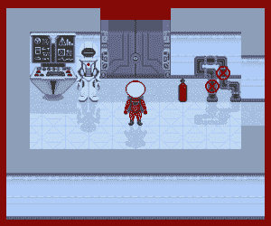

# 本周 PyDev:肖恩·麦克马纳斯

> 原文：<https://www.blog.pythonlibrary.org/2019/05/27/pydev-of-the-week-sean-mcmanus/>

本周，我们欢迎肖恩·麦克马纳斯( [@musicandwords](https://twitter.com/musicandwords) )成为我们本周的 PyDev！肖恩是几本书的作者，包括[任务 Python:编码一个太空冒险游戏！](https://amzn.to/2SRBHDJ)，是三月份[在这个站点审核的](https://www.blog.pythonlibrary.org/2019/03/20/book-review-mission-python/)。这里有他书中的免费章节。你可以在肖恩的网站上了解更多关于他的信息。让我们花些时间去更好地了解他！

你能告诉我们一些关于你自己的情况吗(爱好、教育等)

我是一名专门研究技术的作家。近年来，我写了几本书，让儿童和年轻人学习编程。Raspberry Pi 的推出和 Code Club 等倡议帮助年轻人比过去许多年更容易理解编码。

当我还是个孩子的时候，我喜欢为我的 Amstrad CPC 计算机编程，并且在许多方面它开启了我的职业道路。我在当时的主流杂志上发表过列表和文章，我的第一本书是关于 Amstrad 编程的。今天，我仍然记得我小时候是多么热爱编程，我希望我的书能给今天崭露头角的程序员带来一些兴奋。

除了写书和文章，我还帮助一些世界领先的科技公司满足他们的文案需求。

除了写作，我还喜欢摄影和创作音乐。我录制了一张电子音乐专辑，计划今年晚些时候在网上发行，我是一个歌唱团体的成员，这是一种很好的放松方式。

你最后是如何用 Python 写一本关于游戏编程的书的？

似乎有很多 Python 书籍都包含了一些小例子，向您展示某个特定特性是如何工作的。这很好，因为当代码精简到最基本的部分时，学习起来就容易多了。然而，这确实让许多读者想知道下一步该做什么，以及如何在几页纸的短程序和更实质性的项目之间架起桥梁。例如，知道列表是如何工作的是一回事，但是如何使用它来为 3D 游戏创建地图呢？如何在基础上创造出不仅仅是演示语言的东西？

使用 [Mission Python](https://www.sean.co.uk/books/mission-python/index.shtm) 的想法是展示一个超越基础的游戏实例。这是一个图形化的冒险游戏，所以有很多机会学习数据结构(房间、对象、交互)和很多定制的机会，这是简单的街机游戏所没有的。游戏的背景是火星空间站，那里的空气正在泄漏，你必须到达安全的地方。它包括寻找物体和解决难题，并像早期塞尔达游戏一样使用强制视角。我对一位评论家的评论感到特别高兴，他说这感觉像是游戏先于书出现，而不是教育书籍通常的情况:我渴望游戏尽可能“真实”，在稍微复古的游戏格式的限制下，以及在一本书的范围内可以合理记录的内容。

哪些 Python 库是你最喜欢的(核心或第三方)？

Mission Python 中的游戏使用了 Pygame Zero 库，所以我花了很多时间使用它，并把它看作是我目前最喜欢的库。

Pygame Zero 用一些教育友好的特性对 Pygame 进行了现代化，并简化了一些图像移动的语法。通过引入像精灵一样的演员，它有助于在课堂上使从零开始到 Python 的旅程更加顺畅。它还简化了 Pygame 的一些基础，比如屏幕刷新。Pygame Zero 可以做很多很酷的事情，这些事情超出了 Mission Python 的范围，所以也许将来我会用它编写一些别的东西。

你在写书的过程中学到了什么？

我现在已经写了或合作写了几本书，包括[为傻瓜准备的树莓派](https://www.sean.co.uk/books/raspberry-pi-for-dummies/index.shtm)、[轻松步骤中的 Scratch 编程](https://www.sean.co.uk/books/scratch-programming-in-easy-steps/index.shtm)和[轻松步骤中的酷 Scratch 项目](https://www.sean.co.uk/books/cool-scratch-projects-in-easy-steps/index.shtm)。写书教会你如何组织你的时间和想法:这是一段在短时间内紧张的工作，通常涉及广泛的主题，所以计划是必不可少的。我用电子表格记录一切，来减轻我大脑的负担！

我的一个建议是尽可能留出思考时间。如果你在调试的时候真的被难住了，我发现转而做些别的事情通常更好，在不完全停止项目的情况下，在后台赢得一些思考时间。人们常常会“啊哈！”洗澡时或放松时，所以如果修改代码不起作用，让它休息一会儿是个好主意。

思考时间对创造力也很重要:我留出一个晚上来设计主要的游戏拼图。我去了伦敦科学博物馆的空间画廊参加了一个后期会议，在那里我花了一个晚上的时间绘制拼图和位置，周围是真正的火箭和宇航服。我后来在开发游戏时添加了新的谜题和想法，但这有助于从一开始就有一个良好的愿景。

这些书显然教会了我很多关于我一直在使用的编程语言的知识，因为我研究了我需要的新特性和资源。写一本书，我必须采取务实的观点，有时我更喜欢使用一种更容易让人理解的解决方案，或者一种比可能最快或最惯用的解决方案更广泛兼容的解决方案。

对 Mission Python 的反应如何？

任务 Python 是一个大项目，编写游戏和配套的书，所以它现在出现在世界上真是太棒了。我得到了一些很好的反馈。一位年轻的读者写信告诉我，他们以前没有编程，这本书向他们介绍了 Python 编程，这是一件很棒的事情，我参与了其中。成年人也很喜欢这本书，有些人知道 Python，但以前没有做过任何游戏开发，有些人对 Python 完全陌生。热爱编程的业余程序员发现这是一个令人愉快的项目，看到阅读这本书的人的推文和评论真是太棒了。这是一个巨大的帮助，让这个词出来，非常感谢。游戏引擎可以用来创建全新的游戏，所以我很期待看到读者用它来构建什么。

你现在在做什么项目？

我现在的主要项目是更新我的网站，这涉及到许多代码争论，尽管不是 Python。我的网站去年庆祝了它的 20 岁生日，所以有一些相当旧的代码，我在努力使网站反应更快、对移动设备更友好的过程中清除了这些代码。

我仍然在修补来自 Mission Python 的游戏，既是为了娱乐，也是为了给读者提供额外的资源。例如，美国宇航局发布了一些在火星上录制的真实声音，这似乎是一个不容错过的好机会。我写了一些代码，这样当你在游戏中的火星表面时，那些[声音就会响起。一旦我的新网站设计发布，我将很快发布一个简短的程序来隐藏空间站上的物体，这将为游戏带来新的益智元素。](https://www.sean.co.uk/books/mission-python/adding_atmosphere.shtm)

今年我也会花更多的时间在 Scratch 上，因为我会为 Scratch 3.0 更新我的 Scratch 书籍。

我期待着一旦我有时间投入到另一个大的 Python 项目中。我认为自己正在进行 Python 之旅，并渴望进一步发展我的技能。

你还有什么想说的吗？

欢迎任何人[在这里](https://www.sean.co.uk/books/mission-python/index.shtm)下载任务 Python 游戏。那里也有这本书的免费样本，其中包括玩游戏的说明，如果你被困住了，还有一张地图！

谢谢你邀请我在你的博客上发表文章，迈克！

肖恩，谢谢你接受采访！