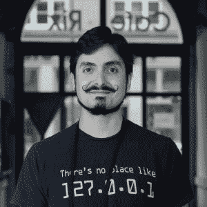

# 本周 PyDev:Sebastian Rami rez

> 原文：<https://www.blog.pythonlibrary.org/2020/01/20/pydev-of-the-week-sebastian-ramirez/>

本周我们欢迎塞巴斯蒂安·拉米雷斯([@田戈洛](https://twitter.com/tiangolo) )成为我们的本周 PyDev！塞巴斯蒂安是 [FastAPI](https://fastapi.tiangolo.com/) Python web 框架的创建者。他维护着自己的[网站/博客](https://tiangolo.com/)，如果你有空的话可以去看看。你也可以在那里看到他的[开源项目](https://tiangolo.netlify.com/projects/)。你也可以在 Github 上看到他在为哪些项目做贡献。

让我们花点时间来更好地了解 sebastán！

**Can you tell us a little about yourself (hobbies, education, etc):**Hey! I'm Sebastián Rami­rez, I'm from Colombia, and currently living in Berlin, Germany.I was "homeschooled" since I was a kid, there wasn't even a term for that, it wasn't common. I didn't go to school nor university, I studied everything at home. At about (I think) 14 I started fiddling with video edition and visual effects, some music production, and then graphic design to help with my parent's business.Then I thought that building a website should be almost the same ...soon I realized I had to learn some of those scary "programming languages". HTML, CSS, and JavaScript ("but!!! HTML and CSS are not..." I know, I know). But soon I was able to write a very short text, in a text file, and use it to make a browser show a button, that when clicked would show a pop-up saying "Hello world!"... I was so proud and excited about it, I guess it was a huge ["I maked these"](http://theawkwardyeti.com/comic/gall-bladders-day/) moment for me. I still feel that rush, that excitement from time to time. That's what makes me keep loving code.I also like to play videogames and watch movies, but many times I end up just coding in my free time too. I'm boring like that... 

**你为什么开始使用 Python？**

At some point, I was taking several (too many) courses on [Coursera](https://www.coursera.org/), [edX](https://www.edx.org/), and [Udacity](https://www.udacity.com/). I knew mainly frontend vanilla JavaScript (Node.js was just starting), so I did all the exercises for the Cryptography, Algorithms, and other courses with JavaScript running in a browser, it sounds a bit crazy now.Then I took Andrew Ng's ML course on Coursera, it used Octave (kinda Matlab) and it taught me enough Octave/Matlab for the course, and also that learning a new language was not so terrible. But then an AI course from Berkeley/edX required Python... so I took the Python crash course that was embedded (it was just like one page). And I went into the AI course with that. I loved the course, and with it, I started to love Python. I had to read a lot of Python docs, tutorials, StackOverflow, etc. just to be able to keep the pace, but I loved it. After that, I took an MIT/edX Python course and several others.And I just kept learning and loving Python more and more.

你还知道哪些编程语言，你最喜欢哪一种？

I'm quite fond of JavaScript as it was my first language. I have also used some compile-to-JS languages like CoffeeScript, TypeScript. I have also ended up doing quite some Bash for Linux and Docker.I really like TypeScript, and now I almost never do plain JS without TS, I love having autocompletion everywhere and type checks for free. I naturally got super excited when optional type hints for Python were released as a Christmas gift in 2016\. And 2 years later FastAPI came to be, heavily based on them.

你现在在做什么项目？

I put a lot of my free time to [FastAPI](https://fastapi.tiangolo.com/) and sibling projects, and also some of the other open source tools I've built.Right now I'm working for [Explosion AI](https://explosion.ai/). They are the creators of [spaCy](https://spacy.io/), the open source, industrial-strength, Natural Language Processing package.At work, I'm currently on the team building the teams version of [Prodigy](https://prodi.gy/), a commercial tool for radically efficient machine teaching, using Active (Machine) Learning.But as open source is very important for the company (because they're awesome like that), I also devote part of my working time to FastAPI and family.

哪些 Python 库是你最喜欢的(核心或第三方)？

Core, I would say [typing](https://docs.python.org/3/library/typing.html), as it's relatively new and it deserves more attention, I think not many people know that those optional type hints are what powers autocompletion and automatic type checks for errors in editors. Most of the developers love those features, but a few know that type hints are what powers them.3rd party, I think naturally [Starlette](https://www.starlette.io/) and [Pydantic](https://pydantic-docs.helpmanual.io/), as they power FastAPI.But I think Pydantic also deserves a lot more attention, even outside of FastAPI. It's an amazing library, really easy to use, and saves a lot of time debugging, validating, documenting, and parsing data. It's also great for managing application settings and just moving data around in an app. Imagine using deeply nested dicts and lists of values, but not having to remember what is what everywhere ("did I write 'username' or 'user_name' as the key in the other function?" ), just having autocomplete for everything and automatic error checks (type checks).I recently built a [GitHub action to help me manage issues](https://github.com/tiangolo/issue-manager), and most of the work ended up being done automatically by Pydantic. It also works great for data science, cleaning and structuring data.This list could probably grow a lot, but some highlights:

*   开发工具:诗歌或 Pipenv，黑色，Isort，Flake8，Autoflake8，Mypy，Pytest，Pytest-cov
*   对于单据:带有 Mkdocs-物料和降价-包括的 MK docs
*   其他:Cookiecutter，Requests 或者 HTTPX，Uvicorn
*   数据科学/处理，ML: Keras 与 TensorFlow 或 PyTorch，Numpy，PyAV，Pandas，Numba，当然还有 spaCy 和 Prodigy

你还有什么想说的吗？

I love the Python community, I think it's a friendly ecosystem and I would like all of us to help it be even more welcoming, friendly, and inclusive. I think we all can help in achieving that.New developers: don't be shy, you can help too. Updating documentation of a new tool you are learning is a great start.

维护者:帮助我们建立一个友好的生态系统，对于一个新的开发者来说，试图提供帮助是很困难的。请友好点。

你的项目 FastAPI 是如何产生的？

I had spent years finding the right tools and plug-ins (even testing other languages with their frameworks) to build APIs.I wanted to have automatic docs; data validation, serialization, and documentation; I wanted it to use open standards like OpenAPI, JSON Schema, and OAuth2; I wanted it to be independent of other things, like database and ORM, etc.I had somewhat achieved it with some components from several places, but it was difficult to use and somewhat brittle, as there were a lot of components and plug-ins, and I had to somehow make them interact well together.I also discovered that having types as, in TypeScript, it was possible to have autocompletion and checks for many errors (type checks). But then Python added optional type hints! And after searching everywhere for a framework that used them and did all that, and finding that it didn't exist yet, I used all the [great ideas brought by previous tools](https://fastapi.tiangolo.com/alternatives/) with some of mine to integrate all those features in a single package.I also wanted to provide a development experience as pleasant as possible, with as small/simple code as possible, while having great performance (powered by the awesome tools underneath, Starlette and Pydantic).

**在创建软件包的过程中，你学到了哪三件最重要的事情？**

First, that it was possible. I thought building a package that others found useful was reserved for some olympian-semi-god coders. It turns out that if there's something to solve, and you solve it, and you help others use it to solve the same thing, that's all that is needed.Second, I learned a lot about how Python interacts with the web. FastAPI uses the new standard [ASGI](https://channels.readthedocs.io/en/latest/asgi.html) (the spiritual successor to WSGI), I learned a lot of it. Especially reading the beautiful and clean code of [Starlette](https://github.com/encode/starlette).Third, I learned a lot about how Python works underneath by adding features to [Pydantic](https://github.com/samuelcolvin/pydantic/). To be able to provide all its awesome features and the great simplicity while using it, its own internal code has to be, naturally, very complex. I even learned about undocumented features of Python's internal typing parsing, that are needed to make everything work.But I don't think that a new developer needs to learn the last 2 things, the first one is the most important one. And as I was able to build FastAPI using the great tools and ideas provided by others, I hope FastAPI can provide a simple and easy way for others to build their ideas.

你对其他有抱负的包创作者有什么建议吗？

Write docs for your package. It doesn't exist completely if it's not well documented. And write them from the point of view of a new user, not of your own.Also, building and publishing a new package is now extremely easy. Use [Flit](https://flit.readthedocs.io/en/latest/index.html) or [Poetry](https://python-poetry.org/) if your project is simple enough to use them (i.e. pure Python, you are not building with Cython extensions, etc).