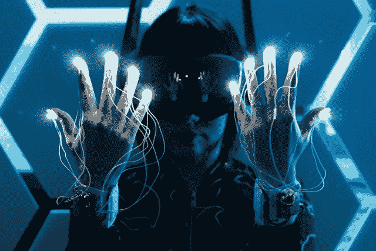

# 本周 PyDev:Sophy Wong

> 原文：<https://www.blog.pythonlibrary.org/2019/10/21/pydev-of-the-week-sophy-wong/>

本周，我们欢迎 Sophy Wong ( [@sophywong](https://twitter.com/sophywong) )成为我们本周的 PyDev！Sophy 是一名使用 Circuit Python 来创造可穿戴设备的制造商。她也是一名作家和创客活动的发言人。你可以在她的 [Youtube 频道](https://www.youtube.com/sophywongmakes)或者她的[网站](https://sophywong.com/)上看到她的一些创作。让我们花一些时间来更好地了解她！

你能告诉我们一些关于你自己的情况吗(爱好、教育等)

我是一名设计师和制造商，目前主要从事可穿戴电子项目。我的背景是平面设计，在走向可穿戴电子产品的路上也做过时装和服装方面的工作。我喜欢探索人们与技术互动的不同方式，我的许多作品都受到科幻和流行文化的启发。我的项目经常将微控制器和 3D 打印等技术与雕刻、绘画和缝纫等手工工艺相结合。

**你为什么开始使用 Python？**

我是通过 Adafruit 开发 Circuit Python 发现 Python 的。Adafruit 完整的文档和庞大的教程项目库使我能够轻松地学习和编写项目代码。我主要是一名设计师，代码是我用来实现我的想法的工具。Circuit Python 帮助我学习编程基础，并且随着我获得更多的技能，它也足够强大，可以支持更复杂的项目。

你还知道哪些编程语言，你最喜欢哪一种？

我也在一些项目中使用 Arduino，这让我可以使用许多出色的 Arduino 库，比如 FastLED。在为教程或教育研讨会创建项目时，我经常使用 MakeCode。MakeCode 作为可视化编程工具，使用起来很直观，也很容易用截图解释。它仍然足够健壮，可以支持相当复杂的项目，是进一步使用 Circuit Python 或 Arduino 的良好开端。

你现在在做什么项目？

我最近完成了一个项目，涉及到将 Adafruit 的 NeoPixel RGB LEDs 添加到一件夹克上，使用直接打印在织物上的 3D 打印扩散器。我现在正在做一个项目，将这项技术扩展到一件更大、更精致的衣服上。我也开始研究另一个太空服概念，学习如何使用台式 PCB 轧机，当然，还会编写更多可穿戴技术项目教程！

哪些 Python 库是你最喜欢的(核心或第三方)？

Adafruit 为其所有组件制作了非常棒的 Circuit Python 库，我几乎在每个项目中都使用他们的 Circuit Python NeoPixel 库，因为我喜欢用 neo pixel 来照亮事物。

对于想成为创客的人，你有什么建议吗？

选择一个你真正感兴趣的项目，然后开始。不要等待完美的材料，或最花哨的工具，要积极进取，边走边想办法。有时候，过多的计划和准备会在你开始之前偷走你所有的精力，让你的项目感觉势不可挡。所以，爱上你的想法，在你兴奋的时候投入进去。相信自己，玩得开心。如果你永不放弃，你就不会失败！

你对什么新的可穿戴技术感到兴奋？

我对虚拟现实和可穿戴设备增加沉浸式体验的潜力感到非常兴奋。这是一项技术，我记得当我还是个孩子的时候，我对它感到惊讶。我真的很想尝试一下，但是这项技术对我来说太遥不可及了，我想我永远也不可能亲自体验一下。现在它已经成为消费技术，我非常有兴趣看到制造商创造他们自己的虚拟现实体验，以及虚拟现实的可穿戴设备和外设。

我也对太空探索和宇航服非常感兴趣。我制作了自己的太空服服装，这是一个基于科幻渲染的概念设计。随着即将到来的月球和火星任务，我很高兴看到宇航服设计的创新，以及设计师和工程师如何为宇航员和太空游客创造新的宇航服。

你还有什么想说的吗？

感谢每一个记录他们的项目并分享他们的工作以供他人学习的人！感谢其他人编写和出版的教程和库，我能够用可编程电子设备将我的想法变成现实。我从来没想过学设计会让我学会如何编码，会让我写教程帮助别人入门编程。现在，为我的项目编写 Circuit Python 代码是这个过程中我最喜欢的部分之一！

索菲，谢谢你接受采访！