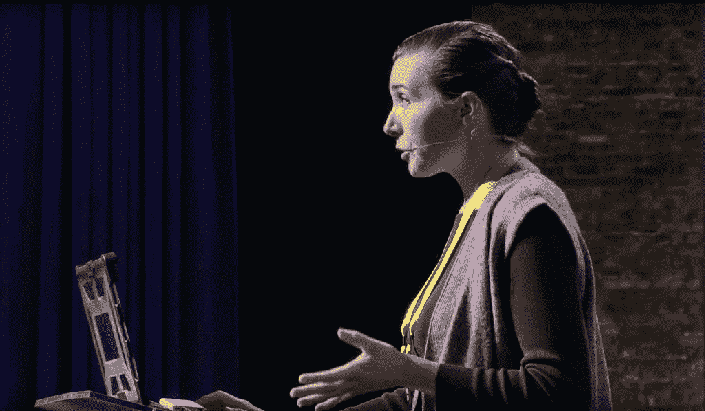

# 本周 PyDev:维罗妮卡·哈努斯

> 原文：<https://www.blog.pythonlibrary.org/2019/09/16/pydev-of-the-week-veronica-hanus/>

本周我们欢迎维罗妮卡·哈努斯([@维罗妮卡 _ 哈努斯](https://twitter.com/veronica_hanus))成为我们本周的 PyDev！Veronica 经常在 Python 和其他技术会议上发表技术演讲。你可以在她的[网站](https://veronicahanus.com/)上看到她的一些演讲和日程安排。在过去的几年里，她一直活跃在 Python 社区中。让我们花一些时间来更好地了解她！

你能告诉我们一些关于你自己的情况吗(爱好、教育等)

我喜欢写作和拍照。对我来说，挑战是帮助别人感受我当时的感受，当我决定那个时刻值得拍照或讲故事时，两者都需要结合你可以学习的技能和我觉得非常有益的普通老人关怀。拍照远足是我最喜欢的与朋友共度时光的方式之一，因为这是“安静、沉思的并排活动”和“让我们出去做点什么吧”的完美结合！

我曾经抽出时间和一个新的会议朋友在会场一个有趣的颠倒的房间里拍傻乎乎的照片。在我第一次会议演讲的压力之后，被人大惊小怪的感觉真好，这让我感到惊讶。随着我说得越来越多，我开始主动为与会者拍照，许多人都有同样的感受。许多人觉得会议让人应接不暇，花几分钟放松一下，交个新朋友，也许带着新的头像回家也不错。

我的教育经常让人们感到惊讶，因为它违背了许多人的期望:我没有计算机学位，也没有参加过训练营。在大学里，我学习地质学，结合了地球化学和行星科学。自从进入软件行业以来，我已经无数次听到“地质学！？这一定是一个很大的变化。即使在今天，这样的评论仍然让人觉得具有挑战性和排斥性，在我职业转变的早期，这种感觉很糟糕。我们一次又一次地听到来自不同背景的人有助于团队创新，但是当遇到不符合我们期望的人时，我们大多数人仍然会犹豫不决。如果我是一个白人，一个吹嘘学位的前科学家，想象一下当我们表达我们的惊讶时，有更多偏见的群体中的人会遇到的不舒服的反应！

事实证明，我曲折的编程之路让我做出了一些最有用的贡献。我们没有足够地谈论它，但是许多人使用编程技能，即使他们没有写过一行代码。如果你正在考虑发展，但不知道如何适应，我鼓励你去看看社区，比如写文档(他们的 [Slack](https://writethedocs.slack.com/) )，#CodeNewbie(他们的 [Twitter](https://twitter.com/CodeNewbies) )，或者通过我的 [Twitter](https://twitter.com/veronica_hanus) 或电子邮件向我问好。

你的科学背景对你的编程生涯有什么影响？

直到我在 JPL 做研究时，我才开始理解什么是编程。这需要相当大的勇气:我需要在实习的前一个学期学习 MATLAB，所以我找到了一位教授，他的研究依赖于 MATLAB，并和他一起建立了一项独立的研究。获得许可的计算机在校园对面一栋建筑的地下室里。他允许我在他的办公时间练习，所以我每周去那里两次，尽可能多地学习 MATLAB。当我的暑期研究导师来自一所重代码的技术学校时，当他看到我磕磕绊绊时，他评论道,“我以为你去了一所好学校。â€

那年夏天我没有学习编程，但我开始在我们团队的开发人员和其他手动测试他的程序的实习生之间充当联络人。在那些会议中，我们打破了我的许多个人编程神话。例如，到那时为止，我一直相信熟练的程序员会像我给朋友写信一样写程序，通常是从上到下(可能会因为一两个拼写错误而退回去)。程序可以由现有代码库和一些“胶水”组成，这让我大吃一惊。我开始阅读我们的程序，并很快指出和建议修改。我开始将我们程序中的模块与我们可能在我习惯的实验室环境中运行的过程进行比较。在与编程相关的领域工作使编程变得更加容易，即使我需要一路乞讨才能进入某人的地下实验室！

**你为什么开始使用 Python？**

有两件事吸引我来到 Python 社区:Python 与众多科学领域的接近(有如此多为特定应用开发的库)和他们热情的社区。

当我决定探索编程的时候，和我交谈过的每个人都强调了友好社区的重要性，并推荐我从 Python 开始。Python 给自己找了一个新的“终身监禁者”。虽然我发现许多普通的“编程”社区让人应接不暇(我可能永远也不会在 Stack Overflow 上为自己开拓一席之地)，但我很快在 Boston Python 上找到了自己的位置(他们有长达一个周末的教程，我都参加了，并和他们一起学习)。哈佛天文小组的电子邮件列表，其研究问题有时与我的兴趣重叠，成为我潜伏的地方，并观察那些依赖 Python 的人如何使用该语言解决他们的问题。有很多不同的学习方法！

人们对 Python 的兴趣越来越大，有很多方法可以参与社区活动。我鼓励你找到最适合你学习和社交风格的方式。我们不都是聚会/会议的人！

在线社区/论坛 : [代码新手](https://www.codenewbie.org/)和[开发者到](https://dev.to/)是我最喜欢的两个！他们有推特签到，播客，博客帖子。我也是 [Recurse Center](https://www.recurse.com/) 的成员，该中心被亲切地称为“世界上最好的编程社区，为期三个月的入职培训”,我会时不时地加入他们的聊天。

Meetup:因城市而异，但我最喜欢那些轮换主题、宣传&支持其他 Meetup 社区、努力记录资源的 Meetup。有些有活跃的 Slack 社区，允许人们在会议间隙轻松交流！

会议很精彩(对我来说),每个会议都有自己的文化。我发现那些有意进行文化建设的人给与会者和演讲者最好的体验(如果他们致力于[阐明与会者的需求](https://twitter.com/veronica_hanus/status/1142392867031269377)或[解释吃豆人规则](https://twitter.com/treyhunner/status/1099366936738054144)，我加入！)

非正式资源:有几个你可以去寻求建议的人是非常宝贵的。找出那些人，培养他们的关系。
有很多方法可以找到支持，但找到你可以成长的空间需要时间。实验！

你还知道哪些编程语言，你最喜欢哪一种？

我对 HTML/CSS/JS、Django 和 LaTeX 相当熟悉。Python 和 LaTeX 是我的初恋，可能永远是我的最爱。很少有人知道 LaTeX，所以我将在这里分享我的故事。

LaTeX 是由 Donald Knuth 创建的一种排版语言，除了他在算法复杂性分析方面的开创性工作之外，他还手工测量了字距调整和行距，以找到视觉上最吸引人的组合，结果非常棒。LaTeX 被数学和数学密集型学科(如物理)的学者广泛使用，并受到其他一些排版爱好者的青睐。我举办过关于乳胶的研讨会，希望能引起工业界人士使用它的兴趣。唉，LaTeX 仍然等待着在计算机科学和科学之外流行起来。目前，它仍然是主要保留用于学术用途的珍品。

我投身 LaTeX 是因为在我大学期间的实习和毕业后的第一份工作中(分别在加州理工学院和麻省理工学院)，我看到人们在打作业、论文和笔记(我听说有些人甚至能熟练地排版他们的课堂笔记！)结果很漂亮！我来自一所文科学校，以前从未见过这种情况——数学变得像艺术一样美丽！我决定，如果我把我需要的时间放入我的数学集，我也可以让它们看起来像一个艺术家在纸上安排的单词/符号！我开始为所有的东西排版，这是由美丽和融入的愿望所驱动的，直到今天，看到我的简历(由我设计和排版)时，我的脸上会带着微笑。学习 LaTeX 是我第一次感受到编程的兴奋、喜悦和精通。

你现在在做什么项目？

我现在最喜欢的项目是分析一个 200 人的关于开发者使用代码内注释的调查结果。在我看到如此多的新程序员被鼓励避免注释之后，我有动力学习更多关于注释实践的知识，尽管它们在许多情况下似乎是有用的。我已经从[开始谈论结果](https://www.youtube.com/watch?v=rSJOqhFQ5uU)，并将从回答中创建一个开放数据集。

你对那些想在会议上发言的人有什么建议？

多年来，我一直觉得自己不适合做演讲，尽管我很想做(我并不孤单！75%的人避免公开演讲)，所以我满脑子都是建议！

和朋友一起头脑风暴，快速开始！每个人都有自己最喜欢的把想法写在纸上的方法，做任何能帮助你关掉自我怀疑过滤器的事情。我发现召集一些人进行头脑风暴特别有效，在草拟了一个大类列表后(例如“你遇到过什么有趣的 bug？)，每个人在自己的纸上写下自己的答案(1 分钟内你能想到多少就写多少！).小组成员交换论文，并标记他们想进一步了解的每个想法。你不仅会很快发现你的想法有多有趣，还会听到一些有用的建议。

拥抱脆弱，不要屈服于低价出售你的想法的诱惑，无论是对自己还是对他人！当寻求帮助时，人们通常会分享他们的想法(通常是很棒的),然后立即用“哦，但是我不确定这是否可行”、“很抱歉打扰你”等等来搪塞。相反，尽你所能做好谈话准备——人们更愿意(也更有能力！)在你能为他们提供反馈材料时提供帮助。

给自己找个审查小组。我有五个经常给我写信的人和他们的评论(甚至只是“我喜欢！)在我挣扎的时候，给我前进的力量。

直到我无意中听到一位经验丰富的演讲者(他似乎在我参加的每个会议上都发言！)说他通常会向每个会议提交至少五个提案，我意识到提案的选择比演讲质量重要得多！组织者努力策划一个演讲阵容，为每个与会者提供一些东西。如果你提交的是一个热门的新技术，它可能会被比作几个(或几十个！)的其他探索该技术的提交。创建多个你感觉良好的提案可能需要一段时间，但希望知道即使是我们中最有经验的人采取这种预防措施也会帮助你向前推进，不管你第一次提交的结果如何！

加入一个评审委员会！大多数会议都在 Twitter 上征集评论者。通过回顾，阅读足够多的提案，你会认识到最常见的错误(例如，当作者遗漏重要信息时)，并看到你想要在自己的提案中模仿的风格。你还将为你最喜欢的会议提供支持，并接触到该领域的新领域或新语言。

记住这个秘密:很少有“糟糕的谈话想法”,创造一个成功的谈话更多地依赖于你持续的兴趣和意愿去研究、接受反馈和修改，而不是你的想法。当你需要把你最糟糕的“怪异”想法公之于众时，提醒自己这一点，看看你能从中得到什么。

你还有什么想说的吗？

经历了“什么，你是地质学家？作为我编程转型的一部分和“也许演讲是为了其他人”的一部分，我已经亲眼看到了谁在演讲有多重要。通过演讲，我们不仅分享了我们的编程冒险，而且有机会分享我们的错误冒险，并且听到旅程中困难的部分可能是强大的——对每个人来说，尤其是对与我们相关的人来说，因为共同的经历或身份。没有人能像你一样讲述你的故事。

谢谢你接受采访，维罗妮卡！