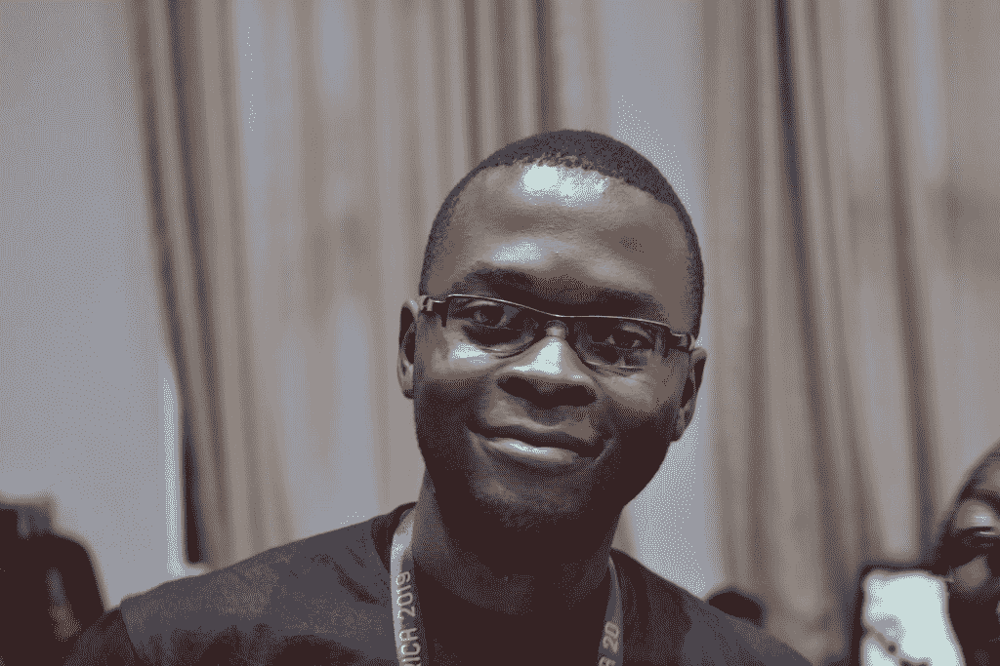

# 本周 PyDev:Vuyisile Ndlovu

> 原文：<https://www.blog.pythonlibrary.org/2019/11/11/pydev-of-the-week-vuyisile-ndlovu/>

本周我们欢迎 Vuyisile Ndlovu([@ terrameijar](https://twitter.com/terrameijar/))成为我们的本周 PyDev！Vuyisile 是[真实 Python](https://realpython.com/) 的贡献者，也是他自己的[网站](https://vuyisile.com/)的 Python 博主。他还活跃在非洲的 Python 社区。你可以在 Vuyisile 的网站上找到更多关于他的信息，或者查看他的 Github 简介。让我们花些时间去更好地了解他！

你能告诉我们一些关于你自己的情况吗(爱好、教育等)

我是来自津巴布韦布拉瓦约的开发人员。我一直对计算机很着迷，所以高中毕业后，我在当地一所社区大学注册了一个信息技术文凭项目，该项目将编程作为课程的一部分。可惜我的情况变了，最后没能毕业。我转而通过在线课程和书籍自学计算机科学主题和编程。

当我不写代码时，我喜欢在后院做木工项目，带着我的狗定期散步。这样做可以让我从技术中解脱出来，以不同的方式发挥创造力，还可以得到一些锻炼。

**你为什么开始使用 Python？**

几年来，我一直是 Mozilla 项目的核心贡献者，和我一起工作的一个团队广泛使用 Python 来自动化他们的工作。我喜欢 Python 看起来简单直观，所以我开始学习它。与我所习惯的 C++相比，Python 语法更容易理解，我喜欢它可以用于 Web 开发，这是我感兴趣的一个领域。随着我对这种语言了解的越来越多，我意识到它有一个令人惊叹的社区，从那时起，作为 Python 社区的一员，我交了很多朋友，这也是我坚持使用 Python 的原因之一。

你还知道哪些编程语言，你最喜欢哪一种？

我还没有最喜欢的语言，因为我没有编程很长时间，我知道不同的语言适合不同的事情。我正在学习 JavaScript，在大学的时候，我上过 C++和 Visual Basic 课程。我在一所高中用 VB.Net 教编程课，因为我发现使用 Visual Basic 可以使在 Windows 环境下构建 GUI 变得容易，而且这种语言对初学者来说也相对简单。

我从事的工作项目是 web 项目，我喜欢使用 Python 和 Django 来构建这些项目。

你现在在做什么项目？

我正在为一家婚礼和活动公司开发一个由 REST API 支持的 Django 客户门户。

另一方面，我正在进行一个项目，该项目将使用负担得起的硬件来制作有用的网站和服务，如 PyPI(https://pypi.org/)、维基百科和 Stack Overflow，供离线使用，因为非洲的互联网接入非常昂贵，在一些地方并不总是可用。我还不太清楚我将如何实现这一点，但它肯定是在管道中。

哪些 Python 库是你最喜欢的(核心或第三方)？

我喜欢的一个内置是 Pathlib，它使文件系统的工作变得简单。

我喜欢的第三方库是 pytest，尤其是它的测试参数化特性。

你是如何成为一名博客写手的？

当我开始在我的[个人网站](http://vuyisile.com)上写博客时，我这样做是为了让其他人知道在开源中工作是多么有趣，并分享我正在做的事情。现在我这样做是为了与世界分享我的知识，也是为了记录我自己的学习。

我发现你是真正的 Python 团队的一员。这种体验如何？

为真正的 Python 写博客真是太棒了，不仅我为他们写的文章获得了报酬，我作为一名作家也变得更好了，因为他们有非常高的质量标准，我发现这些标准在真正的 Python 之外影响着我的写作。它不仅仅是一个博客网站，真正的 Python 是一个由非常聪明的人组成的紧密结合的社区，我喜欢和他们一起工作。

**Python 在非洲发生了哪些令人兴奋的事情？**

软件开发行业正在快速增长，我们的商业之都拥有金融科技公司、初创公司和一些大公司，如微软、谷歌和亚马逊，它们在当地招聘员工。我们最近在加纳举办了第一届[PyCon](https://africa.pycon.org/report/)，取得了巨大的成功。我们的社区成员支持在他们的公司、学校和大学中使用 Python。例如，在我的国家，有一个完整的网络安全学位是用 Python 教授的，这是你每天都不会看到的。

一些社区有令人印象深刻的统计数据，一个很好的例子是 [PyCon Namibia 2018](https://na.pycon.org/2018/) ，其中男性和女性各占 50%。我们也有致力于塑造 Python 和流行 Python 项目(如 Django)方向的开发人员。我能想到的名字有 [Joannah Nanjekye](https://twitter.com/captain_joannah) ，她是一名作家和 Python 核心团队的成员， [Marlene Mhangami](https://twitter.com/marlene_zw) ，她是 Python 软件基金会的董事，还有 [Anna Makarudze](https://twitter.com/amakarudze) ，她是 Django 软件基金会的副主席

你还有什么想说的吗？

是的，如果你正在读这封信，而你的团队正在招人，我很想和你聊聊🙂你可以在我的[网站](https://vuyisile.com/)上找到我的联系方式。

谢谢你接受采访，Vuyisile！