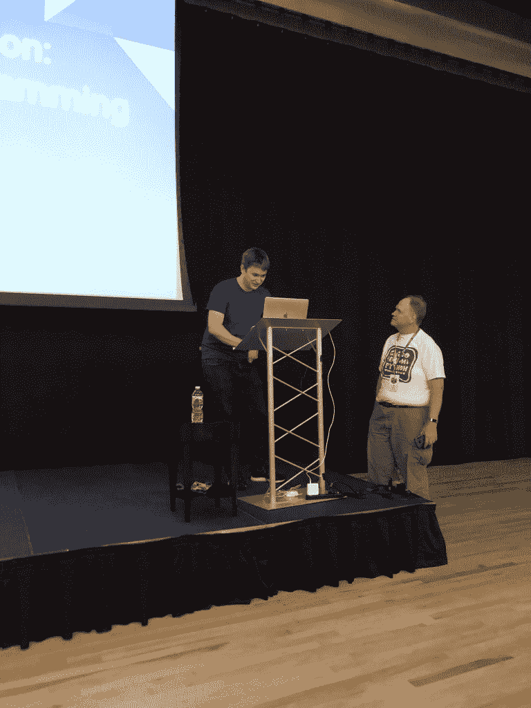

# 本周 PyDev:威廉姆·霍顿

> 原文：<https://www.blog.pythonlibrary.org/2020/10/26/pydev-of-the-week-william-horton/>

本周，我们欢迎威廉姆·霍顿( [@hortonhearsafoo](https://twitter.com/hortonhearsafoo) )成为我们本周的 PyDev！William 是 Compass 的一名高级软件工程师，曾在多个本地 Python 会议上发言。他是 [PyTorch](https://pytorch.org/) 和 [fastai](https://docs.fast.ai/) 的撰稿人。

让我们花些时间更好地了解威廉！

你能告诉我们一些关于你自己的情况吗(爱好、教育等)

关于我自己:人们可能会对我的教育背景感到惊讶——我没有学习计算机科学。我有社会科学学士学位。所以当我本科毕业时，我做的最多的编程工作可能就是在 Stata 中做回归分析来完成我的论文。我决定不去读研，而是报名参加了纽约的一个编程训练营(App Academy)。我写这篇文章的那天，9 月 28 日，实际上是我进入 App Academy 的第五年。

从那以后，我在纽约的几家不同行业的初创公司工作过:先是投资银行，然后是网上药店，现在是房地产。我目前是 Compass 人工智能服务团队的高级工程师，致力于为我们的房地产代理商和消费者提供机器学习解决方案。

我喜欢把空闲时间花在一些不同的爱好上。我是一个有竞争力的举重运动员，所以我喜欢一周去几次健身房(尽管在纽约的疫情，我有六个月左右没有举重)。实际上，我发现力量举是软件工程师中非常普遍的爱好。每次有新人加入我的健身房，他们似乎来自不同的创业公司。我喜欢打篮球。我对音乐充满热情:我几乎一生都是歌手，最近在纽约与一个无伴奏合唱团一起表演。去年，我拿起了吉他，从十几岁开始我就没有碰过它，这让我很有成就感。

**你为什么开始使用 Python？**

我肯定不是从 Python 开发开始的——我的编码训练营专注于 Ruby 和 Rails，他们也教我们 JavaScript 和 React。我得到了我的第一份工作，主要是因为我知道反应，当时它是相当新的。但是我加入的公司也有一个用 Python 编写的相当大的数据处理组件，而且只有几个工程师，所以最终我也加入了那个部分。当我找第二份工作时，我知道我想做更多的 Python，所以我找到了一个全栈角色，即 React 前端和 Python 后端(在 Flask 中)。

但我觉得对我来说真正的转折点是在 2017 年秋天我发现了 [fast.ai](https://www.fast.ai/) 课程。我在网上上过一些机器学习课程，包括吴恩达的 Coursera 课程，这是一个我觉得有趣的话题。但是 fast.ai 课程真的吸引了我——杰瑞米·霍华德展示材料的方式以某种方式抓住了我，让我想了解更多。我喜欢他的观点:如果你懂一些 Python，并且你有高中水平的数学，你就可以实践机器学习，并开始提高你的技能。

所以到了 2018 年找工作的时候，我知道我想做的是更接近数据和机器学习的工作。我加入 Compass 担任后端数据角色，在一个不断发展的团队中处理我们从不同来源获得的所有房地产列表数据。这给了我学习一些重要工具的机会:我在 Compass 上设置了第一个 Airflow 实例，并致力于我们的 PySpark 代码。当机器学习团队成立时，我能够为第一个项目做出贡献，并最终全职加入这个团队。

你还知道哪些编程语言，你最喜欢哪一种？

我从我的编码训练营了解 Ruby，从我之前的两份工作中了解 JavaScript，我也在 Go 中做过少量的编程工作。其中，我可能会说 JavaScript 是我最喜欢的。

你现在在做什么项目？

我现在的主要项目是在 Compass 上销售推荐。我们使用历史数据来学习哪些物业可能会出售的模型，然后将它与代理放入 Compass CRM 联系人列表中的地址联系起来。这是一个完全基于 Python 的项目:模型是 scikit-learn，我们使用 PySpark 处理数据，API 是 Python GRPC 服务。如果人们有兴趣了解更多信息，我们在 Compass Medium 页面上有一个[博客帖子](https://medium.com/compass-true-north/likely-to-sell-recommendations-for-real-estate-47e2f5c37f4)。

另一个让我非常兴奋的项目是我们的机器学习管道项目，我们正在开源平台 Kubeflow 的基础上构建这个项目。这是一种在 Kubernetes 之上定义和运行机器学习工作流的方法，它允许您在利用分布式计算、并行化和资源管理方面获得一些巨大的好处。我们已经在我上面提到的可能出售的项目中使用它，它允许我们更快地迭代和实验。我有机会在 SciPy 2020 上展示了一张关于 Kubeflow 管道的海报，我还在 SciPy Japan(10 月 30 日至 11 月 2 日)上做了一个关于这个主题的(虚拟)演讲

哪些 Python 库是你最喜欢的(核心或第三方)？

很难选择，外面有很多很棒的图书馆！但仅举几个例子:对于我专业从事的工作，我认为 Jupyter 笔记本、熊猫和 scikit-learn 是必不可少的。真正伟大的图书馆已经存在了一段时间，并且经受住了时间的考验。我还必须对 pytorch 和 fastai 表示感谢，感谢他们培养了我对深度学习和机器学习的兴趣，这也是我走上目前职位的原因。

你是如何在 Python 大会上发表演讲的？

我想说几件事促成了它:我自己的好奇心，社区的支持，当然，还有运气。这一切都是因为我注册了一个 meetup，这是一个在纽约 Dropbox 上举办的 PyGotham talk 头脑风暴会议。他们带我们做了一些练习，我们都分享了一些想法，我拿了我最好的一个提交给了 PyGotham 2018 CFP。但是我被拒绝了。

然而，PyOhio CFP 大约在同一时间，我看到一条推文鼓励人们也提交给那个，所以我向 PyOhio 发送了相同的建议。我被录取了！我对这次旅行非常兴奋，但做演讲时也非常紧张。PyOhio 确实为第一次演讲的人提供了演讲指导，所以我很感谢他们。最后，我在演讲中度过了一段美好的时光，并享受了与一些人见面和观看其他演讲的机会。所以我决定再做一次。

在 PyColordao 建立

然后来了...更多的拒绝。我想我在 2018 年底又向两个会议发送了同样的讲话，并被拒绝。我决定在 2019 年推出一些新鲜的材料，我会说 PyTexas 2019 是我真正实现飞跃的时候。我做了一个演讲，我真的为[“你的 Python 中的 CUDA”](https://www.youtube.com/watch?v=MEi1QQQSmOM))感到骄傲，但我也开始在社区中认识更多的人，这真的为我的会议经历做出了很大贡献。

对于想做技术演讲的人，你有什么建议吗？

我要说的第一件事是:把你自己放出去。我天生是一个完美主义者，所以对我来说真的很难在 CFP 上点击提交按钮(即使现在，当我已经接受了谈话)。但是到最后，有些评论家会喜欢你的提议，有些不会，所以如果你想发表演讲，你只需要玩数字游戏，服从几个地方，然后抱最好的希望。

我要强调的另一件事是，你不必成为某方面的世界专家来谈论它。当你看到演讲者是图书馆的作者，或者比你多 10 年的经验，或者在大公司工作时，你可能会感到害怕。但我会告诉刚开始的人:你所要做的就是创造一个 25 分钟的体验，让人们享受演示，并从中学习一些他们以前不知道的东西。许多参加会议的人，尤其是地区 Python 会议的人，都处于学习过程的早期，所以仅仅介绍一下自己对一些入门材料的看法就很有价值。

威廉，谢谢你接受采访！