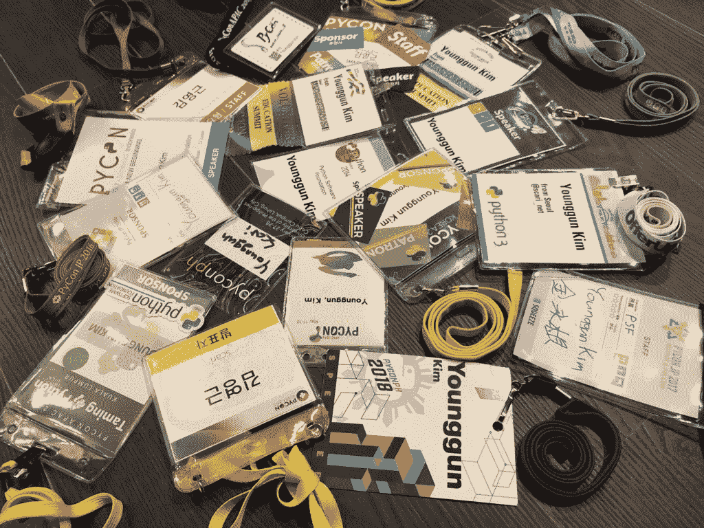

# 本周 PyDev:young gun Kim

> 原文：<https://www.blog.pythonlibrary.org/2018/09/17/pydev-of-the-week-younggun-kim/>

本周我们欢迎金英君(@ [scari_net](https://twitter.com/scari_net) )成为我们本周的 PyDev！Younggun 是 Python 软件基金会的董事会成员，也是韩国 PyCon 的创始人。他已经把几本编程书翻译成了韩语。你可以在他的[网站](http://younggun.kim/)上获得完整的名单。你也可以查看他的 [Github](https://github.com/scari) 来看看他参与的一些项目。现在，让我们花一些时间来更好地了解他！

你能告诉我们一些关于你自己的情况吗(爱好、教育等)

我是一名住在韩国首尔的 Pythonista，在一家视频流公司领导工程部。我还积极参与我们的社区，尤其是在东亚地区。我在 2016/17 年任期内担任 PSF 的董事会董事，由 Carol Willing 提名。2014 年，我和几个当地社区成员第一次创办了韩国 PyCon。我一年中带着一个漂亮的 [PSF 会议包](https://wiki.python.org/psf/PSF%20Conference%20Kit)去 5 或 6 个 PyCons 旅行。我现在是 PSF 赠款工作组的成员。

**你为什么开始使用 Python？**

我在 8 岁的时候开始学习如何编程。在学习编程之前，我必须先学习字母表，因为我是一个不会说英语的孩子，在我 8 年的生命中从未见过字母表。事实上，我从键盘上学会了字母表，并学会了几个英语单词，如 PRINT，GOTO，RUN 等。在我正式从学校学习英语之前。

从那以后，我迷上了学习编程语言。当我在 21 世纪初第一次从 IRC 渠道听说 Python 这种新语言时，我对它感兴趣并不奇怪。频道的 Hyeshik 是一个 Python 爱好者，经过几年的贡献，他成为了 CPython 的提交者。他介绍了很多关于 Python 的趣事，见证这种快节奏语言的历史是一种极大的乐趣。

你还知道哪些编程语言，你最喜欢哪一种？

我知道很多编程语言，从古老的到深奥的。c 是我最喜欢的语言，因为它是我使用时间最长的语言。我想说 Python 是我现在最喜欢的。我经常把 C lang 比作驾驶手动挡汽车。从某种意义上来说这很有趣，但是为什么要每天在交通堵塞的时候用手动挡汽车呢？

你现在在做什么项目？

我现在不怎么写代码了，尤其是在工作中。过去我确实为 pandas 做了一些贡献，但最近，我更喜欢组织开发冲刺，并喜欢帮助他人为开源做贡献。当我写代码时，只有当我需要为决策快速建立原型或自动化单调乏味的工作时。我不能说太多，但我正在用 Python 编写一个可以检测实时视频流中特定内容的系统原型。

哪些 Python 库是你最喜欢的(核心或第三方)？

[拼写错误](https://pypi.org/project/misspellings/)。不是玩笑。😉拼写错误是一个库，用于检查源代码中拼写错误的单词。我没有亲自使用它，而是在一次关于开源贡献的演讲中介绍了它。我在我的演讲中强调的是，不仅仅是解决难题的英雄行为，报告错误、修正错误、文档和捐赠也是有价值的贡献。我引入拼写错误是为了让人们第一次投稿时更容易。我相信一旦他们开始，他们会继续尝试，没有人知道未来会有多美好。

你还有什么想说的吗？

在我们的社区中，我们感受到了与他人的友谊，因为我们有着共同的兴趣，对他人表现出尊重和礼貌，没有任何歧视。事实上，这让我们的社区变得更好。

如你所知，朝鲜半岛的和平指日可待。这是朝鲜人民的热切梦想。然而，由于朝鲜半岛长达 70 年的分裂，南北方在生活方式、财富、政治信仰和其他问题上的巨大差异可能会让我们每天都在挣扎。

我希望南方和北方的 Pythonistas 们有一天能聚在一起，用我们从社区中学到的东西超越彼此之间的差异，这样我们就能为和平做出一点贡献。

如果这个博客的读者认识朝鲜的一个皮托尼斯塔，你能告诉他们当和平到来的时候我会去看他们，请等我到那时吗？

感谢您接受采访！