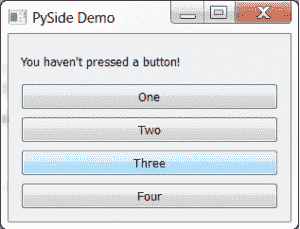
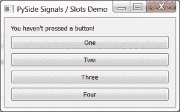

# PySide:将多个小部件连接到同一个插槽

> 原文：<https://www.blog.pythonlibrary.org/2013/04/10/pyside-connecting-multiple-widgets-to-the-same-slot/>

当我学习 PyQt 和 PySide 时，我正在写一些教程来帮助我的同路人。今天我们将看看如何将多个小部件连接到同一个插槽。换句话说，我们将把窗口小部件信号(基本上是事件)绑定到插槽(也就是像函数、方法这样的可调用程序)，它们更好地被称为“事件处理程序”。是的，我知道在皮赛德郡你不这么叫它。这是一个插槽，而不是一个事件处理程序。但是我跑题了。无论如何，有两种方法可以解决这个问题。一种是使用 functools 及其分部类来传递参数，或者使用 PySide 的内省功能从执行调用的小部件中获取信息。实际上至少还有一种方法与 functools.partial 非常相似，那就是使用臭名昭著的匿名函数实用程序 lambda。我们来看看这些方法都是怎么做到的！

### 入门指南

[](https://www.blog.pythonlibrary.org/wp-content/uploads/2013/04/pyside_multipleButtons.png)

如果你还没有 PySide，那就出去买吧。如果您想在 PyQt 上尝试，请确保您的 PyQt 版本是 4.3 或更高版本，因为下面示例应用程序中的第一个 partial 示例在以前版本的 PyQt 上无法工作。你可以在这里得到 py side。一旦你做好了一切准备，继续阅读下面的代码:

```py

from functools import partial
from PySide.QtCore import SIGNAL
from PySide.QtGui import QApplication, QLabel, QWidget
from PySide.QtGui import QPushButton, QVBoxLayout

########################################################################
class MultiButtonDemo(QWidget):
    """"""

    #----------------------------------------------------------------------
    def __init__(self):
        """Constructor"""
        super(MultiButtonDemo, self).__init__()

        layout = QVBoxLayout()

        self.label = QLabel("You haven't pressed a button!")

        # use a normal signal / slot mechanic
        button1 = QPushButton("One")
        self.connect(button1, SIGNAL("clicked()"), self.one)

        # now let's use partial functions
        button2 = QPushButton("Two")
        self.connect(button2, SIGNAL("clicked()"),
                     partial(self.onButton, "Two"))

        button3 = QPushButton("Three")
        self.btn3Callback = partial(self.onButton, "Three")
        button3.clicked.connect(self.btn3Callback)

        # now let's try using a lambda function
        button4 = QPushButton("Four")
        button4.clicked.connect(lambda name="Four": self.onButton(name))

        layout.addWidget(self.label)
        layout.addWidget(button1)
        layout.addWidget(button2)
        layout.addWidget(button3)
        layout.addWidget(button4)
        self.setLayout(layout)

        self.setWindowTitle("PySide Demo")

    #----------------------------------------------------------------------
    def one(self):
        """"""
        self.label.setText("You pressed One!")

    #----------------------------------------------------------------------
    def onButton(self, lbl):
        """Change the label to the text (lbl) passed in"""
        self.label.setText("You pressed %s!" % lbl)

#----------------------------------------------------------------------
if __name__ == "__main__":
    app = QApplication([])
    form = MultiButtonDemo()
    form.show()
    app.exec_()

```

让我们花点时间来分析一下。我们子类化 QWidget 来创建我们的窗口。然后，我们使用 QVBoxLayout 在垂直行中布局我们的小部件。接下来，我们创建一个标签和四个按钮。我们挂接到事件处理程序的第一个按钮是以正常方式完成的。在 **one** 处理程序中，它只是更新标签说“你按了一个！”。您可以对其他 3 个按钮这样做，但这不是本文的重点。相反，我们使用 Python 的 **functools** 库，它有一个非常方便的**分部**类。partial 类允许开发人员创建一个可调用的，你可以给你的 PySide 信号。第一个示例创建了一个其他任何对象都无法访问的分部可调用对象。partial 的第二个例子(按钮 3)被分配给一个类变量， **self.btn3Callback** ，然后你可以把它赋予你的信号。最后一个例子(按钮 4)展示了如何做与 partial 相同的事情，但是使用 Python 的 lambda。最后一种方法在 Tkinter GUI 工具包中特别流行。

现在我们准备了解如何让 PySide 本身告诉我们哪个按钮向插槽发送信号。

### 如何让 PySide 说出一切

[](https://www.blog.pythonlibrary.org/wp-content/uploads/2013/04/pyside_multipleButtons2.png)

实际上，我们将对代码进行一点重构，以使代码更短，并向您展示布局小部件的另一种方式。这一次，我们还将所有按钮连接到一个插槽(即事件处理程序/可调用程序)。代码如下:

```py

from PySide.QtCore import SIGNAL
from PySide.QtGui import QApplication, QLabel, QWidget
from PySide.QtGui import QPushButton, QVBoxLayout

########################################################################
class MultiButtonDemo(QWidget):
    """"""

    #----------------------------------------------------------------------
    def __init__(self):
        """Constructor"""
        super(MultiButtonDemo, self).__init__()

        layout = QVBoxLayout()

        self.label = QLabel("You haven't pressed a button!")
        layout.addWidget(self.label)
        labels = ["One", "Two", "Three", "Four"]
        for label in labels:
            btn = QPushButton(label)
            btn.clicked.connect(self.clicked)
            layout.addWidget(btn)

        self.setLayout(layout)

        self.setWindowTitle("PySide Signals / Slots Demo")

    #----------------------------------------------------------------------
    def clicked(self):
        """
        Change label based on what button was pressed
        """
        button = self.sender()
        if isinstance(button, QPushButton):
            self.label.setText("You pressed %s!" % button.text())

#----------------------------------------------------------------------
if __name__ == "__main__":
    app = QApplication([])
    form = MultiButtonDemo()
    form.show()
    app.exec_()

```

好了，现在导入稍微短了一点，因为我们不再需要 functools 了。在下面的 **__init__** 中，我们创建了一个按钮标签列表，然后遍历它们来创建四个按钮。在循环中，我们还将按钮连接到 callable(或将信号连接到 slot ),并将小部件添加到布局管理器。根据《用 Python 和 PyQt 进行快速 GUI 编程》[的作者马克·萨默菲尔德在他的书中所说，callable (slot)应该和 signal 一样命名，因为这是 PyQt 的惯例。我猜这也是皮赛德的惯例，所以我们会坚持下去。](http://www.amazon.com/gp/product/0132354187/ref=as_li_ss_tl?ie=UTF8&camp=1789&creative=390957&creativeASIN=0132354187&linkCode=as2&tag=thmovsthpy-20)

在我们的 **clicked** 方法/signal/callable/whatever 中，我们使用 **self.sender()** 从调用该方法的任何对象中获取按钮对象。然后，为了安全起见，我们确保发送者是 QPushButton 的一个实例，如果是，那么我们通过它的 **text()** 调用获取按钮的标签，并适当地设置标签。就是这样！又短又甜！

### 包扎

现在，您知道了几种向插槽/处理程序传递参数的方法。您还学习了如何询问 PySide 哪个小部件调用了 callable。现在你可以出去自己写一些很酷的东西了。

### 附加阅读

*   Python 关于 [functools.partial](http://docs.python.org/2/library/functools.html#functools.partial) 的文档
*   [Python Lambda](https://www.blog.pythonlibrary.org/2010/07/19/the-python-lambda/)
*   wxPython: [将多个小部件绑定到同一个处理程序](https://www.blog.pythonlibrary.org/2011/09/20/wxpython-binding-multiple-widgets-to-the-same-handler/)
*   wxPython wiki - [向回调传递参数](http://wiki.wxpython.org/Passing%20Arguments%20to%20Callbacks)

### 下载源代码

*   [py side _ passingargstoslots . zip](https://www.blog.pythonlibrary.org/wp-content/uploads/2013/04/pyside_passingArgstoSlots.zip)