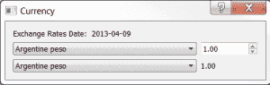
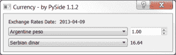

# PySide:创建货币转换器

> 原文：<https://www.blog.pythonlibrary.org/2013/04/09/pyside-creating-a-currency-converter/>

我目前正在通读 Mark Summerfield 关于 PyQt 的书，[用 Python 和 Qt](http://www.amazon.com/gp/product/0132354187/ref=as_li_ss_tl?ie=UTF8&camp=1789&creative=390957&creativeASIN=0132354187&linkCode=as2&tag=thmovsthpy-20) 进行快速 GUI 编程，我认为将其中的一些示例应用程序转换成 PySide 会很有趣。因此，我将撰写一系列文章，展示书中的原始 PyQt 示例，然后将它们转换成 PySide，并可能在代码中添加一些我自己的东西。直到第 4 章作者创建了一个有趣的小货币转换器，这本书才真正开始 Qt GUI 编码。一起来享受乐趣吧！

[](https://www.blog.pythonlibrary.org/wp-content/uploads/2013/04/pyqt_currency.png)

以下是大部分原始代码:

```py

import sys
import urllib2
from PyQt4.QtCore import SIGNAL
from PyQt4.QtGui import QComboBox, QDialog, QDoubleSpinBox, QLabel
from PyQt4.QtGui import QApplication, QGridLayout

########################################################################
class CurrencyDlg(QDialog):
    """"""

    #----------------------------------------------------------------------
    def __init__(self, parent=None):
        """Constructor"""
        super(CurrencyDlg, self).__init__(parent)

        date = self.getdata()
        rates = sorted(self.rates.keys())

        dateLabel = QLabel(date)
        self.fromComboBox = QComboBox()
        self.fromComboBox.addItems(rates)

        self.fromSpinBox = QDoubleSpinBox()
        self.fromSpinBox.setRange(0.01, 10000000.00)
        self.fromSpinBox.setValue(1.00)

        self.toComboBox = QComboBox()
        self.toComboBox.addItems(rates)
        self.toLabel = QLabel("1.00")

        # layout the controls
        grid = QGridLayout()
        grid.addWidget(dateLabel, 0, 0)
        grid.addWidget(self.fromComboBox, 1, 0)
        grid.addWidget(self.fromSpinBox, 1, 1)
        grid.addWidget(self.toComboBox, 2, 0)
        grid.addWidget(self.toLabel, 2, 1)
        self.setLayout(grid)

        # set up the event handlers
        self.connect(self.fromComboBox, SIGNAL("currentIndexChanged(int)"),
                     self.updateUi)
        self.connect(self.toComboBox, SIGNAL("currentIndexChanged(int)"),
                     self.updateUi)
        self.connect(self.fromSpinBox, SIGNAL("valueChanged(double)"),
                     self.updateUi)

        self.setWindowTitle("Currency")

    #----------------------------------------------------------------------
    def getdata(self):
        """
        """
        self.rates = {}
        url = "http://www.bankofcanada.ca/en/markets/csv/exchange_eng.csv"
        try:
            date = None
            fh = urllib2.urlopen(url)
            for line in fh:
                line = line.rstrip()
                if not line or line.startswith(("#", "Closing ")):
                    continue
                fields = line.split(",")
                if line.startswith("Date "):
                    date = fields[-1]
                else:
                    try:
                        value = float(fields[-1])
                        self.rates[unicode(fields[0])] = value
                    except ValueError:
                        pass
            return "Exchange Rates Date: " + date
        except Exception, e:
            return "Failed to download: \n%s" % e

    #----------------------------------------------------------------------
    def updateUi(self):
        """
        Update the user interface
        """
        to = unicode(self.toComboBox.currentText())
        frum = unicode(self.fromComboBox.currentText())
        amount = ( self.rates[frum] / self.rates[to] ) 
        amount *= self.fromSpinBox.value()
        self.toLabel.setText("%0.2f" % amount)

#----------------------------------------------------------------------
if __name__ == "__main__":
    app = QApplication(sys.argv)
    form = CurrencyDlg()
    form.show()
    app.exec_()

```

如果你真的想知道这些代码是如何工作的，我推荐你去阅读前面提到的书或者研究这些代码。毕竟是 Python。

### 移植到 PySide

[](https://www.blog.pythonlibrary.org/wp-content/uploads/2013/04/pyside_currency.png)

现在我们需要将它“移植”到 [PySide](http://qt-project.org/wiki/Category:LanguageBindings::PySide) ，Python 的 QT 绑定的 LGPL 版本。幸运的是，在这个例子中这是非常容易的。您所要做的就是更改以下导入

```py

from PyQt4.QtCore import SIGNAL
from PyQt4.QtGui import QComboBox, QDialog, QDoubleSpinBox, QLabel
from PyQt4.QtGui import QApplication, QGridLayout

```

到

```py

from PySide.QtCore import SIGNAL
from PySide.QtGui import QComboBox, QDialog, QDoubleSpinBox
from PySide.QtGui import QApplication, QGridLayout, QLabel

```

如果您这样做并保存它，您就完成了移植，代码现在可以在 PySide land 中工作了。然而，我认为我们需要更进一步，让这些代码更智能一些。您会注意到，在最初的版本中，每次运行该应用程序时，它都会上线并下载汇率数据。这似乎有点矫枉过正，所以让我们添加一个检查，看看它是否已经下载并且不到一天。只有超过一天，我们才会想下载新的副本。我们不使用 urllib2，而是使用新的[请求](http://docs.python-requests.org/en/latest/)库。

下面是新代码:

```py

import datetime
import os
import PySide
import requests
import sys

from PySide.QtCore import SIGNAL
from PySide.QtGui import QComboBox, QDialog, QDoubleSpinBox
from PySide.QtGui import QApplication, QGridLayout, QLabel

########################################################################
class CurrencyDlg(QDialog):
    """"""

    #----------------------------------------------------------------------
    def __init__(self, parent=None):
        """Constructor"""
        super(CurrencyDlg, self).__init__(parent)

        date = self.getdata()
        rates = sorted(self.rates.keys())

        dateLabel = QLabel(date)
        self.fromComboBox = QComboBox()
        self.fromComboBox.addItems(rates)

        self.fromSpinBox = QDoubleSpinBox()
        self.fromSpinBox.setRange(0.01, 10000000.00)
        self.fromSpinBox.setValue(1.00)

        self.toComboBox = QComboBox()
        self.toComboBox.addItems(rates)
        self.toLabel = QLabel("1.00")

        # layout the controls
        grid = QGridLayout()
        grid.addWidget(dateLabel, 0, 0)
        grid.addWidget(self.fromComboBox, 1, 0)
        grid.addWidget(self.fromSpinBox, 1, 1)
        grid.addWidget(self.toComboBox, 2, 0)
        grid.addWidget(self.toLabel, 2, 1)
        self.setLayout(grid)

        # set up the event handlers
        self.connect(self.fromComboBox, SIGNAL("currentIndexChanged(int)"),
                     self.updateUi)
        self.connect(self.toComboBox, SIGNAL("currentIndexChanged(int)"),
                     self.updateUi)
        self.connect(self.fromSpinBox, SIGNAL("valueChanged(double)"),
                     self.updateUi)

        self.setWindowTitle("Currency - by PySide %s" % PySide.__version__)

    #----------------------------------------------------------------------
    def downloadFile(self, rate_file):
        """
        Download the file
        """
        url = "http://www.bankofcanada.ca/en/markets/csv/exchange_eng.csv"
        r = requests.get(url)
        try:
            with open(rate_file, "wb") as f_handler:
                f_handler.write(r.content)
        except IOError:
            print "ERROR: Unable to download file to %s" % rate_file

    #----------------------------------------------------------------------
    def getdata(self):
        """
        """
        base_path = os.path.dirname(os.path.abspath(__file__))
        rate_file = os.path.join(base_path, "exchange_eng.csv")
        today = datetime.datetime.today()
        self.rates = {}

        if not os.path.exists(rate_file):
            self.downloadFile(rate_file)
        else:
            # get last modified date:
            ts = os.path.getmtime(rate_file)
            last_modified = datetime.datetime.fromtimestamp(ts)
            if today.day != last_modified.day:
                self.downloadFile(rate_file)

        try:
            date = None
            with open(rate_file) as fh:
                for line in fh:
                    result = self.processLine(line)
                    if result != None:
                        date = result

            return "Exchange Rates Date: " + date
        except Exception, e:
            return "Failed to download: \n%s" % e

    #----------------------------------------------------------------------
    def processLine(self, line):
        """
        Processes each line and updates the "rates" dictionary
        """
        line = line.rstrip()
        if not line or line.startswith(("#", "Closing ")):
            return
        fields = line.split(",")
        if line.startswith("Date "):
            date = fields[-1]
            return date
        else:
            try:
                value = float(fields[-1])
                self.rates[unicode(fields[0])] = value
            except ValueError:
                pass
        return None

    #----------------------------------------------------------------------
    def updateUi(self):
        """
        Update the user interface
        """
        to = unicode(self.toComboBox.currentText())
        frum = unicode(self.fromComboBox.currentText())
        amount = ( self.rates[frum] / self.rates[to] ) 
        amount *= self.fromSpinBox.value()
        self.toLabel.setText("%0.2f" % amount)

#----------------------------------------------------------------------
if __name__ == "__main__":
    app = QApplication(sys.argv)
    form = CurrencyDlg()
    form.show()
    app.exec_()

```

好了，让我们花点时间看看代码。我们不会解释所有的事情，但是我们会回顾一下发生了什么变化。首先，我们导入了更多的模块:**日期时间**、**操作系统**、**请求**和**系统**。我们还导入了 PySide 本身，这样我们就可以很容易地将其版本信息添加到对话框的标题栏中。接下来我们添加了几个新方法: **downloadFile** 和 **processLine** 。但是首先我们需要看看在 **getdata** 中发生了什么变化。在这里，我们获取脚本运行的路径，并使用它来创建 rates 文件的完全限定路径。然后我们检查它是否已经存在。如果它不存在，我们调用 **downloadFile** 方法，该方法使用**请求**库来下载文件。我们还使用 Python 的**和**上下文管理器构造，当我们完成写入时，它会自动关闭文件。

如果文件确实存在，那么我们进入语句的 else 部分，检查文件的最后修改日期是否早于今天的日期。如果是，那么我们下载文件并覆盖原始文件。然后我们继续处理文件。为了进行处理，我们将大部分代码转移到一个名为 **processLine** 的独立方法中。这样做的主要原因是，如果我们不这样做，我们最终会得到一个非常复杂的嵌套结构，很难理解。我们还添加了一个检查来查看日期是否已经从 processLine 返回，如果是，我们设置日期变量。其余的代码保持不变。

### 包扎

至此，您应该知道如何创建一个非常简单的 PySide 应用程序，它实际上可以做一些有用的事情。不仅如此，您还对如何将您的 PyQt 代码移植到 PySide 有一个非常一般的想法。您还接触过两种从网上下载文件的不同方式。我希望这已经让您看到了 Python 的强大和编程的乐趣。

*注意:本文中的代码是在使用 Python 2.6.6、PySide 1.2.2 和 PyQt4 的 Windows 7 Professional 上测试的*

### 相关链接

*   Python 101: [如何下载文件](https://www.blog.pythonlibrary.org/2012/06/07/python-101-how-to-download-a-file/)
*   PySide 官方[网站](http://qt-project.org/wiki/Category:LanguageBindings::PySide)
*   PyQt 官方[网站](http://www.riverbankcomputing.com/software/pyqt/intro)
*   [请求包](http://docs.python-requests.org/en/latest/)
*   **更新(04/10/2013)** -我注意到有人决定做这个与[视频教程相同的教程](http://www.youtube.com/watch?v=8D_aEYiBU2c&list=PLA955A8F9A95378CE&index=4)

### 下载源代码

*   [pyqt-side-currency.zip](https://www.blog.pythonlibrary.org/wp-content/uploads/2013/04/pyqt-side-currency.zip)