# PySide:标准对话框和消息框

> 原文：<https://www.blog.pythonlibrary.org/2013/04/16/pyside-standard-dialogs-and-message-boxes/>

PySide GUI toolkit for Python 有几个标准对话框和消息框，您可以按原样使用。您也可以创建自定义对话框，但是我们将把它留到以后的文章中。在本帖中，我们将讨论以下对话:

*   颜色对话框
*   文件对话框
*   字体对话框
*   输入对话框
*   打印和打印预览对话框

我们还将介绍 PySide 的信息盒。本文中的所有代码都是在使用 PySide 1.2.2 和 Python 2.6.6 的 Windows 7 Professional 上测试的。现在让我们开始吧！

### 用标准对话框获取信息

[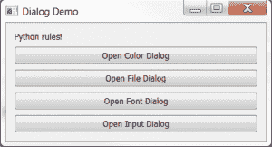](https://www.blog.pythonlibrary.org/wp-content/uploads/2013/04/pysideStdDlgDemo.png)

我们将从显示上面列出的前四个对话框的代码开始。另外两个比较复杂，有自己专门的演示代码。在代码之后，我们将单独看一下每个对话框的代码以帮助理解它。

```py

# stdDialogDemo_pyside.py

from PySide import QtCore, QtGui

########################################################################
class DialogDemo(QtGui.QWidget):
    """"""

    #----------------------------------------------------------------------
    def __init__(self):
        """Constructor"""
        # super(DialogDemo, self).__init__()
        QtGui.QWidget.__init__(self)

        self.label = QtGui.QLabel("Python rules!")

        # create the buttons
        colorDialogBtn = QtGui.QPushButton("Open Color Dialog")
        fileDialogBtn =  QtGui.QPushButton("Open File Dialog")
        self.fontDialogBtn = QtGui.QPushButton("Open Font Dialog")
        inputDlgBtn = QtGui.QPushButton("Open Input Dialog")

        # connect the buttons to the functions (signals to slots)
        colorDialogBtn.clicked.connect(self.openColorDialog)
        fileDialogBtn.clicked.connect(self.openFileDialog)
        self.fontDialogBtn.clicked.connect(self.openFontDialog)
        self.connect(inputDlgBtn, QtCore.SIGNAL("clicked()"), self.openInputDialog)

        # layout widgets
        layout = QtGui.QVBoxLayout()
        layout.addWidget(self.label)
        layout.addWidget(colorDialogBtn)
        layout.addWidget(fileDialogBtn)
        layout.addWidget(self.fontDialogBtn)
        layout.addWidget(inputDlgBtn)
        self.setLayout(layout)

        # set the position and size of the window
        self.setGeometry(100, 100, 400, 100)

        self.setWindowTitle("Dialog Demo")

    #----------------------------------------------------------------------
    def openColorDialog(self):
        """
        Opens the color dialog
        """
        color = QtGui.QColorDialog.getColor()

        if color.isValid():
            print color.name()
            btn = self.sender()
            pal = btn.palette()
            pal.setColor(QtGui.QPalette.Button, color)
            btn.setPalette(pal)
            btn.setAutoFillBackground(True)

            #btn.setStyleSheet("QPushButton {background-color: %s}" % color)

    #----------------------------------------------------------------------
    def openFileDialog(self):
        """
        Opens a file dialog and sets the label to the chosen path
        """
        import os
        path, _ = QtGui.QFileDialog.getOpenFileName(self, "Open File", os.getcwd())
        self.label.setText(path)

    #----------------------------------------------------------------------
    def openDirectoryDialog(self):
        """
        Opens a dialog to allow user to choose a directory
        """
        flags = QtGui.QFileDialog.DontResolveSymlinks | QtGui.QFileDialog.ShowDirsOnly
        d = directory = QtGui.QFileDialog.getExistingDirectory(self,
                                                               "Open Directory",
                                                               os.getcwd(),
                                                               flags)
        self.label.setText(d)

    #----------------------------------------------------------------------
    def openFontDialog(self):
        """
        Open the QFontDialog and set the label's font
        """
        font, ok = QtGui.QFontDialog.getFont()
        if ok:
            self.label.setFont(font)

    #----------------------------------------------------------------------
    def openInputDialog(self):
        """
        Opens the text version of the input dialog
        """
        text, result = QtGui.QInputDialog.getText(self, "I'm a text Input Dialog!",
                                            "What is your favorite programming language?")
        if result:
            print "You love %s!" % text

#----------------------------------------------------------------------
if __name__ == "__main__":
    app = QtGui.QApplication([])
    form = DialogDemo()
    form.show()
    app.exec_()

```

这看起来很简单明了。让我们把它分解一下。您可以在 __init__ 方法的开头看到，我注释掉了使用 Python 的 super 初始化 QWidget 的另一种方法。你可以选择任何一种方式，你的程序都会运行良好。我只想告诉你两种方法。您还会注意到，这段代码只显示了一个 QLabel 和四个 QPushButton 小部件。我们使用两种不同的方法将来自按钮的信号(即事件)连接到插槽(即事件处理程序)。第一种更“Pythonic 化”，因为它使用了点符号:

```py

colorDialogBtn.clicked.connect(self.openColorDialog)

```

第二种方法(我们曾经使用过一次)可能是最常见的方法，但是如果您只是习惯于 Python 代码，那么理解起来会有点困难:

```py

self.connect(inputDlgBtn, QtCore.SIGNAL("clicked()"), self.openInputDialog)

```

将信号连接到插槽的两种方式都有效。注意，我们正在绑定 **clicked** 事件。这意味着当用户单击按钮时，它调用连接的方法。现在我们将依次看一下每个对话框。

#### PySide 颜色对话框

[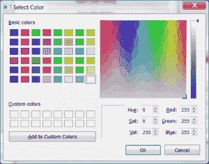](https://www.blog.pythonlibrary.org/wp-content/uploads/2013/04/pysideColorDlg.png)

PySide 颜色对话框是一个非常标准的颜色对话框，你可以在大多数简单的绘图程序中看到，比如 Windows Paint。为了创建它，我们执行以下操作:

```py

#----------------------------------------------------------------------
def openColorDialog(self):
    """
    Opens the color dialog
    """
    color = QtGui.QColorDialog.getColor()

    if color.isValid():
        print color.name()
        btn = self.sender()
        pal = btn.palette()
        pal.setColor(QtGui.QPalette.Button, color)
        btn.setPalette(pal)
        btn.setAutoFillBackground(True)

        #btn.setStyleSheet("QPushButton {background-color: %s}" % color)

```

这里我们称之为 **QtGui。QColorDialog.getColor()** 返回用户选择的颜色，并实例化对话框。如果选择的颜色有效，我们将它应用到我们的 QPushButton。你会注意到在这个方法的末尾有一行注释掉了。有人告诉我你可以使用一种 PySide CSS 来改变按钮的背景颜色，但是我不知道正确的方法。PySide IRC 频道上的一些人说评论行应该管用。别人说应该只是**背景**而不是**背景色**，但那对我也没用。即使使用这里显示的调色板方法，背景色仍然没有改变。相反，您只会注意到按钮轮廓颜色的细微变化。

#### PySide 文件对话框

[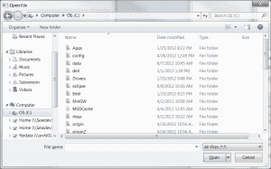](https://www.blog.pythonlibrary.org/wp-content/uploads/2013/04/pysideFileDlg.png)

PySide 文件对话框应该为大多数人所熟悉，因为它与本机文件对话框非常相似(至少在 Windows 上)。下面是实例化它的代码:

```py

#----------------------------------------------------------------------
def openFileDialog(self):
    """
    Opens a file dialog and sets the label to the chosen path
    """
    import os
    path, _ = QtGui.QFileDialog.getOpenFileName(self, "Open File", os.getcwd())
    self.label.setText(path)

```

我们使用 **getOpenFileName** 返回一个元组中的文件路径，该元组还包括文件类型，在本例中是**所有文件(*。*)** 。我们还将 QLabel 设置为返回的路径。在我们的主代码中还有一个名为 **openDirectoryDialog** 的方法，它使用相同的调用签名，但是我们使用 **getExistingDirectory** 而不是 getOpenFileName。请参见下面的示例:

```py

#----------------------------------------------------------------------
def openDirectoryDialog(self):
    """
    Opens a dialog to allow user to choose a directory
    """
    flags = QtGui.QFileDialog.DontResolveSymlinks | QtGui.QFileDialog.ShowDirsOnly
    d = directory = QtGui.QFileDialog.getExistingDirectory(self,
                                                           "Open Directory",
                                                           os.getcwd(),
                                                           flags)
    self.label.setText(d)

```

正如你所看到的，我们必须向这个对话框传递几个标志，告诉它不要解析符号链接，只显示目录。最后，QFileDialog 还有一个 **getOpenFileNames** 方法，允许用户从对话框中选择多个文件并返回所有选择的文件。这个没有显示，但操作类似。

#### PySide 字体对话框

[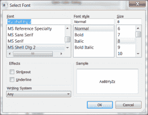](https://www.blog.pythonlibrary.org/wp-content/uploads/2013/04/pysideFontDlg.png)

PySide 字体对话框与您在 Microsoft Office 产品的旧版本中看到的非常相似。创建对话框非常简单:

```py

#----------------------------------------------------------------------
def openFontDialog(self):
    """
    Open the QFontDialog and set the label's font
    """
    font, ok = QtGui.QFontDialog.getFont()
    if ok:
        self.label.setFont(font)

```

如您所见，您只需创建对话框并调用它的 **getFont()** 方法。这将返回所选择的字体以及是否按下了 OK 按钮。如果是，我们用新字体重置 QLabel 小部件。

#### PySide 输入对话框

[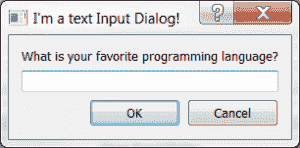](https://www.blog.pythonlibrary.org/wp-content/uploads/2013/04/pysideInputDlg.png)

PySide 输入对话框也非常简单。但是，有四个变种:文本、整数、双精度和项目。显而易见，这些函数返回文本、整数、双精度数(即浮点数)和项目，允许用户从 combobox 的项目列表中进行选择。这里我们展示了如何创建文本版本:

```py

#----------------------------------------------------------------------
def openInputDialog(self):
    """
    Opens the text version of the input dialog
    """
    text, result = QtGui.QInputDialog.getText(self, "I'm a text Input Dialog!",
                                        "What is your favorite programming language?")
    if result:
        print "You love %s!" % text

```

如果你想看看其他类型的输入对话框的例子，我推荐你看看 git 上的 [pyside-examples 文件夹，特别是 **standarddialogs.py** 脚本。你也可以在这里](http://qt.gitorious.org/pyside/pyside-examples/blobs/f6a7054d4e730787ca86a473023aedc4af4ae649/examples/dialogs/standarddialogs.py)看到这四个小工具[的截图。](http://ftp.ics.uci.edu/pub/centos0/ics-custom-build/BUILD/PyQt-x11-gpl-4.7.2/doc/html/qinputdialog.html)

至此，我们已经准备好学习两种类型的打印对话框。

### PySide 的打印对话框

[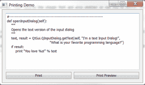](https://www.blog.pythonlibrary.org/wp-content/uploads/2013/04/pysidePrintDlgDemo.png)

对于这个演示，我们创建了一个简单的小窗口，带有一个 QTextEdit 来保存一些示例文本和两个按钮。我们将把上一节中的代码示例复制并粘贴到这个演示应用程序中，然后点击打印按钮。下面是演示代码:

```py

# printDlgDemo.py

from PySide import QtGui, QtCore

########################################################################
class PrinterWindow(QtGui.QWidget):
    """"""

    #----------------------------------------------------------------------
    def __init__(self):
        """Constructor"""
        QtGui.QWidget.__init__(self)
        self.setWindowTitle("Printing Demo")
        self.text_editor = QtGui.QTextEdit(self)

        printButton = QtGui.QPushButton('Print')
        printButton.clicked.connect(self.onPrint)
        printPreviewButton = QtGui.QPushButton('Print Preview')
        printPreviewButton.clicked.connect(self.onPrintPreview)

        btnLayout = QtGui.QHBoxLayout()
        mainLayout = QtGui.QVBoxLayout()

        btnLayout.addWidget(printButton)
        btnLayout.addWidget(printPreviewButton)
        mainLayout.addWidget(self.text_editor)
        mainLayout.addLayout(btnLayout)

        self.setLayout(mainLayout)

    #----------------------------------------------------------------------
    def onPrint(self):
        """
        Create and show the print dialog
        """
        dialog = QtGui.QPrintDialog()
        if dialog.exec_() == QtGui.QDialog.Accepted:
            doc = self.text_editor.document()
            doc.print_(dialog.printer())

    #----------------------------------------------------------------------
    def onPrintPreview(self):
        """
        Create and show a print preview window
        """
        dialog = QtGui.QPrintPreviewDialog()
        dialog.paintRequested.connect(self.text_editor.print_)
        dialog.exec_()

#----------------------------------------------------------------------
if __name__ == "__main__":
    app = QtGui.QApplication([])
    form = PrinterWindow()
    form.show()
    app.exec_()

```

如果你点击打印按钮，你应该会看到一个类似下面的对话框(如果你在 Windows 7 上):

[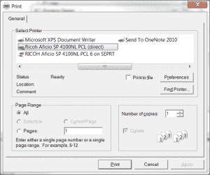](https://www.blog.pythonlibrary.org/wp-content/uploads/2013/04/pysidePrintDlg.png)

让我们来看看这个对话框背后的代码:

```py

#----------------------------------------------------------------------
def onPrint(self):
    """
    Create and show the print dialog
    """
    dialog = QtGui.QPrintDialog()
    if dialog.exec_() == QtGui.QDialog.Accepted:
        doc = self.text_editor.document()
        doc.print_(dialog.printer())

```

这里我们实例化了 **QPrintDialog** ，并通过调用它的 **exec_()** 方法来展示它。如果用户真的点击了打印按钮，我们将从 QTextEdit 控件中提取一个 **QTextDocument** ，然后通过将它传递给打印机对话框来调用它的 **print_()** 方法。

现在让我们做打印预览对话框！这是前面提到的演示中的代码:

```py

#----------------------------------------------------------------------
def onPrintPreview(self):
    """
    Create and show a print preview window
    """
    dialog = QtGui.QPrintPreviewDialog()
    dialog.paintRequested.connect(self.text_editor.print_)
    dialog.exec_()

```

这段代码比创建 QPrintDialog 简单一点。这里我们只是实例化了一个 **QPrintPreviewDialog** 的实例，告诉它我们想要将 **paintRequested** 信号连接到文本控件的 **print_** 方法。最后，我们显示对话框。PySide 完成了剩下的工作，并最终创建了一个如下所示的对话框:

[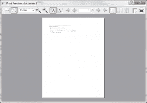](https://www.blog.pythonlibrary.org/wp-content/uploads/2013/04/pysidePrintPreviewDlg.png)

您现在知道如何创建这两种类型的 PySide 打印对话框了！至此，我们已经准备好进入消息框了！

### PySide 的消息框

[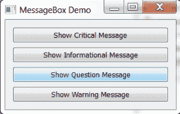](https://www.blog.pythonlibrary.org/wp-content/uploads/2013/04/messageboxdemo.png)

PySide 有四个基于 QMessageBox 小部件的消息框:关键、信息、问题和警告。我们将看一看所有四个。我们将从一个完整的代码示例开始，这是一个可以启动 4 个消息框中任何一个的演示，然后我们将像在上一节中一样查看每个部分。下面是主程序的源代码:

```py

from PySide import QtCore, QtGui

########################################################################
class MessageBoxDemo(QtGui.QWidget):
    """"""

    #----------------------------------------------------------------------
    def __init__(self):
        """Constructor"""
        # super(DialogDemo, self).__init__()
        QtGui.QWidget.__init__(self)
        self.setWindowTitle("MessageBox Demo")

        # create buttons
        criticalMsgBtn = QtGui.QPushButton("Show Critical Message")
        criticalMsgBtn.clicked.connect(self.onShowCriticalMessage)

        infoMsgBtn = QtGui.QPushButton("Show Informational Message")
        infoMsgBtn.clicked.connect(self.onShowInformation)

        questionMsgBtn = QtGui.QPushButton("Show Question Message")
        questionMsgBtn.clicked.connect(self.onShowQuestion)

        warningMsgBtn = QtGui.QPushButton("Show Warning Message")
        warningMsgBtn.clicked.connect(self.onShowWarning)

        # layout widgets
        layout = QtGui.QVBoxLayout()
        layout.addWidget(criticalMsgBtn)
        layout.addWidget(infoMsgBtn)
        layout.addWidget(questionMsgBtn)
        layout.addWidget(warningMsgBtn)
        self.setLayout(layout)

        self.setGeometry(100,100,300,100)

    #----------------------------------------------------------------------
    def onShowCriticalMessage(self):
        """
        Show the critical message
        """
        flags = QtGui.QMessageBox.Abort
        flags |= QtGui.QMessageBox.StandardButton.Retry
        flags |= QtGui.QMessageBox.StandardButton.Ignore

        result = QtGui.QMessageBox.critical(self, "CRITICAL ERROR",
                                            "You're trying Perl aren't you?",
                                            flags)
        if result == QtGui.QMessageBox.Abort:
            print "Aborted!"
        elif result == QtGui.QMessageBox.Retry:
            print "Retrying!"
        elif result == QtGui.QMessageBox.Ignore:
            print "Ignoring!"

    #----------------------------------------------------------------------
    def onShowInformation(self):
        """
        Show the information message
        """
        QtGui.QMessageBox.information(self, "Information", "Python rocks!")

    #----------------------------------------------------------------------
    def onShowQuestion(self):
        """
        Show the question message
        """
        flags = QtGui.QMessageBox.StandardButton.Yes 
        flags |= QtGui.QMessageBox.StandardButton.No
        question = "Do you really want to work right now?"
        response = QtGui.QMessageBox.question(self, "Question",
                                              question,
                                              flags)
        if response == QtGui.QMessageBox.Yes:
            print "You're very dedicated!"
        elif QtGui.QMessageBox.No:
            print "You're fired!"
        else:
            print "You chose wisely!"

    #----------------------------------------------------------------------
    def onShowWarning(self):
        """
        Show a warning message
        """
        flags = QtGui.QMessageBox.StandardButton.Ok
        flags |= QtGui.QMessageBox.StandardButton.Discard
        msg = "This message will self-destruct in 30 seconds!"
        response = QtGui.QMessageBox.warning(self, "Warning!",
                                             msg, flags)
        if response == 0:
            print "BOOM!"
        else:
            print "MessageBox disarmed!"

#----------------------------------------------------------------------
if __name__ == "__main__":
    app = QtGui.QApplication([])
    form = MessageBoxDemo()
    form.show()
    app.exec_()

```

现在让我们依次看看每个消息框。我们要看的第一个是关键消息框。

#### 关键消息框

[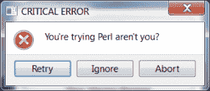](https://www.blog.pythonlibrary.org/wp-content/uploads/2013/04/criticalBox.png)

使用以下方法从我们的演示程序中启动关键消息框:

```py

#----------------------------------------------------------------------
def onShowCriticalMessage(self):
    """
    Show the critical message
    """
    flags = QtGui.QMessageBox.Abort
    flags |= QtGui.QMessageBox.StandardButton.Retry
    flags |= QtGui.QMessageBox.StandardButton.Ignore

    result = QtGui.QMessageBox.critical(self, "CRITICAL ERROR",
                                        "You're trying Perl aren't you?",
                                        flags)
    if result == QtGui.QMessageBox.Abort:
        print "Aborted!"
    elif result == QtGui.QMessageBox.Retry:
        print "Retrying!"
    elif result == QtGui.QMessageBox.Ignore:
        print "Ignoring!"

```

所有消息框都遵循相同的基本公式。它们有一个标题(“严重错误”)，一条消息(“您正在尝试 Perl，是吗？”)和一些控制显示什么按钮的标志。在本例中，我们显示了一个中止、一个重试和一个忽略按钮。我们向 stdout 输出一条特殊的消息，这取决于按下了哪个按钮。

#### 信息消息框

[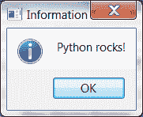](https://www.blog.pythonlibrary.org/wp-content/uploads/2013/04/infoBox.png)

信息消息框可能是所有消息框中最简单的一个:

```py

#----------------------------------------------------------------------
def onShowInformation(self):
    """
    Show the information message
    """
    QtGui.QMessageBox.information(self, "Information", "Python rocks!")

```

如您所见，我们甚至不需要为此指定任何按钮。它自己添加了一个 OK 按钮。

#### 问题消息框

[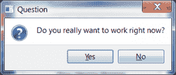](https://www.blog.pythonlibrary.org/wp-content/uploads/2013/04/questionBox.png)

问题消息框也非常简单。代码如下:

```py

#----------------------------------------------------------------------
def onShowQuestion(self):
    """
    Show the question message
    """
    flags = QtGui.QMessageBox.StandardButton.Yes 
    flags |= QtGui.QMessageBox.StandardButton.No
    question = "Do you really want to work right now?"
    response = QtGui.QMessageBox.question(self, "Question",
                                          question,
                                          flags)
    if response == QtGui.QMessageBox.Yes:
        print "You're very dedicated!"
    elif QtGui.QMessageBox.No:
        print "You're fired!"
    else:
        print "You chose wisely!"

```

对于这个消息框，我们需要两个按钮:是和否。我们还检查用户按了哪个按钮，并根据他们的选择打印出特殊的消息。您会注意到，没有办法执行最后一条 print 语句。

#### 警告消息框

[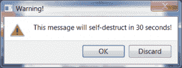](https://www.blog.pythonlibrary.org/wp-content/uploads/2013/04/warningBox.png)

警告消息框也非常简单，与问题框非常相似。

```py

#----------------------------------------------------------------------
def onShowWarning(self):
    """
    Show a warning message
    """
    flags = QtGui.QMessageBox.StandardButton.Ok
    flags |= QtGui.QMessageBox.StandardButton.Discard
    msg = "This message will self-destruct in 30 seconds!"
    response = QtGui.QMessageBox.warning(self, "Warning!",
                                         msg, flags)
    if response == 0:
        print "BOOM!"
    else:
        print "MessageBox disarmed!"

```

这里我们有两个按钮:一个确定按钮和一个放弃按钮。我们再次检查哪个按钮被按下，并相应地采取行动。

### 包扎

现在您知道了如何创建 PySide 提供的各种标准对话框和消息框。当你需要提醒用户你的程序有问题或者需要获取一些小信息的时候，这些是非常方便的。现在向前迈进，开始明智地使用你新发现的知识吧！

### 参考

*   Zetcode 的 PySide [对话框教程](http://zetcode.com/gui/pysidetutorial/dialogs/)
*   git 上的 PySide [repo 显示了标准对话框和消息框示例](http://qt.gitorious.org/pyside/pyside-examples/blobs/f6a7054d4e730787ca86a473023aedc4af4ae649/examples/dialogs/standarddialogs.py)
*   StackOverflow - [使用 PyQt4](http://stackoverflow.com/questions/8193920/print-a-text-through-a-printer-using-pyqt4) 通过打印机打印文本

### 下载源代码

*   [pyside_dialogs.zip](https://www.blog.pythonlibrary.org/wp-content/uploads/2013/04/pyside_dialogs.zip)