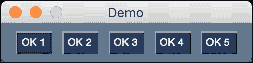
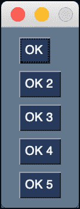
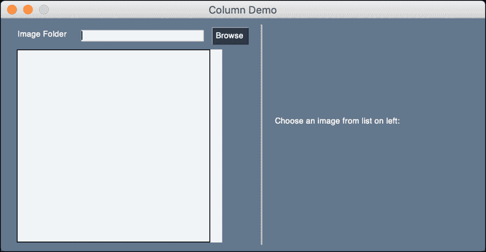

# PySimpleGUI——元素布局介绍

> 原文：<https://www.blog.pythonlibrary.org/2022/01/25/pysimplegui-an-intro-to-laying-out-elements/>

PySimpleGUI 是一个 Python GUI，它包装了其他 Python GUI 工具包(Tkinter、PySide、wxPython)。通过将其他 GUI 的复杂性抽象成一个公共 API，您可以快速编写代码，只需更改程序顶部的导入，就可以使用任何其他工具包来呈现这些代码。

如果您使用 wxPython，并且想要布局您的小部件，您将使用 wx.Sizer。Tkinter 使用几何图形管理器。一般概念是一样的。当您使用这些工具时，GUI 工具包使用小部件的相对位置在屏幕上排列它们。

在 PySimpleGUI 中，使用嵌套列表做同样的事情。在本教程中，您将看到几个不同的示例，这些示例将让您大致了解这一切是如何工作的。

## 创建水平布局

用 PySimpleGUI 中的一个小列表创建一系列水平方向(从左到右)的元素。



打开 Python 编辑器，添加以下代码:

```py
import PySimpleGUI as sg

# Horizontal layout
layout = [[sg.Button(f"OK {num}") for num in range(1, 6)]]

# Create the window
window = sg.Window("Demo", layout)

# Create an event loop
while True:
    event, values = window.read()
    # End program if user closes window or
    # presses the OK button
    if event == "OK" or event == sg.WIN_CLOSED:
        break

window.close()
```

这里您使用 Python list comprehension 创建一个嵌套列表，其中包含五个**按钮**对象。当您运行这段代码时，您将看到按钮水平对齐，从左到右一个挨着一个。

现在，您可以看到如何重写代码来创建垂直布局了！

## 创建垂直布局

要用 PySimpleGUI 创建垂直方向的布局，需要让布局包含一系列嵌套列表，每个列表包含一个或多个元素。



Create a new Python file and add this code to it:

```py
import PySimpleGUI as sg

layout = [[sg.Button("OK")],
          [sg.Button("OK 2")],
          [sg.Button("OK 3")],
          [sg.Button("OK 4")],
          [sg.Button("OK 5")]]

# Create the window
window = sg.Window("Demo", layout)

# Create an event loop
while True:
    event, values = window.read()
    # End program if user closes window or
    # presses the OK button
    if event == "OK" or event == sg.WIN_CLOSED:
        break

window.close()
```

When you run this code, the Button Elements will be stacked from top to bottom vertically, instead of horizontally.

## Using Columns for Complex Layouts

If you need to add two or more columns of Elements next to each other in PySimpleGUI, you can use a **sg.Column** Element. It is a type of container Element specifically made for creating stacked sets of Elements!



Create another Python file and add the following code:

```py
import PySimpleGUI as sg
import os.path

# First the window layout in 2 columns
file_list_column = [
    [sg.Text("Image Folder"),
     sg.In(size=(25, 1), enable_events=True, key="-FOLDER-"),
     sg.FolderBrowse(),],
    [sg.Listbox(values=[], enable_events=True, size=(40, 20), key="-FILE LIST-")],
]

# For now will only show the name of the file that was chosen
image_viewer_column = [
    [sg.Text("Choose an image from list on left:")],
    [sg.Text(size=(40, 1), key="-TEXT-")],
    [sg.Image(key="-IMAGE-")],
]

# ----- Full layout -----
layout = [
    [sg.Column(file_list_column),
     sg.VSeperator(),
     sg.Column(image_viewer_column),]
]

window = sg.Window("Column Demo", layout)

# Run the Event Loop
while True:
    event, values = window.read()

    if event == "Exit" or event == sg.WIN_CLOSED:
        break

    # Folder name was filled in, make a list of files in the folder
    if event == "-FOLDER-":
        folder = values["-FOLDER-"]
        try:
            # Get list of files in folder
            file_list = os.listdir(folder)
        except:
            file_list = []

        fnames = [
            f
            for f in file_list
            if os.path.isfile(os.path.join(folder, f))
            and f.lower().endswith((".png", ".gif"))
        ]

        window["-FILE LIST-"].update(fnames)

    elif event == "-FILE LIST-":  # A file was chosen from the listbox

        try:
            filename = os.path.join(values["-FOLDER-"], values["-FILE LIST-"][0])
            window["-TEXT-"].update(filename)
            window["-IMAGE-"].update(filename=filename)
        except:
            pass

window.close()

```

In this example, you create two layouts! The first layout is called **file_list_column** and contains four Elements in it. The second layout is called **image_viewer_column** and contains three Elements. Then you put these layouts inside of Columns that are themselves inside a layout. As you can see, PySimpleGUI layouts are lists inside of lists all the way down!

## Wrapping Up

PySimpleGUI removes some of the complexity of creating layouts by using Python lists. The PyQt / PySide and wxPython GUI toolkits use an object-oriented approach which includes a significant amount of boilerplate and flags to do much the same thing. They each have their tradeoffs, but PySimpleGUI's learning curve is that much flatter because of their design choice.

## Related Reading

*   [PySimpleGUI: Using an Image as a Button](https://www.blog.pythonlibrary.org/2021/09/05/pysimplegui-using-an-image-as-a-button/)

*   [PySimpleGUI - How to Draw Shapes on an Image with a GUI](https://www.blog.pythonlibrary.org/2021/02/24/pysimplegui-how-to-draw-shapes-on-an-image-with-a-gui/)

*   [A Brief Intro to PySimpleGUI](https://www.blog.pythonlibrary.org/2019/10/23/a-brief-intro-to-pysimplegui/)

*   [The Demos for PySimpleGUI](https://www.blog.pythonlibrary.org/2019/10/31/the-demos-for-pysimplegui/)