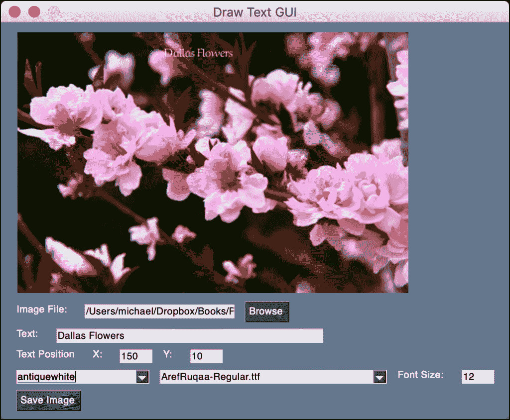

# PySimpleGUI:用 Python GUI 在图像上绘制文本

> 原文：<https://www.blog.pythonlibrary.org/2021/02/03/pysimplegui-drawing-text-on-images-with-a-python-gui/>

[Pillow 包](https://pillow.readthedocs.io/en/stable/)让你使用 Python 在图像上绘制文本。这包括使用 TrueType 和 OpenType 字体。当你在图片中添加这些文字时，你有很大的灵活性。如果你想知道更多，你应该看看[用 Pillow 和 Python](https://www.blog.pythonlibrary.org/2021/02/02/drawing-text-on-images-with-pillow-and-python/) 在图像上绘制文本。

**注:本教程使用的代码和字体可以在** [**Github repo for my book，Pillow:Image Processing with Python(第九章)**](https://github.com/driscollis/image_processing_with_python/tree/main/09_drawing_text) 中找到

当然，如果你能实时看到你的结果，那就更好了。您可以通过编写图形用户界面(GUI)来实现这一点，该界面允许您应用不同的字体并调整它们的设置。您创建的 GUI 将允许您的用户修改其文本的以下属性:

*   字体类型
*   Font color
*   字体大小
*   文本位置

当您的 GUI 完成时，它将看起来像这样:



让我们开始写一些代码吧！

#### 创建 GUI

对于本教程，您将使用 [PySimpleGUI](https://github.com/PySimpleGUI/PySimpleGUI) 。你可以用 **pip** 来安装。一旦完成 PySimpleGUI 的安装，就可以开始了！

现在是您编写 GUI 代码的时候了。打开 Python 编辑器，创建一个新文件。然后将其命名为`text_gui.py`，并输入以下代码:

```py
# text_gui.py

import glob
import os
import PySimpleGUI as sg
import shutil
import tempfile

from PIL import Image
from PIL import ImageColor
from PIL import ImageDraw
from PIL import ImageFont
from PIL import ImageTk

file_types = [("JPEG (*.jpg)", "*.jpg"), ("All files (*.*)", "*.*")]
tmp_file = tempfile.NamedTemporaryFile(suffix=".jpg").name

def get_value(key, values):
    value = values[key]
    if value:
        return int(value)
    return 0

def apply_text(values, window):
    image_file = values["filename"]
    font_name = values["ttf"]
    font_size = get_value("font_size", values)
    color = values["colors"]
    x, y = get_value("text-x", values), get_value("text-y", values)
    text = values["text"]

    if image_file and os.path.exists(image_file):
        shutil.copy(image_file, tmp_file)
        image = Image.open(tmp_file)
        image.thumbnail((400, 400))

        if text:
            draw = ImageDraw.Draw(image)
            if font_name == "Default Font":
                font = None
            else:
                font = ImageFont.truetype(font_name, size=font_size)
            draw.text((x, y), text=text, font=font, fill=color)
            image.save(tmp_file)

        photo_img = ImageTk.PhotoImage(image)
        window["image"].update(data=photo_img)

def create_row(label, key, file_types):
    return [
        sg.Text(label),
        sg.Input(size=(25, 1), enable_events=True, key=key),
        sg.FileBrowse(file_types=file_types),
    ]

def get_ttf_files(directory=None):
    if directory is not None:
        ttf_files = glob.glob(directory + "/*.ttf")
    else:
        ttf_files = glob.glob("*.ttf")
    if not ttf_files:
        return {"Default Font": None}
    ttf_dict = {}
    for ttf in ttf_files:
        ttf_dict[os.path.basename(ttf)] = ttf
    return ttf_dict

def save_image(values):
    save_filename = sg.popup_get_file(
        "File", file_types=file_types, save_as=True, no_window=True
    )
    if save_filename == values["filename"]:
        sg.popup_error(
            "You are not allowed to overwrite the original image!")
    else:
        if save_filename:
            shutil.copy(tmp_file, save_filename)
            sg.popup(f"Saved: {save_filename}")

def update_ttf_values(window):
    directory = sg.popup_get_folder("Get TTF Directory")
    if directory is not None:
        ttf_files = get_ttf_files(directory)
        new_values = list(ttf_files.keys())
        window["ttf"].update(values=new_values,
                             value=new_values[0])

def main():
    colors = list(ImageColor.colormap.keys())
    ttf_files = get_ttf_files()
    ttf_filenames = list(ttf_files.keys())

    menu_items = [["File", ["Open Font Directory"]]]

    elements = [
        [sg.Menu(menu_items)],
        [sg.Image(key="image")],
        create_row("Image File:", "filename", file_types),
        [sg.Text("Text:"), sg.Input(key="text", enable_events=True)],
        [
            sg.Text("Text Position"),
            sg.Text("X:"),
            sg.Input("10", size=(5, 1), enable_events=True,
                     key="text-x"),
            sg.Text("Y:"),
            sg.Input("10", size=(5, 1), enable_events=True,
                     key="text-y"),
        ],
        [
            sg.Combo(colors, default_value=colors[0], key='colors',
                     enable_events=True),
            sg.Combo(ttf_filenames, default_value=ttf_filenames[0], key='ttf',
                     enable_events=True),
            sg.Text("Font Size:"),
            sg.Input("12", size=(5, 1), key="font_size", enable_events=True),

        ],
        [sg.Button("Save Image", enable_events=True,
                   key="save")],
    ]

    window = sg.Window("Draw Text GUI", elements)

    while True:
        event, values = window.read()
        if event == "Exit" or event == sg.WIN_CLOSED:
            break
        if event in ["filename", "colors", "ttf", "font_size",
                     "text-x", "text-y", "text"]:
            apply_text(values, window)
        if event == "save" and values["filename"]:
            save_image(values)
        if event == "Open Font Directory":
            update_ttf_values(window)

    window.close()

if __name__ == "__main__":
    main()
```

这个 GUI 中有超过 100 行代码！为了更容易理解发生了什么，您将把代码分成更小的块。

下面是前几行代码:

```py
# text_gui.py

import glob
import os
import PySimpleGUI as sg
import shutil
import tempfile

from PIL import Image
from PIL import ImageColor
from PIL import ImageDraw
from PIL import ImageFont
from PIL import ImageTk

file_types = [("JPEG (*.jpg)", "*.jpg"), ("All files (*.*)", "*.*")]
tmp_file = tempfile.NamedTemporaryFile(suffix=".jpg").name
```

这是代码的导入部分。您需要导入所有必要的模块和包来使您的代码工作。最后你还设置了几个变量。`file_types`定义了用户界面可以加载的文件类型。`tmp_file`是一个临时文件，您可以创建它来保存您的图像更改，直到用户准备好将文件保存到他们想要的位置。

代码中的第一个函数叫做`get_value()`。下面是它的代码:

```py
def get_value(key, values):
    value = values[key]
    if value:
        return int(value)
    return 0
```

这个函数的工作是将字符串转换成整数，如果用户清空了一个需要值的控件，则返回零。

现在，您可以继续了解`apply_text()`:

```py
def apply_text(values, window):
    image_file = values["filename"]
    font_name = values["ttf"]
    font_size = get_value("font_size", values)
    color = values["colors"]
    x, y = get_value("text-x", values), get_value("text-y", values)
    text = values["text"]

    if image_file and os.path.exists(image_file):
        shutil.copy(image_file, tmp_file)
        image = Image.open(tmp_file)
        image.thumbnail((400, 400))

        if text:
            draw = ImageDraw.Draw(image)
            font = ImageFont.truetype(font_name, size=font_size)
            draw.text((x, y), text=text, font=font, fill=color)
            image.save(tmp_file)

        photo_img = ImageTk.PhotoImage(image)
        window["image"].update(data=photo_img)
```

这就是奇迹发生的地方。每当用户打开新图像、更改字体、更改字体大小、更改字体颜色、更改文本本身或修改文本位置时，此代码都会运行。如果用户没有输入任何文本，但他们选择了一个图像，只有图像会改变。如果用户输入了文本，那么其他的改变也会被更新。

**注意:保存图像时，它会保存为缩略图版本。因此，您将保存一个较小版本的图像，但上面有文字。**

您将看到的下一个函数叫做`create_row()`:

```py
def create_row(label, key, file_types):
    return [
        sg.Text(label),
        sg.Input(size=(25, 1), enable_events=True, key=key),
        sg.FileBrowse(file_types=file_types),
    ]
```

你以前见过这个函数。它用于创建三个元素:

*   一个标签(`sg.Text`)
*   一个文本框 _ `sg.Input`)
*   一个文件浏览按钮(`sg.FileBrowse`)

这些元素在 Python 列表中返回。这将在用户界面中创建一个水平的元素行。

下一个要学习的功能是`get_ttf_files()`:

```py
def get_ttf_files(directory=None):
    if directory is not None:
        ttf_files = glob.glob(directory + "/*.ttf")
    else:
        ttf_files = glob.glob("*.ttf")
    if not ttf_files:
        return {"Default Font": None}
    ttf_dict = {}
    for ttf in ttf_files:
        ttf_dict[os.path.basename(ttf)] = ttf
    return ttf_dict
```

这段代码使用 Python 的`glob`模块来查找 GUI 文件所在目录中的所有 TrueType 字体文件，或者通过搜索传入的`directory`来查找。如果 GUI 没有找到任何 TTF 文件，它将加载 Pillow 的默认字体。

不管发生什么，你的代码将返回一个 Python 字典，它将字体的名称映射到字体文件的绝对路径。如果您的代码没有找到任何 TTF 文件，它会将“默认字体”映射到`None`以向您的代码表明没有找到字体，因此您将使用 Pillow 的默认字体。

下一个函数定义了如何保存编辑过的图像:

```py
def save_image(values):
    save_filename = sg.popup_get_file(
        "File", file_types=file_types, save_as=True, no_window=True
    )
    if save_filename == values["filename"]:
        sg.popup_error(
            "You are not allowed to overwrite the original image!")
    else:
        if save_filename:
            shutil.copy(tmp_file, save_filename)
            sg.popup(f"Saved: {save_filename}")
```

这段代码使用弹出对话框询问用户新图像的名称。然后，它检查以确保用户不会覆盖他们的原始图像。事实上，如果他们试图这样做，您可以通过向他们显示错误消息来防止这种情况发生。

否则，通过将临时文件复制到用户选择的新位置来保存文件。

现在您已经准备好学习`update_ttf_values()`功能了:

```py
def update_ttf_values(window):
    directory = sg.popup_get_folder("Get TTF Directory")
    if directory is not None:
        ttf_files = get_ttf_files(directory)
        new_values = list(ttf_files.keys())
        window["ttf"].update(values=new_values,
                             value=new_values[0])
```

该功能从用户界面的**文件**菜单中调用。当它被调用时，它会显示一个对话框，询问用户他们的 TTF 文件在哪里。如果用户按**取消**，则不返回目录。但是如果用户选择了一个目录并接受了对话框，那么你调用`gett_ttf_files()`，它将搜索文件夹中的所有 TTF 文件。

然后它会更新你的 TTF 组合框的内容，这样你就可以选择一种 TTF 字体来应用到你的文本中。

您需要回顾的最后一个函数是`main()`函数:

```py
def main():
    colors = list(ImageColor.colormap.keys())
    ttf_files = get_ttf_files()
    ttf_filenames = list(ttf_files.keys())

    menu_items = [["File", ["Open Font Directory"]]]

    elements = [
        [sg.Menu(menu_items)],
        [sg.Image(key="image")],
        create_row("Image File:", "filename", file_types),
        [sg.Text("Text:"), sg.Input(key="text", enable_events=True)],
        [
            sg.Text("Text Position"),
            sg.Text("X:"),
            sg.Input("10", size=(5, 1), enable_events=True,
                     key="text-x"),
            sg.Text("Y:"),
            sg.Input("10", size=(5, 1), enable_events=True,
                     key="text-y"),
        ],
        [
            sg.Combo(colors, default_value=colors[0], key='colors',
                     enable_events=True),
            sg.Combo(ttf_filenames, default_value=ttf_filenames[0], key='ttf',
                     enable_events=True),
            sg.Text("Font Size:"),
            sg.Input("12", size=(5, 1), key="font_size", enable_events=True),

        ],
        [sg.Button("Save Image", enable_events=True,
                   key="save")],
    ]

    window = sg.Window("Draw Text GUI", elements)
```

这个函数的前三行创建了一个 Python 列表`colors`和一个列表`ttf_filenames`。接下来，创建一个嵌套列表，表示用户界面的菜单。然后创建一个`elements`列表，用于布局所有用于创建用户界面的元素。一旦你有了它，你就可以把它传递给你的`sg.Window`，它将布局你的元素并显示给用户。

最后一段代码是用户界面的事件处理程序:

```py
    while True:
        event, values = window.read()
        if event == "Exit" or event == sg.WIN_CLOSED:
            break
        if event in ["filename", "colors", "ttf", "font_size",
                     "text-x", "text-y", "text"]:
            apply_text(values, window)
        if event == "save" and values["filename"]:
            save_image(values)
        if event == "Open Font Directory":
            update_ttf_values(window)

    window.close()

if __name__ == "__main__":
    main()
```

在这里你检查用户是否关闭了窗口。如果是，那么你退出循环并结束程序。

下一个条件语句检查除“保存”和菜单事件之外的所有其他事件。如果任何其他启用了事件的元素被触发，那么您将运行`apply_text()`。这将根据您更改的设置更新图像。

下一个条件在您完成编辑后保存图像。它将调用`save_image()`,询问用户他们想在哪里保存图像。

最后一个条件是针对你的**文件的**菜单事件。如果用户选择“打开字体目录”选项，它将调用`update_ttf_values()`，让你选择一个新的 TTF 文件夹进行搜索。

#### 包扎

您已经创建了一个不错的 GUI，可以用来学习如何在自己的图像上绘制文本。这段代码教你如何有效地使用 Pillow 来绘制文本。它还教您如何使用 PySimpleGUI 创建一个功能性的图形用户界面。这个 GUI 可以在 Windows、Mac 和 Linux 上运行。尝试一下，添加一些很酷的新功能，让它成为你自己的。