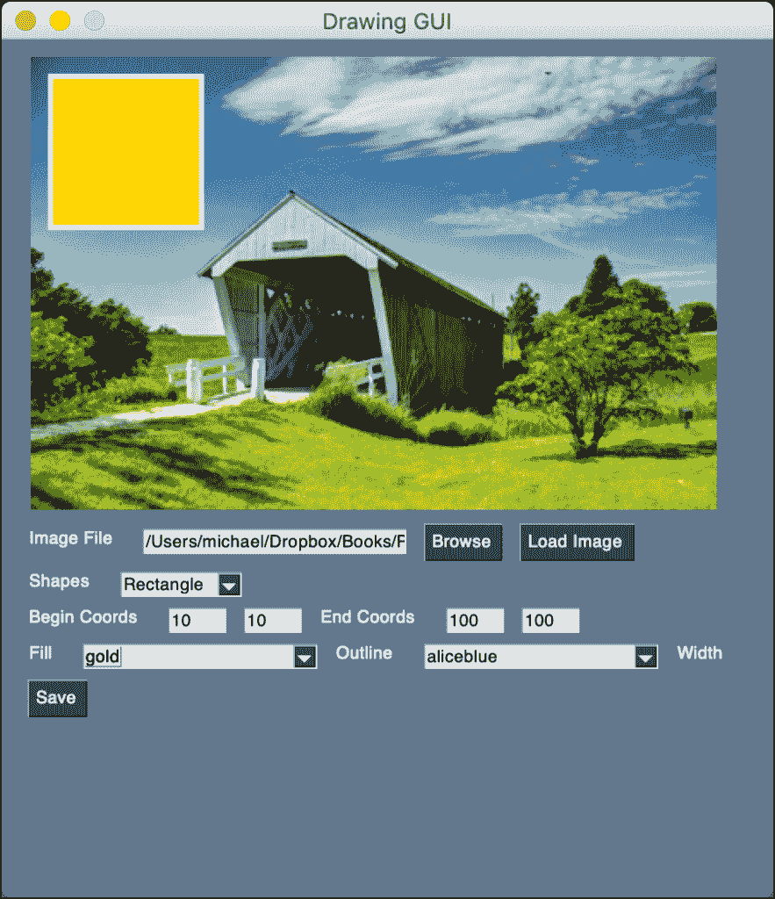
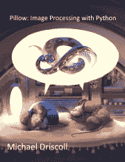

# 如何用图形用户界面在图像上绘制形状

> 原文：<https://www.blog.pythonlibrary.org/2021/02/24/pysimplegui-how-to-draw-shapes-on-an-image-with-a-gui/>

在图像上画出形状是很整洁的。但是如果你能交互地画出形状，那不是很好吗？这就是本教程的要点。您将使用 [PySimpleGUI](https://github.com/PySimpleGUI/PySimpleGUI) 创建一个用户界面，允许您在图像上绘制形状！

这个用户界面的目的是向您展示如何创建一个 GUI 来包装 Pillow 支持的一些形状。尽管 GUI 并不支持所有这些。事实上，该 GUI 仅支持以下内容:

*   椭圆
*   矩形

原因是这两种形状采用相同的参数。您可以自己接受挑战，将其他形状添加到 GUI 中！

当您的 GUI 完成时，它将看起来像这样:



PySimpleGUI Image Shape GUI

## 入门指南

您将需要 PySimpleGUI 和 Pillow 来跟随本教程。下面是如何用 pip 安装它们:

```py
python3 -m pip install PySimpleGUI pillow
```

现在您已经准备好创建您的 GUI 了！

## 创建 GUI

现在打开 Python 编辑器，创建一个名为`drawing_gui.py`的新文件。然后将这段代码添加到新文件中:

```py
# drawing_gui.py

import io
import os
import PySimpleGUI as sg
import shutil
import tempfile

from PIL import Image, ImageColor, ImageDraw

file_types = [("JPEG (*.jpg)", "*.jpg"), ("All files (*.*)", "*.*")]
tmp_file = tempfile.NamedTemporaryFile(suffix=".jpg").name

def get_value(key, values):
    value = values[key]
    if value.isdigit():
        return int(value)
    return 0

def apply_drawing(values, window):
    image_file = values["-FILENAME-"]
    shape = values["-SHAPES-"]
    begin_x = get_value("-BEGIN_X-", values)
    begin_y = get_value("-BEGIN_Y-", values)
    end_x = get_value("-END_X-", values)
    end_y = get_value("-END_Y-", values)
    width = get_value("-WIDTH-", values)
    fill_color = values["-FILL_COLOR-"]
    outline_color = values["-OUTLINE_COLOR-"]

    if os.path.exists(image_file):
        shutil.copy(image_file, tmp_file)
        image = Image.open(tmp_file)
        image.thumbnail((400, 400))
        draw = ImageDraw.Draw(image)
        if shape == "Ellipse":
            draw.ellipse(
                (begin_x, begin_y, end_x, end_y),
                fill=fill_color,
                width=width,
                outline=outline_color,
            )
        elif shape == "Rectangle":
            draw.rectangle(
                (begin_x, begin_y, end_x, end_y),
                fill=fill_color,
                width=width,
                outline=outline_color,
            )
        image.save(tmp_file)

        bio = io.BytesIO()
        image.save(bio, format="PNG")
        window["-IMAGE-"].update(data=bio.getvalue())

def create_coords_elements(label, begin_x, begin_y, key1, key2):
    return [
        sg.Text(label),
        sg.Input(begin_x, size=(5, 1), key=key1, enable_events=True),
        sg.Input(begin_y, size=(5, 1), key=key2, enable_events=True),
    ]

def save_image(values):
    save_filename = sg.popup_get_file(
        "File", file_types=file_types, save_as=True, no_window=True
    )
    if save_filename == values["-FILENAME-"]:
        sg.popup_error(
            "You are not allowed to overwrite the original image!")
    else:
        if save_filename:
            shutil.copy(tmp_file, save_filename)
            sg.popup(f"Saved: {save_filename}")

def main():
    colors = list(ImageColor.colormap.keys())
    layout = [
        [sg.Image(key="-IMAGE-")],
        [
            sg.Text("Image File"),
            sg.Input(
                size=(25, 1), key="-FILENAME-"
            ),
            sg.FileBrowse(file_types=file_types),
            sg.Button("Load Image"),
        ],
        [
            sg.Text("Shapes"),
            sg.Combo(
                ["Ellipse", "Rectangle"],
                default_value="Ellipse",
                key="-SHAPES-",
                enable_events=True,
                readonly=True,
            ),
        ],
        [
            *create_coords_elements(
                "Begin Coords", "10", "10", "-BEGIN_X-", "-BEGIN_Y-"
            ),
            *create_coords_elements(
                "End Coords", "100", "100", "-END_X-", "-END_Y-"
            ),
        ],
        [
            sg.Text("Fill"),
            sg.Combo(
                colors,
                default_value=colors[0],
                key="-FILL_COLOR-",
                enable_events=True,
                readonly=True
            ),
            sg.Text("Outline"),
            sg.Combo(
                colors,
                default_value=colors[0],
                key="-OUTLINE_COLOR-",
                enable_events=True,
                readonly=True
            ),
            sg.Text("Width"),
            sg.Input("3", size=(5, 1), key="-WIDTH-", enable_events=True),
        ],
        [sg.Button("Save")],
    ]

    window = sg.Window("Drawing GUI", layout, size=(450, 500))

    events = [
        "Load Image",
        "-BEGIN_X-",
        "-BEGIN_Y-",
        "-END_X-",
        "-END_Y-",
        "-FILL_COLOR-",
        "-OUTLINE_COLOR-",
        "-WIDTH-",
        "-SHAPES-",
    ]
    while True:
        event, values = window.read()
        if event == "Exit" or event == sg.WIN_CLOSED:
            break
        if event in events:
            apply_drawing(values, window)
        if event == "Save" and values["-FILENAME-"]:
            save_image(values)
    window.close()

if __name__ == "__main__":
    main()
```

那是一堆代码！为了使事情变得简单，您将把这段代码分成更小的块。

第一部分是文件顶部的代码:

```py
# drawing_gui.py

import io
import os
import PySimpleGUI as sg
import shutil
import tempfile

from PIL import Image, ImageColor, ImageDraw

file_types = [("JPEG (*.jpg)", "*.jpg"), ("All files (*.*)", "*.*")]
tmp_file = tempfile.NamedTemporaryFile(suffix=".jpg").name
```

这些代码行定义了您需要的包和模块的导入。它还设置了两个变量:

*   `file_types` -用于浏览和保存图像
*   `tmp_file` -为保存中间图像文件而创建的临时文件

现在你可以看看你的第一个函数:

```py
def get_value(key, values):
    value = values[key]
    if value.is_digit():
        return int(value)
    return 0
```

这个函数用于将字符串转换成整数。如果输入字母字符或特殊字符，将导致代码抛出错误。您可以在这里随意捕捉这些内容，或者实现一个过滤器来防止用户输入除整数之外的任何内容。

如果用户清空了元素的内容，你就强制它返回一个零。这允许用户界面继续工作。您可以在这里添加的另一个改进是考虑图像边界。您可以让用户不能输入负数或大于图像的数字。

下一个功能很重要:

```py
def apply_drawing(values, window):
    image_file = values["-FILENAME-"]
    shape = values["-SHAPES-"]
    begin_x = get_value("-BEGIN_X-", values)
    begin_y = get_value("-BEGIN_Y-", values)
    end_x = get_value("-END_X-", values)
    end_y = get_value("-END_Y-", values)
    width = get_value("-WIDTH-", values)
    fill_color = values["-FILL_COLOR-"]
    outline_color = values["-OUTLINE_COLOR-"]

    if image_file and os.path.exists(image_file):
        shutil.copy(image_file, tmp_file)
        image = Image.open(tmp_file)
        image.thumbnail((400, 400))
        draw = ImageDraw.Draw(image)
        if shape == "Ellipse":
            draw.ellipse(
                (begin_x, begin_y, end_x, end_y),
                fill=fill_color,
                width=width,
                outline=outline_color,
            )
        elif shape == "Rectangle":
            draw.rectangle(
                (begin_x, begin_y, end_x, end_y),
                fill=fill_color,
                width=width,
                outline=outline_color,
            )
        image.save(tmp_file)

        bio = io.BytesIO()
        image.save(bio, format="PNG")
        window["-IMAGE-"].update(data=bio.getvalue())
```

这段代码用于创建您想要在图像上绘制的两个形状。它获得了创建椭圆或矩形所需的各种设置。您可以更改的设置有:

*   图像文件名
*   形状组合框
*   起始坐标(`-BEGIN_X-`，`-BEGIN_Y-`)
*   终点坐标(`-END_X-`，`-END_Y-`)
*   轮廓的宽度
*   要使用的填充颜色(使用颜色名称)
*   轮廓颜色(使用颜色名称)

如果用户打开了一个图像，那么您的代码将使用默认设置自动绘制一个形状。当您编辑这些设置中的任何一个时，这个函数将被调用，图像将更新。

**注意:绘图应用于图像的缩略图版本，而不是图像的副本。这样做是为了保持图像在 GUI 中可见。许多照片的分辨率比普通显示器显示的分辨率要高。**

下一个函数叫做`create_coords_elements()`:

```py
def create_coords_elements(label, begin_x, begin_y, key1, key2):
    return [
        sg.Text(label),
        sg.Input(begin_x, size=(5, 1), key=key1, enable_events=True),
        sg.Input(begin_y, size=(5, 1), key=key2, enable_events=True),
    ]
```

这个函数返回一个包含三个元素的 Python 列表。一个标签(`sg.Text`)和两个文本框(`sg.Input`)。因为这些元素在单个列表中，所以它们将作为水平行添加到您的用户界面中。

现在，您已经准备好继续执行`save_image()`功能:

```py
def save_image(values):
    save_filename = sg.popup_get_file(
        "File", file_types=file_types, save_as=True, no_window=True
    )
    if save_filename == values["-FILENAME-"]:
        sg.popup_error(
            "You are not allowed to overwrite the original image!")
    else:
        if save_filename:
            shutil.copy(tmp_file, save_filename)
            sg.popup(f"Saved: {save_filename}")
```

这个函数询问用户在哪里保存你的文件。这也将防止用户试图覆盖原始图像。

最后一个功能是你的`main()`功能:

```py
def main():
    colors = list(ImageColor.colormap.keys())
    layout = [
        [sg.Image(key="-IMAGE-")],
        [
            sg.Text("Image File"),
            sg.Input(
                size=(25, 1), key="-FILENAME-"
            ),
            sg.FileBrowse(file_types=file_types),
            sg.Button("Load Image"),
        ],
        [
            sg.Text("Shapes"),
            sg.Combo(
                ["Ellipse", "Rectangle"],
                default_value="Ellipse",
                key="-SHAPES-",
                enable_events=True,
                readonly=True,
            ),
        ],
        [
            *create_coords_elements(
                "Begin Coords", "10", "10", "-BEGIN_X-", "-BEGIN_Y-"
            ),
            *create_coords_elements(
                "End Coords", "100", "100", "-END_X-", "-END_Y-"
            ),
        ],
        [
            sg.Text("Fill"),
            sg.Combo(
                colors,
                default_value=colors[0],
                key="-FILL_COLOR-",
                enable_events=True,
                readonly=True
            ),
            sg.Text("Outline"),
            sg.Combo(
                colors,
                default_value=colors[0],
                key="-OUTLINE_COLOR-",
                enable_events=True,
                readonly=True
            ),
            sg.Text("Width"),
            sg.Input("3", size=(5, 1), key="-WIDTH-", enable_events=True),
        ],
        [sg.Button("Save")],
    ]

    window = sg.Window("Drawing GUI", layout, size=(450, 500))
```

这是你编写的最复杂的用户界面之一。它在行中添加了许多元素。您还可以看到，您正在使用一种特殊的语法从列表中提取项目:

*   `*create_coords_elements()`

当你调用`create_coords_elements()`时，它返回一个列表。但是您希望起点和终点坐标在同一条线上。所以你从列表中提取元素。

这个小代码示例说明了正在发生的情况:

```py
>>> def get_elements():
...     return ["element_one", "element_two"]
... 
>>> [*get_elements()]
['element_one', 'element_two']
```

如果你不使用星号，你将得到一个嵌套的列表，而不是一个包含三个元素的列表。

下面是`main()`函数的最后几行代码:

```py
    events = [
        "Load Image",
        "-BEGIN_X-",
        "-BEGIN_Y-",
        "-END_X-",
        "-END_Y-",
        "-FILL_COLOR-",
        "-OUTLINE_COLOR-",
        "-WIDTH-",
        "-SHAPES-",
    ]
    while True:
        event, values = window.read()
        if event == "Exit" or event == sg.WIN_CLOSED:
            break
        if event in events:
            apply_drawing(values, window)
        if event == "Save" and values["-FILENAME-"]:
            save_image(values)
    window.close()

if __name__ == "__main__":
    main()
```

第一行定义了用于了解何时更新绘图的事件。最后一个条件将在用户选择的地方保存图像。试试你的新阿桂。然后你可以开始计划你将如何改善它！

## 包扎

现在你有了一个方便的工具来测试 Pillow 的绘图功能。您可以通过添加 Pillow 的其他形状来使这个 GUI 变得更好。例如，您可以通过在不同的选项卡下添加不同选项的选项卡式界面来实现这一点。

试一试，看看你能想出什么！

## 相关阅读

*   [用 Python 和枕头在图像上画形状](https://www.blog.pythonlibrary.org/2021/02/23/drawing-shapes-on-images-with-python-and-pillow/)
*   [用 Python 和 Pillow 在图像上绘制文本](https://www.blog.pythonlibrary.org/2021/02/02/drawing-text-on-images-with-pillow-and-python/)
*   PySimpleGUI: [用 Python GUI 在图像上绘制文本](https://www.blog.pythonlibrary.org/2021/02/03/pysimplegui-drawing-text-on-images-with-a-python-gui/)

| [](https://leanpub.com/pillow/) | 

### 枕头:使用 Python 进行图像处理

#### **在[Leanpub](https://leanpub.com/pillow)T3 上立即购买**

 |