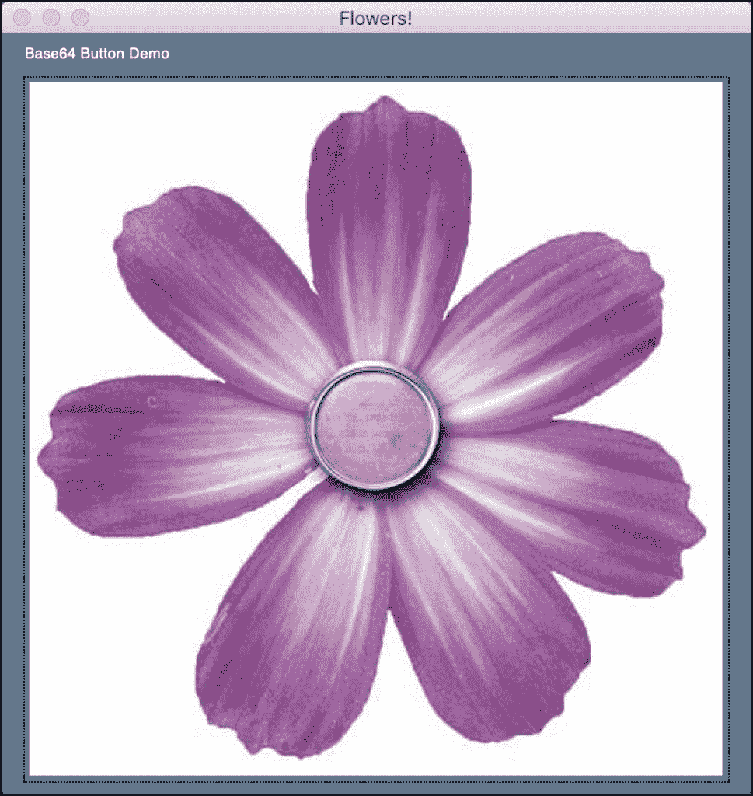

# PySimpleGUI:使用图像作为按钮

> 原文：<https://www.blog.pythonlibrary.org/2021/09/05/pysimplegui-using-an-image-as-a-button/>

当你为你的令人惊奇的程序创建一个图形用户界面时，你想在应用程序中加入一点你自己的东西。一种方法是使用图像作为按钮。虽然有些人觉得这些类型的按钮不直观，因为它们看起来不像按钮，但这是一种合法的方式来区分您的应用程序和竞争对手。

PySimpleGUI 在他们的[食谱](https://pysimplegui.readthedocs.io/en/latest/cookbook/#step-1-find-your-graphic)中为这个过程提供了一个四步过程:

1.  查找您的图像(PNG 或 GIF)
2.  将您的图像转换成 Base64 字节字符串
3.  将 Base64 字节字符串添加到代码中
4.  指定 Base64 字节字符串作为创建按钮时使用的图像

在本教程中，您将遵循这一过程。如果您没有安装 PySimpleGUI，那么您需要发出以下命令:

```py
python -m pip install PySimpleGUI
```

现在您已经有了 PySimpleGUI，下一步是为您的按钮找到一个图像！

## 寻找图像

你可以在很多不同的地方找到图像。你可能在电脑上有自己的收藏。你可以去网上购买图标集。或者你可以在网上搜索图片，试着找到开源或者其他免费的图标。你不应该使用受版权保护的图片，因为这会给你带来法律上的麻烦。

对于这个例子，你可以使用你最喜欢的搜索引擎进行搜索。出于本教程的目的，使用了以下搜索字符串:“紫花图标”，它在 freeiconspng.com 的[上找到了以下图像:](https://www.freeiconspng.com/img/6216)


现在您有了一个可以使用的图像，您需要将它转换成一个字符串！

## 将您的图像转换成 Base64 字节字符串

现在您需要将图像转换成 base64 字节的字符串。PySimpleGUI 有两个[演示](https://github.com/PySimpleGUI/PySimpleGUI/tree/master/DemoPrograms)可以用于这个目的:

*   **Demo _ Base64 _ Single _ Image _ encoder . py**-转换单个输入文件并将字符串保存到剪贴板
*   **Demo _ Base64 _ Image _ encoder . py**——将整个文件夹的图像转换成字符串，并保存到`output.py`

这两个程序都行得通。因为这个例子只有一个图像，所以第一个演示可能最有意义。

一旦您对花卉照片运行了该演示，您的计算机剪贴板中就会有 base64 编码的字符串。

## 将 Base64 字节字符串添加到代码中

您可以从剪贴板中取出 base64 编码的字符串，并将其粘贴到您的代码中。您需要将该字符串赋给一个变量，以便可以在 GUI 代码中引用它。

下面是您将用来显示自定义按钮的代码:

```py
import PySimpleGUI as sg

flower_base64 = b'paste your base64 encoded string here'

layout = [  [sg.Text('Base64 Button Demo')],
            [sg.Button('', image_data=flower_base64, 
            button_color=(sg.theme_background_color(),sg.theme_background_color()),border_width=0, key='Exit')]  ]

window = sg.Window('Flowers!', layout, no_titlebar=True)

while True:             # Event Loop
    event, values = window.read()
    print(event, values)
    if event in (sg.WIN_CLOSED, 'Exit'):
        break
window.close()
```

这段代码基于 PySimpleGUI 食谱中的例子。您需要将 base64 编码的字符串粘贴到这段代码中。它太长了，不能包含在这里。

当您运行这段代码时，您会看到一个如下所示的 GUI:



那看起来不是很好吗？当你点击花按钮，它关闭应用程序。

## 包扎

PySimpleGUI 使创建定制按钮变得简单。你制作纽扣的能力只受到你想象力的限制。

## 相关阅读

想了解更多关于 PySimpleGUI 的信息，请查阅以下资源:

*   PySimpleGUI–[如何使用 GUI 在图像上绘制形状](https://www.blog.pythonlibrary.org/2021/02/24/pysimplegui-how-to-draw-shapes-on-an-image-with-a-gui/)
*   [使用 PySimpleGUI 创建图像查看器](https://www.blog.pythonlibrary.org/2021/02/16/creating-an-image-viewer-with-pysimplegui/)
*   [用 PySimpleGUI 创建一个 Exif 查看器](https://www.blog.pythonlibrary.org/2021/01/26/create-an-exif-viewer-with-pysimplegui/)
*   【PySimpleGUI 的演示