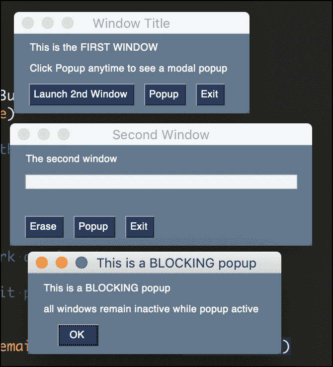

# PySimpleGUI:使用多个窗口

> 原文：<https://www.blog.pythonlibrary.org/2021/01/20/pysimplegui-working-with-multiple-windows/>

当你创建图形用户界面(GUI)时，你经常会发现你需要创建不止一个窗口。在本教程中，您将学习如何使用 [PySimpleGUI](https://pysimplegui.readthedocs.io/en/latest/) 创建两个窗口。

PySimpleGUI 是最容易上手的 Python GUIs 之一。它包装了其他 Python GUIs，并为它们提供了一个公共接口。你可以在我的[PySimpleGUI 简介](https://www.blog.pythonlibrary.org/2019/10/23/a-brief-intro-to-pysimplegui/)或者我的文章《真正的 Python， [PySimpleGUI:用 Python 创建 GUI 的简单方法](https://realpython.com/pysimplegui-python/)中读到更多。

#### 入门指南

您需要安装 PySimpleGUI 来开始使用它。您可以使用画中画来做到这一点:

```py
python -m pip install pysimplegui
```

#### 使窗口模式化

PySimpleGUI 提供了一个**窗口**元素，用于显示其他元素，比如按钮、文本、图像等等。这些窗口可以是模态的。模式窗口不允许你与程序中的其他窗口交互，直到你退出它。当你想强迫用户读一些东西或者问用户一个问题时，这是很有用的。例如，一个模态对话框可以用来询问用户是否真的想退出你的程序，或者显示一个最终用户协议(EULA)对话框。

您可以创建两个窗口，并在 PySimpleGUI 中同时显示它们，如下所示:

```py
import PySimpleGUI as sg

def open_window():
    layout = [[sg.Text("New Window", key="new")]]
    window = sg.Window("Second Window", layout, modal=True)
    choice = None
    while True:
        event, values = window.read()
        if event == "Exit" or event == sg.WIN_CLOSED:
            break

    window.close()

def main():
    layout = [[sg.Button("Open Window", key="open")]]
    window = sg.Window("Main Window", layout)
    while True:
        event, values = window.read()
        if event == "Exit" or event == sg.WIN_CLOSED:
            break
        if event == "open":
            open_window()

    window.close()

if __name__ == "__main__":
    main()
```

当您运行这段代码时，您会看到一个小的主窗口，如下所示:


如果你点击“打开窗口”按钮，你会得到一个新的窗口，看起来像这样:


第二个窗口中有一个名为*模态*的参数，它被设置为**真**。这意味着在关闭第二个窗口之前，您无法与第一个窗口进行交互。

现在让我们来看一种方法，如果你正在创建一个像上面这样的简单窗口，你可以缩短你的代码。

#### 创建内嵌的新窗口

你不必为你的第二窗口写一个完全独立的函数。如果你不想在第二个窗口中有很多小部件，那么你可以创建一个一行或两行的窗口。

有一种方法可以做到:

```py
import PySimpleGUI as sg

def main():
    layout = [[sg.Button("Open Window", key="open")]]
    window = sg.Window("Main Window", layout)
    while True:
        event, values = window.read()
        if event == "Exit" or event == sg.WIN_CLOSED:
            break
        if event == "open":
            if sg.Window("Other Window", [[sg.Text("Try Again?")], 
                                          [sg.Yes(), sg.No()]]).read(close=True)[0] == "Yes":
                print("User chose yes!")
            else:
                print("User chose no!")

    window.close()

if __name__ == "__main__":
    main()
```

在本例中，当您单击“打开窗口”按钮时，它会在条件语句中创建第二个窗口。该窗口直接调用 **read()** ，当用户选择“是”、“否”或退出窗口时关闭。根据用户的选择，条件将打印出不同的内容。

#### 传统的多窗口设计模式

PySimpleGUI 有一个推荐的方法来处理多个窗口。在他们的[食谱](https://pysimplegui.readthedocs.io/en/latest/cookbook/#multiple-windows)和 Github 上的[演示中提到了这一点。这里有一个来自**的例子 Demo _ Design _ Pattern _ Multiple _ windows . py:**](https://github.com/PySimpleGUI/PySimpleGUI/tree/master/DemoPrograms)

```py
import PySimpleGUI as sg
"""
    Demo - 2 simultaneous windows using read_all_window

    Window 1 launches window 2
    BOTH remain active in parallel

    Both windows have buttons to launch popups.  The popups are "modal" and thus no other windows will be active

    Copyright 2020 PySimpleGUI.org
"""

def make_win1():
    layout = [[sg.Text('This is the FIRST WINDOW'), sg.Text('      ', k='-OUTPUT-')],
              [sg.Text('Click Popup anytime to see a modal popup')],
              [sg.Button('Launch 2nd Window'), sg.Button('Popup'), sg.Button('Exit')]]
    return sg.Window('Window Title', layout, location=(800,600), finalize=True)

def make_win2():
    layout = [[sg.Text('The second window')],
              [sg.Input(key='-IN-', enable_events=True)],
              [sg.Text(size=(25,1), k='-OUTPUT-')],
              [sg.Button('Erase'), sg.Button('Popup'), sg.Button('Exit')]]
    return sg.Window('Second Window', layout, finalize=True)

window1, window2 = make_win1(), None        # start off with 1 window open

while True:             # Event Loop
    window, event, values = sg.read_all_windows()
    if event == sg.WIN_CLOSED or event == 'Exit':
        window.close()
        if window == window2:       # if closing win 2, mark as closed
            window2 = None
        elif window == window1:     # if closing win 1, exit program
            break
    elif event == 'Popup':
        sg.popup('This is a BLOCKING popup','all windows remain inactive while popup active')
    elif event == 'Launch 2nd Window' and not window2:
        window2 = make_win2()
    elif event == '-IN-':
        window['-OUTPUT-'].update(f'You enetered {values["-IN-"]}')
    elif event == 'Erase':
        window['-OUTPUT-'].update('')
        window['-IN-'].update('')
window.close()
```

当您运行这段代码时，您可以打开几个不同的窗口，如下所示:



你会想尝试使用这两种方法，看看哪种最适合你。这个方法的好处是只有一个事件循环，这简化了事情。

#### 包扎

PySimpleGUI 允许您创建简单和复杂的用户界面。虽然这里没有涉及，但是您也可以使用 **sg.popup()** 向用户显示一个更简单的对话框。这些对话框也可以是模态的，但不像常规窗口那样可以完全自定义。

试试 PySimpleGUI，看看你的想法。

#### 相关阅读

*   [PySimpleGUI 简介](https://www.blog.pythonlibrary.org/2019/10/23/a-brief-intro-to-pysimplegui/)
*   【PySimpleGUI 的演示
*   真正的 Python - [PySimpleGUI:用 Python 创建 GUI 的简单方法](https://realpython.com/pysimplegui-python/)