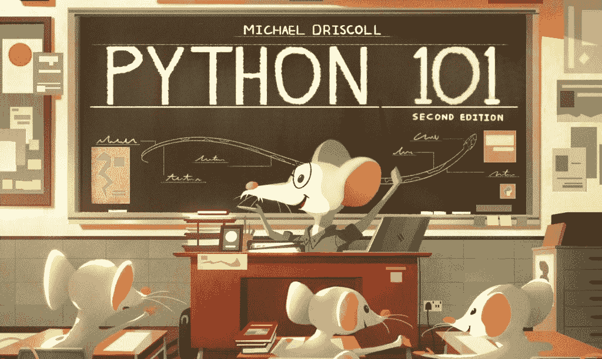

# Python 101 第二版完全资助+扩展目标

> 原文：<https://www.blog.pythonlibrary.org/2020/02/19/python-101-2nd-edition-fully-funded-stretch-goals/>

我的书《Python 101》的第二版已经在 [Kickstarter](https://www.kickstarter.com/projects/driscollis/python-101-2nd-edition/) 上成功融资。按照传统，我增加了几个扩展目标，为这本已经很厚的书增加更多内容。

目标如下:

**1) $5000 -获得 4 个奖励章节**

这些章节将涵盖以下主题:

*   赋值表达式
*   如何创建图形用户界面
*   如何创建图表
*   如何在 Python 中处理图像

**2) $7500 -添加章节复习题**

额外的章节让我非常兴奋，因为它们是用 Python 做的有趣的事情，同时也很有用。赋值表达式一章也是 Python 中的新内容，可能很快就会对您有用。

添加章节回顾问题是我一直想用 Python 101 做的事情。希望你也会发现这个想法很有趣。

如果你有兴趣得到这本书或者支持这个网站，你现在可以去 Kickstarter 了。我的其他一些书在那里也有很好的交易！