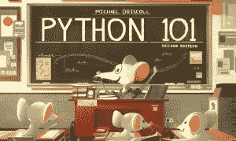

# Python 101:第二版对 PyCon 2021 是免费的！

> 原文：<https://www.blog.pythonlibrary.org/2021/05/13/python-101-2nd-edition-is-free-for-pycon-2021/>

我将在 PyCon 2021 期间免费发布 Python 101:第二版。本次销售将于 2021 年 5 月 17 日星期一结束。您可以通过以下链接免费获得这本书:

*   https://leanpub.com/py101/c/pycon
*   gum road-[https://gumroad.com/l/pypy101/pycon](https://gumroad.com/l/pypy101/pycon)
*   或者**使用此链接支付你想要的东西**起价 5 美元:【https://gumroad.com/l/pypy101】T2

如果你喜欢电子书，并且想要平装本，你可以在亚马逊上买到。

第二版 **Python 101** 完全从头重写。在本书中，您将学习 Python 编程语言以及更多内容。

这本书分为四个部分:

1.  Python 语言
2.  中级主题
3.  创建示例应用程序
4.  分发您的代码