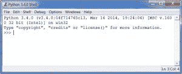
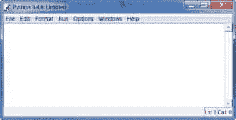
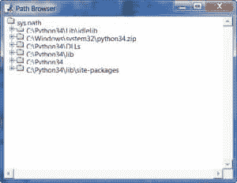

# Python 101 -空闲介绍

> 原文：<https://www.blog.pythonlibrary.org/2017/03/18/python-101-an-intro-to-idle/>

Python 自带代码编辑器: **IDLE** (集成开发学习环境)。有一些传说认为“游手好闲”这个名字来自《T2》中的演员埃里克·艾多尔。IDE 是一个面向程序员的编辑器，它提供了语言中关键词的颜色高亮、自动完成、一个“实验性”调试器和许多其他有趣的东西。您可以找到大多数流行语言的 IDE，许多 IDE 可以支持多种语言。IDLE 是一个 lite IDE，但是它确实有上面提到的所有项目。它允许程序员非常容易地编写 Python 和调试他们的代码。我称之为“精简版”的原因是调试器非常简单，而且它缺少其他功能，而那些有使用像 *Visual Studio* 这样的产品背景的程序员将会缺少这些功能。您可能还想知道 IDLE 是使用 Tkinter 创建的，Tkinter 是 Python 自带的一个 Python GUI 工具包。

要打开 IDLE，您需要找到它，然后您会看到类似这样的内容:



是的，这是一个 Python shell，您可以在其中键入简短的脚本，并立即看到它们的输出，甚至可以实时与代码进行交互。因为 Python 是一种解释性语言，并且在 Python 解释器中运行，所以不需要编译代码。现在让我们写你的第一个程序。在空闲状态下，在命令提示符(>>>)后键入以下内容:

```py

print("Hello from Python!")

```

你刚刚写了你的第一个程序！你的程序所做的只是在屏幕上写一个字符串，但是你会发现这在以后会很有帮助。请注意，在 Python 3.x 中，**print**语句已经更改。在 Python 2.x 中，您应该这样编写上面的语句:

```py

print "Hello from Python!"

```

在 Python 3 中，**打印**语句变成了**打印函数**，这就是为什么需要括号的原因。你会在第 10 章学到什么功能。

如果要将代码保存到文件中，请转到“文件”菜单，选择“新建窗口”(或按 CTRL+N)。现在你可以输入你的程序并保存在这里。使用 Python shell 的主要好处是，在将代码放入真正的程序之前，您可以用小代码片段进行试验，看看您的代码将如何运行。代码编辑器屏幕看起来与上面的空闲屏幕截图有些不同:



现在我们将花一点时间来看看 IDLE 的其他有用功能。

Python 附带了许多模块和包，您可以导入它们来添加新特性。例如，您可以为各种好的数学函数导入 **math** 模块，比如平方根、余弦等。在**文件**菜单中，你会发现一个**路径浏览器**，这对于弄清楚 Python 在哪里寻找模块导入非常有用。您可以看到，Python 首先在正在运行的脚本所在的目录中查找，看它需要导入的文件是否在那里。然后，它检查其他位置的预定义列表。您实际上也可以添加和删除位置。如果您导入了任何文件，路径浏览器会显示这些文件在硬盘上的位置。我的路径浏览器看起来像这样:



接下来是一个**类浏览器**，它将帮助你导航你的代码。坦白地说，如果这个菜单选项被称为“模块浏览器”会更有意义，因为这更接近你实际要做的事情。这其实是现在对你不会很有用，但将来会很有用的东西。当你在一个文件中有很多行代码时，你会发现它很有帮助，因为它会给你一个“树状”的代码界面。请注意，除非您实际保存了程序，否则您将无法加载类浏览器。

**编辑**菜单具有您的典型功能，如复制、剪切、粘贴、撤销、重做和全选。它还包含各种方法来搜索您的代码，并进行搜索和替换。最后，Edit 菜单有一些菜单项可以显示各种内容，比如突出显示括号或显示自动完成列表。

**格式**菜单有很多有用的功能。它有一些对**缩进**和**去缩进**你的代码以及注释掉你的代码很有帮助的项目。当我测试我的代码时，我发现这很有帮助。注释掉您的代码会非常有帮助。一种有用的方法是当你有很多代码，你需要找出为什么它不能正常工作。注释掉部分内容并重新运行脚本可以帮助您找出哪里出错了。你只是慢慢地取消注释，直到你碰到你的 bug。这提醒了我。你可能已经注意到主空闲屏幕有一个**调试器**菜单。

这对于调试来说很好，但只是在 **Shell 窗口**中。遗憾的是，你不能在主编辑菜单中使用调试器。但是，您可以在打开调试的情况下运行模块，以便能够与程序的对象进行交互。例如，这在您试图确定循环内某项的当前值的循环中非常有用。如果您碰巧正在使用 tkinter 创建用户界面(UI)，那么您实际上可以关闭 **mainloop()** 调用(这会阻塞 UI)，以便调试您的用户界面。最后，当调试器运行时引发异常，可以双击该异常直接跳转到发生异常的代码。

如果你需要一个更通用的调试器，你应该找一个不同的 IDE 或者尝试 Python 的调试器，可以在 **pdb** 库中找到。

**运行**菜单有几个方便的选项。您可以使用它来打开 Python Shell、检查代码错误或运行代码。选项菜单没有太多的项目。它有一个配置选项，允许您更改代码高亮颜色、字体和快捷键。除此之外，您还可以获得一个代码上下文选项，这很有帮助，因为它在编辑窗口中放置了一个覆盖图，显示您当前所在的类或函数。您会发现，每当您在一个函数中有很多代码，并且名称已经滚出屏幕顶部时，这个特性就非常有用。启用此选项后，这种情况不会发生。当然，如果功能太大，无法在一个屏幕上显示，那么它可能会变得太长，可能需要将该功能分解为多个功能。在**设置**对话框中的另一个整洁的项目是在**常规**选项卡下，在那里你可以添加其他文档。这意味着你可以添加第三方文档的 URL，比如 SQLAlchemy 或者 pillow，并让它进入空闲状态。要访问新文档，只需跳转到**帮助**菜单。

**窗口**菜单向您显示当前打开的窗口列表，并允许您在它们之间切换。

最后但同样重要的是 **Help** 菜单，在这里你可以了解 IDLE，获得 IDLE 本身的帮助或者加载 Python 文档的本地副本。该文档将解释 Python 的每一部分是如何工作的，并且在覆盖面上相当详尽。帮助菜单可能是最有用的，因为即使你没有连接到互联网，你也可以访问文档。您可以搜索文档，找到 HOWTOs，阅读任何内置的库，了解如此多的内容，您可能会感到头晕。

* * *

### 包扎

在本文中，我们学习了如何使用 Python 的集成开发环境 IDLE。此时，您应该对 IDLE 足够熟悉，可以自己使用它了。Python 还有许多其他的集成开发环境(ide)。有像 PyDev 和 Editra 这样的免费软件，也有一些你需要付费的软件，比如 WingWare 和 PyCharm，尽管它们都有免费版本。还有用于常规文本编辑器的插件，允许您也用 Python 编码。我认为 IDLE 是一个很好的起点，但是如果你已经有了一个最喜欢的编辑器，请继续使用它。

如果你碰巧是视觉学习者，我也创建了这个教程的截屏版本:

[https://www.youtube.com/embed/yEusyqoxNQI?feature=oembed](https://www.youtube.com/embed/yEusyqoxNQI?feature=oembed)

这来自我的 [Python 101 截屏](https://gum.co/kaKNo)