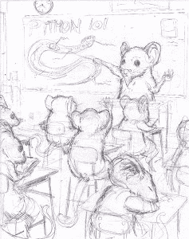

# Python 101 书籍:幕后-封面

> 原文：<https://www.blog.pythonlibrary.org/2014/02/26/python-101-book-behind-the-scenes-the-cover/>

我对 [Python 101](http://kck.st/1kX98BB) 的封面有很多想法。我的第一个想法是去动物园拍一些蟒蛇的照片，然后挑一张合适的贴在封面上。我有很多照片编辑软件，所以我也考虑过把照片拍下来，然后把它修改成素描或油画的样子。然后我开始思考我的博客，以及我的读者是如何首先鼓励我写这本书的。所以我最终选择了我的另一个想法，那就是继续鼠标 Vs Python 的主题。

最后，我雇了一个我认识的艺术家，他设计了我最初的博客标识。他的名字叫泰勒，他拥有并经营着 Killustration 工作室。你可以看到他在 [deviantArt](http://killustrationstudios.deviantart.com/gallery/) 上的一些作品。无论如何，我告诉他我对这本书封面的想法，我想我会分享封面的各种版本。

### 第一个粗糙的封面

下图是封面的第一个版本。这很粗糙，但我可以看到我的愿景正在成形:

### 第二场比赛

下一个粗略的封面图片稍微好一点，有更多的细节:

### 铅笔版本

在批准这项工作后，泰勒创作了铅笔版的封面:

我喜欢这个版本，我们继续。

### 着墨的封面

接下来是给封面上色。我没想到会有这么多台阶！

### 全彩封面！

下一步是给封面添加颜色。我认为这个结果很好:

### 最终封面

最后一次修改是在标题上加上我的名字。

我已经重新雇用了我的艺术家，为这本书添加一些更有趣的艺术。如果你想支持图书项目，请查看 [Kickstarter 活动页面](http://kck.st/1kX98BB)