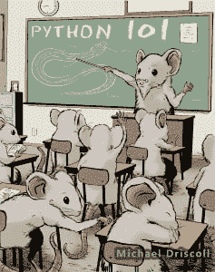

# Python 101 书今天出版！

> 原文：<https://www.blog.pythonlibrary.org/2014/06/03/python-101-book-published-today/>

我的第一本书《Python 101》今天出版了。你可以直接从我的博客购买，那里会有这本书的 PDF、EPUB 和 MOBI 版本。你也可以通过[露露](http://www.lulu.com/shop/michael-driscoll/python-101/paperback/product-21657364.html)购买这本书的精装版。最后，我把电子书发布到了[亚马逊](http://www.amazon.com/gp/product/B00KQTFHNK/ref=as_li_tl?ie=UTF8&camp=1789&creative=390957&creativeASIN=B00KQTFHNK&linkCode=as2&tag=thmovsthpy-20&linkId=P2Q4GHJI6O4LYMNG)。

如果你碰巧开了一个 Python 或技术博客，并且对阅读我的书《Python 101》感兴趣，请随时用你的博客信息联系我。我想找几个好的博客写手来评论这本书。

### [现在订购](https://gum.co/bppWr)