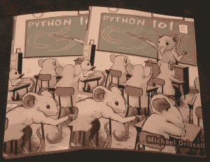
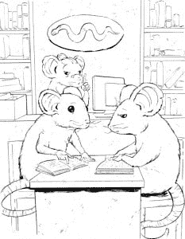

# Python 101 书籍写作更新

> 原文：<https://www.blog.pythonlibrary.org/2014/05/13/python-101-book-writing-update/>

Python 101，我正在创作的这本书快完成了。我有几份由 [Lulu](http://lulu.com/) 制作的“证明”副本，用来验证事情的安排是否正确，并帮助我发现错误。在印刷品上看到它很酷。这也让一些疏漏变得相当明显，尽管它们本质上都是装饰性的。

不管怎样，现在我正在浏览这本书，做一些最后的编辑。我还有一个附录要添加，我目前正在等待两个以上的插图完成。这本书仍然计划在 2014 年 6 月推出。你现在就可以[预订电子书](https://gumroad.com/l/bppWr)。当准备好购买的时候，我会添加一个链接到封面，大概是在六月的第一周。

这里有一个有趣的下一件艺术品的预览:

