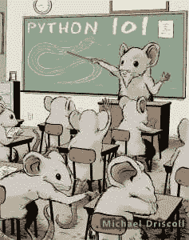

# Python 101:第 42 集——用 cx_Freeze 创建可执行文件

> 原文：<https://www.blog.pythonlibrary.org/2019/01/15/python-101-episode-42-creating-executables-with-cx_freeze/>

In this screencast, we will learn how to turn your Python code into a Windows executable file using the [cx_Freeze project](https://cx-freeze.readthedocs.io/en/latest/). [https://www.youtube.com/embed/9M0xHgX3-Ak](https://www.youtube.com/embed/9M0xHgX3-Ak)

你也可以在这里阅读本视频所依据的章节，或者在 [Leanpub](https://leanpub.com/python_101) 上找到这本书

Python 101