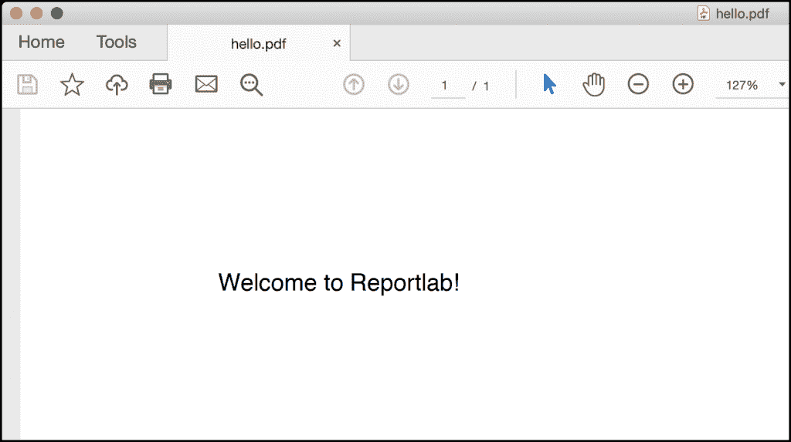
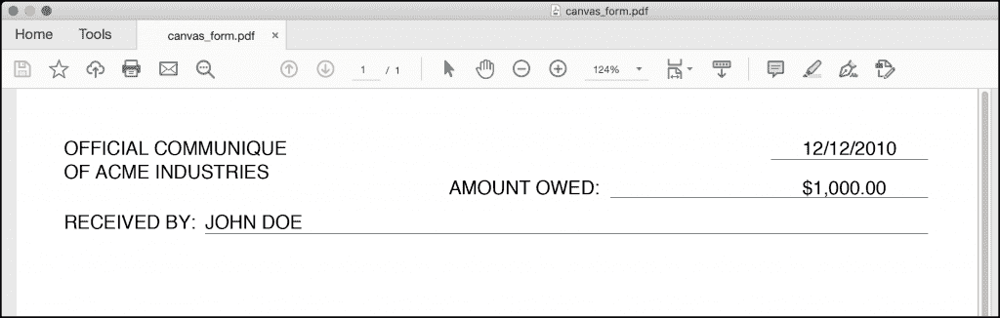
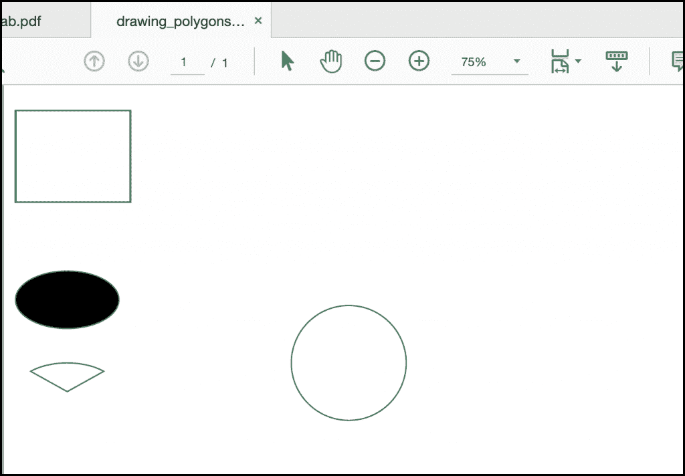
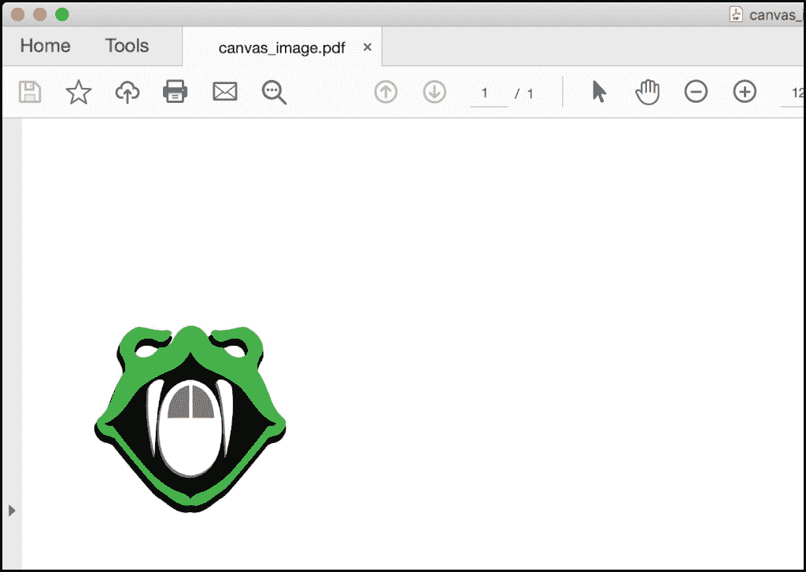
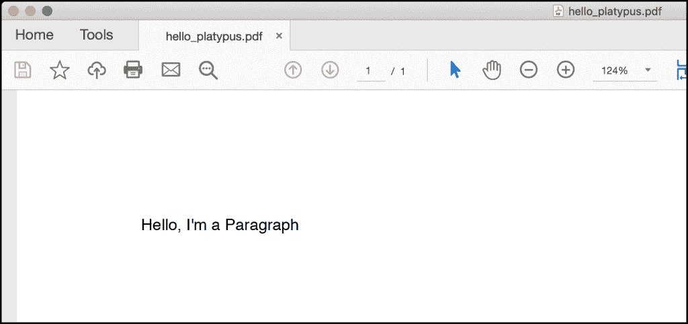
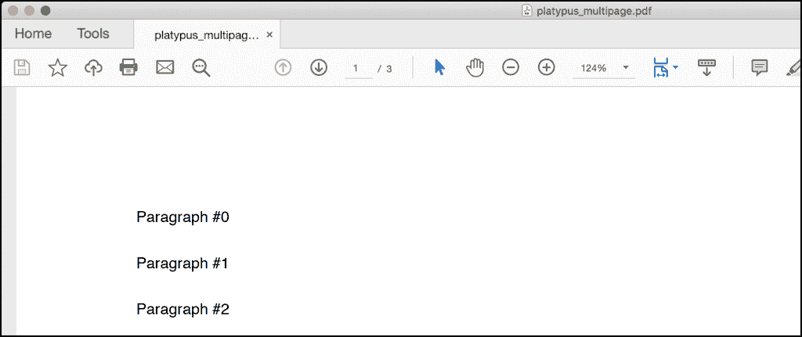
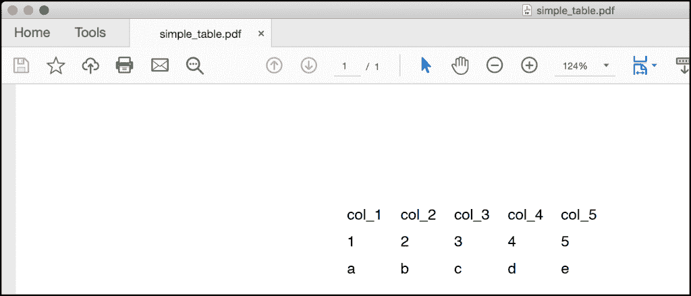
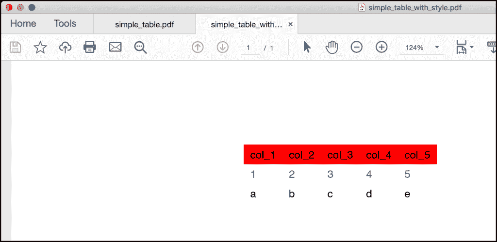

# Python 101 - How to Generate a PDF

> 原文：<https://www.blog.pythonlibrary.org/2021/09/28/python-101-how-to-generate-a-pdf/>

The **Portable Document Format (PDF)** is a very popular way to share documents across multiple platforms. The goal of the PDF is to create a document that will look the same on multiple platforms and that will print the same (or very similar) on various printers. The format was originally developed by Adobe but has been made open-source.

Python has multiple libraries that you can use to create new PDFs or export portions of pre-existing PDFs. There are currently no Python libraries available for editing a PDF in-place. Here are a few of the packages you can use:

*   **ReportLab** - used for creating PDFs
*   **pdfrw** - used for splitting, merging, watermarking and rotating a PDF
*   **PyPDF2 / PyPDF4** - used for splitting, merging, watermarking and rotating a PDF
*   **PDFMiner** - used for extracting text from PDFs

There are many other PDF packages for Python. In this article, you will learn how to create a PDF using ReportLab. The ReportLab package has been around since the year 2000\. It has an open-source version as well as a paid commercial version which has some extra features in it. You will be learning about the open-source version here.

In this article, you will learn about the following:

*   Installing ReportLab
*   Creating a Simple PDF with the Canvas
*   Creating Drawings and Adding Images Using the Canvas
*   Creating Multi-page Documents with PLATYPUS
*   Creating a Table

ReportLab can generate almost any kind of report you can imagine. This article will not cover every feature that ReportLab has to offer, but you will learn enough about it to see how useful ReportLab can be.

Let's get started!

## Installing ReportLab

You can install ReportLab using `pip`:

```py
python3 -m pip install reportlab
```

ReportLab depends on the Pillow package, which is an image manipulation library for Python. It will be installed as well if you do not already have it on your system. Now that you have ReportLab installed, you are ready to learn how to create a simple PDF!

## Creating a Simple PDF with the Canvas

There are two ways to create PDFs using the ReportLab package. The low-level method is drawing on the "canvas". This allows you to draw at specific locations on the page. PDFs measure their size in **points** internally. There are 72 points per inch. A letter-size page is 612 x 792 points. However, the default page size is A4\. There are several default page sizes that you can set or you can create your own page size.

It's always easier to see some code so that you can understand how this will work. Create a new file named `hello_reportlab.py` and add this code:

```py
# hello_reportlab.py

from reportlab.pdfgen import canvas

my_canvas = canvas.Canvas("hello.pdf")
my_canvas.drawString(100, 750, "Welcome to Reportlab!")
my_canvas.save()

```

This will create a PDF that is A4-sized. You create a `Canvas()` object that takes in the path to the PDF that you want to create. To add some text to the PDF, you use `drawString()`. This code tells ReportLab to start drawing the text 100 points from the left and 750 from the bottom of the page. If you were to start drawing at (0, 0), your text would appear at the bottom left of the page. You can change the location you start drawing by setting the `bottomup` canvas argument to 0.

The last line saves the PDF to disk. Don't forget to do that or you won't get to see your new creation!

The PDF should look something like this when you open it:



Hello World on ReportLab Canvas

While this demonstrates how easy it is to create a PDF with ReportLab, it's kind of a boring example. You can use the canvas to draw lines, shapes and different fonts too. To learn how, create a new file named `canvas_form.py` and enter this code in it:

```py
# canvas_form.py

from reportlab.lib.pagesizes import letter
from reportlab.pdfgen import canvas

def form(path):
    my_canvas = canvas.Canvas(path, pagesize=letter)
    my_canvas.setLineWidth(.3)
    my_canvas.setFont('Helvetica', 12)
    my_canvas.drawString(30, 750, 'OFFICIAL COMMUNIQUE')
    my_canvas.drawString(30, 735, 'OF ACME INDUSTRIES')
    my_canvas.drawString(500, 750, "12/12/2010")
    my_canvas.line(480, 747, 580, 747)
    my_canvas.drawString(275, 725, 'AMOUNT OWED:')
    my_canvas.drawString(500, 725, "$1,000.00")
    my_canvas.line(378, 723, 580, 723)
    my_canvas.drawString(30, 703, 'RECEIVED BY:')
    my_canvas.line(120, 700, 580, 700)
    my_canvas.drawString(120, 703, "JOHN DOE")
    my_canvas.save()

if __name__ == '__main__':
    form('canvas_form.pdf')

```

Here you import the `letter` size from `reportlab.lib.pagesizes` which has several other sizes you could use. Then in the `form()` function, you set the `pagesize` when you instantiate `Canvas()`. Next, you use `setLineWidth()` to set the line width, which is used when you draw lines. Then you change the font to Helvetica with the font size at 12 points.

The rest of the code is a series of drawing strings at various locations with lines being drawn here and there. When you draw a `line()`, you pass in the starting coordinate (x/y positions) and the end coordinate (x/y position) and ReportLab will draw the line for you using the line width you set.

When you open the PDF, you will see the following:



A Form Created with ReportLab Canvas

That looks pretty good. But what if you wanted to draw something or add a logo or some other photo to your report? Let's find out how to do that next!

## Creating Drawings and Adding Images Using the Canvas

The ReportLab `Canvas()` is very flexible. It allows you to draw different shapes, use different colors, change the line widths, and more. To demonstrate some of these features, create a new file named `drawing_polygons.py` and add this code to it:

```py
# drawing_polygons.py

from reportlab.lib.pagesizes import letter
from reportlab.pdfgen import canvas

def draw_shapes():
    my_canvas = canvas.Canvas("drawing_polygons.pdf")
    my_canvas.setStrokeColorRGB(0.2, 0.5, 0.3)
    my_canvas.rect(10, 740, 100, 80, stroke=1, fill=0)
    my_canvas.ellipse(10, 680, 100, 630, stroke=1, fill=1)
    my_canvas.wedge(10, 600, 100, 550, 45, 90, stroke=1, fill=0)
    my_canvas.circle(300, 600, 50)
    my_canvas.save()

if __name__ == '__main__':
    draw_shapes()

```

Here you create a `Canvas()` object as you have before. You can use `setStrokeColorRGB()` to change the border color using RGB values between zero and one. The next few lines of code create different shapes. For the `rect()` function, you specify the x and y start position which is the lower left-hand coordinate of the rectangle. Then you specify the width and height of the shape.

The `stroke` parameter tells ReportLab whether or not to draw the border while the `fill` parameter tells ReportLab whether or not to fill the shape with a color. All of the shapes support these two parameters.

According to the documentation for the `ellipse()`, it takes in the starting (x,y) and ending (x,y) coordinates for the enclosing rectangle for the ellipse shape.

The `wedge()` shape is similar in that you are once again specifying a series of points for an invisible rectangle that encloses the wedge shape. What you need to do is imagine that there is a circle inside of a rectangle and you are describing the size of the rectangle. The 5th argument is `startAng`, which is the starting angle of the wedge. The 6th argument is for the `extent`, which tells the wedge how far out the arc can extend.

Lastly, you create a `circle()`, which takes in the `(x,y)` coordinates of its center and then its radius. You skip setting the `stroke` and `fill` parameters.

When you run this code, you will end up with a PDF that looks like this:



Creating Polygons with ReportLab

That looks pretty nice. You can play around with the values on your own and see if you can figure out how to change the shapes in different ways.

While these shapes you drew look fun, they wouldn't really look great on any professional company document. What if you want to add a company logo to your PDF report? You can do this with ReportLab by adding an image to your document. To discover how to do that, create a file named `image_on_canvas.py` and add this code to it:

```py
# image_on_canvas.py

from reportlab.lib.pagesizes import letter
from reportlab.pdfgen import canvas

def add_image(image_path):
    my_canvas = canvas.Canvas("canvas_image.pdf", pagesize=letter)
    my_canvas.drawImage(image_path, 30, 600, width=100, height=100)
    my_canvas.save()

if __name__ == '__main__':
    image_path = 'snakehead.jpg'
    add_image(image_path)

```

To draw an image on your canvas, you use the `drawImage()` method. It takes in the image path, the x and y starting positions, and the width and height you want to use for the image. This method does not maintain the aspect ratio of the image you pass in. If you set the width and height incorrectly, the image will be stretched.

When you run this code, you will end up with a PDF that looks something like this:



Adding an Image to a PDF

The `Canvas()` class is quite powerful. However, you need to keep track of where you are at on a page and tell the canvas when to create a new page. This can be difficult to do without making the code quite complex. Fortunately, there is a better way and you'll find out what that is in the next section!

## Creating Multi-page Documents with PLATYPUS

ReportLab has a neat concept that they call **PLATYPUS**, which stands for “Page Layout and Typography Using Scripts”. It is a high-level layout library that ReportLab provides that makes it easier to programmatically create complex layouts with a minimum of code. PLATYPUS basically takes care of page breaking, layout, and styling for you.

There are several classes that you can use within PLATYPUS. These classes are known as **Flowables**. A Flowable has the ability to be added to a document and can break itself intelligently over multiple pages. The Flowables that you will use the most are:

*   `Paragraph()` - for adding text
*   `getSampleStyleSheet()` - for applying styles to Paragraphs
*   `Table()` - for tabular data
*   `SimpleDocTemplate()` - a document template used to hold other flowables

To see how these classes can be used, create a file named `hello_platypus.py` and add the following code:

```py
# hello_platypus.py

from reportlab.lib.pagesizes import letter
from reportlab.platypus import SimpleDocTemplate, Paragraph
from reportlab.lib.styles import getSampleStyleSheet

def hello():
    doc = SimpleDocTemplate(
            "hello_platypus.pdf",
            pagesize=letter,
            rightMargin=72, leftMargin=72,
            topMargin=72, bottomMargin=18,
            )
    styles = getSampleStyleSheet()

    flowables = []

    text = "Hello, I'm a Paragraph"
    para = Paragraph(text, style=styles["Normal"])
    flowables.append(para)

    doc.build(flowables)

if __name__ == '__main__':
    hello()

```

In this code, you import two new classes from `reportlab.platypus`: `SimpleDocTemplate()` and `Paragraph()`. You also import `getSampleStyleSheet()` from `reportlab.lib.styles`. Then in the `hello()` function, you create a document template object. This is where you pass the file path to the PDF that you want to create. It is analogous to the `Canvas()` class, but for PLATYPUS. You set the `pagesize` here as well and you also specify the margins. You aren't required to set up the margins, but you should know that you can, which is why it is shown here.

Then you get the sample style sheet. The `styles` variable is a `reportlab.lib.styles.StyleSheet1` object type. You can access several different styles in that stylesheet. For the purposes of this example, you use the `Normal` stylesheet.

This code creates a single Flowable using `Paragraph()`. The `Paragraph()` can take several different arguments. In this case, you pass in some text and what style you want to apply to the text. If you look at the code for the stylesheet, you see that you can apply various "Heading" styles to the text as well as a "Code" style and an "Italic" style, among others.

To make the document generate properly, you keep a Python list of the Flowables. In this example, you have a list with only one element in it: a `Paragraph()`. Instead of calling `save()` to create the PDF, you call `build()` and pass in the list of Flowables.

The PDF is now generated. It will look like this:



Creating a Paragraph in ReportLab

That's neat! But it's still kind of boring since it only has one element in it.

To see how useful using the PLATYPUS framework is, you will create a document with dozens of Flowables. Go ahead and create a new file named `platypus_multipage.py` and add this code:

```py
# platypus_multipage.py

from reportlab.lib.pagesizes import letter
from reportlab.lib.styles import getSampleStyleSheet
from reportlab.lib.units import inch
from reportlab.platypus import SimpleDocTemplate, Paragraph, Spacer

def create_document():
    doc = SimpleDocTemplate(
            "platypus_multipage.pdf",
            pagesize=letter,
            )
    styles = getSampleStyleSheet()
    flowables = []
    spacer = Spacer(1, 0.25*inch)

    # Create a lot of content to make a multipage PDF
    for i in range(50):
        text = 'Paragraph #{}'.format(i)
        para = Paragraph(text, styles["Normal"])
        flowables.append(para)
        flowables.append(spacer)

    doc.build(flowables)

if __name__ == '__main__':
    create_document()

```

In this example, you create 50 `Paragraph()` objects. You also create a `Spacer()`, which you use to add space between the flowables. When you create a `Paragraph()`, you add it and a `Spacer()` to the list of `flowables`. You end up with 100 flowables in the list.

When you run this code, you will generate a 3-page document. The first page will begin like the following screenshot:



Creating a Multipage PDF

That wasn't too hard! Now let's find out how you might add a table to your PDF!

## Creating a Table

One of the most complex Flowables in ReportLab is the `Table()`. It allows you to show tabular data with columns and rows. Tables allow you to put other Flowable types in each cell of the table. This allows you to create complex documents.

To get started, create a new file named `simple_table.py` and add this code to it:

```py
# simple_table.py

from reportlab.lib.pagesizes import letter
from reportlab.platypus import SimpleDocTemplate, Table

def simple_table():
    doc = SimpleDocTemplate("simple_table.pdf", pagesize=letter)
    flowables = []

    data = [
            ['col_{}'.format(x) for x in range(1, 6)],
            [str(x) for x in range(1, 6)],
            ['a', 'b', 'c', 'd', 'e'],
            ]

    tbl = Table(data)
    flowables.append(tbl)

    doc.build(flowables)

if __name__ == '__main__':
    simple_table()

```

This time you import `Table()` instead of `Paragraph()`. The rest of the imports should look familiar. To add some data to the table, you need to have a Python list of lists. The items inside the lists must be strings or Flowables. For this example, you create three rows of strings. The first row is the column row, which labels what will be in the following rows.

Next, you create the `Table()` and pass in the `data`, which is your list of lists. Finally, you `build()` the document as you did before. Your PDF should now have a table in it that looks like this:



Creating a Simpe Table in ReportLab

A `Table()` does not have a border or a cell border turned on by default. This `Table()` has no styling applied to it at all.

Tables can have styles applied to them using a `TableStyle()`. Table styles are kind of like the stylesheets you can apply to a `Paragraph()`. To see how they work, you need to create a new file named `simple_table_with_style.py` and add the following code to it:

```py
# simple_table_with_style.py

from reportlab.lib import colors
from reportlab.lib.pagesizes import letter
from reportlab.platypus import SimpleDocTemplate, Table, TableStyle

def simple_table_with_style():
    doc = SimpleDocTemplate(
            "simple_table_with_style.pdf",
            pagesize=letter,
            )
    flowables = []

    data = [
            ['col_{}'.format(x) for x in range(1, 6)],
            [str(x) for x in range(1, 6)],
            ['a', 'b', 'c', 'd', 'e'],
            ]

    tblstyle = TableStyle([
        ('BACKGROUND', (0, 0), (-1, 0), colors.red),
        ('TEXTCOLOR', (0, 1), (-1, 1), colors.blue),
        ])

    tbl = Table(data)
    tbl.setStyle(tblstyle)
    flowables.append(tbl)

    doc.build(flowables)

if __name__ == '__main__':
    simple_table_with_style()

```

This time you add a `TableStyle()`, which is a Python list of tuples. The tuples contain the type of styling you wish to apply and which cells to apply the styling to. The first tuple states that you want to apply a red background color starting on column 0, row 0\. This style should be applied through to the last column, which is specified as -1.

The second tuple applies blue color to the text, starting in column 0, row 1 though all the columns on row 1\. To add the style to the table, you call `setStyle()` and pass it the `TableStyle()` instance that you created.

Note that you needed to import `colors` from `reportlab.lib` to get the two colors that you applied.

When you run this code, you will end up with the following table:



ReportLab Table with Style

If you want to apply a border to the table and cells, you would add a tuple using "GRID" as the style command and then tell it which cells to apply it to.

## Wrapping Up

ReportLab is the most comprehensive package available for creating PDFs with Python. In this article, you learned about the following topics:

*   Installing ReportLab
*   Creating a Simple PDF with the Canvas
*   Creating Drawings and Adding Images Using the Canvas
*   Creating Multi-page Documents with PLATYPUS
*   Creating a Table

This article only scratched the surface of what you can do with ReportLab. You can use ReportLab with different types of fonts, add headers and footers, insert barcodes and much, much more. You can learn about these topics as well as other Python PDF packages in my book, [**ReportLab: PDF Processing with Python**](https://leanpub.com/reportlab)

## Related Articles

You can do a lot more with ReportLab than what is contained in this article. Check out some of these other tutorials to learn more:

*   [ReportLab: Adding a Chart to a PDF with Python](https://www.blog.pythonlibrary.org/2019/04/08/reportlab-adding-a-chart-to-a-pdf-with-python/)
*   [Creating Interactive PDF Forms in ReportLab with Python](https://www.blog.pythonlibrary.org/2018/05/29/creating-interactive-pdf-forms-in-reportlab-with-python/)

*   [Adding SVGs to PDFs with Python and ReportLab](https://www.blog.pythonlibrary.org/2018/04/12/adding-svg-files-in-reportlab/)

*   [ReportLab 101: The textobject](https://www.blog.pythonlibrary.org/2018/02/06/reportlab-101-the-textobject/)