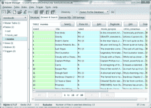

# Python 101:如何从 RottenTomatoes 获取数据

> 原文：<https://www.blog.pythonlibrary.org/2013/11/06/python-101-how-to-grab-data-from-rottentomatoes/>

今天我们将学习如何从流行电影网站烂番茄获取数据。接下来，你需要在这里注册一个 API 密匙。当你拿到钥匙时，记下你的使用限制，如果有的话。你不希望对他们的 API 做太多的调用，否则你的密钥可能会被撤销。最后，阅读您将使用的 API 的文档总是一个非常好的主意。这里有几个链接:

*   常规烂番茄[文档](http://developer.rottentomatoes.com/docs)
*   动态[文档](http://developer.rottentomatoes.com/iodocs)

一旦你仔细阅读或决定留着以后看，我们将继续我们的旅程。

### 开始表演

烂番茄的 API 提供了一组 json 提要，我们可以从中提取数据。我们将使用[请求](http://www.python-requests.org/en/latest/)和 [simplejson](https://pypi.python.org/pypi/simplejson/) 来提取数据并进行处理。让我们写一个小脚本来获取当前正在播放的电影。

```py

import requests
import simplejson

#----------------------------------------------------------------------
def getInTheaterMovies():
    """
    Get a list of movies in theaters. 
    """
    key = "YOUR API KEY"
    url = "http://api.rottentomatoes.com/api/public/v1.0/lists/movies/in_theaters.json?apikey=%s"
    res = requests.get(url % key)

    data = res.content

    js = simplejson.loads(data)

    movies = js["movies"]
    for movie in movies:
        print movie["title"]

#----------------------------------------------------------------------
if __name__ == "__main__":
    getInTheaterMovies()

```

如果您运行这个代码，您将看到一个打印到 stdout 的电影列表。在撰写本文时运行该脚本，我得到了以下输出:

```py

Free Birds
Gravity
Ender's Game
Jackass Presents: Bad Grandpa
Last Vegas
The Counselor
Cloudy with a Chance of Meatballs 2
Captain Phillips
Carrie
Escape Plan
Enough Said
Insidious: Chapter 2
12 Years a Slave
We're The Millers
Prisoners
Baggage Claim

```

在上面的代码中，我们使用 API 键构建了一个 URL，并使用请求来下载提要。然后，我们将数据加载到 simplejson 中，返回一个嵌套的 Python 字典。接下来，我们遍历**电影**字典并打印出每部电影的标题。现在，我们准备创建一个函数，从烂番茄提取每部电影的附加信息。

```py

import requests
import simplejson
import urllib

#----------------------------------------------------------------------
def getMovieDetails(key, title):
    """
    Get additional movie details
    """
    if " " in title:
        parts = title.split(" ")
        title = "+".join(parts)

    link = "http://api.rottentomatoes.com/api/public/v1.0/movies.json"
    url = "%s?apikey=%s&q=%s&page_limit=1"
    url = url % (link, key, title)
    res = requests.get(url)
    js = simplejson.loads(res.content)

    for movie in js["movies"]:
        print "rated: %s" % movie["mpaa_rating"]
        print "movie synopsis: " + movie["synopsis"]
        print "critics_consensus: " + movie["critics_consensus"]

        print "Major cast:"
        for actor in movie["abridged_cast"]:
            print "%s as %s" % (actor["name"], actor["characters"][0])

        ratings = movie["ratings"]
        print "runtime: %s"  % movie["runtime"]
        print "critics score: %s" % ratings["critics_score"]
        print "audience score: %s" % ratings["audience_score"]
        print "for more information: %s" % movie["links"]["alternate"]
    print "-" * 40
    print

#----------------------------------------------------------------------
def getInTheaterMovies():
    """
    Get a list of movies in theaters. 
    """
    key = "YOUR API CODE"
    url = "http://api.rottentomatoes.com/api/public/v1.0/lists/movies/in_theaters.json?apikey=%s"
    res = requests.get(url % key)

    data = res.content

    js = simplejson.loads(data)

    movies = js["movies"]
    for movie in movies:
        print movie["title"]
        getMovieDetails(key, movie["title"]) 
    print

#----------------------------------------------------------------------
if __name__ == "__main__":
    getInTheaterMovies()

```

这个新代码提取了关于每部电影的大量数据，但是 json 提要包含了更多的数据，这些数据在这个例子中没有显示。您可以通过将 **js** 字典打印到 stdout 来查看您错过了什么，或者您可以在烂番茄[文档页面](http://developer.rottentomatoes.com/docs)上查看 json 提要示例。如果你一直密切关注，你会注意到烂番茄 API 并没有覆盖他们网站上的很多数据。比如演员信息本身就没有办法拉。例如，如果我们想知道金凯瑞演了什么电影，没有 URL 端点可以查询。你也不能查找演员中的其他人，比如导演或制片人。信息在网站上，但是没有被 API 公开。为此，我们必须求助于互联网电影数据库(IMDB)，但这将是另一篇文章的主题。

让我们花些时间来改进这个例子。一个简单的改进是将 API 键放在一个配置文件中。另一种方法是将我们下载的信息存储到数据库中。第三个改进将是添加一些代码来检查我们是否已经下载了今天的最新电影，因为确实没有一个好的理由来一天下载今天的电影超过一次。让我们添加那些功能！

### 添加配置文件

我更喜欢和推荐 [ConfigObj](https://pypi.python.org/pypi/configobj/) 来处理配置文件。让我们用以下内容创建一个简单的“config.ini”文件:

```py

[Settings]
api_key = API KEY
last_downloaded = 

```

现在，让我们更改代码以导入 ConfigObj，并更改 **getInTheaterMovies** 函数以使用它:

```py

import requests
import simplejson
import urllib

from configobj import ConfigObj

#----------------------------------------------------------------------
def getInTheaterMovies():
    """
    Get a list of movies in theaters. 
    """
    config = ConfigObj("config.ini")
    key = config["Settings"]["api_key"]
    url = "http://api.rottentomatoes.com/api/public/v1.0/lists/movies/in_theaters.json?apikey=%s"
    res = requests.get(url % key)

    data = res.content

    js = simplejson.loads(data)

    movies = js["movies"]
    for movie in movies:
        print movie["title"]
        getMovieDetails(key, movie["title"]) 
    print

#----------------------------------------------------------------------
if __name__ == "__main__":
    getInTheaterMovies()

```

如您所见，我们导入 configobj 并向其传递我们的文件名。您也可以将完全限定路径传递给它。接下来我们取出 **api_key** 的值，并在我们的 URL 中使用它。由于我们的配置中有一个 **last_downloaded** 值，我们应该继续将它添加到我们的代码中，这样我们就可以避免一天多次下载数据。

```py

import datetime
import requests
import simplejson
import urllib

from configobj import ConfigObj

#----------------------------------------------------------------------
def getInTheaterMovies():
    """
    Get a list of movies in theaters. 
    """
    today = datetime.datetime.today().strftime("%Y%m%d")
    config = ConfigObj("config.ini")

    if today != config["Settings"]["last_downloaded"]:
        config["Settings"]["last_downloaded"] = today

        try: 
            with open("config.ini", "w") as cfg:
                config.write(cfg)
        except IOError:
            print "Error writing file!"
            return

        key = config["Settings"]["api_key"]
        url = "http://api.rottentomatoes.com/api/public/v1.0/lists/movies/in_theaters.json?apikey=%s"
        res = requests.get(url % key)

        data = res.content

        js = simplejson.loads(data)

        movies = js["movies"]
        for movie in movies:
            print movie["title"]
            getMovieDetails(key, movie["title"]) 
        print

#----------------------------------------------------------------------
if __name__ == "__main__":
    getInTheaterMovies()

```

这里我们导入 Python 的 **datetime** 模块，用它来获取今天的日期，格式如下:YYYYMMDD。接下来，我们检查配置文件的**最后下载的**值是否等于今天的日期。如果发生了，我们什么也不做。然而，如果它们不匹配，我们将**最后下载的**设置为今天的日期，然后我们下载电影数据。现在我们准备学习如何将数据保存到数据库中。

### 用 SQLite 保存数据

Python 从 2.5 版本开始就支持 SQLite，所以除非您使用的是非常旧的 Python 版本，否则您应该能够毫无问题地理解本文的这一部分。基本上，我们只需要添加一个功能，可以创建一个数据库，并将我们的数据保存到其中。下面是函数:

```py

#----------------------------------------------------------------------
def saveData(movie):
    """
    Save the data to a SQLite database
    """
    if not os.path.exists("movies.db"):
        # create the database
        conn = sqlite3.connect("movies.db")

        cursor = conn.cursor()

        cursor.execute("""CREATE TABLE movies 
        (title text, rated text, movie_synopsis text,
        critics_consensus text, runtime integer,
        critics_score integer, audience_score integer)""")

        cursor.execute("""
        CREATE TABLE cast
        (actor text, 
        character text)
        """)

        cursor.execute("""
        CREATE TABLE movie_cast
        (movie_id integer, 
        cast_id integer,
        FOREIGN KEY(movie_id) REFERENCES movie(id),
        FOREIGN KEY(cast_id) REFERENCES cast(id)
        )
        """)
    else:
        conn = sqlite3.connect("movies.db")
        cursor = conn.cursor()

    # insert the data
    print
    sql = "INSERT INTO movies VALUES(?, ?, ?, ?, ?, ?, ?)"
    cursor.execute(sql, (movie["title"],
                         movie["mpaa_rating"],
                         movie["synopsis"],
                         movie["critics_consensus"],
                         movie["runtime"],
                         movie["ratings"]["critics_score"],
                         movie["ratings"]["audience_score"]
                         )
                   )
    movie_id = cursor.lastrowid

    for actor in movie["abridged_cast"]:
        print "%s as %s" % (actor["name"], actor["characters"][0])
        sql = "INSERT INTO cast VALUES(?, ?)"
        cursor.execute(sql, (actor["name"],
                             actor["characters"][0]
                             )
                       )
        cast_id = cursor.lastrowid

        sql = "INSERT INTO movie_cast VALUES(?, ?)"
        cursor.execute(sql, (movie_id, cast_id) )

    conn.commit()
    conn.close()

```

这段代码首先检查数据库文件是否已经存在。如果没有，那么它将创建数据库和 3 个表。否则， **saveData** 函数将创建一个连接和一个光标对象。接下来，它将使用传递给它的电影字典插入数据。我们将调用这个函数，并从 **getMovieDetails** 函数传递电影字典。最后，我们将数据提交到数据库并关闭连接。

您可能想知道完整的代码是什么样子的。嗯，这就是:

```py

import datetime
import os
import requests
import simplejson
import sqlite3
import urllib

from configobj import ConfigObj

#----------------------------------------------------------------------
def getMovieDetails(key, title):
    """
    Get additional movie details
    """
    if " " in title:
        parts = title.split(" ")
        title = "+".join(parts)

    link = "http://api.rottentomatoes.com/api/public/v1.0/movies.json"
    url = "%s?apikey=%s&q=%s&page_limit=1"
    url = url % (link, key, title)
    res = requests.get(url)
    js = simplejson.loads(res.content)

    for movie in js["movies"]:
        print "rated: %s" % movie["mpaa_rating"]
        print "movie synopsis: " + movie["synopsis"]
        print "critics_consensus: " + movie["critics_consensus"]

        print "Major cast:"
        for actor in movie["abridged_cast"]:
            print "%s as %s" % (actor["name"], actor["characters"][0])

        ratings = movie["ratings"]
        print "runtime: %s"  % movie["runtime"]
        print "critics score: %s" % ratings["critics_score"]
        print "audience score: %s" % ratings["audience_score"]
        print "for more information: %s" % movie["links"]["alternate"]
        saveData(movie)
    print "-" * 40
    print

#----------------------------------------------------------------------
def getInTheaterMovies():
    """
    Get a list of movies in theaters. 
    """
    today = datetime.datetime.today().strftime("%Y%m%d")
    config = ConfigObj("config.ini")

    if today != config["Settings"]["last_downloaded"]:
        config["Settings"]["last_downloaded"] = today

        try: 
            with open("config.ini", "w") as cfg:
                config.write(cfg)
        except IOError:
            print "Error writing file!"
            return

        key = config["Settings"]["api_key"]
        url = "http://api.rottentomatoes.com/api/public/v1.0/lists/movies/in_theaters.json?apikey=%s"
        res = requests.get(url % key)

        data = res.content

        js = simplejson.loads(data)

        movies = js["movies"]
        for movie in movies:
            print movie["title"]
            getMovieDetails(key, movie["title"]) 
        print

#----------------------------------------------------------------------
def saveData(movie):
    """
    Save the data to a SQLite database
    """
    if not os.path.exists("movies.db"):
        # create the database
        conn = sqlite3.connect("movies.db")

        cursor = conn.cursor()

        cursor.execute("""CREATE TABLE movies 
        (title text, rated text, movie_synopsis text,
        critics_consensus text, runtime integer,
        critics_score integer, audience_score integer)""")

        cursor.execute("""
        CREATE TABLE cast
        (actor text, 
        character text)
        """)

        cursor.execute("""
        CREATE TABLE movie_cast
        (movie_id integer, 
        cast_id integer,
        FOREIGN KEY(movie_id) REFERENCES movie(id),
        FOREIGN KEY(cast_id) REFERENCES cast(id)
        )
        """)
    else:
        conn = sqlite3.connect("movies.db")
        cursor = conn.cursor()

    # insert the data
    print
    sql = "INSERT INTO movies VALUES(?, ?, ?, ?, ?, ?, ?)"
    cursor.execute(sql, (movie["title"],
                         movie["mpaa_rating"],
                         movie["synopsis"],
                         movie["critics_consensus"],
                         movie["runtime"],
                         movie["ratings"]["critics_score"],
                         movie["ratings"]["audience_score"]
                         )
                   )
    movie_id = cursor.lastrowid

    for actor in movie["abridged_cast"]:
        print "%s as %s" % (actor["name"], actor["characters"][0])
        sql = "INSERT INTO cast VALUES(?, ?)"
        cursor.execute(sql, (actor["name"],
                             actor["characters"][0]
                             )
                       )
        cast_id = cursor.lastrowid

        sql = "INSERT INTO movie_cast VALUES(?, ?)"
        cursor.execute(sql, (movie_id, cast_id) )

    conn.commit()
    conn.close()

#----------------------------------------------------------------------
if __name__ == "__main__":
    getInTheaterMovies()

```

如果你使用 Firefox，有一个有趣的插件叫做 [SQLite Manager](https://addons.mozilla.org/en-US/firefox/addon/sqlite-manager/) ，你可以用它来可视化我们创建的数据库。以下是撰写本文时制作的截图:

[](https://www.blog.pythonlibrary.org/wp-content/uploads/2013/11/rotten_tomatoes_db.png)

### 包扎

还有很多东西需要补充。例如，我们需要在 **getInTheaterMovies** 函数中的一些代码，如果我们已经获得了当前数据，它将从数据库中加载详细信息。我们还需要向数据库添加一些逻辑，以防止我们多次添加同一个演员或电影。如果我们也有某种图形用户界面或网络界面就好了。这些都是你可以添加的有趣的小练习。

顺便说一下，这篇文章的灵感来自迈克尔·赫尔曼的《面向 Web 的真正 Python》。里面有很多巧妙的想法和例子。你可以在这里查看。

### 相关阅读

*   Python: [一个简单的逐步 SQLite 教程](https://www.blog.pythonlibrary.org/2012/07/18/python-a-simple-step-by-step-sqlite-tutorial/)
*   wxPython 和 SQLAlchemy: [加载随机 SQLite 数据库以供查看](https://www.blog.pythonlibrary.org/2012/06/04/wxpython-and-sqlalchemy-loading-random-sqlite-databases-for-viewing/)
*   StackOverflow: [SQLite 外键示例](http://stackoverflow.com/questions/13934994/sqlite-foreign-key-examples)
*   Python 关于 sqlite3 模块的官方文档