# Python 101 -如何处理图像

> 原文：<https://www.blog.pythonlibrary.org/2021/09/14/python-101-how-to-work-with-images/>

**Python 图像库** (PIL)是一个第三方 Python 包，为您的 Python 解释器增加了图像处理能力。它允许你处理照片和做许多常见的图像文件操作。这个软件的当前版本在**枕**里，是原 PIL 支持 Python 3 的一个分叉。其他几个 Python 包，如 wxPython 和 ReportLab，使用 Pillow 来支持加载许多不同的图像文件类型。您可以在以下几种情况下使用 Pillow:

*   图像处理
*   图像存档
*   成批处理
*   通过 Tkinter 显示图像

在这篇文章中，你将学习如何用枕头做以下事情:

*   打开图像
*   裁剪图像
*   使用过滤器
*   添加边框
*   调整图像大小

如你所见，Pillow 可以用于多种类型的图像处理。本文中使用的图片是作者自己拍摄的一些图片。它们包含在 Github 上的代码示例中。详见简介。

现在让我们开始安装枕头吧！

## 安装枕头

使用`pip`可以轻松安装枕头。打开终端或控制台窗口后，您可以这样做:

```py
python -m pip install pillow

```

现在枕头安装好了，你可以开始使用它了！

## 打开图像

枕头让你打开和查看许多不同的文件类型。有关 Pillow 支持的图像文件类型的完整列表，请参见以下内容:

*   [https://pillow . readthe docs . io/en/stable/handbook/image-file-formats . html](https://pillow.readthedocs.io/en/stable/handbook/image-file-formats.html)

您可以使用 Pillow 打开并查看上面链接中“完全支持的格式”部分提到的任何文件类型。查看器是用 Tkinter 制作的，在显示图形时，其工作方式与 Matplotlib 非常相似。

要了解这是如何工作的，创建一个名为`open_image.py`的新文件，并输入以下代码:

```py
# open_image.py

from PIL import Image

image = Image.open('jellyfish.jpg')
image.show()

```

在这里，您从`PIL`包中导入`Image`。然后你用`Image.open()`打开一个图像。这将返回一个`PIL.JpegImagePlugin.JpegImageFile`对象，您可以使用它来了解关于您的图像的更多信息。当您运行此代码时，您将看到一个类似如下的窗口:

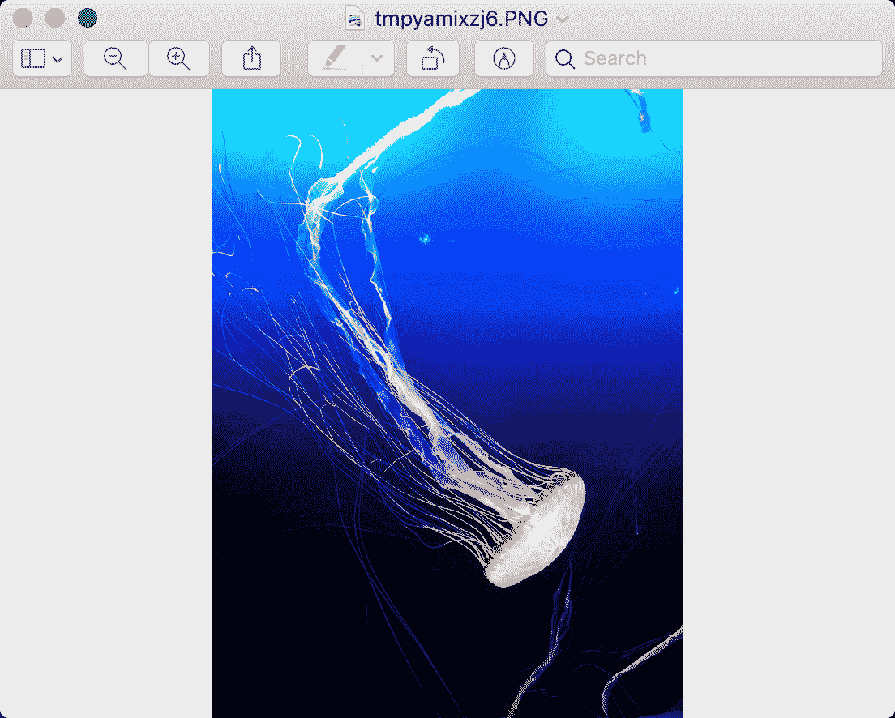

这非常方便，因为现在您可以使用 Python 查看图像，而无需编写完整的图形用户界面。您也可以使用 Pillow 来了解更多关于图像的信息。创建一个名为`get_image_info.py`的新文件，并将以下代码添加到其中:

```py
# get_image_info.py

from PIL import Image

def get_image_info(path):
    image = Image.open(path)
    print(f'This image is {image.width} x {image.height}')
    exif = image._getexif()
    print(exif)

if __name__ == '__main__':
    get_image_info('ducks.jpg')

```

这里你使用`image`对象得到图像的宽度和高度。然后使用`_getexif()`方法获取关于图像的元数据。EXIF 代表“可交换图像文件格式”，是一种指定数码相机使用的图像、声音和辅助标签格式的标准。输出非常详细，但您可以从数据中了解到，这张特定的照片是用索尼 6300 相机拍摄的，设置如下:“E 18-200mm F3.5-6.3 OSS LE”。照片的时间戳也在 Exif 信息中。

但是，如果您使用照片编辑软件进行裁剪、应用滤镜或进行其他类型的图像处理，Exif 数据可能会被更改。这可以删除部分或全部 Exif 数据。试着在你自己的一些照片上运行这个功能，看看你能提取出什么样的信息！

您可以从图像中提取的另一个有趣信息是直方图数据。图像的直方图是其色调值的图形表示。它将照片的亮度显示为一个数值列表，您可以用图形表示出来。让我们以这张图片为例:

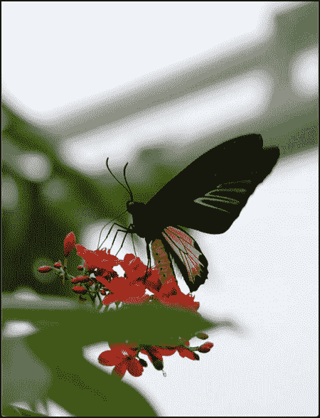

要从该图像中获得直方图，您将使用图像的`histogram()`方法。然后你会用 Matplotlib 把它画出来。要查看实现这一点的一种方法，创建一个名为`get_histrogram.py`的新文件，并向其中添加以下代码:

```py
# get_histrogram.py

import matplotlib.pyplot as plt

from PIL import Image

def get_image_histrogram(path):
    image = Image.open(path)
    histogram = image.histogram()
    plt.hist(histogram, bins=len(histogram))
    plt.xlabel('Histogram')
    plt.show()

if __name__ == '__main__':
    get_image_histrogram('butterfly.jpg')

```

当运行这段代码时，像以前一样打开图像。然后从中提取直方图，并将值列表传递给 Matplotlib 对象，在该对象中调用`hist()`函数。`hist()`函数接受值列表以及值范围内的等宽仓的数量。

运行此代码时，您将看到下图:

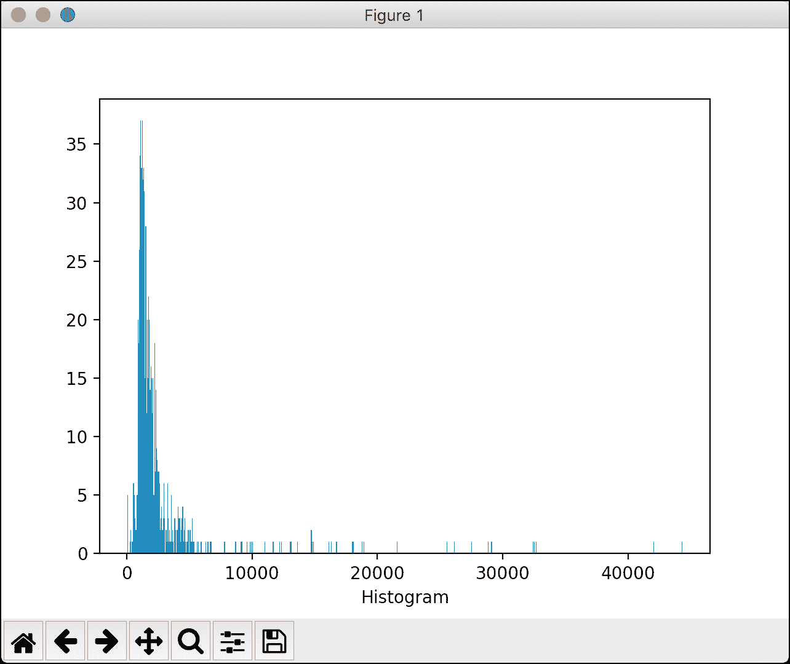

这个图表显示了之前提到的图像中的色调值。您可以尝试传入 Github 上包含的一些其他图像来查看不同的图表，或者换入一些您自己的图像来查看它们的直方图。

现在让我们来看看如何使用 Pillow 来裁剪图像！

## 裁剪图像

当你拍照时，照片的主体经常会移动，或者你没有放大足够远。这导致照片中图像的焦点并不在正面中央。要解决此问题，您可以将图像裁剪到您想要突出显示的图像部分。

枕头内置了这种功能。要了解它是如何工作的，创建一个名为`cropping.py`的文件，并向其中添加以下代码:

```py
# cropping.py

from PIL import Image

def crop_image(path, cropped_path):
    image = Image.open(path)
    cropped = image.crop((40, 590, 979, 1500))
    cropped.save(cropped_path)

if __name__ == '__main__':
    crop_image('ducks.jpg', 'ducks_cropped.jpg')

```

`crop_image()`函数接受您希望裁剪的文件的路径以及新裁剪文件的路径。然后你像以前一样`open()`这个文件并打电话给`crop()`。此方法采用您用来裁剪的起始和结束 x/y 坐标。您正在创建一个用于裁剪的框。

让我们拍摄这张有趣的鸭子照片，并尝试使用上面的代码进行裁剪:

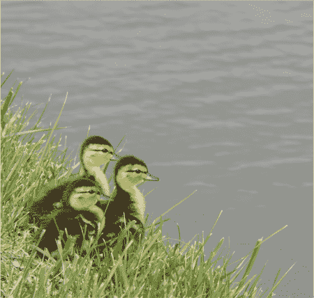

现在，当您对此运行代码时，您将得到以下裁剪后的图像:

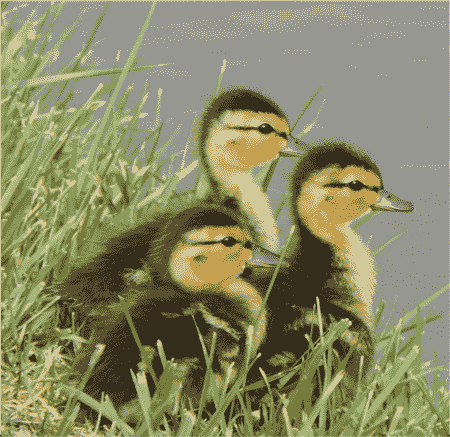

您用来裁剪的坐标会因照片而异。事实上，您可能应该更改这段代码，以便它接受裁剪坐标作为参数。你可以自己做一点功课。找出要使用的裁剪边界框需要一些反复试验。你可以使用 Gimp 这样的工具来帮助你，用 Gimp 画一个边界框，并记下它给你的坐标，用 Pillow 试试。

现在让我们继续学习如何将滤镜应用到你的图片中！

## 使用过滤器

枕头包有几个过滤器，您可以应用到您的图像。以下是当前支持的过滤器:

*   虚化
*   轮廓
*   详述
*   边缘增强
*   边缘 _ 增强 _ 更多
*   装饰
*   查找 _ 边
*   尖锐
*   光滑的
*   平滑 _ 更多

让我们使用之前的蝴蝶图像来测试这些过滤器。以下是您将使用的图像:


现在您已经有了一个可以使用的图像，接下来创建一个名为`blur.py`的新文件，并将这段代码添加到其中，以试用 Pillow 的`BLUR`过滤器:

```py
# blur.py

from PIL import Image
from PIL import ImageFilter

def blur(path, modified_photo):
    image = Image.open(path)
    blurred_image = image.filter(ImageFilter.BLUR)
    blurred_image.save(modified_photo)

if __name__ == '__main__':
    blur('butterfly.jpg', 'butterfly_blurred.jpg')

```

要在 Pillow 中实际使用滤镜，需要导入`ImageFilter`。然后将您想要使用的特定过滤器传递给`filter()`方法。当你调用`filter()`时，它会返回一个新的图像对象。然后将文件保存到磁盘。

这是您运行代码时将得到的图像:

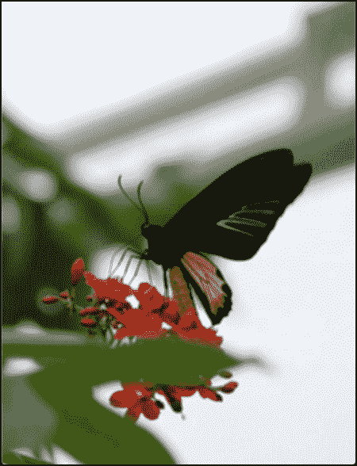

这看起来有点模糊，所以你可以认为这是一个成功！如果你想让它更模糊，你可以通过你的脚本第二次运行模糊的照片。

当然，有时候你拍的照片有点模糊，你想把它们锐化一点。枕头包括你可以应用的过滤器。创建一个名为`sharpen.py`的新文件，并添加以下代码:

```py
# sharpen.py

from PIL import Image
from PIL import ImageFilter

def sharpen(path, modified_photo):
    image = Image.open(path)
    sharpened_image = image.filter(ImageFilter.SHARPEN)
    sharpened_image.save(modified_photo)

if __name__ == '__main__':
    sharpen('butterfly.jpg', 'butterfly_sharper.jpg')

```

在这里，你要拍摄原始的蝴蝶照片，并在保存之前应用`SHARPEN`滤镜。当您运行此代码时，您的结果将如下所示:

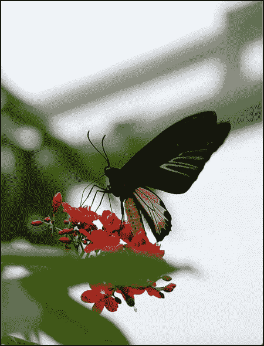

根据您的视力和显示器的质量，您可能会看到也可能看不到太大的差异。不过，你可以放心，它稍微锋利一点。

现在让我们来看看如何给你的图片添加边框！

## 添加边框

让照片看起来更专业的一个方法是给它们添加边框。Pillow 通过他们的`ImageOps`模块让这变得非常容易。但是在你做任何边界之前，你需要一个图像。下面是您将使用的一个:

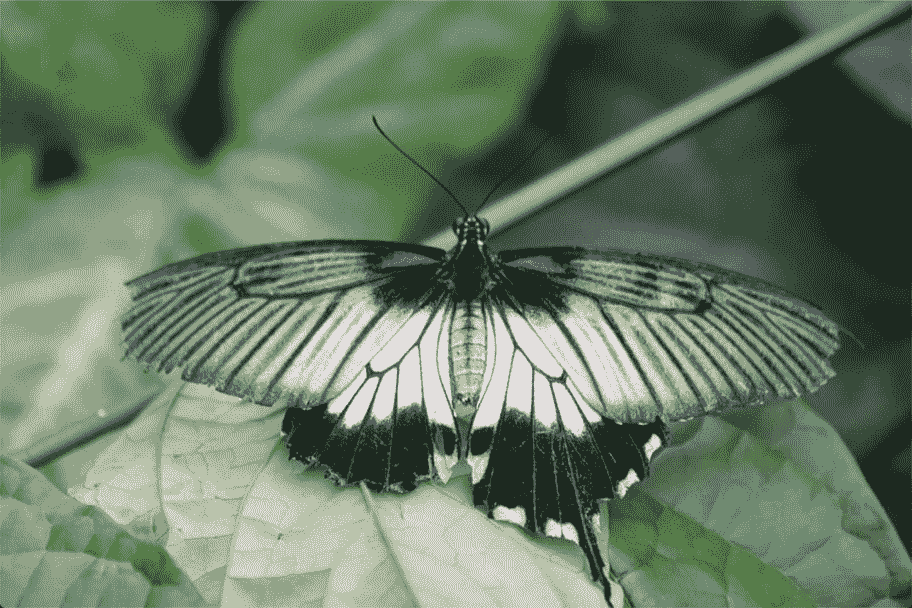

现在您已经有了一个很好的图像，接下来创建一个名为`border.py`的文件，并将以下代码放入其中:

```py
# border.py

from PIL import Image, ImageOps

def add_border(input_image, output_image, border):
    img = Image.open(input_image)

    if isinstance(border, int) or isinstance(border, tuple):
        bimg = ImageOps.expand(img, border=border)
    else:
        raise RuntimeError('Border is not an integer or tuple!')

    bimg.save(output_image)

if __name__ == '__main__':
    in_img = 'butterfly_grey.jpg'

    add_border(in_img, output_image='butterfly_border.jpg',
             border=100)

```

`add_border()`函数接受 3 个参数:

*   `input_image` -要添加边框的图像
*   `output_image` -应用了新边框的图像
*   `border` -以像素为单位应用的边框数量

在这段代码中，您告诉 Pillow，您想要为传入的照片添加一个 100 像素的边框。当您传入一个整数时，该整数将用于所有四条边的边框。边框的默认颜色是黑色。这里的关键方法是`expand()`，它接受图像对象和边框量。

当您运行这段代码时，您将得到这个可爱的结果:

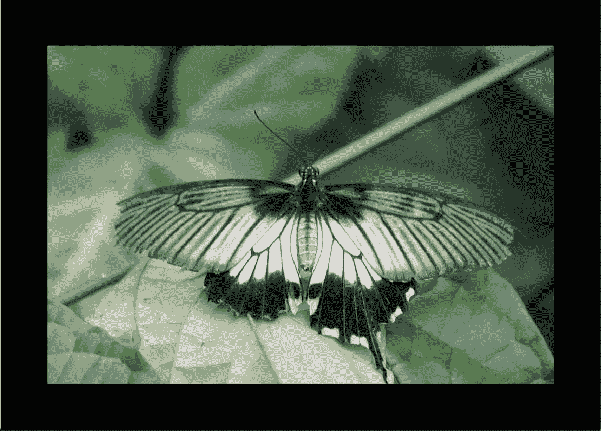

您可以传入一组值来使边框具有不同的宽度。例如，如果你传入`(10, 50)`，它会在图片的左右两边添加一个 10 像素的边框，在顶部和底部添加一个 50 像素的边框。试着用上面的代码做这件事，然后重新运行。如果这样做，您将得到以下内容:

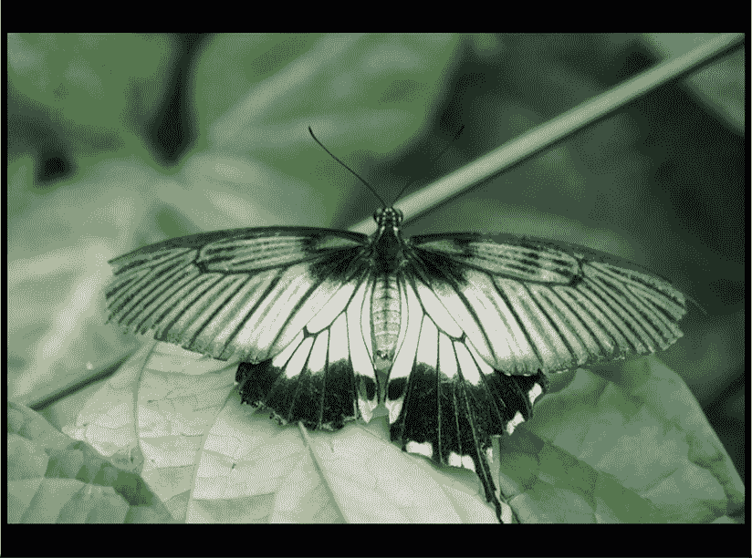

这不是很好吗？如果你想变得更漂亮，你可以为图像的四个边传递不同的值。但是可能没有太多有意义的用例。

有一个黑色的边框是很好的，但有时你会想给你的图片添加一点活力。您可以通过将参数`fill`传递给`expand()`来更改边框颜色。该参数采用命名颜色或 RGB 颜色。

创建一个名为`colored_border.py`的新文件，并将以下代码添加到其中:

```py
# colored_border.py

from PIL import Image, ImageOps

def add_border(input_image, output_image, border, color=0):
    img = Image.open(input_image)

    if isinstance(border, int) or isinstance(
        border, tuple):
        bimg = ImageOps.expand(img,
                               border=border, 
                               fill=color)
    else:
        msg = 'Border is not an integer or tuple!'
        raise RuntimeError(msg)

    bimg.save(output_image)

if __name__ == '__main__':
    in_img = 'butterfly_grey.jpg'

    add_border(in_img,
               output_image='butterfly_border_red.jpg',
               border=100,
               color='indianred')

```

现在你的`add_border()`函数接受一个`color`参数，你把它传递给`expand()`方法。当您运行这段代码时，您会看到这样的结果:

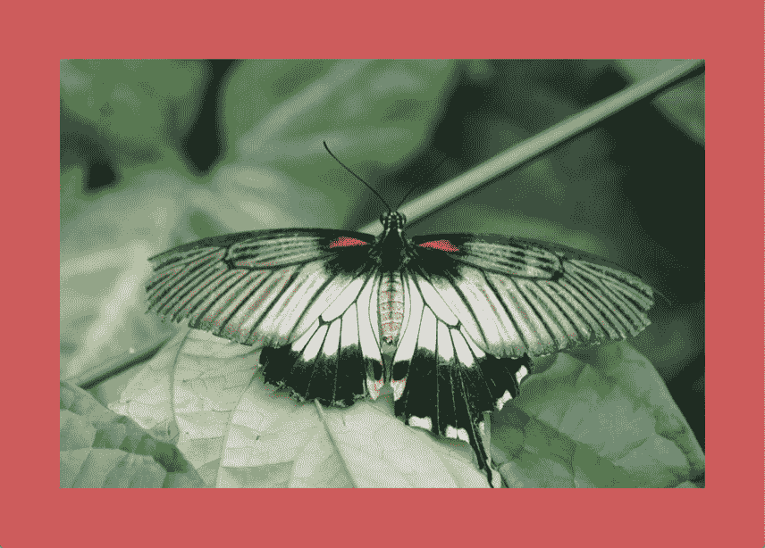

看起来很不错。你可以尝试不同的颜色，或者用自己喜欢的颜色作为边框。

枕头之旅的下一个项目是学习如何调整图像大小！

## 调整图像大小

使用 Pillow 调整图像大小相当简单。您将使用`resize()`方法，该方法接受一个整数元组，用于调整图像的大小。为了了解这是如何工作的，你将使用这张可爱的蜥蜴照片:

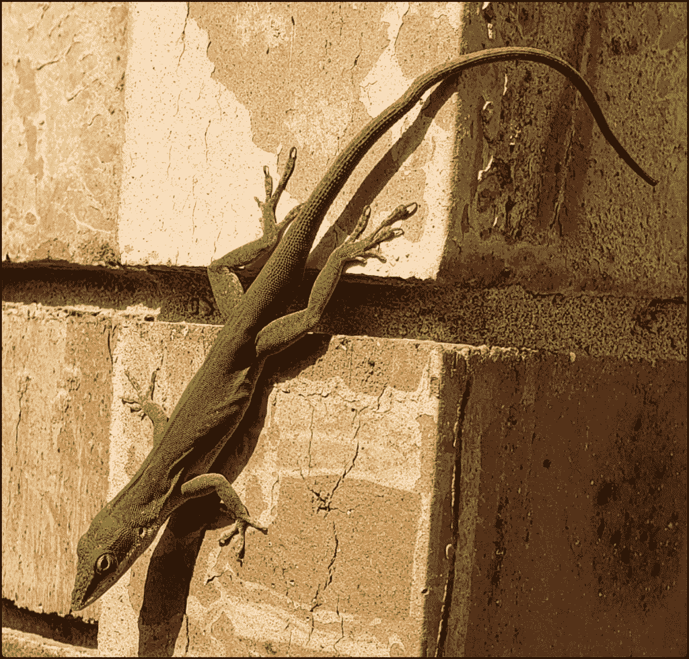

现在您已经有了一张照片，继续创建一个名为`resize_image.py`的新文件，并将以下代码放入其中:

```py
# resize_image.py

from PIL import Image

def resize_image(input_image_path, output_image_path, size):
    original_image = Image.open(input_image_path)
    width, height = original_image.size
    print(f'The original image size is {width} wide x {height} '
          f'high')

    resized_image = original_image.resize(size)
    width, height = resized_image.size
    print(f'The resized image size is {width} wide x {height} '
          f'high')
    resized_image.show()
    resized_image.save(output_image_path)

if __name__ == '__main__':
    resize_image(
            input_image_path='lizard.jpg',
            output_image_path='lizard_small.jpg',
            size=(800, 400),
            )

```

这里，您传入蜥蜴照片，并告诉 Pillow 将其大小调整为 600 x 400。当您运行这段代码时，输出会告诉您原始照片在为您调整大小之前是 1191 x 1141 像素。

运行这段代码的结果如下所示:

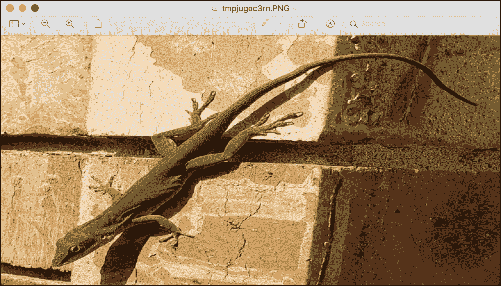

嗯，这看起来有点奇怪！Pillow 在调整图像大小时实际上不做任何缩放。相反，枕头会拉伸或扭曲你的图像，以适应你告诉它使用的值。

你要做的是**缩放**图像。要做到这一点，您需要创建一个名为`scale_image.py`的新文件，并向其中添加一些新代码。以下是您需要的代码:

```py
# scale_image.py

from PIL import Image

def scale_image(
            input_image_path,
            output_image_path,
            width=None,
            height=None
    ):
    original_image = Image.open(input_image_path)
    w, h = original_image.size
    print(f'The original image size is {w} wide x {h} '
          'high')

    if width and height:
        max_size = (width, height)
    elif width:
        max_size = (width, h)
    elif height:
        max_size = (w, height)
    else:
        # No width or height specified
        raise ValueError('Width or height required!')

    original_image.thumbnail(max_size, Image.ANTIALIAS)
    original_image.save(output_image_path)

    scaled_image = Image.open(output_image_path)
    width, height = scaled_image.size
    print(f'The scaled image size is {width} wide x {height} '
          'high')

if __name__ == '__main__':
    scale_image(
            input_image_path='lizard.jpg',
            output_image_path='lizard_scaled.jpg',
            width=800,
            )

```

这一次，您让用户指定宽度和高度。如果用户指定了宽度和/或高度，那么条件语句使用这些信息创建一个`max_size`。一旦计算出了`max_size`的值，就将它传递给`thumbnail()`并保存结果。如果用户指定了这两个值，`thumbnail()`将在调整大小时正确保持纵横比。

当您运行这段代码时，您会发现结果是原始图像的一个较小版本，并且它现在保持了它的纵横比。

## 包扎

Pillow 对于使用 Python 处理图像非常有用。在本文中，您学习了如何执行以下操作:

*   打开图像
*   裁剪图像
*   使用过滤器
*   添加边框
*   调整图像大小

你可以用枕头做比这里展示的更多的事情。例如，您可以进行各种图像增强，如更改图像的对比度或亮度。或者你可以将多张图片合成在一起。枕头还有许多其他用途。您应该检查一下这个包，并阅读它的文档以了解更多信息。

## 相关阅读

这篇文章基于 **Python 101 第二版**中的一章，你可以在 [Leanpub](https://leanpub.com/py101) 或[亚马逊](https://amzn.to/2Zo1ARG)上购买。

如果你想学习更多的 Python，那么看看这些教程:

*   python 101-[记录你的代码](https://www.blog.pythonlibrary.org/2021/09/12/documenting-code/)

*   Python 101: [使用 JSON 的介绍](https://www.blog.pythonlibrary.org/2020/09/15/python-101-an-intro-to-working-with-json/)

*   python 101-[创建多个流程](https://www.blog.pythonlibrary.org/2020/07/15/python-101-creating-multiple-processes/)