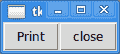

# Python 101: Lambda 基础

> 原文：<https://www.blog.pythonlibrary.org/2015/10/28/python-101-lambda-basics/>

许多编程语言都有 lambda 函数的概念。在 Python 中，lambda 是匿名函数或非绑定函数。它们的语法看起来有点奇怪，但实际上只是将一个简单的函数变成一行程序。让我们从一个常规的简单函数开始:

```py

#----------------------------------------------------------------------
def doubler(x):
    return x*2

```

这个函数所做的就是取一个整数，然后翻倍。从技术上来说，它还会加倍其他东西，因为没有类型检查，但这是它的意图，现在让我们把它变成一个 lambda 函数！

幸运的是，将一行函数转换成 lambda 非常简单。方法如下:

```py

doubler = lambda x: x*2

```

所以 lambda 的工作方式和函数差不多。我们先说清楚，这里的“x”是你传入的参数。冒号将参数列表与返回值或表达式分开。所以当你到了“x*2”部分，这就是返回的内容。让我们看另一个例子:

```py

>>> poww = lambda i: i**2
>>> poww(2)
4
>>> poww(4)
16
>>> (lambda i: i**2)(6)
36

```

在这里，我们演示了如何创建一个 lambda，它接受一个输入并对其求平方。Python 社区中有一些关于是否应该给变量赋值 lambda 的争论。原因是当你命名一个 lambda 时，它不再是真正的匿名，你还不如只写一个普通的函数。lambda 的要点是使用一次就扔掉。上面的最后一个例子展示了一种匿名调用 lambda 的方法(即使用一次)。

此外，如果你给 lambda 命名，你可以这样做:

```py

>>> def poww(i): return i**2
>>> poww(2)
4

```

让我们继续，看看如何在列表理解中使用 lambda！

* * *

### Lambdas，列表理解和地图

除了在事件回调中使用 lambdass 之外，我总是很难想出 lambda 的好的用法。所以我去找了一些其他的用例。似乎有些人喜欢在列表理解中使用它们。这里有几个例子:

```py

>>> [(lambda x: x*3)(i) for i in range(5)]
[0, 3, 6, 9, 12]
>>> tripler = lambda x: x*3
>>> [tripler(i) for i in range(5)]
[0, 3, 6, 9, 12]

```

第一个例子有点尴尬。虽然它匿名调用 lambda，但阅读起来也有点困难。下一个例子把 lambda 赋值给一个变量，然后我们这样调用它。有趣的是 Python 有一个内置的方法来调用一个带有 iterable 的函数，这个函数叫做 **map** 。以下是您通常使用它的方式:

```py

map(function, interable)

```

这是一个使用我们之前的 lambda 函数的真实例子:

```py

>>> map(tripler, range(5))
[0, 3, 6, 9, 12]

```

当然，在大多数情况下，lambda 非常简单，在列表中做同样的事情可能更容易理解:

```py

>>> [x*3 for x in range(5)]
[0, 3, 6, 9, 12]

```

* * *

### λ的其他用途

我的读者建议了 lambda 的一些其他用途。第一个例子是从函数调用中返回一个 lambda:

```py

>>> def increment(n): 
        return lambda(x): x + n
>>> i = increment(5)
>>> i(2)
7

```

这里我们创建了一个函数，无论我们给它什么，它都会递增 5。我的另一个读者建议给 Python 的**排序的**函数传递一个 lambda:

```py

sorted(list, key=lambda i: i.address)

```

这里的想法是用属性“地址”对对象列表进行排序。然而，我仍然发现 lambda 的最佳用例仍然是事件回调，所以让我们看看如何使用 Tkinter 来使用它们。

* * *

### 使用 lambda 进行回调

[](https://www.blog.pythonlibrary.org/wp-content/uploads/2015/10/lambda_tk.png)

Tkinter 是 Python 内置的一个 GUI 工具包。当你想与你的用户界面交互时，你通常会使用键盘和鼠标。这些交互通过事件工作，这就是 lambda 出现的地方。让我们创建一个简单的用户界面，这样您就可以看到 lambda 是如何在 Tkinter 中使用的！

```py

import Tkinter as tk

########################################################################
class App:
    """"""

    #----------------------------------------------------------------------
    def __init__(self, parent):
        """Constructor"""
        frame = tk.Frame(parent)
        frame.pack()

        print_btn = tk.Button(frame, text='Print',
                              command=lambda: self.onPrint('Print'))
        print_btn.pack(side=tk.LEFT)

        close_btn = tk.Button(frame, text='close', command=frame.quit)
        close_btn.pack(side=tk.LEFT)

    #----------------------------------------------------------------------
    def onPrint(self, num):
        print "You just printed something"

#----------------------------------------------------------------------
if __name__ == "__main__":
    root = tk.Tk()
    app = App(root)
    root.mainloop()

```

这里我们有一个简单的用户界面，有两个按钮。一个按钮使用 lambda 调用 **onPrint** 方法，而另一个按钮使用 Tkinter 方法关闭应用程序。如你所见，Tkinter 对 lambda 的使用符合其初衷。这里的 lambda 用一次就扔掉了。除了按下按钮之外，没有其他方法可以引用它。

* * *

### 包扎

正如我的长期读者可能知道的，五年前我在另一篇文章中写过关于 lambda 的文章。那时，我对兰姆达斯没有太大的用处，坦白地说，现在也没有。它们是这种语言的一个简洁的特性，但是在用 Python 编程 9 年多之后，我几乎没有发现使用它们的需要，尤其是在它们应该被使用的方式上。而是每个人自己的。使用 lambdas 当然没有错，但是我希望这篇文章对于弄清楚您是否真的需要在自己的工作中使用它们是有用的。

* * *

### 相关阅读

*   巨蟒[λ](https://www.blog.pythonlibrary.org/2010/07/19/the-python-lambda/)
*   [又一个 Lambda 教程](https://pythonconquerstheuniverse.wordpress.com/2011/08/29/lambda_tutorial/)
*   [用 Python lambdas 迭代](http://caisbalderas.com/blog/iterating-with-python-lambdas/)
*   当操作列表中的元素时，使用列表理解还是使用带有 lambda 函数的 map 更好？- [Quora](https://www.quora.com/Is-it-better-to-use-list-comprehensions-or-map-with-a-lambda-function-when-manipulating-elements-in-a-list)
*   使用 lambda 函数深入 Python-