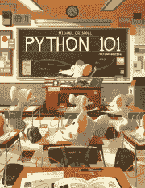

# Python 101:学习集合

> 原文：<https://www.blog.pythonlibrary.org/2020/04/28/python-101-learning-about-sets/>

根据 Python 3 文档，数据类型被定义为“不同可散列对象的无序集合”。您可以使用`set`进行成员测试，从序列中删除重复项，并计算数学运算，如交集、并集、差集和对称差集。

由于它们是无序的集合，`set`不记录元素的位置或插入顺序。因此，它们也不支持索引、切片或其他类似序列的行为，而这些行为你在列表和元组中见过。

Python 语言内置了两种类型的`set`:

*   可变的
*   这是不可改变的，也是可改变的

本文将重点介绍`set`。

您将学习如何使用器械包执行以下操作:

*   创建一个`set`
*   访问`set`成员
*   时代的变化
*   添加项目
*   移除项目
*   删除一个`set`

让我们从创建一套开始吧！

| [](https://leanpub.com/py101/) | Would you like to learn more about Python?

### Python 101 -第二版

**[在 Leanpub](https://leanpub.com/py101) 上立即购买** |

### 创建集合

创建一个`set`非常简单。您可以通过在花括号内添加一系列逗号分隔的对象来创建它们，或者您可以将一个序列传递给内置的`set()`函数。

让我们看一个例子:

```py
>>> my_set = {"a", "b", "c", "c"}
>>> my_set
{'c', 'a', 'b'}
>>> type(my_set)
<class 'set'>
```

A `set`使用了你用来创建字典的相同的花括号。请注意，您有一系列值，而不是`key: value`对。当您打印出`set`时，您可以看到重复的内容被自动删除了。

现在让我们尝试使用`set()`创建一个`set`:

```py
>>> my_list = [1, 2, 3, 4]
>>> my_set = set(my_list)
>>> my_set
{1, 2, 3, 4}
>>> type(my_set)
<class 'set'>
```

在这个例子中，您创建了一个`list`，然后使用`set()`将其转换为一个`set`。如果`list`中有任何重复，它们将被删除。

现在让我们继续，看看可以用这种数据类型做些什么。

### 访问集合成员

您可以使用 Python 的`in`操作符来检查项目是否在`set`中:

```py
>>> my_set = {"a", "b", "c", "c"}
>>> "a" in my_set
True
```

集合不允许你使用切片或类似的方法来访问`set`的单个成员。相反，您需要迭代一个`set`。你可以使用一个循环来完成，比如一个`while`循环或者一个`for`循环。

在本文中，您不会深入讨论循环，但是下面是使用`for`循环迭代集合的基本语法:

```py
>>> for item in my_set:
...     print(item)
... 
c
a
b
```

这将循环遍历`set`中的每一项，一次一项，并将其打印出来。

### 时代的变化

一旦创建了一个`set`，您就不能更改它的任何项目。

但是，您可以向`set`添加新项目。让我们来看看是如何做到的！

### 添加项目

向`set`添加项目有两种方式:

*   `add()`
*   `update()`

让我们尝试使用`add()`添加一个项目:

```py
>>> my_set = {"a", "b", "c", "c"}
>>> my_set.add('d')
>>> my_set
{'d', 'c', 'a', 'b'}
```

那很容易！您可以通过将项目传递给`add()`方法来将它添加到`set`中。

如果您想一次添加多个项目，那么您应该使用`update()`来代替:

```py
>>> my_set = {"a", "b", "c", "c"}
>>> my_set.update(['d', 'e', 'f'])
>>> my_set
{'a', 'c', 'd', 'e', 'b', 'f'}
```

注意`update()`将接受你传递给它的任何 iterable。例如，它可能需要一个`list`、`tuple`或另一个`set`。

### 移除项目

您可以用几种不同的方式从器械包中移除物品。

您可以使用:

*   `remove()`
*   `discard()`
*   `pop()`

让我们在接下来的小节中逐一查看！

#### 使用。移除()

`remove()`方法将尝试从`set`中移除指定的项目:

```py
>>> my_set = {"a", "b", "c", "c"}
>>> my_set.remove('a')
>>> my_set
{'c', 'b'}
```

如果您碰巧向`set`到`remove()`询问一个不存在的项目，您将收到一个错误:

```py
>>> my_set = {"a", "b", "c", "c"}
>>> my_set.remove('f')
Traceback (most recent call last):
  Python Shell, prompt 208, line 1
builtins.KeyError: 'f'
```

现在让我们看看密切相关的`discard()`方法是如何工作的！

#### 使用。丢弃()

`discard()`方法的工作方式与`remove()`几乎完全相同，它将从`set`中删除指定的项目:

```py
>>> my_set = {"a", "b", "c", "c"}
>>> my_set.discard('b')
>>> my_set
{'c', 'a'}
```

与`discard()`的不同之处在于，如果你试图移除一个不存在的项目，它**不会**抛出错误:

```py
>>> my_set = {"a", "b", "c", "c"}
>>> my_set.discard('d')
>>>
```

如果您希望能够在尝试移除不存在的项目时捕捉到错误，请使用`remove()`。如果你不介意，那么`discard()`可能是更好的选择。

#### 使用。流行()

`pop()`方法将从`set`中移除并返回任意一项:

```py
>>> my_set = {"a", "b", "c", "c"}
>>> my_set.pop()
'c'
>>> my_set
{'a', 'b'}
```

如果您的器械包是空的，并且您试图`pop()`取出物品，您将收到一条错误消息:

```py
>>> my_set = {"a"}
>>> my_set.pop()
'a'
>>> my_set.pop()
Traceback (most recent call last):
  Python Shell, prompt 219, line 1
builtins.KeyError: 'pop from an empty set'
```

这与`pop()`处理`list`数据类型的方式非常相似，除了对于`list`，它将引发一个`IndexError`。列表是有序的，而集合是无序的，所以你不能确定你会用`pop()`删除什么，因为集合是无序的。

### 清除或删除集合

有时候你会想清空一个`set`甚至完全移除它。

要清空一个`set`，可以使用`clear()`:

```py
>>> my_set = {"a", "b", "c", "c"}
>>> my_set.clear()
>>> my_set
set()
```

如果你想完全删除`set`，那么你可以使用 Python 的内置`del`:

```py
>>> my_set = {"a", "b", "c", "c"}
>>> del my_set
>>> my_set
Traceback (most recent call last):
  Python Shell, prompt 227, line 1
builtins.NameError: name 'my_set' is not defined
```

现在，让我们学习一下您还可以用器械包做什么！

### 集合操作

器械包为您提供了一些常见的操作，例如:

*   `union()` -合并两个集合并返回一个新集合
*   `intersection()` -返回两个集合中相同元素的新集合
*   `difference()` -返回一个新的`set`，其元素不在另一个`set`中

这些操作是您在使用`sets`时最常用的操作。

`union()`方法实际上有点像你之前学过的`update()`方法，因为它将两个或更多的集合组合成一个新的集合。但是，不同之处在于它返回一个新的集合，而不是用新项目更新原始集合:

```py
>>> first_set = {'one', 'two', 'three'}
>>> second_set = {'orange', 'banana', 'peach'}
>>> first_set.union(second_set)
{'two', 'banana', 'three', 'peach', 'orange', 'one'}
>>> first_set
{'two', 'three', 'one'}
```

在本例中，您创建了两个集合。然后在第一个集合上使用`union()`来添加第二个集合。然而`union`并没有更新`set`。它创建了一个新的`set`。如果你想保存新的`set`，那么你应该改为执行以下操作:

```py
>>> united_set = first_set.union(second_set)
>>> united_set
{'two', 'banana', 'three', 'peach', 'orange', 'one'}
```

`intersection()`方法接受两个集合并返回一个新的`set`,它只包含两个集合中相同的项目。

让我们看一个例子:

```py
>>> first_set = {'one', 'two', 'three'}
>>> second_set = {'orange', 'banana', 'peach', 'one'}
>>> first_set.intersection(second_set)
{'one'}
```

这两个集合只有一个共同点:字符串“one”。因此，当您调用`intersection()`时，它会返回一个新的`set`，其中只有一个元素。与`union()`一样，如果您想要保存这个新的`set`，那么您会想要做这样的事情:

```py
>>> intersection = first_set.intersection(second_set)
>>> intersection
{'one'}
```

`difference()`方法将返回一个新的集合，该集合中的元素是另一个集合中的**而不是**。这可能有点令人困惑，所以我们来看几个例子:

```py
>>> first_set = {'one', 'two', 'three'}
>>> second_set = {'three', 'four', 'one'}
>>> first_set.difference(second_set)
{'two'}
>>> second_set.difference(first_set)
{'four'}
```

当您在`first_set`上调用`difference()`时，它返回一个以“two”作为其唯一元素的`set`。这是因为“two”是唯一没有在`second_set`中找到的字符串。当你在`second_set`上调用`difference()`时，它会返回“四”，因为“四”不在`first_set`中。

还有其他方法可以用于集合，但是它们很少被使用。如果你需要使用这些方法，你应该去查阅文档以获得关于这些方法的全部细节。

### 包扎

集合是一种很好的数据类型，用于非常特殊的情况。您会发现集合对于删除重复列表或元组最有用，或者通过使用它们来查找多个列表之间的差异。

在本文中，您了解了以下内容:

*   创建一个`set`
*   访问`set`成员
*   时代的变化
*   添加项目
*   移除项目
*   删除一个`set`

任何时候你需要使用类似集合的操作，你都应该看看这个数据类型。然而，很有可能，您会更频繁地使用列表、字典和元组。

### 相关阅读

*   python 101-[处理字符串](https://www.blog.pythonlibrary.org/2020/04/07/python-101-working-with-strings/)
*   python 101-[了解字典](https://www.blog.pythonlibrary.org/2020/03/31/python-101-learning-about-dictionaries/)
*   python 101-[了解元组](https://www.blog.pythonlibrary.org/2020/03/26/python-101-learning-about-tuples/)
*   Python 101: [了解列表](https://www.blog.pythonlibrary.org/2020/03/10/python-101-learning-about-lists/)