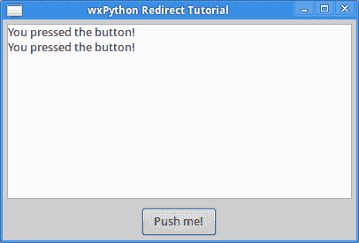

# Python 101:重定向标准输出

> 原文：<https://www.blog.pythonlibrary.org/2016/06/16/python-101-redirecting-stdout/>

将 stdout 重定向到大多数开发人员在某个时候需要做的事情。将 stdout 重定向到文件或类似文件的对象会很有用。在我的一些桌面 GUI 项目中，我还将 stdout 重定向到一个文本控件。在本文中，我们将了解以下内容:

*   将标准输出重定向到文件(简单)
*   外壳重定向方法
*   使用自定义上下文管理器重定向 stdout
*   Python 3's contextlib.redirect_stdout()
*   将 stdout 重定向到 wxPython 文本控件

* * *

### 重定向标准输出

在 Python 中重定向 stdout 最简单的方法就是给它分配一个 open file 对象。让我们看一个简单的例子:

```py

import sys

def redirect_to_file(text):
    original = sys.stdout
    sys.stdout = open('/path/to/redirect.txt', 'w')
    print('This is your redirected text:')
    print(text)
    sys.stdout = original

    print('This string goes to stdout, NOT the file!')

if __name__ == '__main__':Redirecting stdout / stderr
    redirect_to_file('Python rocks!')

```

这里我们只是导入 Python 的 sys 模块并创建一个函数，我们可以传递我们希望重定向到文件的字符串。我们保存了对 **sys.stdout** 的引用，这样我们可以在函数结束时恢复它。如果您打算将 stdout 用于其他用途，这可能会很有用。在运行这段代码之前，请确保将路径更新为可以在您的系统上运行的路径。当您运行它时，您应该在文件中看到以下内容:

```py

This is your redirected text:
Python rocks!

```

最后一条 print 语句将被输出到 stdout，而不是文件。

* * *

### 外壳重定向

Shell 重定向也很常见，尤其是在 Linux 中，尽管 Windows 在大多数情况下也以同样的方式工作。让我们创建一个愚蠢的噪声函数示例，我们称之为 noisy.py:

```py

# noisy.py
def noisy(text):
    print('The noisy function prints a lot')
    print('Here is the string you passed in:')
    print('*' * 40)
    print(text)
    print('*' * 40)
    print('Thank you for calling me!')

if __name__ == '__main__':
    noisy('This is a test of Python!')

```

您会注意到，这次我们没有导入 sys 模块。原因是我们不需要它，因为我们将使用 shell 重定向。要进行 shell 重定向，请打开终端(或命令提示符)并导航到保存上面代码的文件夹。然后执行以下命令:

```py

python noisy.py > redirected.txt

```

大于号(即>)告诉您的操作系统将 stdout 重定向到您指定的文件名。此时，在 Python 脚本所在的文件夹中，应该有一个名为“redirected.txt”的文件。如果打开它，该文件应该包含以下内容:

```py

The noisy function prints a lot
Here is the string you passed in:
****************************************
This is a test of Python!
****************************************
Thank you for calling me!

```

这不是很酷吗？

* * *

### 用上下文管理器重定向标准输出

重定向 stdout 的另一个有趣的方法是使用上下文管理器。让我们创建一个定制的上下文管理器，它接受一个文件对象来将 stdout 重定向到:

```py

import sys
from contextlib import contextmanager

@contextmanager
def custom_redirection(fileobj):
    old = sys.stdout
    sys.stdout = fileobj
    try:
        yield fileobj
    finally:
        sys.stdout = old

if __name__ == '__main__':
    with open('/path/to/custom_redir.txt', 'w') as out:
        with custom_redirection(out):
            print('This text is redirected to file')
            print('So is this string')
        print('This text is printed to stdout')

```

当您运行这段代码时，它会将两行文本写到您的文件中，一行写到 stdout 中。像往常一样，我们在函数结束时重置 stdout。

* * *

### 使用 contextlib.redirect_stdout

Python 3.4 在他们的 contextlib 模块中加入了 redirect_stdout 函数。让我们尝试使用它来创建一个上下文管理器来重定向 stdout:

```py

import sys
from contextlib import redirect_stdout

def redirected(text, path):
    with open(path, 'w') as out:
        with redirect_stdout(out):
            print('Here is the string you passed in:')
            print('*' * 40)
            print(text)
            print('*' * 40)

if __name__ == '__main__':
    path = '/path/to/red.txt'
    text = 'My test to redirect'
    redirected(text, path)

```

这段代码稍微简单一点，因为内置函数会自动为您完成所有对 stdout 的让步和重置。除此之外，它的工作方式与我们的定制上下文管理器非常相似。

* * *

### 在 wxPython 中重定向 stdout



我已经多次写过关于在 wxPython 中重定向 stdout 的文章。下面这段代码其实来自我 2009 年写的一篇文章，2015 年更新:

```py

import sys
import wx

class MyForm(wx.Frame):

    def __init__(self):
        wx.Frame.__init__(self, None,
                          title="wxPython Redirect Tutorial")

        # Add a panel so it looks the correct on all platforms
        panel = wx.Panel(self, wx.ID_ANY)
        style = wx.TE_MULTILINE|wx.TE_READONLY|wx.HSCROLL
        log = wx.TextCtrl(panel, wx.ID_ANY, size=(300,100),
                          style=style)
        btn = wx.Button(panel, wx.ID_ANY, 'Push me!')
        self.Bind(wx.EVT_BUTTON, self.onButton, btn)

        # Add widgets to a sizer
        sizer = wx.BoxSizer(wx.VERTICAL)
        sizer.Add(log, 1, wx.ALL|wx.EXPAND, 5)
        sizer.Add(btn, 0, wx.ALL|wx.CENTER, 5)
        panel.SetSizer(sizer)

        # redirect text here
        sys.stdout = log

    def onButton(self, event):
        print "You pressed the button!"

# Run the program
if __name__ == "__main__":
    app = wx.App(False)
    frame = MyForm().Show()
    app.MainLoop()

```

这段代码只是创建了一个简单的框架，带有一个包含多行文本控件和一个按钮的面板。无论何时按下按钮，它都会将一些文本打印到 stdout，我们已经将它重定向到文本控件。试一试，看看效果如何！

* * *

### 包扎

现在，您已经知道了几种不同的将 stdout 重定向到文件的方法。有些方法比其他方法更好。就个人而言，我认为 Python 3 现在内置了一个专门用于这个目的的上下文管理器，这很酷。说到这里，Python 3 还有一个重定向 stderr 的功能。所有这些示例都可以稍加修改，以支持重定向 stderr 或同时重定向 stdout 和 stderr。我们最后谈到的是在 wxPython 中将 stdout 重定向到一个文本控件。这对于调试或获取子流程的输出非常有用，尽管在后一种情况下，您需要打印输出以正确重定向。

* * *

### 相关阅读

*   StackOverflow: [将标准输出重定向到 Python 中的一个文件](http://stackoverflow.com/questions/4675728/redirect-stdout-to-a-file-in-python)
*   wxPython – [Redirecting stdout / stderr](https://www.blog.pythonlibrary.org/2009/01/01/wxpython-redirecting-stdout-stderr/)