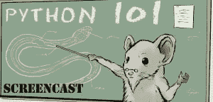

# Python 101 截屏发布

> 原文：<https://www.blog.pythonlibrary.org/2016/02/09/python-101-screencast-released/>

Python 101 的截屏已经完成一个多月了，我现在发布它供大众使用。

Python 101 截屏是根据我的书《Python 101》改编的。我看完了这本书的所有 44 章，并把每一章都变成了独立的截屏。换句话说，截屏覆盖了 44 个视频。你可以在我博客的 [youTube 页面](https://www.youtube.com/playlist?list=PLN0iJDXT7K2vB3EGwKpDV-VIylhs3dEV8)上观看前 11 个视频。

### **你得到了什么:**

最少 **44 集** +你将收到一份 PDF、MOBI 和 EPUB 版本的 Python 101 书籍。您还将收到一份 A4 大小的 PDF 副本。

第一部分

第一部分是初学者部分。在这里你将学到 Python 的所有基础知识。从 Python 类型(字符串、列表、字典)到条件语句再到循环。你还将学习理解、函数和类以及它们之间的一切！

第二部分

这一节是对 Python 标准库的有组织的参观。其目的并不是涵盖其中的所有内容，而是向读者展示开箱即用的 Python 可以做很多事情。我们将涵盖我认为在日常编程任务中最有用的模块，例如 **os、sys、日志、线程**等等。

**第三部分**

一个中间部分，涵盖了 **lambda，decorators，properties，debugging，testing 和 profiling** 。

**第四部分**

现在事情变得非常有趣！在第四部分，我们将学习如何从 Python 包索引和其他位置安装第三方库(即包)。我们将介绍简易安装和 pip。这一节也将是一系列的教程，在这里你将学习如何使用你下载的软件包。例如，您将学习如何下载文件、解析 XML、使用对象关系映射器处理数据库等。

**第五部分**

本系列的最后一部分将介绍如何与你的朋友和全世界分享你的代码！您将了解如何将其打包并在 Python 包索引上共享(例如，如何创建一个鸡蛋或轮子)。您还将学习如何使用 py2exe、bb_freeze、cx_freeze 和 PyInstaller 创建可执行文件。最后，您将学习如何使用 Inno Setup 创建安装程序

# [立即购买](https://gum.co/kaKNo)