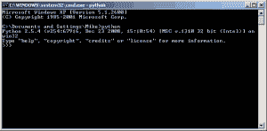

# Python 101:在 Windows 上设置 Python

> 原文：<https://www.blog.pythonlibrary.org/2011/11/24/python-101-setting-up-python-on-windows/>

Python 很容易在 Windows 上安装，但有时你需要做一些额外的调整，以真正获得最大的开发环境。在本文中，我们将尝试涵盖您可能想要做或安装的所有常见事情，以便设置一个理想的 Python Windows 开发工作区。你们中的一些人可能认为你需要做的就是安装 Python，然后你就完成了，但是如果你要做 Windows 开发，那么你将需要一些其他的包来使它更好。

## 安装和配置 Python

下载 [Python](http://www.python.org) 并运行安装程序。确保您获得了想要的版本(即 Python 2.7 或 3.x)。您还需要确保获得您想要的位类型，因为有 32 位和 64 位版本。*注意:32 位 Python 可以在 64 位系统上很好地运行，但反之则不然！*一旦你安装好，我们将继续前进。

现在，我们将确保 Python 设置正确。打开命令窗口，方法是进入开始>运行，然后键入“cmd”并按**回车**或**回车**。尝试在那里输入“python ”(不带引号),然后按回车键。如果您看到 Python shell，那么我们已经成功了一半。它应该是这样的:

如果没有，我们需要修改一些设置。

### 修改您的路径

在 Windows 上，通过将 Python 路径和脚本文件夹的路径添加到系统路径中，可以很好地修改路径设置。有一种方法可以做到:

1.  Right-Click "My Computer" and choose **Properties** (Windows XP) or you may have to go digging in Control Panel on Windows 7 and do a "Show All Control Panel Items" from the path bar and look for **System**. You should see something like this:

    

2.  Go to the **Advanced** tab and press the **Environmental Variable** button to see something like the following:

    

3.  这里你会看到两种类型的变量。底部是**系统变量**。向下滚动到标有**路径**的那一行，并在最后添加下面两行:；c:\ python 26；C:\Python26\Scripts(根据您的 Python 版本及其位置进行必要的调整)请注意，每个条目都由分号分隔，因此请确保您也这样做，否则将不起作用！

现在，您应该能够从命令行运行 Python 了。不仅如此，您还可以运行 Python 脚本文件夹中的特殊脚本。你为什么会在乎？嗯，如果你安装 easy_install / SetupTools 或 pip，他们会在你可以运行的脚本文件夹中安装东西。说到这里，既然您现在已经安装了全新的 Python，那么让我们花点时间向您展示如何安装第三方包。

## 如何在 Windows 上安装软件包

我们将以 pip 为例。它用于从 Python 包索引(PyPI，不要与 PyPy 混淆)中轻松安装 Python 包。无论如何，你需要去[这里](http://pypi.python.org/pypi/pip)下载它。pip 包在页面底部的 tar 和 pip 下载中。你可能需要像 [IZArc](http://www.izarc.org/) 或 [Filzip](http://www.filzip.com/) 这样的东西来解压它，因为 Windows 本身并不解压 tar 文件。

像以前一样打开一个命令行窗口。现在，您需要使用“cd”命令将目录切换到您解压缩文件的位置。这需要一些练习。在我的机器上，我通常解压到我的桌面，然后放入解压后的包中。一旦你进入了包含有 **setup.py** 文件的文件夹，你需要做的就是输入以下内容来安装它:

 `python setup.py install` 

大多数情况下，这很有效，并且软件包安装正确。偶尔，你会碰到某些抱怨他们需要编译器的包。如果你没有安装(比如 Visual Studio 或 MingW)，那么你就不能用这种方式安装这个包。你必须为它找到一个预打包的安装程序。在我的机器上，我通常也会安装 easy_install。出于某种原因，这个包被称为 [SetupTools](http://pypi.python.org/pypi/setuptools) 。无论如何，你过去需要 easy_install 的主要原因是它是安装 Python Eggs 的事实上的标准，你可以在这里或者这里阅读[。现在你可以使用 pip 或](http://mrtopf.de/blog/en/a-small-introduction-to-python-eggs/) [distribute](http://pypi.python.org/pypi/distribute) 来做同样的事情。这三个软件都可以安装压缩文件中的软件包。通常，使用这些实用程序中的一个来安装一个软件包，您所要做的就是这样:

 `easy_install PackageName
pip install PackageName` 

请阅读他们各自的文档以获取更多信息。

## 为 Windows 开发人员提供的其他方便的软件包

如果你是一个需要访问 Windows APIs 的严肃的 Windows 开发者，那么你将需要 [PyWin32](http://sourceforge.net/projects/pywin32/) 包。你也会想熟悉 [ctypes](http://docs.python.org/library/ctypes.html) ，但是从 2.5 版本开始 Python 就包含了这一点。PyWin32 是一个轻量级的 Windows APIs 包装器。你可以在 MSDN 上找到 API 文档，然后直接翻译成 Python。ctypes 包放在一个更低的层次上，可以用来直接与 dll 交互，等等。

在 Windows 上编程的另一个常见需求是访问窗口管理工具(WMI)。幸运的是，Tim Golden 写了一个很好的 wmi 模块。使用 PyWin32 通常可以获得相同的信息，但是这比仅仅使用 WMI 要复杂得多。Tim Golden 还编写了其他几个实用程序:

*   [WinSys](http://timgolden.me.uk/python/winsys/index.html) -面向 Windows 管理员的 Python 工具
*   winshell -一个轻松获取 Windows 路径的工具
*   一个活动目录包装器

你也应该看看他那令人敬畏的“[How I](http://timgolden.me.uk/python/win32_how_do_i.html)”系列教程。

最后，Python 包含一个名为 **_winreg** 的模块，您可以使用它来访问 Windows 注册表。这是一个非常强大的工具，如果您在 Windows 上执行大量管理脚本，它会非常有用。

## 用于 Windows 的其他 Python 安装

评论部分开始有人提到您可以获得的特殊 Python 安装，这些安装实际上包括 PyWin32 和其他打包在一个安装程序中的包。这也是一种选择。以下是其中的几个例子:

*   python xy——这个包包含了大量其他包，包括 PyWin32、SciPy、wxPython、NumPy 和许多其他包。它看起来像一个万事通。我没有用过这个，但是听起来很有趣。
*   这个链接是他们的付费版本，但是也有一个[轻量级免费版本](http://enthought.com/products/epd_free.php)。
*   ActiveState 的 active python(——它已经存在很长时间了，包括 PyWin32 文档和各种其他工具。

## 包扎

现在，您应该拥有了成为一名高效的 Python Windows 开发人员所需的所有工具。如果你需要帮助，PyWin32 和 ctypes 邮件列表是活跃的，他们有专家可以回答你想知道的关于这些包的任何问题。

## 进一步阅读

*   一个 Python 的 Windows 注册表[教程](https://www.blog.pythonlibrary.org/2010/03/20/pythons-_winreg-editing-the-windows-registry/)
*   另外一些关于 MvP 的文章是关于 [Windows 和 Python](https://www.blog.pythonlibrary.org/tag/windows/)
*   Windows 上的官方 Python 文档
*   另一个关于 Windows 上的 [Python 的教程](http://www.imladris.com/Scripts/PythonForWindows.html)
*   来自 ActiveState 的 PyWin32 [文档](http://docs.activestate.com/activepython/2.7/pywin32/PyWin32.HTML)