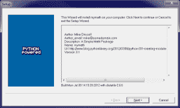

# Python 201:分布式工具简介

> 原文：<https://www.blog.pythonlibrary.org/2012/07/09/python-201-an-intro-to-distutils/>

上次我们学习了如何创建[模块和包](https://www.blog.pythonlibrary.org/2012/07/08/python-201-creating-modules-and-packages/)。今天，我们将使用我们创建的包，并使用 Python 的 distutils 创建几种不同的方法来分发我们的代码。在本教程中，我们将学习以下内容:

*   如何创建 setup.py 文件
*   如何创建源分布
*   如何创建 Windows 分发版

我们开始吧！

### 编写我们的第一个“setup.py”脚本

当您编写 setup.py 脚本时，需要注意它的位置。如果你把它放在你的包的文件夹中，当你试图构建一个发行版时，你会收到一个错误。如果您将 setup.py 文件放在有一堆其他文件夹的文件夹之外，您可能最终会添加一堆您不想添加的文件。因此，为了使这个超级简单，创建一个新文件夹，并将我们在上一篇文章中创建的“mymath”文件夹复制到您的新文件夹中。然后在 mymath 文件夹旁边创建 setup.py 文件。文件夹结构应该如下所示:

```py

myNewFolder/
    mymath/
    setup.py

```

*注:如果没有上一篇文章的代码，可以下载[mymath . zip](https://www.blog.pythonlibrary.org/wp-content/uploads/2012/07/mymath.zip)*

现在我们需要把一些代码放到我们的新脚本中。让我们看看下面的例子:

```py

from distutils.core import setup

setup(name = "mymath",
      version = "0.1",
      description = "A Simple Math Package",
      author = "Mike Driscoll",
      author_email = "mike@somedomain.com",
      url = "https://www.blog.pythonlibrary.org/2012/07/08/python-201-creating-modules-and-packages/",
      packages=["mymath"]
      )

```

嗯，这看起来很简单。如果我们想在 setup.py 文件中添加更多的包，我们只需将它们添加到**包**列表中。还有一个 **py_modules** 列表，可以为单个模块添加。如果你深入研究文档，你会发现你也可以使用 disutils 的扩展类添加非 Python 文件。这是为了包含 C 文件或类似的文件，就像在 lxml 这样的第三方包中找到的一样。

### Distutils:如何构建源代码和 Windows 发行版

现在我们已经定义并保存了安装脚本，我们可以创建一个源归档文件，我们可以用它来分发我们精彩的包。只需打开一个终端(或 Windows 上的命令行),将目录切换到您创建的新目录。然后执行以下命令:

```py

python setup.py sdist

```

这应该会吐出这样的话:

```py

C:\Users\mdriscoll\Documents\mymath-setup>python setup.py sdist
running sdist
warning: sdist: manifest template 'MANIFEST.in' does not exist (using default fi
le list)
writing manifest file 'MANIFEST'
creating mymath-0.1
creating mymath-0.1\mymath
copying files to mymath-0.1...
copying README.txt -> mymath-0.1
copying setup.py -> mymath-0.1
copying mymath\__init__.py -> mymath-0.1\mymath
copying mymath\add.py -> mymath-0.1\mymath
copying mymath\divide.py -> mymath-0.1\mymath
copying mymath\multiply.py -> mymath-0.1\mymath
copying mymath\subtract.py -> mymath-0.1\mymath
creating dist
creating 'dist\mymath-0.1.zip' and adding 'mymath-0.1' to it
adding 'mymath-0.1\PKG-INFO'
adding 'mymath-0.1\README.txt'
adding 'mymath-0.1\setup.py'
adding 'mymath-0.1\mymath\add.py'
adding 'mymath-0.1\mymath\divide.py'
adding 'mymath-0.1\mymath\multiply.py'
adding 'mymath-0.1\mymath\subtract.py'
adding 'mymath-0.1\mymath\__init__.py'
creating 'dist\mymath-0.1.zip' and adding 'mymath-0.1' to it
adding 'mymath-0.1\PKG-INFO'
adding 'mymath-0.1\README.txt'
adding 'mymath-0.1\setup.py'
adding 'mymath-0.1\mymath\add.py'
adding 'mymath-0.1\mymath\divide.py'
adding 'mymath-0.1\mymath\multiply.py'
adding 'mymath-0.1\mymath\subtract.py'
adding 'mymath-0.1\mymath\__init__.py'
removing 'mymath-0.1' (and everything under it)

```

这意味着 distutils 已经创建了一个名为 **dist** 的新文件夹，它现在有一个 zip 文件(mymath-0.1.zip ),其中包含您的软件包的所有文件。如果你在 Windows 上运行它，你会得到一个 zip 文件，而在*nix 上，你会得到一个 tarball。

现在，如果你想创建一个小的 Windows installer exe，你也可以这样做。只需在命令行上运行这个略有不同的命令:

```py

python setup.py bdist_wininst

```

该命令将在您的 dist 文件夹中创建一个 **build** 目录(您可以忽略它)和一个名为“mymath-0.1.win32.exe”的文件，您可以在 Windows 上运行该文件来安装您的软件包。说到安装，我们可能应该尝试一下！

### 如何安装您的软件包

对于源文件，您需要解包/解压缩它，然后从终端/命令行窗口调用以下命令:

```py

python setup.py install

```

如果一切正常，您将有一个新的软件包安装到您的系统。要使用 Windows exe，您只需双击它，您应该会看到以下向导出现:

[](https://www.blog.pythonlibrary.org/wp-content/uploads/2012/07/mypackageinstaller.png)

注意，它显示了我们在 **setup.py** 脚本中创建的所有元数据。是不是很酷？无论如何，如果你运行安装程序，它也应该安装软件包。

**注意:** *以这种方式安装会将这个包添加到您的 Python 基础安装中。如果你不想这么做，那么你可以使用 [virtualenv](http://pypi.python.org/pypi/virtualenv/) 作为你的测试平台。*

### 包扎

至此，您应该能够使用 distutils 和 Python 创建并安装自己的包了。如果你想把你的包上传到 Python 包索引(PyPI)，那么你应该阅读他们的教程。祝你好运，编码快乐！

### 进一步阅读

*   官方文件
*   [编写设置脚本](http://docs.python.org/distutils/setupscript.html)